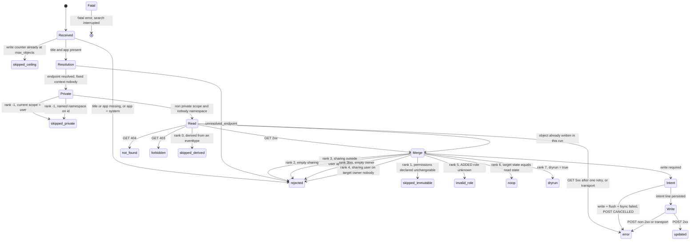
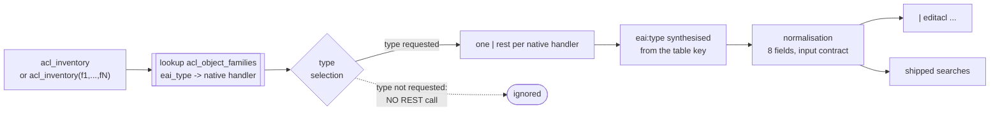

# SA-acl-tools - development notes

This document is for whoever has to **change this code**, or to read it cold in a year.
It carries what the [README](README.md) deliberately leaves out: the architecture, the
measurements the behaviour rests on, the traps found on the way, the decisions with their
motive, and the exhaustive operator reference the README reduces to a short list.

`DEVNOTES.md` is excluded from the deployable archive by `.gitattributes`, like `tests/`
and `tools/`: a development note has no business inside an app installed on a search head.

**How to read it.** Part I is the design. Sections 1 to 3 describe the shape of the code.
Section 4 is the important one: a catalogue of **facts no documentation gives**, every one
of them established by measurement on Splunk Enterprise 9.4.6. Sections 5 to 9 explain the
mechanisms whose form is not obvious from reading them. Section 10 lists the guard rails
of the test suite and what each one is worth. Section 11 records what was deliberately
left out. Part II - sections 13 to 26 - is the operator reference in full: everything the
README states in one line, with the measurement or the reasoning that established it.

---

## Contents

**Part I - design**

1. [Layering](#1-layering)
2. [Module map](#2-module-map)
3. [State machine](#3-state-machine)
4. [Measured facts, none of them deducible](#4-measured-facts-none-of-them-deducible)
5. [The journal](#5-the-journal)
6. [The shipped SPL artefacts](#6-the-shipped-spl-artefacts)
7. [The SDK adapter](#7-the-sdk-adapter)
8. [Idempotence, and what it does not cover](#8-idempotence-and-what-it-does-not-cover)
9. [Derived objects](#9-derived-objects)
10. [Guard rails of the test suite](#10-guard-rails-of-the-test-suite)
11. [What was deliberately left out](#11-what-was-deliberately-left-out)
12. [Still open](#12-still-open)

**Part II - the operator reference in full**

13. [Deployable archive](#13-deployable-archive)
14. [Entitlements](#14-entitlements)
15. [Command semantics](#15-command-semantics)
16. [Input contract](#16-input-contract)
17. [Output](#17-output)
18. [Journal](#18-journal)
19. [Rollback](#19-rollback)
20. [Run monitoring view](#20-run-monitoring-view)
21. [Inventory of the objects to process](#21-inventory-of-the-objects-to-process)
22. [Mapping table and re-validation](#22-mapping-table-and-re-validation)
23. [Tests and integration environment](#23-tests-and-integration-environment)
24. [Vendored dependencies](#24-vendored-dependencies)
25. [Known limits](#25-known-limits)
26. [Troubleshooting](#26-troubleshooting)

---

## 1. Layering

| Layer | Content | Imports allowed |
|---|---|---|
| Pure core | normalisation, merge, endpoint resolution, mapping table, journal serialisation, state machine | standard library, **no network** |
| Adapters | REST client (`acltools/rest.py`), journal writer | standard library, network allowed **in `rest.py` only** |
| Wrapper | `bin/editacl.py` | the SDK - deliberately minimal surface, **no business rule** |

The rule is not a comment: `tests/test_layering.py` reads the syntax tree of every core
module and fails if one of them imports the network outside `rest.py`, or mentions the
SDK at all. Without it the rule would be an intention, and one hastily added import
would be enough for the merge matrix to stop being testable on a machine with no Splunk
instance.

The consequence that matters: **the whole unit suite runs with no instance and no
network**, and `bin/lib/` is never loaded by it. That is not a convenience, it is what
makes the suite runnable by a reviewer who has no lab.

---

## 2. Module map

```
bin/
  editacl.py            SDK adapter. Options, chunk lifecycle, output, fatal path.
  acl_endpoint_map.json Mapping table eai:type -> handler path.
  acltools/
    model.py            Data types, ACL_STATUSES, output field set, parameter names.
    binding.py          SPL record -> EventInput. Single injection point of presence.
    endpoint.py         URI building, encoding rule, namespace reading of id.
    mapping.py          Loading of the table + operator override, coverage.
    normalize.py        Role list normalisation.
    merge.py            Merge and the ordered pre-write checks.
    derived.py          Discovery of the carrier of a derived object.
    preflight.py        Per-run initialisation: capability, real time, roles, table.
    pipeline.py         Per-event orchestration, counters, deduplication, summary.
    rest.py             Raw HTTP client on urllib + ssl. The only network module.
    journal.py          Write-ahead journal: serialisation, fsync, three phases.
    diag.py             Run diagnostic, redaction, never fatal.
    errors.py           Fatal error and per-event rejection.
```

Two single injection points are worth naming, because both replaced a rule that had been
dispersed and therefore unverifiable:

- **`binding.field_present`** decides column presence, on one line, for the whole
  package. No other caller tests for the presence of a field. That is what makes the
  presence semantics a rule instead of a convention.
- **`editacl._emit_message`** is the only place that talks to the search interface, and
  the only place that applies the `editacl: ` prefix. A prefix repeated on thirty
  literals is a convention somebody forgets; a single emission point checked by a test
  is a rule. `tests/test_message_prefix.py` and `tests/test_editacl_adapter.py` fail if
  `write_warning`, `write_error`, `write_info` or `write_fatal` is called anywhere else.

---

## 3. State machine

The twelve terminal states in lower case are the `acl_status` values, declared once in
`acltools.model.ACL_STATUSES`. Each of them produces **exactly one** `outcome` journal
line then **one** output event - the ceiling included. Only a fatal error interrupts the
search, and it then produces neither an `intent` line, nor an `outcome` line, nor an
output event.



**The order of ranks -1 to 7 is normative**: it decides which status wins when several
conditions hold at once. Four consequences:

- the ceiling comes before everything, the GET included: once reached, every following
  object comes out `skipped_ceiling` with no HTTP exchange at all, **and the search
  carries on**;
- rank -1 skips private objects before any read, and rank 0 precedes every following
  check: an object derived from an `eventtype` comes out `skipped_derived` even when it
  is immutable, even in simulation, even when it is already compliant;
- whether the permissions may be changed is read **in the GET response**, never in the
  input event - trusting the event would make the guard rail bypassable by an upstream
  `eval`. It is read under **two** key names, in order: `can_change_perms`, and
  `modifiable` when the block carries no `can_change_perms` (section 4.16). The reason that
  accompanies the status names the key that answered, so that one status can carry two
  provenances without hiding either;
- rank 6 precedes rank 7: an object that is already compliant is a `noop` **even in
  simulation**.

That last point has a consequence for every consumer, and it had never been written down
until late: **counting the `dryrun` rows of a simulation does not give the size of the
batch**, it gives the number of objects that would change. A panel labelling that column
"simulated objects" would be lying.

### 3.1 Why the write ceiling is no longer fatal, and why it defaults to ten

In its earlier form, reaching the ceiling raised a fatal error: the search stopped, the
output was **entirely lost** (`resultCount = 0`), and the operator was left with a
partial mutation **and** blindness about what had just happened. The guard rail
therefore produced, at the exact moment it fired, the worst of both worlds.

Its real value is elsewhere, narrow but legitimate: it bounds the blast radius of an
operator who launches a real write **without having simulated**. On the disciplined path
- simulate, examine, replay - it adds nothing, since the simulation already showed the
volume. That function is entirely preserved by stopping the writes. What disappears is
the blindness. **A guard rail must inform, not blind.**

Batch atomicity stays out of scope for the same reason a global abort on a single
failure stays out of scope: over several hundred objects it would produce an
uncharacterised partial state, where the journal characterises it entirely.

**Why ten and not five hundred.** A one-off correction - a few identified objects,
checked in simulation - goes through without the operator having to think about the
ceiling at all. Beyond that, they have to write it, therefore to **state the volume they
are about to mutate**. A ceiling of five hundred let operations of several hundred
objects through on a production platform without a word, which amounted to keeping none
of the guard rail in most real cases.

What makes a default that low workable is that **simulation never enters the counter**:
a `dryrun` covers the whole batch whatever its size, so the friction sits on the real
write and never on the examination.

---

## 4. Measured facts, none of them deducible

Every item below was established by measurement on a lab instance, not by reading
documentation. They are the expensive part of this project, and they are the reason this
file exists.

### 4.1 `admin/directory` sees 60.6 % of the objects

`| rest /servicesNS/-/-/admin/directory` returns **894 objects out of 1 476**,
independently of capabilities. Seven families are entirely absent, the largest being
lookup files with **526 objects**. The truncation is even partial inside a single
endpoint: modular alert actions appear, the six legacy alert actions do not.

That is the whole reason the `acl_inventory` macro exists and unions the native
endpoints family by family, at a cost of roughly thirty REST calls instead of one.

### 4.2 The field filter changes the value of `id`

Two measurements on the same platform had concluded the opposite of each other: 100 % of
`id` values self-referential for one, 0 % for the other. **Both were right.**

The discriminant is the **field filter**. Queried with no `f=`, `admin/directory` emits
the URI of the native endpoint, which is usable. Queried with `f=...&f=id` - that is,
the way a canonical pipeline writes it - it emits its own self-reference. Measured over
938 objects: 0 % against 100 %, on the sole presence of the filter.

**The field filter does not merely restrict what is returned: it changes the value of a
field.** Nothing lets you predict that, and no amount of reading would have given it.

Symmetrically, the seven families absent from `admin/directory` emit no `eai:type` on
their native endpoint: for them `id` is the only possible resolution - hence the
obligation on the inventory macro to synthesise `eai:type`.

### 4.3 Presence of the column, never its value, decides

Measured: the command receives either a key **absent** from the record, or a key
**present** holding the empty string. Never `None`, never an empty list. And a
multivalue field reduced to a single value **arrives as a string**, not as a list of one
element - a type test would conclude "single value" where there is nothing to conclude,
and would say nothing at all about presence.

The v1 assumed the distinction impossible, on the grounds that an `mvmap` emptying a
multivalue produces a null indistinguishable from a field never mentioned. The
measurement refutes the conclusion without refuting the premise: an emptied `mvmap`
**is** null in the SPL sense, but **a null field is not removed from the result set**.
The column survives, including when the field is empty on every single row - verified
over eleven chunks of a twenty thousand row search.

**Positive rule**: the column is only lost when the field carried a value **nowhere, at
no point** of the pipeline. "`eval X=null()` removes the field" is false in general; it
only removes it when it had never been valued.

The extra caution `raw is not None` on top of `key in record` would be a mistake, not a
precaution: it would bring value-based discrimination back through the back door and
would turn an explicit "empty this attribute" into "preserve it". The predicate in
`binding.field_present` is therefore **exactly** `key in record`, with no further clause.

The whole removed `fields` parameter of the v1, and its eighteen-row merge matrix,
followed from the wrong assumption.

### 4.4 Normalisation has to drop empty elements

After a POST carrying an empty permission, the next GET returns neither `[]` nor `null`
but **`[""]`** - a list holding one empty string. Without that filtering, the read state
and the merged state are never equal, idempotence detection fails on **every** object
with an empty permission, and a second pass rewrites everything.

### 4.5 Fixed-context addressing, and what it fixed

A shared object belonging to somebody else is reachable through the `nobody` context,
for reading as well as for writing, at both sharing scopes, and the GET response always
carries the **real owner** - never the addressing context. The `id` the platform returns
is itself in `nobody`.

The v1 addressed through `eai:acl.owner`. **A private object masks a shared homonym in
the namespace of its holder**: if the owner of a shared object also held a private
object of the same name in the same application, the command reached **the private one**
and wrote its ACL - `200` on the GET, merge computed, POST succeeded, row reported
`updated`. A silent write on the wrong target, that neither the acceptance run nor two
audits had caught, for want of measuring namespace resolution.

The wildcard context is **never** used: it refuses writes, and on two homonyms it
returns two entries on a single-object path, where a client reading the first would be
choosing blind.

### 4.6 The namespace segment of `id` is the scope, not the owner

That nuance is what makes the second private-detection path reliable. Measured on
homonyms of the same application: a **shared object owned by a named account** is still
emitted as `/servicesNS/nobody/...`, while a private object carries the namespace of its
holder. The segment does not say **who** owns the object, it says **whether it is
shared**.

The fallback previously advertised - "the GET through the fixed context answers `404`
and the object comes out `not_found`" - **is false as soon as a shared homonym exists**:
the fixed addressing then reaches the shared object, and the command would read and
write **an object other than the one designated on input**. Same class of defect as the
v1 one that fixed addressing was supposed to have closed, reintroduced by the fallback.

The possible error of the second path is bounded and conservative: a shared object whose
`id` had been harvested in a named context would come out `skipped_private` wrongly.
**Abstention, never a wrong write** - the same discipline as rank 0.

Two successive versions of that paragraph promised a `not_found`, the second one all the
more firmly since the first had already proved false. Neither held. A reassuring clause
added at the end of a paragraph, with no measurement behind it, is a promise made on
intuition.

### 4.7 The URI has to be rebuilt, and the encoding rule is counter-intuitive

The native `id` field double-encodes the slash but not the other special characters, so
it is not reusable as a URI. `enc()` is a plain percent-encoding of the whole segment,
`safe=''`, with no character left literal. Space gives `%20`, slash gives `%2F`, an
accented character gives its UTF-8 bytes, percent gives `%25`.

Double encoding is an **asymmetric trap**: it works for the slash alone and breaks
space, accent and percent. That is exactly the shape of a bug that passes the first test
somebody writes.

### 4.8 `current-context` returns the flattened effective capability set

`GET /services/authentication/current-context` returns in `content.capabilities` the
**flattened effective** set of the user's capabilities, `imported_roles` inheritance
included. The entitlement check therefore reduces to a membership test; no walk of the
role hierarchy is needed. The separate load of `authorization/roles` serves
`validate_roles` only.

### 4.9 A `searchbnf.conf` confined to its app is silently useless

A valid, loaded, correctly parsed `searchbnf.conf` **has no effect** unless it is
exported out of its application: the interface queries `configs/conf-searchbnf` **in the
namespace of the search page**, not in the one of the app declaring the command.
Measured: without the export, that endpoint returns `total = 0` in the search namespace
and `total = 6` in the app namespace.

Without the export the observed behaviour is the worst possible one: the file is loaded,
`btool` reports nothing, no error is raised anywhere, and the colouring simply does not
appear.

### 4.10 `is_visible = 0` does not block access to an exported view

Measured **with the negative control that makes the measurement conclusive**: a view
exported to the system answers `200` from three distinct app contexts, including the
hidden app itself; the **same view** declared `export = none` answers `404`. Without the
negative control the `200` would have proved nothing.

`export = system` reads back as `sharing = global` in the ACL API, never as `system`: an
operational check written on `sharing="system"` would find nothing.

A view exported to the system does not appear in the menu of another app for all that: a
`nav` entry is still needed there.

### 4.11 An account without the read role gets a `404`, not a `403`

Measured on the monitoring view. Without warning, a non-entitled operator concludes that
the deployment is broken. The README states the fact for that reason.

Two more facts of the same family, both measured:

- **`admin_all_objects` short-circuits the read restriction.** "Readable by a single
  role" only holds for non-administrator accounts. No declaration of the app can prevent
  it.
- A bare role is **not** an empty role: it inherits the platform `[default]` stanza,
  which on a stock install carries `run_collect`, `run_mcollect`, `schedule_rtsearch`,
  `edit_own_objects` and `list_all_objects`. The `editacl_auditor` role refuses the
  first three explicitly and leaves the last two. `schedule_rtsearch` is refused for a
  reason proper to this app: the command refuses by design to run under a real-time
  search, so shipping a role that allows scheduling real-time searches would contradict
  its own doctrine.

### 4.12 A holder of the role without index entitlement sees an empty view, silently

`isFailed = False`, `dispatchState = DONE`, `resultCount = 0` - at the very moment an
`admin` account sees one hundred and sixty-four runs. A dashboard that looks up to date
while showing nothing is a diagnostic trap, which is why the view carries an entitlement
panel telling "no run recorded" from "index not readable".

Index entitlement is deliberately outside the app: the role declares no
`srchIndexesAllowed`, no `srchIndexesDefault`, no `srchFilter`.

### 4.12.bis Unioning two sources: `multisearch`, never `OR`

The monitoring view has one panel that must read the journal **and** the diagnostic at
once - the one that lists runs whose diagnostic exists and whose journal does not. The
obvious construction is an `OR` of the two source macros. **It parses, it runs, it
returns rows, and it loses most of both sources without a word.**

Measured on a lab, one seven-day window, the same instance at the same moment:

| Construction | Diagnostic events | Journal events |
|---|---|---|
| `search (`acl_journal_source`) OR (`acl_diag_source`)` | 9 | 1 403 |
| `search `acl_journal_source` OR `acl_diag_source`` | 9 | **0** |
| `index=_internal (sourcetype=a OR sourcetype=b)` | 2 268 | 17 770 |
| `multisearch [search macro] [search macro]` | 2 268 | 17 770 |

What the parenthesised form kept was the **newest** diagnostic line of each run and the
**oldest** journal lines - the two clauses do not compose. The panel's filter is
`journal_lines = 0`, so nine runs that had each written a complete journal came out as
having written none, and the panel named a cause for each of them.

**How it was found**: by replaying the shipped panel against the lab and reading its rows
one by one, after the sponsor's first look at the rendered page sent that panel back for
rework. No test reaches it - the SPL is valid, and the result set is non-empty and
plausible. It is the same family as the search-time defects of the next section: the
file was right, the search was wrong, and only reading the result where it is meant to be
read showed it.

`multisearch` unions two independent searches rather than asking one search to match two
index-and-sourcetype pairs at once. Each branch still names its source by its macro, so
the single-point-of-redirection rule (D-51) holds - better than before, since neither
branch can be collapsed into the other.

### 4.13 Two journal defects that only show at search time

Both had the same signature: **the JSON file was correct**, and nothing showed before
reading the journal where it is meant to be read.

- **`error` used to be `null` when there was no error.** `KV_MODE = json` extracts that
  JSON `null` as **the string `"null"`**, so the obvious predicate `isnotnull(error)` is
  true on every line. Measured in lab: eight objects reported in error out of eight,
  where there were two. A wrong figure, with no signal. `error` is now serialised as the
  empty string, like every other empty field.
- **The `host` key collided with the Splunk `host` metadata field** and came back
  **multivalued** at search time. It was renamed `member`, the term the diagnostic file
  already used for the same thing - and then **removed altogether**. The rename fixed
  the collision and kept the duplication: the `host` metadata is stamped on every event
  at collection and carries the same value, measured identical on the whole current
  corpus of the lab. A key that duplicates a metadata field costs a field on every line
  and offers a second version of the same fact, free to drift. The member is read from
  the metadata, and the diagnostic file still logs it on its own line at startup.

  **What went with the key.** Its presence dated a line - it appeared with D-46 - so
  `isnotnull(member)` had become the monitoring view's discriminator between journal
  format generations, in sixteen places, and the view carried a panel counting the lines
  it excluded. Both are gone. Introducing a version field instead was ruled out: lines
  of an older format are an artefact of a lab that ran campaigns for a week, not a
  deployment problem, and a fresh install has none. **The view now assumes a homogeneous
  journal format and says so on the page.** Should section 8.2 ever change again, the
  transition is a deployment question - see the README.

### 4.14 The chunk regime is not predictable

splunkd does not hand the stream to the command in one piece: it cuts it into **chunks**
and calls the command once per chunk.

| Pipeline measured | Behaviour |
|---|---|
| Materialising source (`makeresults`, `rest`, `map` - therefore the inventory macro) | **a single chunk up to 60 000 records** |
| Search on `_internal` bounded to 160 records | **two chunks** |
| Search on an index fed by `collect`, 160 records, consumer deliberately slowed down | **a single chunk** |

The first version of this note stated a rule - materialising against streaming - and the
third case refutes it. Two searches over an index, same volume, opposite regimes.

**What is established, and is enough**:

- **Multi-chunk happens at low volume** - from about a hundred records, probably fewer.
  It is not a regime reserved for very large batches.
- **It is not predictable from the shape of the pipeline.** Any logic attached to the
  run must therefore survive multi-chunk **by construction**, never through reasoning
  about the expected volume or source.
- **The nominal path, built on the inventory macro, is single-chunk.** That is what
  hid the journal lifecycle defect for three days, four independent audits and
  twenty-three acceptance scenarios.

**The last chunk of a run may carry no record at all**, and it is nonetheless the one the
end-of-run line and the file closing fall on. Any end-of-run logic must hold on an empty
chunk.

No configuration lever reduces the chunk size received: measured without effect, the
available setting bounds the chunk **produced**, not the chunk received.

### 4.15 An `HTTP 5xx` on persistence mutates the runtime view anyway

When splunkd refuses the POST with `Could not flush changes to disk: ...
metadata/local.meta`, the `local.meta` file is **intact** - fingerprint unchanged - but
the **runtime view** of splunkd has already been mutated. That runtime view is what the
GETs serve, what users and searches see, and what access control is enforced on, until
the next configuration reload or member restart.

The warning is emitted on the **whole** `5xx` class and not on `500` alone: the
divergence comes from the handler having mutated its in-memory state before failing to
persist it, which a `502`, a `503` or a `507` produce just as well. Restricting a guard
rail to the one code you happened to meet makes it depend on your sample.

Recovery is a configuration reload of the family, not a rollback: the rollback macro
only keeps `outcome` lines with status `updated`, and it is right to exclude the object,
since the disk never saw it change.

### 4.16 `admin/ntags` refuses every ACL write - and says so beforehand

Measured: `HTTP 500`, "ACL modification not supported by this handler". No workaround
exists - that is a limit of the handler, not of the command.

**The handler announces it in its ACL block, under a name the command did not read.**
Measured on 9.4.6, the block of an `admin/ntags` object carries neither
`can_change_perms` nor any `can_share_*` key, `perms` is `null`, and what is left is
`"modifiable": false`. The whole permission side of the block is absent, and
`modifiable` is the only statement about it the handler makes.

Reading `can_change_perms` alone left that block silent. The fallback of the code -
absent means permissive - then applied, rank 1 never fired, the POST went out, the
`500` came back, and with it `runtime_divergence_possible`: a warning announcing a
runtime view possibly mutated, on an object nothing had written. Of the three possible
behaviours - abstain, try, try and cry wolf - the command had the worst one, on an
entire family.

The correction reads the fact under **both** names, in that order: `can_change_perms`
when the block carries it, `modifiable` otherwise. Three properties make the order the
whole design rather than a detail:

- **the fallback adds an answer, it never overrides one.** `modifiable` speaks of the
  object, `can_change_perms` of its ACL; the two are not synonyms, and a handler that
  publishes both answers the exact question. Letting the approximate name win would
  freeze the ACL of every object that happens to be read-only in content;
- **nothing in the code names a family.** The correction is a property of the block
  read, not a special case keyed on `admin/ntags`, which is what makes it hold for a
  handler nobody has measured yet;
- **the reason names the key that answered** - `modifiable=0` instead of
  `can_change_perms=0`. Same status, same absence of a write, different provenance, and
  the provenance belongs where every other rank already puts its reason.

Census over the 1 502 objects of the 27 native handler paths of a 9.4.6 instance:
`modifiable` published by 1 502, `can_change_perms` by 1 501. The single object without
`can_change_perms` is the `admin/ntags` one, and it is also the single object carrying
`modifiable = false`. **No object anywhere carries the two keys with contradictory
values**, which is exactly why the precedence is frozen by a test rather than left to
that observation. Two families held no object at the time of the census -
`data/props/fieldaliases` and `data/ui/panels` - and the census says nothing about them.

The objects of the family now come out `skipped_immutable` with `acl_error =
"modifiable=0"`, no POST, no journal `intent` line, and no divergence warning.

### 4.17 Moving an application, and renaming

- **Moving** exists (`POST <object_endpoint>/move`, `app=` and `user=` both mandatory,
  15 families out of 16), and it is out of scope for one decisive reason: with a `user`
  different from the current owner, the object is written under
  `etc/users/<user>/<app>/` **without `owner` being rewritten**. Address and owner then
  diverge and the object becomes **unreachable for writing**, deletion included. Sixteen
  combinations tried, all `404`. On a tool whose only justification is reversibility, an
  operation able to destroy access to an object is a contradiction. Three lesser
  reasons: only 3.4 % of objects are movable outside lookup files on the reference
  platform, moving an `eventtype` **materialises a second** derived object in the target
  application whose duplicate survives the rollback, and the return address is not
  deducible from `eai:acl.owner`, which breaks the implicit assumption of the rollback
  macro.
- **Renaming does not exist.** 1 560 objects swept over the 27 contractual handlers:
  **18 distinct actions exposed, none of them a rename**. That is not a trade-off, it is
  a fact.

### 4.18 Taking ownership: two platform conditions

`/acl` does apply the `owner` parameter, on 15 families out of 15, and it is not echoed
back; a second POST carrying the old owner reverses it. But `admin_all_objects` is
required - isolated by a single-variable measurement, an account carrying
`edit_own_objects` receives `403` **even on its own object** - and the target owner must
exist, failing which the platform answers `400` without mutating.

The scoping-phase claim that ownership had to stay out of scope was **partly** wrong:
for an object in `sharing=app` or `global` it stays addressable at every namespace after
the change. It holds for `sharing=user` only, which is not the dominant case here.

### 4.19 An empty permission survives journalling and aggregation

The risk was real in principle: since the input contract was reworked, an **absent**
column preserves the attribute instead of emptying it. If the journalling chain lost an
empty permission on the way, a rollback would restore nothing while reporting a success.

**Measured on 9.4.6, it does not lose it - and the measurement was made twice, by two
distinct profiles.** A permission serialised as `""` in the journal is **extracted** at
indexing time: field present, value the empty string, with a control `isnull()` on a
non-existent field establishing that the instrument does tell "absent" from "present and
empty". And it **survives aggregation**: the `stats earliest(...) BY endpoint` of the
rollback macro, run without the `coalesce` and filtered on an object whose two
permissions are empty on 100 % of the aggregated rows, does emit both columns.

The macro nonetheless materialises both permission columns explicitly, **as defence in
depth and not as the fix for an observed defect**. It costs one line and protects
against a behaviour nothing obliges another version of the platform to keep.
`eai:acl.sharing` and `eai:acl.owner` are deliberately **not** treated the same way:
their empty value does not exist on the platform side, a restorable object always
carries one, and materialising an empty column there would only turn a correct
preservation into a rejection.

An earlier version of the shipped documentation claimed the opposite - that the column
disappeared - and built an elegant demonstration about behaviours that are "right for
the wrong reason" on top of it. That claim had never been measured. **A requirement
founded on a supposition stays a supposition, however elegant the reasoning built on
it.**

### 4.20 Real-time detection is exposed, and it was measured

The guard rail reads `isRealTimeSearch` on `GET /services/search/jobs/<sid>`, falling
back on inspection of `earliest_time` / `latest_time`.

**Measured on Splunk 9.4.6** - search submitted in `search_mode = realtime`, bounds
`rt-60s` to `rt`: `isRealTimeSearch = True` is indeed exposed, and the run is refused by
a fatal error. The refusal therefore stays a fatal error and not a warning.

It is not re-validated on another platform. If the information were not exposed and the
fallback did not conclude, the command would emit a **warning** saying the guard rail
could not be applied, and would carry on - `run_in_preview = false` and idempotence
remain the first two lines of defence. That degradation is specified rather than left to
improvisation, and it is documented rather than removed silently.

### 4.21 Aggregating the prior state of a run needs `earliest()`, not `values()`

Measured on a batch carrying one deliberate duplicate. An object presented twice in the
same batch produces two `outcome` lines, so `values()` merges the prior state of the
first pass with the state read back on the second, turns the column multivalued, and
reports "unchanged" on an object that did change.

Every panel of the monitoring view that shows a before/after state therefore aggregates
with `earliest(...) BY endpoint`, which is the same discipline as the rollback macro.

---

## 5. The journal

### 5.1 One file per `sid`, no rotation

A `RotatingFileHandler` is not safe across processes: two concurrent runs on the same
member - a scheduled search crossing a manual one - can lose lines at rotation time. The
journal is the **only** safety net of an irreversible operation, so a known window of
line loss is not acceptable when the fix costs a file name.

Favourable side effect: the rollback set of a run is self-contained in one file, usable
directly before indexing.

The counterpart is that the number of files grows monotonically with no automatic
ceiling. The unit volume is marginal; the README documents a purge by age.

The diagnostic file is the opposite choice on purpose: it carries no restorable state,
so it stays single and rotating, and **no diagnostic failure is fatal**. A diagnostic
that interrupted the operation it observes would add a failure to the one it reports.
For the same reason, opening it never raises: a failure to open yields an inert
diagnostic object, so no call site has to guard itself.

It is nonetheless the **only** trace of a fatal error that survives the end of the
search: the operator message is ephemeral and the job disappears when it expires. It
therefore records the startup line (app version, user, member, `splunkd_uri`, TLS
verification state), the validated parameters, **the nine naming parameters** - without
them a run whose field names were redirected would be unreadable after the fact - the
entitlement check, the real-time check, the resolution of the mapping table with its
counts and its discarded entries, the opening of the rollback journal, and the fatal
errors.

**No secret enters it.** The guarantee is structural first: the diagnostic module never
receives the session key - none of its methods has a parameter carrying it, and the REST
client does not talk to it. A redaction covers, as a second line, the error messages
copied back from the platform: the `Authorization` header, `session_key`, `token`,
`password`, `api_key` and their kin are replaced by a placeholder and **never
truncated** - a truncated secret is still a partially disclosed secret. That file is
collected into an index: it is read by far more people than the disk of the search head.

### 5.2 `fsync` on the intent line, not on the outcome line

`intent` is written, flushed and `os.fsync()`ed **before** the POST. Its failure
**cancels** the POST for that object, which comes out `error` with
`acl_journaled = false`.

`outcome` is written after the response. Its failure cancels nothing - the POST already
happened - and is signalled by `acl_warning = "journal_outcome_failed"`.

The asymmetry is the whole point. The purpose of the write-ahead line is to guarantee
that **no mutation can happen without its prior state being on disk first**; that only
requires a durability barrier upstream of the write. A barrier on the result line would
buy nothing: whatever happens, the mutation has already taken place and the prior state
is already persisted. Paying an `fsync` there would double the cost of every object to
protect nothing.

Consequence to know: an `intent` line with no `outcome` signals an interruption between
the disk synchronisation and the POST response, and **the POST may have succeeded**.
That case is settled against `splunkd_access.log`, not by the journal.

### 5.3 The `summary` line, and why its position in the control flow is the point

`summary` is written once, after the last record of the run, and carries one counter per
status - **every** status, including the ones at zero, so a consumer never has to handle
an absent key. The enumeration of those counters is derived from `ACL_STATUSES`, never
written by hand.

It sits inside the `try` of `stream()`, after the loop over the records, therefore on
the branch a fatal error skips. The fatal path calls the cleanup then ends the process
through `os._exit`: the `finally` never runs and no line can be appended afterwards. A
run interrupted by a fatal error therefore leaves a journal **with no summary line**,
and it is that **absence** which distinguishes it from a run that reached its end.
Putting that write inside the cleanup would have made the two indistinguishable again,
since the fatal path does call the cleanup.

### 5.4 The journal must survive the second chunk

The SDK calls `stream()` **once per chunk** and drains the generator each time. A
cleanup placed unconditionally in the `finally` of `stream()` therefore closed the
journal at the end of the **first** chunk. The initialisation flag staying true, the
setup was not replayed and the journal stayed closed for the rest of the batch: from the
second chunk on, every object came out `error` / `journal_intent_failed` and was **not
written**, since an intent line that cannot be persisted cancels the POST.

That defect lived in the v1, in the v2 and in everything shipped before it was found.
It was hidden by the fact that the nominal path, built on the inventory macro, is
single-chunk - see [4.14](#414-the-chunk-regime-is-not-predictable). None of the
twenty-three acceptance scenarios and none of the four independent audits had used a
streaming source.

The fix conditions the cleanup on the last chunk, reading the SDK flag **negatively**:

```python
return getattr(self, "_finished", None) is not False
```

`is not False` and not `is True`, and that asymmetry is the whole point. Under protocol
v2 the flag is `False` while more chunks are announced and `True` on the last one; under
protocol v1 it stays at its initial `None`, since there is no chunk at all. Reading it
positively would defer the cleanup to a chunk that never comes: the end-of-run line
would never be written and the journal never closed.

The cleanup on the fatal error path stays **unconditional**, alone of its kind, since
that exit unwinds no `finally` at all.

The same reasoning already governed the ceiling warning, which defers its emission to
the last chunk because that is the only moment the number of skipped objects is known.
Two protections written by the same hand, one of which used to undo the other.

The invariant "one `outcome` line per output event, with no exception" was therefore
**false since the v1**, and the run monitoring view was the first artefact of this
project that would have made it visible: a total lower than the real batch, with no
error and no warning. It has been true since the fix, proved on a batch of 150 objects
in five chunks - 150 written, complete journal, end-of-run line present. The defect was
**reproduced on the platform before being fixed**: the same batch on the previous code
gave 74 written and 76 failing from rank 75 on, with the real ACLs read back object by
object to establish that they had stayed at their original value, rather than trusting
the status to say so.

### 5.5 The correlation key

`sid` + `endpoint` + `phase` identifies an entry uniquely **for `phase=intent` only**.
Deduplication by URI guarantees one POST per object per run, therefore one `intent`
line; but one output event per **input** event means an object presented twice produces
two `outcome` lines. The rollback macro filters on `phase="intent"` and is not affected -
nor by the `summary` line, which carries no `endpoint` and therefore lands in a distinct
aggregation group before being dropped by that filter.

The `endpoint` string is a **contract**: rigorously identical on the `intent` and
`outcome` lines of a given event, computed once and never recomputed. It carries no
scheme, host or port - two search head cluster members would otherwise produce two
distinct keys for the same object - and no `/acl` suffix. It is the same string as the
`acl_endpoint` output field.

`endpoint` is filled in **from resolution onwards, not from the write attempt**: an
object that could not be found carries one. `eai_type` may still be empty on the line of
an object that was written and resolved - not because the input row carried no type, that
case is now covered, but because the handler path it resolved is the image of two keys or
of none. Any breakdown by object type therefore still has to label those lines.

That contract is also what closes the rollback hole. The shape
`/servicesNS/nobody/<app>/<handler path>/<encoded title>` is exactly what route 1 of
endpoint resolution parses, so the rollback macro re-emits `endpoint` as `id` and no
longer depends on `eai:type` being present. The identifier costs no journaled field -
the string was already there, on both phases, and it is the group key of the macro's own
aggregation, so it cannot disagree with the pairing.

### 5.6 One vocabulary for the nature of an object, and where it runs out

The nature of an object is designated by **one** field, `eai_type`, in **one**
vocabulary: the keys of the mapping table, which are the values an operator writes in
`eai:type` and reads in the documentation. The command settles it right after endpoint
resolution: the value the input row carried, or - the row having carried none, which
twenty-four of the twenty-seven native handlers guarantee - the value the resolved
handler path inverts to.

The alternative was to publish the **handler path** as a second designation, and it was
tried. It fails on its own terms: a mixed batch then shows one family under two labels.
Measured in the lab on one run of eighteen objects, the breakdown panel returned
`saved/searches`, `data/ui/views`, `data/macros`, `saved/eventtypes`, `admin/tags`,
`admin/ntags`, `saved/fvtags` - and `no_such_family`, a *type*, on the single row
refused before resolution. Two vocabularies in one column of one table, which is what an
operator reads as a list of types. The shipped saved search over the same run grouped by
`eai_type` and split the saved searches in two, `savedsearch` and the empty string, for
objects of the same family in the same batch.

**The inversion is a partial function, and the exception is named rather than guessed.**
`bin/acl_endpoint_map.json` holds 28 keys for 27 distinct handler paths: `data/ui/times`
is the image of `times` **and** of `conf-times`, and of those two only. Every other path
is the image of exactly one key, and a test asserts that exact set, so an entry added
later that made a second path ambiguous fails the suite. Where the inversion is
undefined - the ambiguous path, or a path no key names, which resolution through `id`
can produce since it accepts any well-formed path - the type stays **empty**, and empty
means "not established" rather than one of two candidates.

`lookups/acl_object_families.csv` carries the same pair under the same column names,
`eai_type,handler_path`, and **27 rows**: it drops the `times` key, because
`conf-times` already claims `data/ui/times` and inventorying that endpoint twice would
duplicate every object of the family. It is an inventory of families, not a reverse map.
Building an inverse from it would answer `conf-times` with no warning where the shipped
table says the answer is undefined; the inverse the code uses is built from the JSON.

The handler path is still available to every consumer, and under its proper name: it is
the third segment of `endpoint`, where it is an **address**.

---

## 6. The shipped SPL artefacts

Four design points that a reader of the `.conf` files would otherwise have to
reconstruct.

### Every shipped search names its source through a macro

No shipped search - panel, saved search or macro - writes `index=` literally. One macro
names the journal source, one names the diagnostic source, and both carry the
`sourcetype` as well.

Two reasons, and the second one is the interesting one.

- `inputs.conf` governs ingestion and the macros govern reading. An operator who
  redirects the journal index without overriding both gets **an empty result with no
  message** from every shipped search - including the rollback macro, on the only safety
  net of an irreversible operation. No Simple XML construct brings that down to a single
  configuration point, so the constraint is **stated** rather than promised away.
- Carrying the `sourcetype` inside those macros makes a separate rule **structurally
  unbreakable** instead of leaving it to discipline: no search may write
  `sourcetype=editacl:*`. The diagnostic file produces seventeen extracted business
  fields with no `props.conf`, among them `app`, `title`, `id`, `type` and `user` -
  **homonyms of the journal ones, with inverted semantics**: they carry an *SPL field
  name*, not the value of an object. The wildcard mixes the two sets without raising a
  single error, and produces rows where `title` designates sometimes an object and
  sometimes the name of a parameter.

### Twenty-seven inventory macro stanzas, generated rather than one quoted argument

Splunk indexes macros **by arity**: `acl_inventory(savedsearch,views)` is a two-argument
call and looks for the two-argument stanza, not for a one-argument stanza holding a
comma-separated string. The parameterised form therefore needs one stanza per argument
count, up to the number of families in the shipped lookup.

The alternative - a single-arity macro called with a quoted list - reintroduces a
quoting requirement in the call form, which is exactly the class of error the removed
`fields` parameter demonstrated to be silent and expensive. Twenty-seven mechanically
generated stanzas are a visible maintenance cost; a forgotten quote is an invisible
defect. The visible cost wins.

### The applied rollback macro delegates instead of copying

`editacl_rollback_apply` expands `editacl_rollback` rather than repeating its SPL. Two
copies of the same pipeline diverge at the first amendment, and the forgotten copy would
be the one that **writes**. It also carries the ceiling explicitly, since the default of
ten would stop a rollback of a larger batch at the eleventh object.

### The re-validation is a script, not an SPL search

Building the URI of an object obeys a single, non-obvious encoding rule, implemented once
in `acltools/endpoint.py`. Rewriting it in SPL would create a second implementation that
would drift - the exact defect the single-injection-point rule forbids. The script
**reuses** the mapping coverage function and the path builder; it reimplements nothing.

It also produces a section nobody asked for and everybody needs: a consistency check
between `bin/acl_endpoint_map.json`, read by the Python code, and
`lookups/acl_object_families.csv`, read by the inventory macro. SPL cannot read JSON, so
the same information exists in two forms, and a divergence would make the inventory and
the resolution inconsistent.

---

## 7. The SDK adapter

### 7.1 The output field set is declared, never inferred

The SDK writer builds the stream header from the **keys of the first record emitted**,
then projects every later record onto it: a field absent from that first record
**disappears from the entire output**, with no error and no warning.

The eight `acl_before_*` / `acl_after_*` fields are only carried by records whose merge
was computed. A `skipped_private`, a `skipped_derived`, a `skipped_ceiling` or an
upstream rejection carries none of them. A batch whose first row falls into one of those
statuses therefore deprived the operator of **everything a simulation exists to show** -
and the inventory macro, which lists private and derived objects alongside the rest,
routinely produces such batches.

The SDK exposes `RecordWriter.custom_fields` for exactly this: names listed there are
added to the header whatever the first record holds. **The vendored SDK is therefore not
modified**; the declaration is made from the app, and `custom_fields` survives the
end-of-chunk clearing, which makes it valid for every chunk of the run.

The declaration is made from `prepare()` - the extension point the SDK provides - **and**
from the setup that runs before the first `yield`, which covers a protocol where
`prepare()` would not be reached. It is idempotent, and no failure of it may interrupt
the command: it improves the output, it conditions no write.

**The symmetry is worth seeing.** The whole presence semantics rests, on **input**, on
the fact that the column set is the one of the result set and not of the event. The
output obeys a constraint of the same nature - frozen, but on the **first record**
instead of the complete set. The contract was built by measuring the input and assuming
the output.

### 7.2 `_journal_writer`, and above all not `_journal`

The SDK stores the value of an `Option` in the attribute `"_" + <option name>`
(`searchcommands/decorators.py`). The `journal` option therefore occupies `_journal`.

Storing the journal writer there created a **two-way collision**: the boolean of the
option got closed like a file on the fatal error path, and writing the writer made the
value of the option unreadable. The attribute is therefore named `_journal_writer`, and
`tests/test_editacl_adapter.py` mechanically forbids the defect from coming back.

Anything the adapter stores on `self` has to be checked against the option names for the
same reason.

### 7.3 The fatal error message is emitted in a non-final chunk

The SDK's `error_exit()` writes the message then raises `SystemExit`, which the SDK turns
into a `finish()` - a final chunk with `finished: true` - followed by exit code 1. That
chunk tells splunkd the command ended normally, and splunkd then ignores the return
code. Measured on Splunk 9.4.6: the job comes out `dispatchState=DONE`,
`isFailed=false`, `resultCount=0`. A scheduler or an alert built on that pipeline
therefore cannot tell an interruption from an empty batch, and the `MSG[ERROR]` is only
visible to whoever inspects the job.

The message is therefore emitted in a **non-final** chunk, and the process then exits
with a non-zero code **without ever sending `finished: true`**. splunkd then marks
`dispatchState=FAILED` / `isFailed=true` **and keeps the message**; it adds its own,
"External search command exited unexpectedly with non-zero error code 1", which is
accurate and expected.

`os._exit` short-circuits the `finally` blocks, so the cleanup is done by the caller
**before** that call. The journal loses nothing for all that: every line is already
flushed on write, and the `intent` line is `fsync`ed.

The indirection through `_abort_process` exists for two reasons: to name what `os._exit`
does - no return, no cleanup, no final chunk - and to make the failure path
**exercisable**, since a hardcoded `os._exit` would kill the test process instead of
failing it.

### 7.4 `type` cannot be passed to `@Configuration`

`StreamingCommand` pins `type` to `streaming` and the SDK refuses any redeclaration. The
decorator therefore reads `@Configuration(local=True)`; the effect is identical, the form
is imposed by the SDK. `local = true` is carried by `commands.conf` as well.

### 7.5 One warning per run, not per event

Three warnings are emitted once per run and never per event: the simulation warning, the
ceiling warning and the runtime divergence warning. Over several hundred objects, a
repeated warning is noise, and noise gets filtered out mentally.

Two of them can only be emitted on the last chunk, because that is the only moment their
number is known. The third one is guarded by a plain flag on the command instance.

---

## 8. Idempotence, and what it does not cover

The merged state is compared with the read state after identical normalisation on both
sides - split, `trim`, removal of empty elements, deduplication, sort. The comparison
bears on `owner`, `sharing`, `perms.read` and `perms.write`, over sorted collections: a
permutation of role order is a `noop`.

`owner` entered the comparison when taking ownership entered the scope. Excluding it -
which the v1 did, on the grounds that it was never modified - would make `new_owner`
inoperative: a batch changing only the owner would come out entirely `noop`, with not a
single POST.

**A green second pass does not establish that the rollback set is right.**

Idempotence detects only **one of the two known failure modes**. It flags the case where
the **state** is wrong - the second pass does not converge, objects come out `updated`
where they should all be `noop`. It stays **completely silent** on the case where it is
the **rollback set** that is wrong: that case comes out 100 % `noop`, exactly like a
healthy batch.

The reason is mechanical: idempotence compares the target state with the state read
**now**. It never compares the state journalled as prior with the state that really was
prior. A `before_*` captured after another object of the same batch already mutated this
one is a false `before_*`, and nothing in a second pass reveals it.

That limit goes **beyond the case of derived objects**. It holds for any situation where
the state of an object can change between its preflight and the end of the batch.
Verifying a rollback means **replaying** it and comparing field by field, not observing a
`noop` rate.

---

## 9. Derived objects

### 9.1 Why abstain rather than handle

Writing the derived object leads, depending on the order of the pipeline, either to a
**wrong final state** - the cascade from the carrier overwrites the value just written -
or to a **wrong rollback set** - the preflight of the derived object reads an
already-cascaded state and journals a prior value that never existed. **No order gives
both correct.** Abstention eliminates both modes.

Measured properties of the cascade: it bears on **one single stanza**, the one of the
`saved/fvtags` object; it is **unidirectional**; and it is triggered only by an
**effective POST** - a `noop` carrier does not cascade. That last point is what made a
remediation possible without a redesign: the trigger is identified, punctual, and
observable by the command itself.

The favourable side effect is that writing the carrier **aligns** the derived object.
The tool therefore makes the estate converge towards a consistent state batch after
batch, without ever writing the derived object itself.

### 9.2 The relation is discovered, not computed

No name of a derived object is ever recomposed by concatenation from the name of a
carrier. A guessed link would one day produce a homonym, with the same consequences as a
guessed endpoint. The traversal is **from child to carrier**, and each of its three steps
rests on data supplied by splunkd:

1. **the family** comes from the resolved handler path, itself coming from the `id`
   emitted by a native endpoint or from the mapping table validated by a real GET;
2. **the identity of the object** is the one splunkd returns in the GET response
   (`entry[0].name`), never the `title` field of the input event, which an upstream
   `eval` may have forged. It is the composite key of the family, whose grammar
   `<field>=<value>` is the platform's own: that is the form under which splunkd names
   the object, addresses it, creates it and writes it into `tags.conf`;
3. **the existence of the carrier is confirmed by a real GET** on `saved/eventtypes` in
   the same namespace, memoised for the duration of the run. That is the step that turns
   the relation into an observation.

The grammar of the composite key is **measured, not assumed**: an `eventtype` named
`drv_eq=inside` does produce `eventtype=drv_eq=inside`, and a POST of ACL on the carrier
did cascade to it. And the method **actually discriminates**: on the four `fvtags`
objects of the witness app, three come out `skipped_derived` and the fourth does not,
because its key designates another field. Any family-based or name-shape heuristic would
have skipped all four.

Direct and verifiable consequence: an **orphan** `fvtags` - whose designated carrier does
not exist - stays **modifiable**. No cascade can reach it, so there is no reason to
abstain. A naming heuristic would have skipped it wrongly.

If the confirming GET can neither establish nor rule out the existence of the carrier
(`403`, `5xx`, transport failure), the abstention is pronounced anyway and traced by
`acl_warning = "carrier_probe_inconclusive:<code>"`. That is deliberately conservative:
writing a derived object whose carrier might exist falsifies the rollback set **in
silence**, whereas one abstention too many is visible and has no effect on the estate.

### 9.3 Scope of the rule

The rule is bounded to objects derived from an `eventtype`. The pattern "writing the ACL
of A modifies the ACL of B" was looked for on 11 of the 27 families and is found nowhere
outside the tag cluster; the remaining 16 families are **inferred** exempt, not observed.

It does not extend to the `tags` family (`admin/tags`) either, although its objects are
also derived from an `eventtype`. An `admin/tags` object acquires its own metadata stanza
on its first ACL write and stops being exposed to the cascade from then on: abstaining
from it for good would remove it from decommissioning **with no cascade coming to align
it in return**.

### 9.4 The blind spot, and where it is treated

A diverging derived object whose carrier does not enter the batch is reached by no
cascade. If it carries a reference to a decommissioned role that its carrier does not
carry, the batch filtered on that role does not return the carrier, nothing fires, and
**that reference survives**. It is the only place where the objective of effective
disappearance of the references is not met by the command alone.

That divergence belongs to the upstream configuration - typically an `eventtype` pushed
by a deployer with a metadata stanza of its own, without the materialisation mechanism of
the derived object having run. It is treated upstream, on the deployer side, before local
configurations are taken over.

The shipped `ACL - eventtype / derived object divergences` search makes the volume
measurable. Its own limit: pairing is scoped **by application**, so a carrier shared
globally from another application than its derived object would not be paired.

---

## 10. Guard rails of the test suite

The suite runs outside Splunk, with no instance and no network, on the standard library
alone:

```sh
python -m unittest discover -s tests -t . -v
```

Six of its modules are not tests of behaviour but **guard rails**: they exist to make a
rule mechanically enforceable rather than a matter of goodwill. Each one is worth
exactly what its stated scope is worth, and each states the limits of its own reach.

### 10.1 `test_statuses.py` - the status enumeration is derived from the code

Four successive writings of that list were wrong: three in the specification, then one
in the test suite the specification had entrusted it to - a constant announcing twelve
values and carrying eleven, with `skipped_derived` missing. The flaw is not
forgetfulness: a hand-written enumeration has **no mechanical link** with what the code
produces, and therefore drifts at every change.

The module reads the syntax tree of the core and sorts **every** construct touching a
status into one of three exhaustive categories:

1. **canonical** - the status is a literal, it gets collected;
2. **recognised propagation** - the value is a status born elsewhere, already collected
   at its birth;
3. **opaque** - everything else. **Opaque fails the suite**, naming the module, the
   line, the scope and the offending source fragment.

That reversal of the default is the point. The first version recognised two written
forms and **ignored everything else**: a status passed as a keyword argument or by
indirection entered the core unseen and the suite stayed green - measured at the closing
audit, two stealth statuses and 501 tests passing. Adding those two forms to the
extractor would have reproduced the flaw one notch further out. A noisy blind spot is
infinitely better than a silent one.

Its reach stops where the reading of a syntax tree stops: it does not see a module added
outside its source list, a status built at run time (`exec`, `importlib`, a metaclass, a
decorator rewriting an attribute), a status written into an attribute of another name, or
the real value behind a `<expr>.status` propagation. Exemptions are declared one by one,
justified, and a **dead exemption fails the suite** as well.

**Where the enumeration lives, and why.** The enumeration is carried by `README.md`,
once, in the output field table, and that placement survived the reduction of the README
to an operator document. Three reasons, and the third is the one that settles it:

- `acl_status` is a **column of the search output**. Whoever reads a result table needs
  the complete set of values it can hold; that is the output contract, not design
  material.
- `README.md` is the **only one of the two documents shipped in the deployable archive**.
  `DEVNOTES.md` carries `export-ignore`, so an enumeration living here would be
  unreachable from an app installed on a search head - which is exactly where the
  question gets asked.
- The other guard rail, `test_language.py`, already keeps both files in scope, so neither
  placement buys any coverage the other lacks. Only the reachability argument breaks the
  tie, and it breaks it towards the README.

This file carries the **state machine** instead, because that diagram shows the normative
ranks and the internal transitions, which nobody reads to interpret a result table. One
copy each, each anchored to `ACL_STATUSES` by a dedicated test:

| Document | What it carries | Anchoring test |
|---|---|---|
| `README.md` | the enumeration, in order, in the output field table | `test_the_readme_enumeration_equals_ACL_STATUSES` |
| `README.md` | the count, spelled out in words | `test_the_count_announced_by_the_readme_is_right` |
| `README.md` | every status explained **outside** the enumeration row | `test_every_status_is_mentioned_in_the_readme` |
| `DEVNOTES.md` | the state machine | `test_the_design_state_machine_covers_every_status` |

Adding a status without updating the document that carries its copy fails the suite,
naming which document and which value.

**The third test was strengthened by the reduction, not weakened by it.** It used to
search the whole README, which the enumeration row satisfied on its own: a status added
to the table row and explained nowhere passed. The README now carries a one-line meaning
for each value, so the row can be excluded from the search and the test asks the question
its own docstring always claimed to ask - *is this value explained anywhere?* A shorter
document made a broader guard rail affordable, which is the opposite of what shrinking a
document usually costs.

### 10.2 `test_language.py` - the repository is in English

This app is published, and its comments are not decoration: they carry measurements and
reasoning. Half of that value is lost on a reader who does not speak French. The
repository was therefore translated in full, and that module is what keeps it
translated - in both directions. It passes on the translated repository, and it fails on
French witness sentences, including ones whose subject matter is entirely technical.

Three layered detectors, any one of them firing being a fault. First, a list of French
function words that do not exist in English and are not plausible identifiers here.
Second, the commonest French conjunction, on its own, with a lookahead sparing its one
legitimate Latin use in English - it exists because the word list alone misses a
telegraphic fragment such as a docstring title, which carries no article and no pronoun
at all. Third, French elision, which is the strongest signal available, because an
English apostrophe follows the END of a word while an elided French article is a lone
letter before it.

The examples are deliberately not written out here: this file is inside the scan, and a
sample of the very thing being detected would make the check fail on the document that
explains it. That is exactly why the detector module excludes itself, and the effect was
observed on this paragraph while writing it.

Its only remaining declared exclusions are the vendored SDK, whose integrity is held by a
hash manifest, and the module itself, whose vocabulary **is** the detector. Both
`README.md` and this file are inside its scope.

### 10.3 `test_message_prefix.py` and `test_editacl_adapter.py` - the single emission point

They read the syntax tree of the adapter and fail if a message reaches the search
interface anywhere other than `_emit_message`, or through a construct they cannot
analyse. They also forbid the return of the `_journal` collision described in
[7.2](#72-_journal_writer-and-above-all-not-_journal).

### 10.4 `test_layering.py` - the core does not know about the network or the SDK

Without it, the layering rule is an intention in a comment and one hastily added import
is enough for the merge matrix to stop being testable on a machine with no instance.

### 10.5 `test_spl_artifacts.py` - the removed parameter stays removed

The `fields` parameter of the v1 was the most serious defect this project ever had: an
unquoted list was **truncated by SPL to its first value**, with no error and no warning,
so that a rollback restored `perms.read`, left `perms.write` and `sharing` mutated, and
reported a success. There was no possible guard in the code: a legitimate quoted single
value and a truncated list arrive identical at the command.

The defect is now eliminated **by construction** - each parameter carries a single field
name, with no comma - and the module sweeps the deliverables to make sure the removed
form is not offered anywhere again. A comma inside a naming parameter is also refused
explicitly, to catch the operator still thinking in v1 terms.

### 10.6 `test_vendor_manifest.py` - the vendored SDK is what the script installs

The manifest describes **what the vendoring script installs**, not the raw content of the
directory: compilation artefacts are excluded from the walk, on writing as on
verification. They appear on the first import of the SDK, that is, on the first run of
the command on a deployed app, and counting them as a divergence would make the check
unusable exactly where it serves. A real modification, addition or disappearance of a
vendored file is still detected.

### 10.7 What the suite also covers

Worth naming because each one froze a measured behaviour rather than an intention:

- the twelve rows of the presence matrix - four target attributes times three column
  states - one per named test, with no grouping and no parameterised test;
- discrimination by key presence rather than by type: a multivalue reduced to one value,
  arriving as a string, is treated as a value and not as an absence;
- addressing with no owner: the built URI always carries the fixed context, and the
  signature of the path builder exposes no owner parameter at all;
- the non-fatal ceiling: complete output, `skipped_ceiling` on the skipped objects,
  counter of skipped objects kept, no firing in simulation, resumption with no double
  write;
- role list normalisation, including the `[""]` case;
- URI rebuilding over the four character classes;
- the normative order of the pre-write checks;
- the three journal invariants, and the field contract of the rollback macro;
- the Simple XML of the monitoring view, parsed in the suite - which is one of the three
  reasons that view is Simple XML and not Dashboard Studio, the other two being version
  portability from 8.x to 9.x on an unspecified target platform, and the fact that a
  Simple XML diff can be reviewed while a Studio JSON cannot.

---

## 11. What was deliberately left out

| Left out | Why |
|---|---|
| Parallelism | REST calls are serialised. No concurrency parameter is exposed. Speculative surface on a tool whose bottleneck is the operator's caution, not throughput. |
| Batch atomicity | Over several hundred objects, a global abort on a single failure would produce an uncharacterised partial state. The journal characterises the partial state entirely, which is strictly better. |
| Retry on the POST | A retry could not tell "the POST never left" from "the POST succeeded and the response was lost". Cross-checking with `splunkd_access.log` is the honest answer. |
| An identity key in the journal | `endpoint` identifies every resolved object uniquely, and counting `outcome` lines gives the exact total per status. Identity would only be missing to designate an individual **unresolved** object in a drill-down. Speculative surface. |
| An opt-in parameter to write derived objects anyway | Same reason. There is no order of operations that gives both a correct final state and a correct rollback set. |
| Moving an object between applications | See [4.17](#417-moving-an-application-and-renaming). It deserves its own tool, with its own safety net. |
| Renaming an object | Does not exist on the platform. Not a trade-off. |
| Writing `.meta` files directly | Out of scope since scoping: the command goes exclusively through the REST API. |
| Managing roles (`authorize.conf`) | Out of scope since scoping, apart from the two stanzas the app declares for itself. |
| Filtering derived or private objects out of the inventory | It is the modification that abstains, not the view. An operator must be able to see what the tool does not process. |

---

## 12. Still open

- **Search head cluster replication of a mutated but unpersisted runtime state.** After
  an `HTTP 5xx` on persistence, does the mutated runtime state replicate to the other
  members? Not observable on a standalone instance.
- **Version portability of the mapping table.** Established on 9.4.6 only. The
  re-validation script exists precisely because no claim is made beyond that version.
- **The 16 families where the cascade pattern was not looked for.** They are inferred
  exempt, not observed - see [9.3](#93-scope-of-the-rule).
- **Pairing of the divergence search across applications.** Not observed on the reference
  platform, not ruled out either.

---

# Part II - the operator reference in full

The README states each of these points in one line, or leaves it out entirely. What
follows is the same material with the measurement, the message text or the reasoning that
established it - the part an operator does not need in order to act, and a maintainer
cannot do without.

---

## 13. Deployable archive

The archive is built from the repository, from a **git reference**, never from the working
tree - which makes the shipped content traceable to a commit and reproducible by anyone:

```sh
git archive --format=tar.gz --prefix=SA-acl-tools/ \
    -o SA-acl-tools-$(git rev-parse --short HEAD).tar.gz HEAD
```

The scope is carried by the `export-ignore` attributes of `.gitattributes`, not by the
memory of whoever builds it: `tests/`, `tools/` and `DEVNOTES.md` are **left out** - they
live in the repository, never in the installed app - together with the repository's own
service files. `bin/lib/` is on the contrary **included**: the archive must be deployable
with no network access. The override file of the mapping table never appears either, since
it is not versioned.

Checking the content before deployment:

```sh
tar tzf SA-acl-tools-<ref>.tar.gz | grep -E '^SA-acl-tools/(tests|tools)/'   # empty
```

> **Anchor the pattern.** The archive prefix is `SA-acl-tools/`, which itself contains the
> substring `tools/`: an unanchored `grep 'tools/'` matches every single entry and looks
> like a catastrophic failure. The `^SA-acl-tools/` anchor above is what makes the check
> mean something. The same trap catches a search for `docs/` in a repository whose own
> name ends in `-tools`.

**Four properties of the command that the operator diagram of the README summarises**,
kept here in full because two of them are contracts rather than illustrations:

- **The intent line precedes the POST** and is synchronised to disk. If it cannot be
  written, the POST is cancelled. That is what makes the operation reversible.
- **The GET is authoritative.** The ACL values carried by the input event are treated as
  possibly stale; they only feed the attributes whose column is present in the result set.
- **Addressing uses a fixed context**, never the owner of the object. No parameter names an
  addressing owner.
- **Nothing runs in parallel.** REST calls are serialised, the output order follows the
  input order. One input event always produces exactly one output event.

### TLS verification - the symptom when the setting is missing

By default, verification of the `splunkd` certificate is **on**, using the CA bundle of
`$SPLUNK_HOME/etc/auth/cacert.pem` when it is present. On a platform with self-signed
certificates whose bundle is not usable, `local/editacl.conf` carries `[editacl]` then
`verify_ssl = false`, and the command then emits a warning on every run.

The failure happens on the first REST call of the run - the entitlement check - and the
command stops on a fatal error that names TLS and the setting explicitly:

```
editacl: TLS verification of the splunkd certificate failed. Platform with a
self-signed certificate: create local/editacl.conf in the SA-acl-tools app with
[editacl] then verify_ssl = false, or install the platform CA into
$SPLUNK_HOME/etc/auth/cacert.pem. (detail: transport:SSLCertVerificationError: ...)
```

A transport failure **not** caused by TLS (splunkd unreachable, connection refused)
produces a different message, which does not mention `verify_ssl`: the two causes are not
handled the same way.

---

## 14. Entitlements

Three distinct entitlements. None of them replaces another.

| Entitlement | Role | Consequence if missing |
|---|---|---|
| `edit_acl_bulk` | Authorises the use of `editacl` | **Fatal error**, the search stops |
| `admin_all_objects` | Lets the inventory return other people's private objects, and lets splunkd accept a write on an object the operator does not own | **No error**: the scope is silently truncated |
| Read access to the journal index | Lets the rollback macro, the change-journal search and the monitoring view see anything at all | **No error**: empty result, which looks exactly like "nothing happened" |

### 14.1 `edit_acl_bulk`

Declared **and granted to the `admin` role** by `default/authorize.conf`:

```ini
[capability::edit_acl_bulk]

[role_admin]
edit_acl_bulk = enabled
```

The tool is therefore usable **as soon as it is deployed** by the accounts that already
carry `admin_all_objects` - which is required anyway for most writes. A `splunkd` restart
is still needed for the capability to show up in `current-context`. Granting it to
**other** roles belongs to the role management chain, outside the app; `imported_roles`
inheritance is resolved server side.

Splunk offers **no** native gating of search commands by capability: the check is
implemented in the code, at the head of the run, and a failed check is a fatal error.
Bypassing it by calling the script directly buys nothing - without `admin_all_objects` or
ownership of the object, splunkd rejects the writes.

> **Truncation by capability is the first of the two inventory truncations.** Without
> `admin_all_objects`, the operator processes a subset **with no message whatsoever**. It
> adds up with the one described in section 21.

### 14.2 Read access to the journal index

The rollback macro, the `ACL - change journal` saved search and the monitoring view all
read the index the journal lands in - `_internal` by default, or the dedicated index if
you redirected it.

**Granting that access is a deployment prerequisite, and it is outside this app.** The app
declares no index entitlement of any kind: no `srchIndexesAllowed`, no
`srchIndexesDefault`, no `srchFilter`. Without the access, the view triggers its own guard
rail and says so instead of showing an empty page - but the rollback macro says nothing,
and returns an empty rollback set reported as a success.

### 14.3 The `editacl_auditor` role

The app **declares** a role dedicated to reading the monitoring view and **grants it to
nobody**. Accounts holding `admin_all_objects` already read the view, so granting it would
add no access and would widen a population nobody asked to widen.

The role carries the `search` capability, and explicitly refuses `run_collect`,
`run_mcollect` and `schedule_rtsearch`.

Three facts to know before diagnosing anything:

- **An account without the role gets a `404`, not a `403`.** Without warning, an operator
  concludes that the deployment is broken. It is not: the view exists and the account
  simply may not read it.
- **`admin_all_objects` short-circuits the read restriction.** "Readable by a single role"
  only holds for non-administrator accounts. No declaration in this app can prevent that.
- **The `[default]` stanza belongs to the platform, not to this app.** A bare role is not
  an empty role: it inherits whatever `[default]` carries on your install. The app refuses
  what it knows it must refuse; it can guarantee nothing beyond that.

---

## 15. Command semantics

### 15.1 The search assistant

The syntax is also served by the **search assistant** of the interface:
`default/searchbnf.conf` describes the command, its thirteen options and four usage
examples, which also gives the command name its syntax colouring in the search bar. A
`splunkd` restart is needed for it to be taken into account, and the file has to be
exported out of its app to have any effect at all - see [4.9](#49-a-searchbnfconf-confined-to-its-app-is-silently-useless).

### 15.2 Simulation announces itself

`dryrun` defaults to `true`. A simulation run returns a **full** result table, exactly
like a run that wrote everything; only the `acl_status` column tells them apart. The
command therefore emits, at the head of the run, a search-level warning:

```
editacl: simulation active (dryrun=true, the default value): NOTHING will be written.
         Objects come out with acl_status=dryrun. To really apply the changes, replay
         the same search with dryrun=false.
```

It is emitted **once per run**, never per event: over several hundred objects a repeated
warning is noise, and noise gets filtered out mentally. It is a `MSG[WARN]` - it changes
neither the job status nor the result count.

> **In simulation, an object that is already compliant comes out `noop`, not `dryrun`.**
> The `dryrun` status only designates the objects a real run **would have changed**.
> Counting the `dryrun` rows of a simulation therefore does **not** give you the size of
> the batch; it gives you the number of objects that would change. That is usually the
> number you actually want - but a panel labelling that column "simulated objects" would
> be lying.

### 15.3 `max_objects` counts writes; it is not a precondition on the batch

A streaming command receives its events in successive chunks and never knows the total
cardinality of its input. Consequences, all of them intended:

- the counter is incremented on every POST **sent**, whether it succeeds or fails;
  statuses with no POST do not count;
- **simulation never enters the counter.** `dryrun` sends no POST: a `dryrun` therefore
  covers the **whole** batch, whatever its volume. That is what makes a default as low as
  ten workable - the friction sits on the real write, never on the examination;
- a batch holding **exactly** `max_objects` objects to write skips nothing;
- **objects written before the ceiling are not rolled back.** There is no batch atomicity,
  and there will not be one.

On reaching the ceiling, the command stops writing **without stopping the search**. The
output stays complete: one output event per input event, as always. Skipped objects come
out with `acl_status = "skipped_ceiling"`, **with no GET and no POST**, with their journal
line. The job is **not** marked failed, and a single warning says what happened:

```
editacl: max_objects=10 ceiling reached: 30 object(s) skipped with no GET and no POST,
         with acl_status=skipped_ceiling. Objects already written are not rolled back
         and the output of this search is complete. To process the rest, replay with a
         higher max_objects.
```

It is emitted **once per run**, at the end of the batch - the only moment at which the
number of skipped objects is known to a command that receives its input in chunks.

The journal fully characterises the partial state, and remains the way to undo it:
`` | `editacl_rollback(<sid>)` `` previews what would be restored,
`` | `editacl_rollback_apply(<sid>)` `` restores.

**The job is still marked failed on a fatal error.** The ceiling is no longer one, but the
list under [17.3](#173-fatal-errors) remains. On those, the job comes out
`dispatchState = FAILED`, `isFailed = true`. Something worth knowing: the job message list
then carries two entries - the one from the command, explicit, and the one from splunkd,
generic ("External search command exited unexpectedly with non-zero error code 1"). The
second one is accurate and expected.

### 15.4 What column presence means for your pipeline

> **Presence is a property of the *result set*, not of the event.**
>
> On a heterogeneous batch, an object that does not carry the field receives the **empty
> string** as soon as another object of the batch carries it - the column exists for
> everybody.
>
> **A pipeline that only fills a field on some of its rows would therefore empty the
> attribute on the others.**

The pipeline describes **the target state of every row it emits**. A pipeline built on the
inventory macro satisfies that by construction: every row carries the current value of its
object, and the operator only overrides what they want to change.

The counter-example not to write:

```
| `acl_inventory(savedsearch)`
| eval "eai:acl.perms.write" = if('eai:type'="savedsearch", "new_role_admin", null())
| editacl dryrun=f max_objects=1000
```

Rows that do not satisfy the condition come out with `eai:acl.perms.write` null, but the
column exists - and their `perms.write` will be **emptied**. The correct form keeps the
current value on the `else` branch:

```
| eval "eai:acl.perms.write" = if('eai:type'="savedsearch", "new_role_admin",
                                  'eai:acl.perms.write')
```

Or, more simply, does not touch the column at all and leaves the filtering upstream:

```
| `acl_inventory(savedsearch)` | search "eai:type"="savedsearch"
| eval "eai:acl.perms.write" = "new_role_admin"
```

Simulating before writing is enough to see the problem: the `acl_before_*` and
`acl_after_*` columns of the output show exactly what would be applied.

### 15.5 Deprecation by prefixing

The example the README dropped for room, kept because it is the second of the two driving
use cases. Real write, restricted to saved searches and views, ceiling spelled out because
the batch is larger than ten objects:

```
| `acl_inventory(savedsearch,views)`
| search "eai:acl.perms.write" IN ("role_a","role_b")
| eval "eai:acl.perms.write" = mvmap('eai:acl.perms.write',
        if('eai:acl.perms.write' IN ("role_a","role_b"),
           "deprecated_" . 'eai:acl.perms.write', 'eai:acl.perms.write'))
| editacl dryrun=f max_objects=2000
| where acl_status!="noop"
```

---

## 16. Input contract

Every input event designates **one** object, and every piece of information is read from
the field named by the matching parameter. `title` and `app` are required: the designated
field must exist and carry a value. At least one of the two resolution paths, `id` or
`type`, must be usable.

### 16.1 Presence semantics

**This is the heart of the contract.** The decision "modify or preserve an attribute"
rests on the **presence of the column** in the result set, and on nothing else.

| Situation | Effect |
|---|---|
| Column **absent** from the result set | Attribute **preserved**, as read by the GET |
| Column **present**, cell **empty** | Attribute **emptied** |
| Column **present**, cell **valued** | Value applied |

**Two attributes cannot be emptied**, because their empty value does not exist on the
platform side:

| Attribute | Empty cell on the designated column | `acl_error` |
|---|---|---|
| `sharing` | event **rejected**, no POST | `sharing_empty_not_allowed` |
| `owner` | event **rejected**, no POST | `owner_empty_not_allowed` |

A scope outside `{user, app, global}` is rejected likewise (`invalid_sharing:<value>`).
Those refusals are noisy on purpose: they are visible and non-destructive, the opposite is
not.

### 16.2 Taking ownership

`new_owner` is a **target value**, and presence semantics apply to it like to the others. A
pipeline built on the inventory macro carries the current owner on every row, which
produces a `noop` on that attribute for as long as the operator does not override it.

Two platform conditions: taking ownership requires `admin_all_objects` - an account
carrying only the right over its own objects is refused **even on its own object** - and
the target owner must **exist**, failing which the platform refuses without mutating. The
measurement behind both is [4.18](#418-taking-ownership-two-platform-conditions).

Moving an object between applications and renaming an object are **out of scope**, see
[4.17](#417-moving-an-application-and-renaming).

### 16.3 Addressing uses a fixed context

```
<object_endpoint> = <splunkd_uri>/servicesNS/nobody/<enc(app)>/<handler_path>/<enc(title)>
```

A shared object belonging to somebody else is reachable through that context, for reading
as well as for writing, at both sharing scopes, and the GET response always carries the
**real owner** - never the addressing context.

### 16.4 Private objects are out of scope

An object with `sharing=user` is only visible to its owner and to administrators. Any
permission it carried would grant nothing to anybody: they are inert.

Detected through the **current** scope (the `sharing` parameter), private objects come out
with `acl_status = "skipped_private"`, **with no GET and no POST**, counter not
incremented, with their journal line like any other status.

**Second detection path.** When the scope column is absent from the result set - or
present and empty, which tells no more - the command falls back on the **namespace carried
by `id`**. splunkd emits `/servicesNS/nobody/...` for a shared object and
`/servicesNS/<owner>/...` for a private one: a named namespace is therefore enough to skip
the object without consulting its scope. It then comes out `skipped_private` with the
warning `private_detected_by_id_namespace`, which says at the same time what the pipeline
is missing.

**If neither the scope nor a usable `id` is available, the command cannot know.** It then
holds only a name and an application, resolves through the fixed context, and therefore
reaches the **shared** object if one of that name exists - while the input row may have
designated a private homonym. The behaviour is made visible: the event carries
`acl_warning = "scope_undetermined"`.

**Build the pipeline on the inventory macro**, which always emits both designations and
makes that case unreachable.

The inventory keeps listing private objects: the rule bears on writing, not on the view.

### 16.5 Endpoint resolution

Two **complementary and disjoint** paths, not a primary one and a fallback:

1. **From `id`**, if the extracted path does not point at `admin/directory` - that
   aggregation handler can list, not write an ACL.
2. **From `eai:type`**, through the mapping table. Unknown type gives an explicit
   rejection, `acl_error = "unresolved_endpoint:<type>"`. **No derivation heuristic** is
   admitted: naming analogy breaks in practice (`commands` gives `admin/commandsconf`,
   `conf-times` gives `data/ui/times`).

In both cases the URI is **rebuilt**, never reused as is: the native `id` field
double-encodes the slash but not the other special characters.

Encoding of the `title` segment follows a **single rule**: plain percent-encoding of the
whole segment, with no reserved character. The slash becomes `%2F` and calls for no special
treatment.

| Class | Form | Example |
|---|---|---|
| space | `%20` | `My search` gives `My%20search` |
| slash | `%2F` | `Report/Monthly` gives `Report%2FMonthly` |
| non-ASCII | UTF-8 then percent-encoding | three accented letters give `%C3%A9%C3%A0%C3%BC` |
| percent | `%25` | `Rate 100%` gives `Rate%20100%25` |

### 16.6 Merge and normalisation

The merge applies presence semantics attribute by attribute. Permission fields are
accepted as multivalue or as a comma-separated string. Systematic normalisation: split on
comma, `trim`, **removal of empty elements**, deduplication, lexicographic sort,
reassembly as a comma-separated string for the POST.

An empty attribute is **never** materialised as `*`, nor as any other default value.

**All four attributes are always sent.** The `/acl` endpoint operates as a full
replacement: any omission is an erasure. The POST body therefore always carries `owner`,
`sharing`, `perms.read` and `perms.write`, including those that are not being changed.

### 16.7 Order of the pre-write checks

The order is normative: it decides which status wins when several conditions hold at once.

| Rank | Check | Status | POST |
|---|---|---|---|
| -1 | The current scope is `user`, or - lacking a scope - the namespace carried by `id` is a named one | `skipped_private` | no |
| 0 | The object is derived from an `eventtype` | `skipped_derived` | no |
| 1 | The GET response declares the permissions unchangeable | `skipped_immutable` | no |
| 2 | `new_sharing` column present, cell empty | `rejected` / `sharing_empty_not_allowed` | no |
| 3 | Target scope outside `{user, app, global}` | `rejected` / `invalid_sharing:<value>` | no |
| 3bis | `new_owner` column present, cell empty | `rejected` / `owner_empty_not_allowed` | no |
| 4 | Target scope = `user` and target owner = `nobody` | `rejected` / `sharing_user_requires_named_owner` | no |
| 5 | `validate_roles=true` and an **added** role is absent from the repository | `invalid_role` | no |
| 6 | Merged state == read state, after normalisation | `noop` | no |
| 7 | `dryrun=true` | `dryrun` | no |

The `max_objects` ceiling comes before all of it: once reached, the object comes out
`skipped_ceiling` without even a GET.

**Rank 6 precedes rank 7**: an object that is already compliant is a `noop` **even in
simulation**. That is the useful information, and it is what lets you measure the
convergence of a batch without writing.

**Rank 1 reads two key names.** Splunkd states whether the permissions of an object may be
changed under `can_change_perms` in a full ACL block, and under `modifiable` in a reduced
block that carries no `perms` and no `can_share_*` - which is what `admin/ntags`
publishes. The command reads `can_change_perms` when the block carries it and `modifiable`
otherwise, never the reverse: the two are not synonyms, and the exact answer wins wherever
it exists. `acl_error` names the key that answered - `can_change_perms=0` or
`modifiable=0` - so that one status carries the two provenances without hiding either. See
[4.16](#416-adminntags-refuses-every-acl-write---and-says-so-beforehand).

An effective change of `sharing` is signalled by `acl_warning = "sharing_change"`, a change
of owner by `acl_warning = "owner_change"`: in both cases what changes goes beyond
permissions.

**`validate_roles` only bears on added roles.** An unknown role already present on the
object and untouched by the operation does not block the write; it is signalled by
`acl_warning = "stale_role_preserved:<list>"`. The role `*` is a legitimate value and is
**never** expanded into a list of roles.

### 16.8 Derived objects - writing abstains

Some knowledge objects are not autonomous: they are the **internal materialisation** of a
function carried by another object. That is the case of the `fvtags` object produced by
tagging an `eventtype`.

Writing the ACL of the `eventtype` **cascades** that ACL to the derived object - with no
POST, no HTTP response, therefore with no way for the command to observe it. The command
therefore **refuses to modify an object identified as derived from an `eventtype`**:

```
acl_status = "skipped_derived"
acl_error  = "derived_object:<name of the carrier>"
```

No POST is sent, `max_objects` is not decremented, and an `outcome` journal line is written
as for any other status.

**Favourable side effect**: when the carrier is written, the cascade **aligns** the derived
object on it. The tool therefore makes the estate converge towards a consistent state batch
after batch, without ever writing the derived object itself. That alignment has a
counterpart when the derived object was diverging: it is not reversible, see
[19.2](#192-a-derived-object-aligned-by-cascade-cannot-be-restored).

**A `fvtags` object with no carrier stays modifiable.** The relation is discovered from the
platform, not computed from a name: an orphan derived object cannot be reached by any
cascade, so there is no reason to abstain. If the confirming GET can neither establish nor
rule out the existence of the carrier (`403`, `5xx`, transport failure), the abstention is
pronounced anyway and traced by `acl_warning = "carrier_probe_inconclusive:<code>"`.

**The blind spot.** A diverging derived object **whose carrier does not enter the batch**
is reached by no cascade. If it carries a reference to a decommissioned role that its
carrier does not carry, a batch filtered on that role does not return the carrier, nothing
fires, and **that reference survives**. Run the shipped
`ACL - eventtype / derived object divergences` search **before** a decommissioning
campaign: it says exactly what the campaign will not be able to reach. The fix is upstream,
on the deployer side.

The inventory keeps listing derived objects: it is the modification that abstains, not the
view.

---

## 17. Output

The fourteen columns are present whatever the order of the batch; the ones a given status
does not carry are **empty**, never absent. `acl_endpoint` is **empty** on the abstentions
that address nothing - `skipped_private`, `skipped_ceiling` - where it would designate an
object other than the one on the input row. `acl_type` is the **type of the object as the
command settled it**, in the vocabulary of the input contract: the value the row carried,
or the one its resolved endpoint inverts to when the row carried none; empty when no route
established a type. It is the value the journal records and the monitoring view groups on,
so a simulation shows the same type the dashboard will.

### 17.1 Two things to know before reading a figure off that output

- **`acl_journaled` is narrower than its name.** It says the `phase=intent` line was
  written and flushed to disk, nothing else. It is therefore `false` on **every** line of a
  simulation, where an `outcome` line was nonetheless journaled - a simulation writes no
  `intent` line at all, by construction.
- **Do not `stats ... BY` an `acl_*` column that can be empty.** Measured: an empty value
  emitted by a search command is indistinguishable from an absent field, and
  `| stats count BY acl_type` silently **drops** the objects whose type could not be
  established - two successfully written objects vanished from a count with no message. The
  control is unambiguous: an empty value created by `| eval x=""` is kept as a group of its
  own, one emitted by a command is not. Label first, group after -
  `| eval acl_type = if(coalesce(acl_type,"")!="", acl_type, "(type not established)")` -
  which is what every shipped search and panel does. The same applies to `acl_error` and
  `acl_warning`.

`runtime_divergence_possible` is emitted on **any** POST answering `5xx`, not on `500`
alone - see [4.15](#415-an-http-5xx-on-persistence-mutates-the-runtime-view-anyway).

### 17.2 Deduplication

The input pipeline may present the same object twice. An internal **deduplication by URI**
covers the scope of the run: it saves the GET and the POST, never an output event nor an
`outcome` line. The duplicate comes out with the **result of the first send** - same
`acl_status`, same `acl_error`, same `acl_http_code` - plus
`acl_warning = "duplicate_post_suppressed"`. A duplicate asking for a **different** target
state is a distinct request and does give rise to a second write.

### 17.3 Fatal errors

Exhaustive list. Any other error bearing on a given object is a per-event error, and the
pipeline carries on.

- `edit_acl_bulk` capability missing;
- invalid parameter: a field-naming parameter designating an empty field identifier or
  carrying a comma, or `max_objects` not a positive integer;
- run detected as a real-time search;
- `splunkd_uri` or `session_key` unavailable;
- mapping table unreadable;
- journal file not openable while `journal=true` **and** `dryrun=false`.

**Reaching `max_objects` is not among them**: it produces a per-event status,
`skipped_ceiling`, and the search ends normally.

On a fatal error the search output is lost (`resultCount = 0`): events already emitted
disappear. The journal stays complete and remains the way to resume and to undo.

---

## 18. Journal

Two files under `$SPLUNK_HOME/var/log/splunk/`, collected into `_internal` under dedicated
sourcetypes.

| File | Rotation | Content | Sourcetype |
|---|---|---|---|
| `editacl_journal_<sid>.log` | **none - one file per run** | JSON lines per object. Rollback set. | `editacl:journal` |
| `editacl.log` | 5 MB x 5 | Run diagnostic | `editacl:diag` |

**One file per `sid`**, with no size-based rotation: the reasoning is in
[5.1](#51-one-file-per-sid-no-rotation). The diagnostic file carries no restorable state:
it stays single and rotating, and **no diagnostic failure is ever fatal**.

### 18.1 Lines written

- `intent`, before each POST, with `flush()` then `os.fsync()`. Its failure **cancels** the
  POST for that object.
- `outcome`, after processing **each** event, whatever the status - including `noop`,
  `dryrun` and the rejections. Its failure cancels nothing but is signalled by
  `acl_warning = "journal_outcome_failed"`.
- `summary`, **once**, at the end of a normal run, carrying one counter per status. Its
  **absence** is what marks an interrupted run.

An `intent` line with no `outcome` signals an interruption between the disk synchronisation
and the POST response - **the POST may have succeeded**. Settle it against
`splunkd_access.log`.

### 18.2 One field says what an object is, and it is written in one vocabulary

`eai_type` is **the type of the object**, in the vocabulary of the input contract: the keys
of the mapping table - `savedsearch`, `views`, `eventtypes` - which are the words you write
in `eai:type` in your own pipeline and read in the documentation.

It is filled in on two routes, and both produce values from that one vocabulary:

- the input row carried a type: it is kept as is;
- the input row carried none - a batch read from the native endpoints carries none, since
  twenty-four of the twenty-seven native handlers emit no `eai:type` - and the type is the
  one the resolved handler path **inverts to**.

An **empty** `eai_type` says the type could not be established. There are three ways in: no
route resolved the object at all; the handler path is the image of **two** keys, which on
the shipped table is `data/ui/times` and nothing else (`times` and `conf-times`); or the
handler path is the image of no key, which resolution through `id` can produce since it
accepts any well-formed path. **The command never picks one of two candidates**, and an
empty type is the honest answer rather than a coin toss.

The **handler path is not journaled under a name of its own.** It is the other vocabulary
of the same notion - the one that addresses objects rather than names them - and `endpoint`
already carries it, as its third segment. Publishing both is what made a single batch show
one family under two labels: `saved/searches` on the rows a pipeline had read natively,
`savedsearch` on the rows it had typed, in the same run and the same column of the same
table. Full reasoning: [5.6](#56-one-vocabulary-for-the-nature-of-an-object-and-where-it-runs-out).

A `skipped_private` line keeps its type although its `endpoint` is deliberately empty. The
endpoint is an **address**, and the one that could be computed there designates the shared
object of the same name rather than the private object the input row designated. The type
is the same for both.

### 18.3 Which member ran it: the metadata, not a field

**No line of the journal names the search head member.** It is not an omission: the `host`
metadata Splunk stamps on every event at collection carries exactly that, and a key
duplicating it would only offer a second version to drift. Group by `host` to split a
consolidated journal by member; the monitoring view does precisely that for its *member*
column. The diagnostic file, which carries no such metadata of its own, still logs the
member on its own line at startup.

The key existed, twice. It was `host`, which collided with the metadata of the same name
and came back **multivalued** at search time; renaming it `member` fixed the collision and
kept the duplication. Removing it also removed the only thing the view had to sort journal
lines into format generations - see [20.3](#203-the-journal-format-is-assumed-homogeneous)
and [4.13](#413-two-journal-defects-that-only-show-at-search-time).

### 18.4 Retention and routing

- **Retention.** `_internal` is frozen at 28 days by default. If the operational window of
  the journal must exceed that, redefine `index` in `local/inputs.conf` towards a dedicated
  index - and read the next paragraph, which is not optional.
- **Routing.** The journal is only searchable from the search head if that search head
  forwards its internal logs to the indexers - a common configuration, but not a universal
  one. Failing that, `_internal` stays local to the member that ran the command, and
  multi-member consolidation falls away.

### 18.5 Redirecting the journal index takes TWO overrides, not one

`inputs.conf` governs **ingestion**. Reading is governed by the `acl_journal_source` and
`acl_diag_source` macros of `default/macros.conf`.

| File to override | What it rules |
|---|---|
| `local/inputs.conf` | Where the journal is **ingested** |
| `local/macros.conf` | Where it is **read** |

**Overriding only one of the two leaves every shipped search - the monitoring view, the
change journal, the rollback macro - looking at the old index and returning an empty result
without saying so.** On the rollback macro, that means an empty rollback set reported as a
success, on the only safety net of an irreversible operation. Two configuration points,
each of them single; no Simple XML construct brings it down to one.

**And the monitoring view does not go empty - it goes stale.** Measured: with only
`inputs.conf` overridden, the panels keep listing the runs that predate the redirection and
simply stop at its date. The *Entitlement check* panel is what tells you, on two signals it
reports without over-claiming: the index the journal **actually** lands in compared with
the index this view **reads**, and the date of the most recent journal line compared with
the window you asked for. Section 20.4 says what those two signals do **not** cover - the
list is short and it matters.

### 18.6 Purge policy

The number of `editacl_journal_<sid>.log` files grows with the number of runs, **with no
automatic ceiling**. The unit volume is marginal, but growth is monotonic.

Purge by **age**, never by size and never by count:

```sh
# To be scheduled outside the operating window, after making sure the runs concerned
# are indexed AND that their restore window is closed.
find "$SPLUNK_HOME/var/log/splunk" -name 'editacl_journal_*.log' -mtime +90 -delete
```

Choose the age from the **real retention of the target index**, not from disk space: as
long as the events are not indexed, the file is the only restore path; once indexed, it
remains the immediate fallback.

---

## 19. Rollback

`editacl_rollback(<sid>)` emits eight fields - `title`, `eai:acl.app`, `eai:acl.owner`,
`eai:acl.perms.read`, `eai:acl.perms.write`, `eai:acl.sharing`, `eai:type` and `id` -
exactly the native field names that the command's defaults pick up. **No parameter
therefore has to be written**, `new_owner` included: `eai:acl.owner` carries the
**previous** owner, and the default of `new_owner` applies it.

`id` is the journaled `endpoint` re-emitted as is. It is what makes the rollback work on an
object whose input row carried **no type**.

It only restores objects for which an `outcome` line attests that the write **did**
succeed: an object whose POST failed was not modified and must not be "restored" to a state
it never left.

**Why `editacl_rollback_apply` is preferable to typing the invocation by hand.** It carries
the invocation inside the macro, ceiling included: the default being ten, a rollback typed
by hand would stop writing at the eleventh object.

> **The leading pipe is not cosmetic.** `editacl_rollback(<sid>)` is only valid in
> **generating** position - its definition opens on the `search` keyword. Written
> `` search `editacl_rollback(<sid>)` ``, it searches for the literal term `search` and
> returns **zero rows, `HTTP 200`, without one message**. Measured: 0 rows in that form,
> 160 in the correct one, on the same run. On the safety net of an irreversible operation,
> that is the project's named class of error - an artifact that reports a success without
> doing anything.

### 19.1 Limits of the rollback

- It is **not transactional**.
- It does not bring back an object deleted in the meantime.
- It is only usable **after the journal has been indexed** - a latency of a few seconds to
  a few tens of seconds depending on the load of the ingestion chain. The file on disk
  remains the immediate fallback.
- It resolves through the journaled **endpoint**, re-emitted as `id`, and falls back on
  `eai:type` only if that endpoint were missing. The coverage of the mapping table
  therefore no longer conditions the ability to roll back an object the command wrote: the
  endpoint of a written object is always journaled, on both phases, and
  [5.5](#55-the-correlation-key) makes its shape a contract. **What it does not fix**: an
  object that never reached the endpoint resolution has no journaled endpoint either. Such
  an object was never written, so there is nothing to roll back - but it also means the
  rollback covers exactly the objects the outbound pass resolved, no more.

  > **This used to be a hole in the safety net.** The macro re-emitted `eai:type` and no
  > object identifier, so an object whose row carried no type - which every batch built on
  > the native endpoints produces - was journaled with an empty type and **rejected at
  > rollback**, its prior state intact in the journal and unreachable. Measured on a mixed
  > batch: the 3 views restored, the 4 saved searches rejected. The rejection was visible,
  > which is what made it survivable; it was not visible *before* the rollback, which is
  > what made it a hole.
- It does **not cover** an object refused with an `HTTP 500` on persistence, whose
  observable state may nevertheless have changed - see 19.3.
- It is **not reversible for a derived object that was diverging** and that the cascade
  aligned - see 19.2.

### 19.2 A derived object aligned by cascade cannot be restored

Writing an `eventtype` whose derived object was **diverging** aligns that derived object by
cascade: the platform applies to it the value written on the carrier, with no POST from the
command and therefore **with no journal line**. Restoring the carrier rewrites the prior
value **of the carrier**, which is not the one the derived object carried. **The operation
is not reversible for that object.**

On an **aligned** pair - carrier and derived object already carrying the same ACL, which is
the nominal case - the round trip is correct. The guard is upstream: run the divergence
audit search before a batch and treat what it reports.

### 19.3 An `HTTP 500` on persistence does not mean "nothing changed"

It means "nothing was **persisted**". When splunkd refuses the POST with

```
In handler '<family>': Could not flush changes to disk: ... metadata/local.meta
```

the `local.meta` file is **intact** - but the **runtime view** of splunkd has already been
mutated. That runtime view is what the GETs serve, what users and searches see, and what
access control is enforced on, until the next configuration reload or member restart.

The command cannot prevent that divergence: it is produced by the platform. It signals it -
`acl_status = "error"`, `acl_http_code = 500`, the splunkd message carried whole in
`acl_error`, `acl_warning = "runtime_divergence_possible"`, plus one `MSG[WARN]` per run.

**Recovery does not go through `editacl_rollback`.** The macro only keeps `outcome` lines
with status `updated`, so it excludes the object - which is correct with respect to the
disk. The lever is a **configuration reload** of the family concerned, which realigns the
runtime on the disk:

```
POST /servicesNS/nobody/<app>/admin/<family>/_reload
```

failing that, a restart of the member. Treat the root cause of the write refusal **before**
replaying the batch.

---

## 20. Run monitoring view

**Prerequisites**, in this order:

1. The reader must hold the `editacl_auditor` role, or `admin_all_objects`. An account
   holding neither gets a **`404`**, not a `403`.
2. The reader must be **entitled to search the index the journal lands in**. That
   entitlement is outside this app. Without it, the view triggers its own guard rail: the
   *Entitlement check* panel says whether the journal is readable, distinguishing "no run
   recorded" from "no searchable index". **Read that panel before concluding anything from
   this view - empty or not.**
3. A view exported to the system does **not** appear in the menu of another app: a `nav`
   entry is still needed there. That is a fact to know, not a defect to fix in the app.

### 20.1 Selecting a run: three ways in

| Way in | What you do | What you should see |
|---|---|---|
| **Click** | Click any row of the *Runs* list | The `sid` of that row **appears in the *Run (sid)* box**, and the detail panels open on it |
| **Type** | Type or paste a `sid` into the *Run (sid)* box | The detail panels open on it. Clearing the box closes them again |
| **Link** | Open `.../app/<app>/editacl_runs?form.sid_in=<sid>` | The view opens straight on that run, box filled. This is what makes a `sid` quotable in an operations note |

The three converge on the same token, and the click and the link travel the same wire: the
query parameter of the link and the token the click writes are one and the same name. That
is held by a test, so renaming the input cannot silently break the link.

> **The click is confirmed.** The view has been opened in a browser and a click on a row of
> the *Runs* list was observed to do what this table says: the run is selected and the
> detail panels open on it. That is a direct observation on the shipped construction, not a
> deduction.
>
> **The other two ways in are not confirmed the same way.** Clearing the box to drop the
> selection, and the deep link `?form.sid_in=<sid>`, are held by the test suite -
> structure, token wiring and searches - and were replayed against a real instance through
> the REST API. Nobody has watched either of them happen in a page. They travel the same
> wire as the click, which is what makes them likely to work, and *likely* is exactly the
> word.
>
> Why the click was the one at risk. It writes `form.sid_in`, which is where the dashboard
> framework of the platform keeps the **state of the box**; the bare `sid_in` is what the
> box *produces*, not what it reads, and an earlier version of this view wrote to the wrong
> end of that wire and left the box empty. The click also sets the panel token **itself**
> rather than delegating it to the box, so a box that failed to redisplay would still open
> the panels.
>
> If a way in does nothing, use another one - all three reach the same token. Report it
> either way.
>
> **Rendering has now been looked at once, and it is worth knowing what that changed.** The
> first sight of the rendered page showed a defect no test reaches: a panel whose cause
> column held a whole sentence, wrapping to one word per line in a narrow column and
> pushing the columns to its right off the screen. That panel now writes a short code and
> puts the explanation beside the table, and the suite carries a crude control - no string
> a search writes into a cell exceeds 60 characters, the entitlement guard excepted. **The
> exception is real**: the guard's states are sentences, their wording is normative, and
> they are displayed in a table. The *Runs* list is wide too, at eighteen columns. Both are
> known, neither is measured on a screen.

### 20.2 The ACL change breakdown

*Which changes took place, and on how many objects of each type.* One row per transition
observed - an attribute, the value before, the value after - one column per object type
met, and **nothing for an attribute that did not move**.

| Column | What it holds |
|---|---|
| `change_type` | `Read`, `Write`, `Sharing` or `Owner`. All four, not only the two a substitution usually touches |
| `before` / `after` | The **whole value** of the attribute on each side. A permission is a list of roles, and the list is shown as one value, not split per role |
| `objects_changed` | The number of **result lines** carrying that transition. An object handed to the command twice counts twice, as everywhere else in this view |
| `applied` | Of those, how many the platform accepted (`updated`) |
| `simulated` | Of those, how many a `dryrun` run would have written |
| one per object type | How the count splits by **object type** - `savedsearch`, `views` - with `(type not established)` left for the lines on which no route gave one |

Three things to know before reading a figure off it.

- **`objects_changed` is not a promise that the change took.** A transition is what the
  command *computed*: an object whose write was refused carries a prior and an intended
  state exactly like one that succeeded. `objects_changed - applied - simulated` is what
  was attempted and refused; the *Errors* panel says why. **In simulation nothing was
  written at all** and the `after` value is the one that *would* be applied.
- **The columns are object types, in the vocabulary you write.** `savedsearch`, `views`,
  `eventtypes` - the keys of the mapping table, the same words your own SPL carries. A row
  that reached the command without a type is typed here all the same, because the command
  inverts the handler path it resolved. This panel used to prefer the handler path and fall
  back on the type, which showed **both vocabularies at once**: measured on a mixed batch,
  one run produced `saved/searches`, `data/ui/views` and `data/macros` next to
  `no_such_family`, a type, on the row refused before resolution. `(type not established)`
  is what an empty type becomes, and it covers an event refused before resolution as well
  as an endpoint no single key names.
- **The value columns are whole values, and that was a measurement, not a preference.**
  Showing the role added or removed instead would be closer to what a decommissioning looks
  for, and further from the question asked. The whole-value form was kept because the
  reference platform carries **4 distinct read combinations, 5 write, 3 sharing scopes and
  1 owner over 1 499 objects**, and a run drives everything it touches to the same target:
  the table is bounded by roughly a dozen rows for all four attributes. On a platform
  carrying far more combinations, expect more rows.

### 20.3 The journal format is assumed homogeneous

The view reads every line in the window as the format the shipped command writes. It
carries **no version marker and no format discriminator** - it used to have one by
accident, a key whose presence dated a line, and that key has been removed as a duplicate
of the `host` metadata.

The consequence, stated rather than left to be discovered: **if the journal format ever
changes again, lines written before and after the change will coexist in the retention
window and the view will read them all as current.** No panel can tell you. A fresh
deployment never meets the case; an installation whose journal spans an upgrade of this app
does, and the way through it is the retention window - wait it out, or narrow the time
range to after the upgrade.

### 20.4 What the entitlement check does, and what it does not

It answers one question - *can I trust the list below to be complete?* - on three signals,
and it is worth knowing what each one is worth.

| Signal | What it proves | What it does **not** prove |
|---|---|---|
| No searchable index | Your role has no index entitlement at all. Granting it is outside this app | - |
| **Journal lines outside what this view reads** | Lines of the journal sourcetype sit, in this window, in an index the view does not read. The two index columns show which. This is what a redirection of `local/inputs.conf` alone produces | Nothing, if the index they went to is one **you are not entitled to search**: what you cannot search, you cannot count either. The signal is then silent, and only the next one is left. It also fires, legitimately, during a deliberate migration, until the old index ages out |
| **The end of the window is silent** | The most recent journal line is older than the last 25 % of the window you asked for | **Why** it is silent. A period with no run looks exactly the same as a journal that stopped arriving. The panel says so in as many words rather than guessing. It also proves nothing at all *below* the threshold - see the blind band below |
| **The date of the most recent journal line** - always, on every state | Exactly what it says: when the freshest line this view can read was written, and how old it is at the end of the window. **No threshold and no entitlement can suppress it**: it is the first thing the state says | Anything about *why*. It is a fact handed to the reader, and the reader is the one who knows how often runs are expected here |

**The blind band of the silence signal, measured.** The threshold is **25 % of the window
asked for**, which is a **chosen value and not a measured one** - no threshold separates a
quiet platform from a broken one, and this one is written in the state text so that it can
be argued with rather than suffered. The shipped default range is `-7d@d .. now`, that is
seven days snapped to midnight **plus the hours already elapsed today**, so the trip needs
**between 42 hours** (just after midnight) **and 48 hours** (just before) of silence.
Measured on a lab, same journal: **5.6 % over 7 d** and **20.6 % over 48 h** do *not* trip
it, **41.2 % over 24 h** does; and the boundary itself was bracketed rather than deduced -
with the freshest readable line 9 h 54 old, a window of 41.2 h reads 24.0 % and stays
clean, a window of 38.0 h reads 26.0 % and trips. Narrow the time range to see a recent
redirection sooner - or read the date, which needs no threshold.

**What this costs the reader the view is written for.** A holder of `editacl_auditor`
entitled to the index the journal *used to* land in, and not to the one it was redirected
to, gets **no automatic signal at all inside that band**: the first signal is blind -
counting lines in an index you may not search is exactly what an entitlement forbids - and
the second has not tripped yet. That case **cannot** be detected without reading what the
reader is not allowed to read, and the role is deliberately not widened for it. What that
reader always has is the date at the start of the state line, and the run list stopping on
the same day.

Two more consequences to keep in mind:

- the check covers the **journal** sourcetype. A redirection of the **diagnostic** input
  alone is not detected, and the *Runs started with no journal line* panel would then lose
  runs silently;
- `unread_events` compares two counts taken on the same pinned window but not at the same
  instant. It can flicker while a run is writing; the index comparison beside it cannot.

### 20.5 What the view cannot show

- **A run launched with `journal=false` produces no journal file** and therefore appears in
  no panel built on it. It is not invisible for all that: the **diagnostic sourcetype**
  keeps its trace, and the *Runs started with no journal line* panel surfaces it from
  there. Do not read the run list as exhaustive.
- **Objects filtered out upstream** of `editacl` never reached the command and appear
  nowhere - neither as a candidate volume nor as a selection rate.
- **`acl_warning` is not journalled.** The output warnings cannot be recovered after the
  fact.
- **The calling search is not in the journal.** It is in the platform audit index, out of
  reach of the read role of this view.
- **The direction of a batch** - outbound change or rollback - is not journalled: both look
  like writes.
- **The journal format is not versioned.** Lines written before a schema change coexist in
  the retention window with later ones. The view detects the previous format and
  **excludes** those lines from every other panel, saying so in a dedicated panel: they
  carry no end-of-run line and would all be reported as interrupted, and their `error`
  field holds the literal string `null` and would report them all as failed.

---

## 21. Inventory of the objects to process

This is where an operator gets it silently wrong. Two independent truncations add up.

### 21.1 Truncation by capability

Without `admin_all_objects`, the inventory does not return other people's private objects -
those whose ACL carries `sharing = user` and an `owner` other than the operator. **No error
is emitted.**

**No reference figure is given here, and that is deliberate.** Unlike the next truncation,
which is a **structural** property of `admin/directory` and therefore measured once and for
all, this one is a property of the **population** of objects on your platform: it is zero
on an instance with no private objects and can be most of the estate on a search head with
heavy user activity. A figure taken from a reference instance would not carry over - it
would reassure you wrongly.

Measure it on the target platform, from an account that **holds** `admin_all_objects`:

```
| `acl_inventory`
| stats count AS total,
        count(eval('eai:acl.sharing'=="user")) AS private,
        dc(eval(if('eai:acl.sharing'=="user", 'eai:acl.owner', null()))) AS owners
| eval invisible_share_pct = round(100 * private / total, 1)
```

`private` is the upper bound of what an operator **without** the capability would not see -
an upper bound, since their own private objects stay visible to them.

### 21.2 Structural truncation of `admin/directory`

`| rest /servicesNS/-/-/admin/directory` **does not return all knowledge objects**,
whatever the capabilities. Measured on a standalone Splunk Enterprise 9.4.6 instance,
operator holding `admin_all_objects`:

| Measurement | Value |
|---|---|
| Objects seen by `admin/directory` | **894** |
| Objects seen by the union of the native endpoints | **1 476** |
| **Coverage** | **60.6 %** |

Families **entirely absent** from `admin/directory`:

| Family | Objects not seen |
|---|---|
| lookup files | **526** - the most numerous population of the instance |
| `fields` | 29 |
| `EVAL-` calculated fields | 12 |
| legacy alert actions | 6 |
| data models | 3 |
| `viewstates` | 2 |
| `tags` | 2 |
| `ntags` | 2 |

The truncation is even **partial inside a single endpoint**: modular alert actions do
appear in `admin/directory`, the six legacy actions do not.

On top of that, the `id` values that endpoint emits under the field filter a canonical
pipeline writes are self-referential - they point at `.../admin/directory/<title>` and not
at the object, see [4.2](#42-the-field-filter-changes-the-value-of-id). With that source,
the mapping table is not a fallback: it is the **only** resolution path.

Those objects stay **addressable and their `/acl` modifiable**: the obstacle is the
inventory, not the write.

### 21.3 The answer: the `acl_inventory` macro



Three things to know:

1. **Selection happens before the REST calls.** A family that is not requested costs
   nothing. An operator who only handles saved searches does not pay for the enumeration of
   the lookup files, which are often the most numerous population.
2. **`eai:type` is synthesised**, since most native endpoints do not emit one. The value
   used is the mapping table key of the family being queried - the same word the command
   journals and the monitoring view groups on. Measured on 9.4.6, the three families that
   *do* emit a type of their own - `datamodel`, `models`, `views` - emit exactly the key
   this table names, so preserving the native value introduces no second word. The
   synthesis is **no longer what makes a rollback possible**: the command fills the type in
   itself by inverting the handler path it resolved, and `editacl_rollback` re-emits `id`.
   What the synthesis still buys is a type to filter on *before* the command has seen the
   row.
3. **The arguments are mapping table keys**, carried by the `acl_object_families` lookup
   (column `eai_type`, the same column name the override file of the mapping table uses).
   That lookup carries **27 rows where the table carries 28 keys**: `times` is absent,
   because `conf-times` already claims `data/ui/times` and inventorying an endpoint twice
   would duplicate its objects. **Do not read the lookup as an inverse table** - it would
   answer `conf-times` where the shipped table says the answer is undefined.

**Cost.** A complete inventory sends one REST call per family - on the order of thirty
calls, not one. That is the price of full coverage. On a loaded search head, prefer the
parameterised form for interactive use, and scheduling on large scopes.

`| rest ... /admin/directory` remains usable as a **fast path**, on the express condition of
accepting the figures above: it is not an inventory, it is a subset.

### 21.4 Limit of the divergence search: pairing is scoped by application

Two objects are only paired when they are attached to the same application. An `eventtype`
shared globally from an application other than the one its derived object lives in would
not be paired, and the matching divergence would not be reported. That case was not
observed on the reference platform; check it on yours before treating the count as
exhaustive:

```
| `acl_inventory(eventtypes,fvtags)`
| rex field=title "^(?<acl_pair_field>[^=]+)=(?<acl_pair_value>.*)$"
| where 'eai:type'=="fvtags" AND acl_pair_field=="eventtype"
| stats dc(title) AS inventoried_derived_objects
```

A gap with the number of pairs the divergence search reports signals derived objects whose
carrier lives in another application.

**Scheduling.** None of the four shipped searches is scheduled: the inventory is a macro
invocable inline, and scheduling is a recommended usage on large scopes, never the access
modality. To schedule one, turn `enableSched` on in `local/savedsearches.conf`.

---

## 22. Mapping table and re-validation

`bin/acl_endpoint_map.json`, structure `{ "<eai:type>": "<handler_path>" }`.

State of the shipped table, established on Splunk Enterprise 9.4.6: **28 entries, 28
validated by a real GET on a witness object, no unresolved type**. Four entries carry an
explicit reservation - `tags`, `lookup-table-file`, `times` and `models`: their handler is
proven by GET, but the key was never observed as an `eai:type` value on 9.4.6. They are
kept out of version caution.

### 22.1 Extension by the operator, with no code change

Create `lookups/acl_endpoint_map_override.csv` (columns `eai_type`, `handler_path`) from
the `acl_endpoint_map_override.csv.example` template. It is loaded **after** the JSON and
overrides it.

**The archive never contains the real file**: an app upgrade therefore cannot overwrite it,
since it does not contain it. Keep a copy outside the app all the same, as a belt.

A `handler_path` that does not match the expected pattern is **discarded** with a
diagnostic trace, never used: the file is editable, it is therefore untrusted input, and a
forged path could aim at an arbitrary endpoint.

### 22.2 Re-validation - a prerequisite to any real use

**The table is not presumed valid on any version other than 9.4.6.** Since the table is the
only resolution path as soon as the inventory comes from `admin/directory`, a naming scheme
that changed shows up as rejections - or worse, as a valid but wrong endpoint.

The procedure ships as `tools/revalidate_mapping.py`. It runs on the target platform,
against the REST API of the instance:

```sh
<command supplying the password> | python3 tools/revalidate_mapping.py \
    [--user admin] [--splunkd-uri https://127.0.0.1:8089] [--insecure]
```

The password is read from the **first line of standard input**: never as a command line
argument, never written to disk, never printed. Return code `1` if the list of types
present on the platform and absent from the table is not empty; treat that list through the
override file, with no code change.

`tools/` is not part of the deployable archive. The script resolves its paths relative to
its parent directory: to run it on the platform, drop it into
`$SPLUNK_HOME/etc/apps/SA-acl-tools/tools/`, where it will find `bin/acltools`,
`bin/acl_endpoint_map.json`, the override if any, and `lookups/acl_object_families.csv` of
the app **as actually installed**, which is the only state that counts.

It also produces a consistency check between `bin/acl_endpoint_map.json`, read by the
Python code, and `lookups/acl_object_families.csv`, read by the inventory macro - SPL
cannot read JSON, so the same information exists in two forms, and a divergence would make
the inventory and the resolution inconsistent.

---

## 23. Tests and integration environment

Unit suite **runnable outside Splunk, with no instance and no network**. No development
dependency: `unittest` from the standard library is enough. The suite is not shipped in the
archive. What it covers, and why it is built the way it is, is section 10.

```sh
python -m unittest discover -s tests -t . -v
```

The integration tests need an instance and a throwaway app carrying one object of each
major family, in all three sharing scopes, with and without explicit permissions. Its
bootstrap is scripted, in two parts - the second exists only because **private** objects
(`sharing=user`, user namespace) and objects with **special names** (slash, space, accent,
percent) cannot be declared properly in a configuration file:

```sh
bash tools/acl_probe_bootstrap.sh                    # objects declared in .conf
# then, after restarting splunkd:
<password> | python3 tools/acl_probe_bootstrap_rest.py   # private objects, special names
```

Both scripts are **idempotent** (template writing, never appending; an object already
present comes back as HTTP 409, treated as a success) and accept `--remove`. The password
is read from the first line of standard input. The identifiers created are deliberately
generic.

---

## 24. Vendored dependencies

`bin/lib/` holds **one** dependency: the Splunk Python SDK, pinned to a patch version,
installed with verified hashes. The `bin/acltools/` core has **no** third-party dependency -
the REST calls are written in raw HTTP on `urllib` + `ssl`.

The directory is **generated and versioned**: the archive must be deployable with no
network. Its rebuild and its verification are scripted.

```sh
sh tools/vendor.sh        /path/to/python3   # rebuilds bin/lib/
sh tools/verify_vendor.sh /path/to/python3   # checks the hash manifest
```

Any version bump goes through `tools/requirements-vendor.txt` then a re-run of both
scripts - **never** through a direct edit inside `bin/lib/`, which `verify_vendor.sh` would
detect. Detail: [`bin/lib/VENDOR.md`](bin/lib/VENDOR.md).

The manifest describes **what `tools/vendor.sh` installs**, not the raw content of the
directory: the interpreter's compilation artefacts (`__pycache__/`, `*.pyc`, `*.pyo`) are
excluded from the walk, on writing as on verification. They appear on the first import of
the SDK - that is, on the first run of the command on a deployed app. A real modification of
a vendored file, an addition or a disappearance are still detected.

---

## 25. Known limits

The README carries this table as a list of one-line clauses. Here it is with the
consequence and the guard spelled out.

| Limit | Consequence | Guard |
|---|---|---|
| **Table established on 9.4.6** | A different naming scheme on another platform produces rejections, or a valid but wrong endpoint | Re-validation on the target platform, **a prerequisite to any real use**; override file |
| **Double inventory truncation** | The operator processes a subset with no message whatsoever | `admin_all_objects` + inventory through the native endpoints |
| **No batch atomicity** | A stop mid-batch leaves a partial state | The journal fully characterises the partial state |
| **Search output lost on a fatal error** | `resultCount = 0`: events already emitted disappear. Not fixable from a search command. **Reaching `max_objects` is no longer part of this** | The journal stays complete and remains the way to resume and to undo; `editacl.log` timestamps the interruption. The job is marked `isFailed = true`, which a scheduler detects |
| **No retry on the POST** | A transport failure after sending leaves an `intent` with no `outcome` | Cross-check with `splunkd_access.log`. A retry could not tell "the POST never left" from "the POST succeeded and the response was lost" |
| **`HTTP 5xx` on persistence: diverging runtime view** | The POST is refused, the disk is intact, but the runtime view of splunkd is mutated - and it is the runtime view that is authoritative for users, searches and access control. The object is excluded from the rollback set | `acl_warning = "runtime_divergence_possible"` on the **whole** `5xx` class + one `MSG[WARN]` per run. Recovery through a configuration reload (`admin/<family>/_reload`) or a member restart, **not** through `editacl_rollback` |
| **`admin/ntags` refuses every ACL write** | Measured: `HTTP 500`, "ACL modification not supported by this handler". The handler **announces it in its ACL block**, which carries no `can_change_perms` and states `"modifiable": false` with `perms: null`. The command reads that statement (rank 1), so objects of that family come out `acl_status = "skipped_immutable"`, `acl_error = "modifiable=0"`, **with no POST**, no journal `intent` line and no `runtime_divergence_possible` | **No workaround** for writing them: that is a limit of the handler, not of the command. Nothing to do to avoid the failed write - the command abstains. Excluding the family from the batch stays legitimate to shorten the output - `acl_inventory(...)` without `ntags`, or `\| search 'eai:type'!="ntags"`. Tags stay addressable through the `tags` and `fvtags` families |
| **A green second pass does not prove the rollback set is right** | The idempotence check only covers **one of the two known failure modes** | Verifying a rollback means replaying `editacl_rollback` and comparing field by field, never observing a `noop` rate |
| **Blind spot on derived objects** | A diverging derived object whose carrier enters no batch is reached by no cascade: if it references a decommissioned role that its carrier does not, that reference **survives** | The shipped divergence search measures the volume. The treatment is **upstream, on the deployer side** |
| **Search head cluster replication** | Every write triggers a knowledge object replication | Batches bounded by `max_objects`, run outside peak hours. The command serialises its calls and implements **no** automatic throttling |
| **Restore only after indexing** | The journal is only queryable after ingestion | The file of the run is self-contained and usable immediately |
| **Redirecting the journal index takes two overrides** | Overriding only `inputs.conf` leaves every shipped search returning an empty result **without saying so** | Override `local/inputs.conf` **and** `local/macros.conf` |
| **Dashboard requires an index entitlement** | Without read access to the journal index the view shows nothing | The *Entitlement check* panel distinguishes "no run" from "no access". Granting the access is outside this app |
| **Of the monitoring view, only the click has been observed in a browser** | Selecting a run by clicking a row is **confirmed**. Clearing the *Run (sid)* box to drop the selection, and the deep link `?form.sid_in=<sid>`, are not: they travel the same wire, which makes them likely, not established | Structure, token wiring and searches are frozen by the test suite and were replayed through the REST API. The click sets the panel token itself, so a box that failed to redisplay would still open the panels. If one way in does nothing, use another; all three reach the same token |
| **An `OR` of two source designations loses most of both, silently** | Fixed, and worth knowing before writing a search of your own over both files. `search (`acl_journal_source`) OR (`acl_diag_source`)` measured **9 diagnostic and 1 403 journal events** where a single search over the two sourcetypes returned **2 268 and 17 770**, same instance, same window, same moment. Without parentheses the journal disappears entirely. Nothing is reported | The panel that reads both files unions them with `multisearch`, one branch per macro, which measures identical to the single search. A test forbids the `OR` form anywhere in the view. **If you write your own search over both sourcetypes, do the same** |
| **Column widths are not measured, and one panel was found unreadable that way** | A search can be correct and its table unusable. The cause column of *Runs started with no journal line* held a sentence: in a narrow column it wrapped to one word per line and pushed the columns to its right off screen | The cause is now a short code with its explanation beside the table, and a test caps at 60 characters any string a search writes into a cell. **Two known exceptions**: the entitlement guard, whose sentences the specification makes normative, and the eighteen-column *Runs* list. Both are open points, neither is measured on a screen |
| **The journal format is assumed homogeneous** | Lines written by an older format are read as current, and no panel says so. The discriminator the view used to have was a side effect of a journal key that has since been removed | A fresh deployment never meets the case. On an installation whose journal spans an upgrade of this app, wait out the retention window or narrow the time range to after the upgrade |
| **The entitlement check reports a silent window, it does not diagnose it** | A journal that stopped arriving and a period with no run produce the same reading | The panel states the ambiguity instead of guessing, and shows the date of the most recent line on every state. The index comparison beside it resolves the case **only** when the reader may search the index the lines went to |
| **No automatic signal for 42 to 48 h for a reader entitled to the origin index only** | After a redirection, a holder of the read role who may search the old index and not the new one reads a clean state while the run list has already stopped. Measured on the shipped default range, whose length is seven days plus the hours elapsed today | **None, and it is not fixable inside the app**: detecting it means counting events in an index that reader may not search. The mitigation is a fact, not a signal - the date of the most recent journal line **opens the state on every state**, at every threshold, and the run list stops on the same day. Narrow the time range, or compare that date with how often runs are expected |
| **The cause of a run with no journal line is read from a severity, not from a sentence** | A run is called fatal because it carries a `CRITICAL` diagnostic line, and "journal could not be opened" because a `WARNING` line names a journal file | That the message said so. It is the deliberate choice: the wording of a message is translated and reworded, its severity is not. Measured: of 19 fatal runs in a lab retention window, matching the English sentence found **1**. What it costs: a future message emitted at `CRITICAL` for something that is not a fatal error would be counted as one |
| **`app_disabled` costs one REST call per distinct app** | Marginal latency on a multi-app batch | Memoised per app |
| **Taking ownership: two platform conditions** | `admin_all_objects` is required - an account carrying only the right over its own objects is refused **even on its own object** - and the target owner must exist, failing which the platform refuses without mutating | Check both before a campaign carrying `new_owner`. The refusal is visible: `acl_status = "error"` with the platform code |
| **Moving between applications and renaming are out of scope** | The first exists but a badly chosen parameter makes the object **unreachable for writing**, deletion included; the second does not exist at all | Out of scope, knowingly. Moving deserves its own tool, with its own safety net |
| **A heterogeneous pipeline can empty an attribute** | Presence is a property of the **result set**, not of the event | Build the pipeline on `acl_inventory`; simulate and read `acl_before_*` / `acl_after_*` before writing |
| **Cost of the complete inventory** | One REST call per family, around thirty in total | Parameterised form for interactive use; scheduling on large scopes |
| **Inventory families frozen by a lookup** | A family absent from `acl_object_families` is not inventoried | `tools/revalidate_mapping.py` compares the lookup with the table and reports any divergence |

---

## 26. Troubleshooting

| Symptom | Most likely cause | What to do |
|---|---|---|
| The search stops immediately, `MSG[ERROR]` about the capability | `edit_acl_bulk` not granted, or `splunkd` not restarted since the install | Grant the capability, restart `splunkd`, check `current-context` |
| Fatal error naming TLS on the first REST call | Self-signed platform certificate | Section 13, TLS verification |
| Everything comes out `dryrun` | `dryrun` defaults to `true` | Replay with `dryrun=f`, after reading the simulation |
| Everything comes out `noop` on a first pass | The batch is already compliant, or the pipeline does not actually change anything | Read `acl_before_*` / `acl_after_*` on a few rows |
| Only ten objects were written | `max_objects` defaults to 10; the rest came out `skipped_ceiling` | Replay with an explicit `max_objects` |
| `acl_before_*` / `acl_after_*` columns are empty on some rows | Those statuses never computed a merge (`skipped_private`, `skipped_derived`, `skipped_ceiling`, upstream rejections) | Expected. The columns are always present, empty where there is nothing to show |
| An object comes out `unresolved_endpoint:<type>` | The type is absent from the mapping table | Add it through the override file; run the re-validation |
| Objects of the `ntags` family come out `skipped_immutable` / `modifiable=0` | The handler refuses ACL writes and declares it in its ACL block. No POST is sent | Expected. Nothing to do; exclude the family from the batch only to shorten the output |
| The monitoring view is a `404` | The account holds neither `editacl_auditor` nor `admin_all_objects` | Grant the role. It is not a deployment failure |
| The monitoring view is empty | No index entitlement, or the journal index was redirected without overriding `local/macros.conf` | Read the *Entitlement check* panel first |
| The rollback macro returns nothing | The search time range does not cover the run, or the journal index was redirected without overriding `local/macros.conf`, or no write succeeded in that run | Widen the time range; check both override points |
| The rollback macro returns nothing, and the search was written `search \`editacl_rollback(<sid>)\`` | **The macro is only valid in generating position.** Its definition opens on the `search` keyword, so the other form searches for the literal term `search` and matches nothing. Measured: **0 rows** in the faulty form, **160** in the correct one, same `sid` - `HTTP 200`, not one message | Write it as `\| \`editacl_rollback(<sid>)\``, with the leading pipe and no `search` keyword. Every example in the README uses that form |
| The monitoring view lists runs but stops at a date | The journal index was redirected in `local/inputs.conf` without overriding `local/macros.conf`, or ingestion stopped | Read the *Entitlement check* panel: it compares the index the journal lands in with the index the view reads, and shows the date of the most recent line. **The view does not go empty in this case, it goes stale** |
| Clicking a run leaves the *Run (sid)* box empty, but the detail panels open | The box did not redisplay on the token write. The selection is correct - only the box is out of step, and the click was built so that this is what failure looks like | Nothing to do to read the run. Report it: it is a known unmeasured link |
| Clicking a run does nothing at all: empty box, no detail panels | The client-side behaviour of the view is **not validated** beyond the click observed once | Type the `sid` into the *Run (sid)* box, or open the view as `?form.sid_in=<sid>`. Report it: it is a known unmeasured path |
| A run does not appear in the view at all | It ran with `journal=false` | The *Runs started with no journal line* panel surfaces it from the diagnostic sourcetype |
| A saved search seems duplicated after an upgrade | The searches were renamed when the repository moved to English | Check `local/savedsearches.conf` and remove the stale entries |

---

## Reading order for a cold start

1. `bin/acltools/model.py` - the vocabulary: statuses, output fields, parameter names.
2. `bin/acltools/binding.py` - presence semantics, which everything else assumes.
3. `bin/acltools/merge.py` - the ordered checks, which decide the status.
4. `bin/acltools/pipeline.py` - the per-event orchestration.
5. `bin/editacl.py` - the SDK adapter, and only then.
6. `tests/test_merge_matrix.py` - the twelve rows of the presence matrix, one per test.
