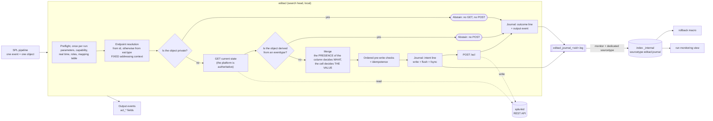
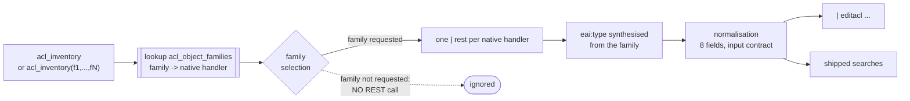

# SA-acl-tools

Splunk application shipping the custom search command **`editacl`**, which rewrites in
bulk the ACLs (read and write permissions, sharing scope, owner) of arbitrary Splunk
knowledge objects, through the REST API, from an SPL pipeline describing the target
state. It also ships an inventory macro, a rollback macro, four saved searches and a
run monitoring view.

Driving use case: decommissioning a set of legacy roles, either by **substitution**
(replacement with the roles of a new entitlement structure) or by **deprecation**
(renaming to `deprecated_<name>` before removal).

> **The operation is irreversible.** The write-ahead journal and the rollback macro are
> the only safety net. Read [Rollback](#rollback) **before** the first real write, not
> after.

This document is for whoever **runs** the tool. The reasoning behind the design, the
measurements it rests on and the traps found along the way live in
[`docs/DESIGN.md`](docs/DESIGN.md), which is not shipped in the deployable archive.

---

## Contents

- [What the command does](#what-the-command-does)
- [Building the deployable archive](#building-the-deployable-archive)
- [Installation](#installation)
- [Entitlements](#entitlements)
- [Syntax](#syntax)
- [Input contract](#input-contract)
- [Output](#output)
- [Journal](#journal)
- [Rollback](#rollback)
- [Run monitoring view](#run-monitoring-view)
- [Inventory of the objects to process](#inventory-of-the-objects-to-process)
- [Shipped searches](#shipped-searches)
- [Mapping table and re-validation on the target platform](#mapping-table-and-re-validation-on-the-target-platform)
- [Tests](#tests)
- [Vendored dependencies](#vendored-dependencies)
- [Known limits](#known-limits)
- [Troubleshooting](#troubleshooting)
- [Licence](#licence)

---

## What the command does



Four properties of that picture matter in daily use:

- **The intent line precedes the POST** and is synchronised to disk. If it cannot be
  written, the POST is cancelled. That is what makes the operation reversible.
- **The GET is authoritative.** The ACL values carried by the input event are treated as
  possibly stale; they only feed the attributes whose column is present in the result
  set.
- **Addressing uses a fixed context**, never the owner of the object. No parameter names
  an addressing owner.
- **Nothing runs in parallel.** REST calls are serialised, the output order follows the
  input order. One input event always produces exactly one output event.

---

## Building the deployable archive

The archive is built from the repository, from a **git reference**, never from the
working tree - which makes the shipped content traceable to a commit and reproducible by
anyone:

```sh
git archive --format=tar.gz --prefix=SA-acl-tools/ \
    -o SA-acl-tools-$(git rev-parse --short HEAD).tar.gz HEAD
```

The scope is carried by the `export-ignore` attributes of `.gitattributes`, not by the
memory of whoever builds it: `tests/`, `tools/` and `docs/` are **left out** - they live
in the repository, never in the installed app - together with the repository's own
service files. `bin/lib/` is on the contrary **included**: the archive must be
deployable with no network access. The override file of the mapping table never appears
either, since it is not versioned.

Checking the content before deployment:

```sh
tar tzf SA-acl-tools-<ref>.tar.gz | grep -E '^SA-acl-tools/(tests|tools|docs)/'   # empty
```

> **Anchor the pattern.** The archive prefix is `SA-acl-tools/`, which itself contains
> the substring `tools/`: an unanchored `grep 'tools/'` matches every single entry and
> looks like a catastrophic failure. The `^SA-acl-tools/` anchor above is what makes the
> check mean something.

---

## Installation

1. Drop the `SA-acl-tools/` directory under `$SPLUNK_HOME/etc/apps/` of the **search
   head** (never on an indexer: the command is declared `local = true`).
2. Restart `splunkd`. The restart is **required**: without it the capability declared by
   the app does not enter the repository and cannot be granted.
3. Check the integrity of the vendored dependencies:

   ```sh
   sh tools/verify_vendor.sh $SPLUNK_HOME/bin/python3
   ```

   `tools/` **is not in the archive** - it lives in the repository (see
   [Building the deployable archive](#building-the-deployable-archive)). Fetch the
   directory from the repository and drop it into
   `$SPLUNK_HOME/etc/apps/SA-acl-tools/tools/`, where the two scripts of this
   installation procedure will find the app **as actually installed**.

4. Grant the `edit_acl_bulk` capability (see [Entitlements](#entitlements)).
5. **Run the mapping table re-validation procedure** on the target platform - that is a
   **prerequisite to any real use**, not a precaution (see
   [Mapping table](#mapping-table-and-re-validation-on-the-target-platform)).
6. Grant read access to the journal index to whoever must use the monitoring view - see
   [Run monitoring view](#run-monitoring-view). That step is outside this app.
7. First run **in simulation** (`dryrun=t`, the default value) on a restricted scope.

### TLS verification

By default, verification of the `splunkd` certificate is **on**, using the CA bundle of
`$SPLUNK_HOME/etc/auth/cacert.pem` when it is present. On a platform with self-signed
certificates whose bundle is not usable, create `local/editacl.conf`:

```ini
[editacl]
verify_ssl = false
```

The command then emits a warning on every run. This file is **not** shipped in the
archive: an app upgrade therefore cannot overwrite it.

**Symptom when the setting is missing.** The failure happens on the first REST call of
the run - the entitlement check - and the command stops on a fatal error that names TLS
and the setting explicitly:

```
editacl: TLS verification of the splunkd certificate failed. Platform with a
self-signed certificate: create local/editacl.conf in the SA-acl-tools app with
[editacl] then verify_ssl = false, or install the platform CA into
$SPLUNK_HOME/etc/auth/cacert.pem. (detail: transport:SSLCertVerificationError: ...)
```

A transport failure **not** caused by TLS (splunkd unreachable, connection refused)
produces a different message, which does not mention `verify_ssl`: the two causes are
not handled the same way.

---

## Entitlements

Three distinct entitlements. None of them replaces another.

| Entitlement | Role | Consequence if missing |
|---|---|---|
| `edit_acl_bulk` | Authorises the use of `editacl` | **Fatal error**, the search stops |
| `admin_all_objects` | Lets the inventory return other people's private objects, and lets splunkd accept a write on an object the operator does not own | **No error**: the scope is silently truncated |
| Read access to the journal index | Lets the rollback macro, the change-journal search and the monitoring view see anything at all | **No error**: empty result, which looks exactly like "nothing happened" |

### `edit_acl_bulk`

Declared **and granted to the `admin` role** by `default/authorize.conf`:

```ini
[capability::edit_acl_bulk]

[role_admin]
edit_acl_bulk = enabled
```

The tool is therefore usable **as soon as it is deployed** by the accounts that already
carry `admin_all_objects` - which is required anyway for most writes. A `splunkd`
restart is still needed for the capability to show up in `current-context`. Granting it
to **other** roles belongs to the role management chain, outside the app;
`imported_roles` inheritance is resolved server side.

Splunk offers **no** native gating of search commands by capability: the check is
implemented in the code, at the head of the run, and a failed check is a fatal error.
Bypassing it by calling the script directly buys nothing - without `admin_all_objects`
or ownership of the object, splunkd rejects the writes.

> **Truncation by capability is the first of the two inventory truncations.** Without
> `admin_all_objects`, the operator processes a subset **with no message whatsoever**.
> It adds up with the one described in
> [Inventory](#inventory-of-the-objects-to-process).

### Read access to the journal index

The rollback macro, the `ACL - change journal` saved search and the monitoring view all
read the index the journal lands in - `_internal` by default, or the dedicated index if
you redirected it (see [Journal](#journal)).

**Granting that access is a deployment prerequisite, and it is outside this app.** The
app declares no index entitlement of any kind: no `srchIndexesAllowed`, no
`srchIndexesDefault`, no `srchFilter`. Without the access, the view triggers its own
guard rail and says so instead of showing an empty page - but the rollback macro says
nothing, and returns an empty rollback set reported as a success.

### The `editacl_auditor` role

The app **declares** a role dedicated to reading the monitoring view and **grants it to
nobody**. Accounts holding `admin_all_objects` already read the view, so granting it
would add no access and would widen a population nobody asked to widen.

The role carries the `search` capability, and explicitly refuses `run_collect`,
`run_mcollect` and `schedule_rtsearch`.

Three facts to know before diagnosing anything:

- **An account without the role gets a `404`, not a `403`.** Without warning, an
  operator concludes that the deployment is broken. It is not: the view exists and the
  account simply may not read it.
- **`admin_all_objects` short-circuits the read restriction.** "Readable by a single
  role" only holds for non-administrator accounts. No declaration in this app can
  prevent that.
- **The `[default]` stanza belongs to the platform, not to this app.** A bare role is
  not an empty role: it inherits whatever `[default]` carries on your install. The app
  refuses what it knows it must refuse; it can guarantee nothing beyond that.

---

## Syntax

```
| editacl [title=<field>] [app=<field>] [id=<field>] [type=<field>] [sharing=<field>]
          [new_perms_read=<field>] [new_perms_write=<field>]
          [new_sharing=<field>] [new_owner=<field>]
          [dryrun=<bool>] [validate_roles=<bool>] [journal=<bool>]
          [max_objects=<int>]
```

**Every parameter names the SPL field to read one piece of information from**, and
defaults to the platform's native field name. A pipeline built on `acl_inventory`
therefore needs **no parameter at all**: `| editacl` is enough, and `| editacl dryrun=f`
writes.

**Reference** fields - they designate the object:

| Parameter | Default | Role |
|---|---|---|
| `title` | `title` | Name of the object, last segment of the REST path. Required, with a value. |
| `app` | `eai:acl.app` | Application of the namespace. Required, with a value. |
| `id` | `id` | Full URI, primary resolution path |
| `type` | `eai:type` | Object type, resolution path through the mapping table |
| `sharing` | `eai:acl.sharing` | **Current** scope, used to skip private objects. Optional. |

**Target values** - they describe the wanted state:

| Parameter | Default | ACL attribute |
|---|---|---|
| `new_perms_read` | `eai:acl.perms.read` | `perms.read` |
| `new_perms_write` | `eai:acl.perms.write` | `perms.write` |
| `new_sharing` | `eai:acl.sharing` | `sharing` |
| `new_owner` | `eai:acl.owner` | `owner` |

Functional parameters:

| Parameter | Type | Default | Description |
|---|---|---|---|
| `dryrun` | boolean | `true` | No write at all. The GET happens, the merge is computed, the result is emitted and journalled. |
| `validate_roles` | boolean | `true` | Checks that the **added** roles exist before writing. |
| `journal` | boolean | `true` | Records into the indexed journal. |
| `max_objects` | integer | `10` | Maximum number of objects **written** per run. No effect in simulation. |

> **There is no parameter naming an addressing owner.** Addressing uses a fixed context,
> and the value sent in the POST is the one read by the GET for as long as `new_owner`
> is not supplied. `new_owner` is a **target value**, never an address.

That syntax is also served by the **search assistant** of the interface:
`default/searchbnf.conf` describes the command, its thirteen options and four usage
examples, which also gives the command name its syntax colouring in the search bar. A
`splunkd` restart is needed for it to be taken into account.

### Simulation announces itself

`dryrun` defaults to `true`. A simulation run returns a **full** result table, exactly
like a run that wrote everything; only the `acl_status` column tells them apart. The
command therefore emits, at the head of the run, a search-level warning:

```
editacl: simulation active (dryrun=true, the default value): NOTHING will be written.
         Objects come out with acl_status=dryrun. To really apply the changes, replay
         the same search with dryrun=false.
```

It is emitted **once per run**, never per event: over several hundred objects a repeated
warning is noise, and noise gets filtered out mentally. It is a `MSG[WARN]` - it changes
neither the job status nor the result count.

> **In simulation, an object that is already compliant comes out `noop`, not `dryrun`.**
> The `dryrun` status only designates the objects a real run **would have changed**.
> Counting the `dryrun` rows of a simulation therefore does **not** give you the size of
> the batch; it gives you the number of objects that would change. That is usually the
> number you actually want - but a panel labelling that column "simulated objects" would
> be lying.

### `max_objects` counts writes; it is not a precondition on the batch

A streaming command receives its events in successive chunks and never knows the total
cardinality of its input. Consequences, all of them intended:

- the counter is incremented on every POST **sent**, whether it succeeds or fails;
  statuses with no POST do not count;
- **simulation never enters the counter.** `dryrun` sends no POST: a `dryrun` therefore
  covers the **whole** batch, whatever its volume. That is what makes a default as low
  as ten workable - the friction sits on the real write, never on the examination;
- a batch holding **exactly** `max_objects` objects to write skips nothing;
- **objects written before the ceiling are not rolled back.** There is no batch
  atomicity, and there will not be one.

#### On reaching the ceiling, the command stops writing without stopping the search

The search output stays **complete**: one output event per input event, as always.
Skipped objects come out with `acl_status = "skipped_ceiling"`, **with no GET and no
POST**, with their journal line. The job is **not** marked failed, and a single warning
says what happened:

```
editacl: max_objects=10 ceiling reached: 30 object(s) skipped with no GET and no POST,
         with acl_status=skipped_ceiling. Objects already written are not rolled back
         and the output of this search is complete. To process the rest, replay with a
         higher max_objects.
```

It is emitted **once per run**, at the end of the batch - the only moment at which the
number of skipped objects is known to a command that receives its input in chunks.

#### Resuming a batch interrupted by the ceiling

Just **replay the same search** with an explicit ceiling. Objects already written come
out `noop` through idempotence, only the skipped ones are processed, and there is no
risk of a double write:

```
| `acl_inventory(savedsearch)` | search ... | eval ...
| editacl dryrun=f                          <- 10 updated, 30 skipped_ceiling
| editacl dryrun=f max_objects=100          <- 10 noop,    30 updated
```

The journal fully characterises the partial state, and remains the way to undo it:

```
| `editacl_rollback(<sid>)`          <- preview what would be restored
| `editacl_rollback_apply(<sid>)`    <- restore
```

The `sid` comes from the search inspector or from the name of the journal file.

#### The job is still marked failed on a fatal error

The ceiling is no longer one, but the list under [Fatal errors](#fatal-errors) remains.
On those, the job comes out `dispatchState = FAILED`, `isFailed = true`. Something worth
knowing: the job message list then carries two entries - the one from the command,
explicit, and the one from splunkd, generic ("External search command exited
unexpectedly with non-zero error code 1"). The second one is accurate and expected.

### What column presence means for your pipeline

> **Presence is a property of the *result set*, not of the event.**
>
> On a heterogeneous batch, an object that does not carry the field receives the **empty
> string** as soon as another object of the batch carries it - the column exists for
> everybody.
>
> **A pipeline that only fills a field on some of its rows would therefore empty the
> attribute on the others.**

The pipeline describes **the target state of every row it emits**. A pipeline built on
the inventory macro satisfies that by construction: every row carries the current value
of its object, and the operator only overrides what they want to change.

The counter-example not to write:

```
| `acl_inventory(savedsearch)`
| eval "eai:acl.perms.write" = if('eai:type'="savedsearch", "new_role_admin", null())
| editacl dryrun=f max_objects=1000
```

Rows that do not satisfy the condition come out with `eai:acl.perms.write` null, but the
column exists - and their `perms.write` will be **emptied**. The correct form keeps the
current value on the `else` branch:

```
| eval "eai:acl.perms.write" = if('eai:type'="savedsearch", "new_role_admin",
                                  'eai:acl.perms.write')
```

Or, more simply, does not touch the column at all and leaves the filtering upstream:

```
| `acl_inventory(savedsearch)` | search "eai:type"="savedsearch"
| eval "eai:acl.perms.write" = "new_role_admin"
```

Simulating before writing is enough to see the problem: the `acl_before_*` and
`acl_after_*` columns of the output show exactly what would be applied.

### Examples

Substituting an obsolete role, **in simulation**, over the complete inventory. No
parameter: the macro emits the native field names, which the defaults pick up.

```
| `acl_inventory`
| search "eai:acl.perms.write"="legacy_role" OR "eai:acl.perms.read"="legacy_role"
| eval "eai:acl.perms.read" = mvmap('eai:acl.perms.read',
        if('eai:acl.perms.read'="legacy_role", "new_role_read",
           'eai:acl.perms.read'))
| eval "eai:acl.perms.write" = mvmap('eai:acl.perms.write',
        if('eai:acl.perms.write'="legacy_role", "new_role_admin",
           'eai:acl.perms.write'))
| editacl
| stats count by acl_status "eai:type" "eai:acl.app"
```

Deprecation by prefixing, **writing for real**, restricted to saved searches and views.
The ceiling is spelled out because the batch is larger than ten objects:

```
| `acl_inventory(savedsearch,views)`
| search "eai:acl.perms.write" IN ("role_a","role_b")
| eval "eai:acl.perms.write" = mvmap('eai:acl.perms.write',
        if('eai:acl.perms.write' IN ("role_a","role_b"),
           "deprecated_" . 'eai:acl.perms.write', 'eai:acl.perms.write'))
| editacl dryrun=f max_objects=2000
| where acl_status!="noop"
```

**Emptying `perms.write`** - the nominal decommissioning pipeline. An `mvmap` that
removes the last value leaves the column in place with a null cell, and the attribute is
emptied:

```
| `acl_inventory(savedsearch)`
| search "eai:acl.perms.write"="legacy_role"
| eval "eai:acl.perms.write" = mvmap('eai:acl.perms.write',
        if('eai:acl.perms.write'="legacy_role", null(), 'eai:acl.perms.write'))
| editacl dryrun=f max_objects=1000
```

**Preserving an attribute** - just drop its column from the result set:

```
| `acl_inventory(savedsearch)`
| fields - "eai:acl.perms.read"
| eval "eai:acl.perms.write" = "new_role_admin"
| editacl dryrun=f max_objects=1000
```

**Fields renamed by the upstream pipeline**, plus a change of owner:

```
| `acl_inventory(savedsearch)`
| rename "eai:acl.perms.write" AS write, "eai:type" AS object_type
| eval target_owner = "nobody"
| editacl type=object_type new_perms_write=write new_owner=target_owner
```

**Restoring** a run, once the journal is indexed:

```
| `editacl_rollback(1754483000.1)`
| `editacl_rollback_apply(1754483000.1)`
```

The first previews the rollback set, the second applies it.

The parameterised form of the inventory is the cost lever for interactive use: only the
families you aim at get enumerated. See
[Inventory](#inventory-of-the-objects-to-process).

---

## Input contract

Every input event designates **one** object, and every piece of information is read from
the field named by the matching parameter (see [Syntax](#syntax)).

`title` and `app` are required: the designated field must exist and carry a value. At
least one of the two resolution paths, `id` or `type`, must be usable.

### Presence semantics - what decides between modifying and preserving

**This is the heart of the contract.** The decision "modify or preserve an attribute"
rests on the **presence of the column** in the result set, and on nothing else.

| Situation | Effect |
|---|---|
| Column **absent** from the result set | Attribute **preserved**, as read by the GET |
| Column **present**, cell **empty** | Attribute **emptied** |
| Column **present**, cell **valued** | Value applied |

The usage clause that follows from it is described above:
[What column presence means for your pipeline](#what-column-presence-means-for-your-pipeline).

**Two attributes cannot be emptied**, because their empty value does not exist on the
platform side:

| Attribute | Empty cell on the designated column | `acl_error` |
|---|---|---|
| `sharing` | event **rejected**, no POST | `sharing_empty_not_allowed` |
| `owner` | event **rejected**, no POST | `owner_empty_not_allowed` |

A scope outside `{user, app, global}` is rejected likewise
(`invalid_sharing:<value>`). Those refusals are noisy on purpose: they are visible and
non-destructive, the opposite is not.

### Taking ownership

`new_owner` is a **target value**, and presence semantics apply to it like to the
others. A pipeline built on the inventory macro carries the current owner on every row,
which produces a `noop` on that attribute for as long as the operator does not override
it.

Two platform conditions: taking ownership requires `admin_all_objects` - an account
carrying only the right over its own objects is refused **even on its own object** - and
the target owner must **exist**, failing which the platform refuses without mutating.

Moving an object between applications and renaming an object are **out of scope**.

### Addressing uses a fixed context

```
<object_endpoint> = <splunkd_uri>/servicesNS/nobody/<enc(app)>/<handler_path>/<enc(title)>
```

A shared object belonging to somebody else is reachable through that context, for
reading as well as for writing, at both sharing scopes, and the GET response always
carries the **real owner** - never the addressing context.

### Private objects are out of scope

An object with `sharing=user` is only visible to its owner and to administrators. Any
permission it carried would grant nothing to anybody: they are inert.

Detected through the **current** scope (the `sharing` parameter), private objects come
out with `acl_status = "skipped_private"`, **with no GET and no POST**, counter not
incremented, with their journal line like any other status.

**Second detection path.** When the scope column is absent from the result set - or
present and empty, which tells no more - the command falls back on the **namespace
carried by `id`**. splunkd emits `/servicesNS/nobody/...` for a shared object and
`/servicesNS/<owner>/...` for a private one: a named namespace is therefore enough to
skip the object without consulting its scope. It then comes out `skipped_private` with
the warning `private_detected_by_id_namespace`, which says at the same time what the
pipeline is missing.

**If neither the scope nor a usable `id` is available, the command cannot know.** It
then holds only a name and an application, resolves through the fixed context, and
therefore reaches the **shared** object if one of that name exists - while the input row
may have designated a private homonym. The behaviour is made visible: the event carries
`acl_warning = "scope_undetermined"`.

**Build the pipeline on the inventory macro**, which always emits both designations and
makes that case unreachable.

The inventory keeps listing private objects: the rule bears on writing, not on the view.

### Endpoint resolution

Two **complementary and disjoint** paths, not a primary one and a fallback:

1. **From `id`**, if the extracted path does not point at `admin/directory` - that
   aggregation handler can list, not write an ACL.
2. **From `eai:type`**, through the mapping table. Unknown type gives an explicit
   rejection, `acl_error = "unresolved_endpoint:<type>"`. **No derivation heuristic** is
   admitted: naming analogy breaks in practice (`commands` gives `admin/commandsconf`,
   `conf-times` gives `data/ui/times`).

In both cases the URI is **rebuilt**, never reused as is: the native `id` field
double-encodes the slash but not the other special characters.

Encoding of the `title` segment follows a **single rule**: plain percent-encoding of the
whole segment, with no reserved character. The slash becomes `%2F` and calls for no
special treatment.

| Class | Form | Example |
|---|---|---|
| space | `%20` | `My search` gives `My%20search` |
| slash | `%2F` | `Report/Monthly` gives `Report%2FMonthly` |
| non-ASCII | UTF-8 then percent-encoding | three accented letters give `%C3%A9%C3%A0%C3%BC` |
| percent | `%25` | `Rate 100%` gives `Rate%20100%25` |

### Merge and normalisation

The merge applies presence semantics attribute by attribute. Permission fields are
accepted as multivalue or as a comma-separated string. Systematic normalisation: split
on comma, `trim`, **removal of empty elements**, deduplication, lexicographic sort,
reassembly as a comma-separated string for the POST.

An empty attribute is **never** materialised as `*`, nor as any other default value.

**All four attributes are always sent.** The `/acl` endpoint operates as a full
replacement: any omission is an erasure. The POST body therefore always carries `owner`,
`sharing`, `perms.read` and `perms.write`, including those that are not being changed.

### Order of the pre-write checks

The order is normative: it decides which status wins when several conditions hold at
once.

| Rank | Check | Status | POST |
|---|---|---|---|
| -1 | The current scope is `user`, or - lacking a scope - the namespace carried by `id` is a named one | `skipped_private` | no |
| 0 | The object is derived from an `eventtype` | `skipped_derived` | no |
| 1 | `can_change_perms = 0` in the GET response | `skipped_immutable` | no |
| 2 | `new_sharing` column present, cell empty | `rejected` / `sharing_empty_not_allowed` | no |
| 3 | Target scope outside `{user, app, global}` | `rejected` / `invalid_sharing:<value>` | no |
| 3bis | `new_owner` column present, cell empty | `rejected` / `owner_empty_not_allowed` | no |
| 4 | Target scope = `user` and target owner = `nobody` | `rejected` / `sharing_user_requires_named_owner` | no |
| 5 | `validate_roles=true` and an **added** role is absent from the repository | `invalid_role` | no |
| 6 | Merged state == read state, after normalisation | `noop` | no |
| 7 | `dryrun=true` | `dryrun` | no |

The `max_objects` ceiling comes before all of it: once reached, the object comes out
`skipped_ceiling` without even a GET.

**Rank 6 precedes rank 7**: an object that is already compliant is a `noop` **even in
simulation**. That is the useful information, and it is what lets you measure the
convergence of a batch without writing.

An effective change of `sharing` is signalled by `acl_warning = "sharing_change"`, a
change of owner by `acl_warning = "owner_change"`: in both cases what changes goes
beyond permissions.

**`validate_roles` only bears on added roles.** An unknown role already present on the
object and untouched by the operation does not block the write; it is signalled by
`acl_warning = "stale_role_preserved:<list>"`. The role `*` is a legitimate value and is
**never** expanded into a list of roles.

### Derived objects - writing abstains

Some knowledge objects are not autonomous: they are the **internal materialisation** of
a function carried by another object. That is the case of the `fvtags` object produced
by tagging an `eventtype`.

Writing the ACL of the `eventtype` **cascades** that ACL to the derived object - with no
POST, no HTTP response, therefore with no way for the command to observe it. The command
therefore **refuses to modify an object identified as derived from an `eventtype`**:

```
acl_status = "skipped_derived"
acl_error  = "derived_object:<name of the carrier>"
```

No POST is sent, `max_objects` is not decremented, and an `outcome` journal line is
written as for any other status.

**Favourable side effect**: when the carrier is written, the cascade **aligns** the
derived object on it. The tool therefore makes the estate converge towards a consistent
state batch after batch, without ever writing the derived object itself. That alignment
has a counterpart when the derived object was diverging: it is not reversible, see
[Limits of the rollback](#limits-of-the-rollback).

**A `fvtags` object with no carrier stays modifiable.** The relation is discovered from
the platform, not computed from a name: an orphan derived object cannot be reached by
any cascade, so there is no reason to abstain. If the confirming GET can neither
establish nor rule out the existence of the carrier (`403`, `5xx`, transport failure),
the abstention is pronounced anyway and traced by
`acl_warning = "carrier_probe_inconclusive:<code>"`.

**The blind spot.** A diverging derived object **whose carrier does not enter the batch**
is reached by no cascade. If it carries a reference to a decommissioned role that its
carrier does not carry, a batch filtered on that role does not return the carrier,
nothing fires, and **that reference survives**. Run the shipped
`ACL - eventtype / derived object divergences` search **before** a decommissioning
campaign: it says exactly what the campaign will not be able to reach. The fix is
upstream, on the deployer side.

The inventory keeps listing derived objects: it is the modification that abstains, not
the view.

---

## Output

Each input event produces **exactly one** output event, keeping all of its fields, plus:

| Field | Content |
|---|---|
| `acl_status` | `updated`, `noop`, `dryrun`, `rejected`, `not_found`, `forbidden`, `invalid_role`, `skipped_immutable`, `skipped_derived`, `skipped_private`, `skipped_ceiling`, `error` |
| `acl_endpoint` | Path of the targeted object, **without** scheme, host, port or `/acl` suffix. **Empty** on the abstentions that address nothing - `skipped_private`, `skipped_ceiling` - where it would designate an object other than the one on the input row |
| `acl_http_code` | HTTP code of the POST, or of the GET on an upstream failure. **Sentinel `0`** when no HTTP exchange took place |
| `acl_error` | Error message, truncated at 512 characters |
| `acl_warning` | Non-blocking warnings, **joined by `;`** in a stable order |
| `acl_before_owner`, `acl_after_owner` | Owner before and after. Identical for as long as `new_owner` is unused |
| `acl_before_perms_read`, `acl_before_perms_write`, `acl_before_sharing` | Prior state, normalised |
| `acl_after_perms_read`, `acl_after_perms_write`, `acl_after_sharing` | State sent |
| `acl_journaled` | `intent` line written **and synchronised to disk** |

Those are the twelve `acl_status` values, and the enumeration above is checked against
the code by the test suite rather than maintained by hand.

Possible warnings: `sharing_change`, `owner_change`, `app_disabled`,
`stale_role_preserved:<list>`, `journal_outcome_failed`, `duplicate_post_suppressed`,
`runtime_divergence_possible`, `carrier_probe_inconclusive:<code>`,
`private_detected_by_id_namespace`, `scope_undetermined`.

The fourteen columns above are present whatever the order of the batch; the ones a given
status does not carry are **empty**, never absent.

`runtime_divergence_possible` is emitted on **any** POST answering `5xx`, not on `500`
alone - see [Known limits](#known-limits).

### Deduplication

The input pipeline may present the same object twice. An internal **deduplication by
URI** covers the scope of the run: it saves the GET and the POST, never an output event
nor an `outcome` line. The duplicate comes out with the **result of the first send** -
same `acl_status`, same `acl_error`, same `acl_http_code` - plus
`acl_warning = "duplicate_post_suppressed"`. A duplicate asking for a **different**
target state is a distinct request and does give rise to a second write.

### Fatal errors

Exhaustive list. Any other error bearing on a given object is a per-event error, and the
pipeline carries on.

- `edit_acl_bulk` capability missing;
- invalid parameter: a field-naming parameter designating an empty field identifier or
  carrying a comma, or `max_objects` not a positive integer;
- run detected as a real-time search;
- `splunkd_uri` or `session_key` unavailable;
- mapping table unreadable;
- journal file not openable while `journal=true` **and** `dryrun=false`.

**Reaching `max_objects` is not among them**: it produces a per-event status,
`skipped_ceiling`, and the search ends normally.

On a fatal error the search output is lost (`resultCount = 0`): events already emitted
disappear. The journal stays complete and remains the way to resume and to undo.

---

## Journal

Two files under `$SPLUNK_HOME/var/log/splunk/`, collected into `_internal` under
dedicated sourcetypes.

| File | Rotation | Content | Sourcetype |
|---|---|---|---|
| `editacl_journal_<sid>.log` | **none - one file per run** | JSON lines per object. Rollback set. | `editacl:journal` |
| `editacl.log` | 5 MB x 5 | Run diagnostic | `editacl:diag` |

**One file per `sid`**, with no size-based rotation: a shared rotating handler is not
safe across processes, and two concurrent runs on the same member could lose lines at
rotation time. The journal is the **only** safety net of an irreversible operation.

The diagnostic file, on the other hand, carries no restorable state: it stays single and
rotating, and **no diagnostic failure is ever fatal**.

### Lines written

- `intent`, before each POST, with `flush()` then `os.fsync()`. Its failure **cancels**
  the POST for that object.
- `outcome`, after processing **each** event, whatever the status - including `noop`,
  `dryrun` and the rejections. Its failure cancels nothing but is signalled by
  `acl_warning = "journal_outcome_failed"`.
- `summary`, **once**, at the end of a normal run, carrying one counter per status. Its
  **absence** is what marks an interrupted run.

An `intent` line with no `outcome` signals an interruption between the disk
synchronisation and the POST response - **the POST may have succeeded**. Settle it
against `splunkd_access.log`.

### Two fields say what an object is, and they are not the same fact

- `eai_type` is **what the input event carried**. It is empty whenever the pipeline did
  not supply one, which a batch read from the native endpoints never does: twenty-four
  of the twenty-seven native handlers emit no `eai:type` at all.
- `handler` is **the handler path the command resolved** - `saved/searches`,
  `data/ui/views` - whichever of the two routes of *Endpoint resolution* answered. It
  is filled in on every object whose endpoint was resolved, and it is the field to
  group on when you want to know what kind of objects a run touched.

`handler` is **not an inverted type, and it cannot be turned back into one.** The
shipped mapping table holds 28 keys for 27 distinct handler paths: `times` and
`conf-times` both resolve to `data/ui/times`. And resolution through `id` accepts any
well-formed handler path, including paths that no key of the table names. The journal
therefore carries both fields and derives neither from the other.

A `skipped_private` line carries its handler although its `endpoint` is deliberately
empty. The two are not the same kind of datum: the endpoint is an **address**, and the
one that could be computed there designates the shared object of the same name rather
than the private object the input row designated. The handler is the **family**, which
is the same for both.

### Which member ran it: the metadata, not a field

**No line of the journal names the search head member.** It is not an omission: the
`host` metadata Splunk stamps on every event at collection carries exactly that, and a
key duplicating it would only offer a second version to drift. Group by `host` to split a
consolidated journal by member; the monitoring view does precisely that for its *member*
column. The diagnostic file, which carries no such metadata of its own, still logs the
member on its own line at startup.

The key existed, twice. It was `host`, which collided with the metadata of the same name
and came back **multivalued** at search time; renaming it `member` fixed the collision
and kept the duplication. Removing it also removed the only thing the view had to sort
journal lines into format generations - see *The journal format is assumed homogeneous*
above.

### Retention and routing

- **Retention.** `_internal` is frozen at 28 days by default. If the operational window
  of the journal must exceed that, redefine `index` in `local/inputs.conf` towards a
  dedicated index - and read the next paragraph, which is not optional.
- **Routing.** The journal is only searchable from the search head if that search head
  forwards its internal logs to the indexers - a common configuration, but not a
  universal one. Failing that, `_internal` stays local to the member that ran the
  command, and multi-member consolidation falls away.

### Redirecting the journal index takes TWO overrides, not one

`inputs.conf` governs **ingestion**. Reading is governed by the `acl_journal_source` and
`acl_diag_source` macros of `default/macros.conf`.

| File to override | What it rules |
|---|---|
| `local/inputs.conf` | Where the journal is **ingested** |
| `local/macros.conf` | Where it is **read** |

**Overriding only one of the two leaves every shipped search - the monitoring view, the
change journal, the rollback macro - looking at the old index and returning an empty
result without saying so.** On the rollback macro, that means an empty rollback set
reported as a success, on the only safety net of an irreversible operation. Two
configuration points, each of them single; no Simple XML construct brings it down to
one.

**And the monitoring view does not go empty - it goes stale.** Measured: with only
`inputs.conf` overridden, the panels keep listing the runs that predate the redirection
and simply stop at its date. The *Entitlement check* panel is what tells you, on two
signals it reports without over-claiming: the index the journal **actually** lands in
compared with the index this view **reads**, and the date of the most recent journal
line compared with the window you asked for. Read [Run monitoring
view](#run-monitoring-view) for what those two signals do **not** cover - the list is
short and it matters.

### Purge policy

The number of `editacl_journal_<sid>.log` files grows with the number of runs, **with no
automatic ceiling**. The unit volume is marginal, but growth is monotonic.

Purge by **age**, never by size and never by count:

```sh
# To be scheduled outside the operating window, after making sure the runs concerned
# are indexed AND that their restore window is closed.
find "$SPLUNK_HOME/var/log/splunk" -name 'editacl_journal_*.log' -mtime +90 -delete
```

Choose the age from the **real retention of the target index**, not from disk space: as
long as the events are not indexed, the file is the only restore path; once indexed, it
remains the immediate fallback.

---

## Rollback

Two macros, two distinct gestures.

| Macro | What it does | Writes? |
|---|---|---|
| `editacl_rollback(<sid>)` | **previews** the rollback set - the objects to restore and their prior state | no |
| `editacl_rollback_apply(<sid>)` | the same set, **followed by the complete `\| editacl` invocation** | **yes** |

`editacl_rollback(<sid>)` is the default entry point: look before you write.

```
| `editacl_rollback(1754483000.1)`
```

Once the rollback set has been checked, apply it. Two equivalent forms - the second one
is preferable:

```
| `editacl_rollback(1754483000.1)`
| editacl dryrun=f max_objects=100000
```

```
| `editacl_rollback_apply(1754483000.1)`
```

**Why prefer the second.** It carries the invocation inside the macro, ceiling included:
the default being ten, a rollback typed by hand would stop writing at the eleventh
object.

`editacl_rollback(<sid>)` emits eight fields - `title`, `eai:acl.app`, `eai:acl.owner`,
`eai:acl.perms.read`, `eai:acl.perms.write`, `eai:acl.sharing`, `eai:type` and `id` -
exactly the native field names that the command's defaults pick up. **No parameter
therefore has to be written**, `new_owner` included: `eai:acl.owner` carries the
**previous** owner, and the default of `new_owner` applies it.

`id` is the journaled `endpoint` re-emitted as is. It is what makes the rollback work
on an object whose input row carried **no type** - see *Limits of the rollback* below
for what it does and does not fix.

It only restores objects for which an `outcome` line attests that the write **did**
succeed: an object whose POST failed was not modified and must not be "restored" to a
state it never left.

> **The time range of the calling search must cover the run to be restored.** The macro
> queries an index; run over the last fifteen minutes, it will not see yesterday's run
> and will restore nothing - with no error.

> **The leading pipe is not cosmetic.** `editacl_rollback(<sid>)` is only valid in
> **generating** position - its definition opens on the `search` keyword. Written
> `` search `editacl_rollback(<sid>)` ``, it searches for the literal term `search` and
> returns **zero rows, `HTTP 200`, without one message**. Measured: 0 rows in that form,
> 160 in the correct one, on the same run. On the safety net of an irreversible
> operation, that is the project's named class of error - an artifact that reports a
> success without doing anything. Always `` | `editacl_rollback(<sid>)` ``.

The `sid` comes from `| eval sid=$sid$`, from the search inspector, or from the name of
the journal file of the run (`editacl_journal_<sid>.log`).

### Limits of the rollback

- It is **not transactional**.
- It does not bring back an object deleted in the meantime.
- It is only usable **after the journal has been indexed** - a latency of a few seconds
  to a few tens of seconds depending on the load of the ingestion chain. The file on
  disk remains the immediate fallback.
- It resolves through the journaled **endpoint**, re-emitted as `id`, and falls back on
  `eai:type` only if that endpoint were missing. The coverage of the mapping table
  therefore no longer conditions the ability to roll back an object the command wrote:
  the endpoint of a written object is always journaled, on both phases, and section 8.5
  makes its shape a contract. **What it does not fix**: an object that never reached
  the endpoint resolution has no journaled endpoint either. Such an object was never
  written, so there is nothing to roll back - but it also means the rollback covers
  exactly the objects the outbound pass resolved, no more.

  > **This used to be a hole in the safety net.** The macro re-emitted `eai:type` and no
  > object identifier, so an object whose row carried no type - which every batch built
  > on the native endpoints produces - was journaled with an empty type and **rejected
  > at rollback**, its prior state intact in the journal and unreachable. Measured on a
  > mixed batch: the 3 views restored, the 4 saved searches rejected. The rejection was
  > visible, which is what made it survivable; it was not visible *before* the rollback,
  > which is what made it a hole.
- It does **not cover** an object refused with an `HTTP 500` on persistence, whose
  observable state may nevertheless have changed - see below.
- It is **not reversible for a derived object that was diverging** and that the cascade
  aligned - see below.

### A derived object aligned by cascade cannot be restored

Writing an `eventtype` whose derived object was **diverging** aligns that derived object
by cascade: the platform applies to it the value written on the carrier, with no POST
from the command and therefore **with no journal line**. Restoring the carrier rewrites
the prior value **of the carrier**, which is not the one the derived object carried.
**The operation is not reversible for that object.**

On an **aligned** pair - carrier and derived object already carrying the same ACL, which
is the nominal case - the round trip is correct. The guard is upstream: run the
divergence audit search before a batch and treat what it reports.

### An `HTTP 500` on persistence does not mean "nothing changed"

It means "nothing was **persisted**". When splunkd refuses the POST with

```
In handler '<family>': Could not flush changes to disk: ... metadata/local.meta
```

the `local.meta` file is **intact** - but the **runtime view** of splunkd has already
been mutated. That runtime view is what the GETs serve, what users and searches see, and
what access control is enforced on, until the next configuration reload or member
restart.

The command cannot prevent that divergence: it is produced by the platform. It signals
it - `acl_status = "error"`, `acl_http_code = 500`, the splunkd message carried whole in
`acl_error`, `acl_warning = "runtime_divergence_possible"`, plus one `MSG[WARN]` per run.

**Recovery does not go through `editacl_rollback`.** The macro only keeps `outcome`
lines with status `updated`, so it excludes the object - which is correct with respect
to the disk. The lever is a **configuration reload** of the family concerned, which
realigns the runtime on the disk:

```
POST /servicesNS/nobody/<app>/admin/<family>/_reload
```

failing that, a restart of the member. Treat the root cause of the write refusal
**before** replaying the batch.

---

## Run monitoring view

`editacl - run monitor`, a Simple XML view shipped under
`default/data/ui/views/editacl_runs.xml` and exported to the system so that it opens
from any app context.

It answers two questions: **which runs took place**, and **how did the one you select
go**. A run is identified by its `sid`.

**Prerequisites**, in this order:

1. The reader must hold the `editacl_auditor` role, or `admin_all_objects`. An account
   holding neither gets a **`404`**, not a `403`.
2. The reader must be **entitled to search the index the journal lands in**. That
   entitlement is outside this app - see [Entitlements](#entitlements). Without it, the
   view triggers its own guard rail: the *Entitlement check* panel says whether the
   journal is readable, distinguishing "no run recorded" from "no searchable index".
   **Read that panel before concluding anything from this view - empty or not.**
3. A view exported to the system does **not** appear in the menu of another app: a `nav`
   entry is still needed there. That is a fact to know, not a defect to fix in the app.

### Selecting a run: three ways in

| Way in | What you do | What you should see |
|---|---|---|
| **Click** | Click any row of the *Runs* list | The `sid` of that row **appears in the *Run (sid)* box**, and the detail panels open on it |
| **Type** | Type or paste a `sid` into the *Run (sid)* box | The detail panels open on it. Clearing the box closes them again |
| **Link** | Open `.../app/<app>/editacl_runs?form.sid_in=<sid>` | The view opens straight on that run, box filled. This is what makes a `sid` quotable in an operations note |

The three converge on the same token, and the click and the link travel the same wire:
the query parameter of the link and the token the click writes are one and the same
name. That is held by a test, so renaming the input cannot silently break the link.

> ### Read this before you use the view
>
> **The click is confirmed.** The view has been opened in a browser and a click on a row
> of the *Runs* list was observed to do what this table says: the run is selected and the
> detail panels open on it. That is a direct observation on the shipped construction, not
> a deduction.
>
> **The other two ways in are not confirmed the same way.** Clearing the box to drop the
> selection, and the deep link `?form.sid_in=<sid>`, are held by the test suite -
> structure, token wiring and searches - and were replayed against a real instance
> through the REST API. Nobody has watched either of them happen in a page. They travel
> the same wire as the click, which is what makes them likely to work, and *likely* is
> exactly the word.
>
> Why the click was the one at risk. It writes `form.sid_in`, which is where the
> dashboard framework of the platform keeps the **state of the box**; the bare `sid_in`
> is what the box *produces*, not what it reads, and an earlier version of this view
> wrote to the wrong end of that wire and left the box empty. The click also sets the
> panel token **itself** rather than delegating it to the box, so a box that failed to
> redisplay would still open the panels.
>
> If a way in does nothing, use another one - all three reach the same token. Report it
> either way.
>
> **Rendering has now been looked at once, and it is worth knowing what that changed.**
> The first sight of the rendered page showed a defect no test reaches: a panel whose
> cause column held a whole sentence, wrapping to one word per line in a narrow column
> and pushing the columns to its right off the screen. That panel now writes a short
> code and puts the explanation beside the table, and the suite carries a crude control -
> no string a search writes into a cell exceeds 60 characters, the entitlement guard
> excepted. **The exception is real**: the guard's states are sentences, their wording is
> normative, and they are displayed in a table. The *Runs* list is wide too, at eighteen
> columns. Both are known, neither is measured on a screen.

Panels, in order: entitlement check, runs started with no journal line, the run list,
then - for the run selected by any of the three ways above - its summary, the status
breakdown observed against declared, the HTTP code breakdown, the breakdown by
application and object type, **the ACL change breakdown**, the resolved objects with
their before/after state, the events refused before endpoint resolution, and the errors.

### The ACL change breakdown

*Which changes took place, and on how many objects of each type.* One row per transition
observed - an attribute, the value before, the value after - one column per object type
met, and **nothing for an attribute that did not move**.

| Column | What it holds |
|---|---|
| `change_type` | `Read`, `Write`, `Sharing` or `Owner`. All four, not only the two a substitution usually touches |
| `before` / `after` | The **whole value** of the attribute on each side. A permission is a list of roles, and the list is shown as one value, not split per role |
| `objects_changed` | The number of **result lines** carrying that transition. An object handed to the command twice counts twice, as everywhere else in this view |
| `applied` | Of those, how many the platform accepted (`updated`) |
| `simulated` | Of those, how many a `dryrun` run would have written |
| one per object type | How the count splits by **the handler path the command resolved** - `saved/searches`, `data/ui/views` - with `(type not journaled)` left for the lines that carry neither a handler nor a type |

Three things to know before reading a figure off it.

- **`objects_changed` is not a promise that the change took.** A transition is what the
  command *computed*: an object whose write was refused carries a prior and an intended
  state exactly like one that succeeded. `objects_changed - applied - simulated` is what
  was attempted and refused; the *Errors* panel says why. **In simulation nothing was
  written at all** and the `after` value is the one that *would* be applied.
- **The columns are handler paths, not `eai:type` values.** `eai:type` is what the input
  event happened to carry, and it is empty on a large share of journal lines - the
  saved-search endpoint of the platform emits none at all, so a batch read from the
  native endpoints used to land *in full* in the single `(type not journaled)` column.
  The handler is the path the command actually resolved: it is filled in on every
  object whose endpoint was resolved, whichever of the two resolution routes answered,
  and it is what you read on the object's URI anyway. A line that carries a type and no
  handler - written before the handler was journaled - is grouped under its type.
  `(type not journaled)` now means what it says: **neither** designation is present,
  which is the case of an event refused before its endpoint could be resolved.
- **The value columns are whole values, and that was a measurement, not a preference.**
  Showing the role added or removed instead would be closer to what a decommissioning
  looks for, and further from the question asked. The whole-value form was kept because
  the reference platform carries **4 distinct read combinations, 5 write, 3 sharing
  scopes and 1 owner over 1 499 objects**, and a run drives everything it touches to the
  same target: the table is bounded by roughly a dozen rows for all four attributes.
  On a platform carrying far more combinations, expect more rows.

### The journal format is assumed homogeneous

The view reads every line in the window as the format the shipped command writes. It
carries **no version marker and no format discriminator** - it used to have one by
accident, a key whose presence dated a line, and that key has been removed as a duplicate
of the `host` metadata.

The consequence, stated rather than left to be discovered: **if section 8.2 of the
specification ever changes again, lines written before and after the change will coexist
in the retention window and the view will read them all as current.** No panel can tell
you. A fresh deployment never meets the case; an installation whose journal spans an
upgrade of this app does, and the way through it is the retention window - wait it out,
or narrow the time range to after the upgrade.

### What the entitlement check does, and what it does not

It answers one question - *can I trust the list below to be complete?* - on three
signals, and it is worth knowing what each one is worth.

| Signal | What it proves | What it does **not** prove |
|---|---|---|
| No searchable index | Your role has no index entitlement at all. Granting it is outside this app | - |
| **Journal lines outside what this view reads** | Lines of the journal sourcetype sit, in this window, in an index the view does not read. The two index columns show which. This is what a redirection of `local/inputs.conf` alone produces | Nothing, if the index they went to is one **you are not entitled to search**: what you cannot search, you cannot count either. The signal is then silent, and only the next one is left. It also fires, legitimately, during a deliberate migration, until the old index ages out |
| **The end of the window is silent** | The most recent journal line is older than the last 25 % of the window you asked for | **Why** it is silent. A period with no run looks exactly the same as a journal that stopped arriving. The panel says so in as many words rather than guessing. It also proves nothing at all *below* the threshold - see the blind band below |
| **The date of the most recent journal line** - always, on every state | Exactly what it says: when the freshest line this view can read was written, and how old it is at the end of the window. **No threshold and no entitlement can suppress it**: it is the first thing the state says | Anything about *why*. It is a fact handed to the reader, and the reader is the one who knows how often runs are expected here |

**The blind band of the silence signal, measured.** The threshold is **25 % of the
window asked for**, which is a **chosen value and not a measured one** - no threshold
separates a quiet platform from a broken one, and this one is written in the state text
so that it can be argued with rather than suffered. The shipped default range is
`-7d@d .. now`, that is seven days snapped to midnight **plus the hours already elapsed
today**, so the trip needs **between 42 hours** (just after midnight) **and 48 hours**
(just before) of silence. Measured on a lab, same journal: **5.6 % over 7 d** and
**20.6 % over 48 h** do *not* trip it, **41.2 % over 24 h** does; and the boundary
itself was bracketed rather than deduced - with the freshest readable line 9 h 54 old, a
window of 41.2 h reads 24.0 % and stays clean, a window of 38.0 h reads 26.0 % and
trips. Narrow the time range to see a recent redirection sooner - or read the date,
which needs no threshold.

**What this costs the reader the view is written for.** A holder of `editacl_auditor`
entitled to the index the journal *used to* land in, and not to the one it was
redirected to, gets **no automatic signal at all inside that band**: the first
signal is blind - counting lines in an index you may not search is exactly what an
entitlement forbids - and the second has not tripped yet. That case **cannot** be
detected without reading what the reader is not allowed to read, and the role is
deliberately not widened for it. What that reader always has is the date at the start
of the state line, and the run list stopping on the same day.

Two more consequences to keep in mind:

- the check covers the **journal** sourcetype. A redirection of the **diagnostic**
  input alone is not detected, and the *Runs started with no journal line* panel would
  then lose runs silently;
- `unread_events` compares two counts taken on the same pinned window but not at the
  same instant. It can flicker while a run is writing; the index comparison beside it
  cannot.

### What the view cannot show

- **A run launched with `journal=false` produces no journal file** and therefore appears
  in no panel built on it. It is not invisible for all that: the **diagnostic
  sourcetype** keeps its trace, and the *Runs started with no journal line* panel
  surfaces it from there. Do not read the run list as exhaustive.
- **Objects filtered out upstream** of `editacl` never reached the command and appear
  nowhere - neither as a candidate volume nor as a selection rate.
- **`acl_warning` is not journalled.** The output warnings cannot be recovered after the
  fact.
- **The calling search is not in the journal.** It is in the platform audit index, out
  of reach of the read role of this view.
- **The direction of a batch** - outbound change or rollback - is not journalled: both
  look like writes.
- **The journal format is not versioned.** Lines written before a schema change coexist
  in the retention window with later ones. The view detects the previous format and
  **excludes** those lines from every other panel, saying so in a dedicated panel: they
  carry no end-of-run line and would all be reported as interrupted, and their `error`
  field holds the literal string `null` and would report them all as failed.

---

## Inventory of the objects to process

This is where an operator gets it silently wrong. Two independent truncations add up.

### 1. Truncation by capability

Without `admin_all_objects`, the inventory does not return other people's private
objects - those whose ACL carries `sharing = user` and an `owner` other than the
operator. **No error is emitted.**

**No reference figure is given here, and that is deliberate.** Unlike the next
truncation, which is a **structural** property of `admin/directory` and therefore
measured once and for all, this one is a property of the **population** of objects on
your platform: it is zero on an instance with no private objects and can be most of the
estate on a search head with heavy user activity. A figure taken from a reference
instance would not carry over - it would reassure you wrongly.

Measure it on the target platform, from an account that **holds**
`admin_all_objects`:

```
| `acl_inventory`
| stats count AS total,
        count(eval('eai:acl.sharing'=="user")) AS private,
        dc(eval(if('eai:acl.sharing'=="user", 'eai:acl.owner', null()))) AS owners
| eval invisible_share_pct = round(100 * private / total, 1)
```

`private` is the upper bound of what an operator **without** the capability would not
see - an upper bound, since their own private objects stay visible to them.

### 2. Structural truncation of `admin/directory`

`| rest /servicesNS/-/-/admin/directory` **does not return all knowledge objects**,
whatever the capabilities. Measured on a standalone Splunk Enterprise 9.4.6 instance,
operator holding `admin_all_objects`:

| Measurement | Value |
|---|---|
| Objects seen by `admin/directory` | **894** |
| Objects seen by the union of the native endpoints | **1 476** |
| **Coverage** | **60.6 %** |

Families **entirely absent** from `admin/directory`:

| Family | Objects not seen |
|---|---|
| lookup files | **526** - the most numerous population of the instance |
| `fields` | 29 |
| `EVAL-` calculated fields | 12 |
| legacy alert actions | 6 |
| data models | 3 |
| `viewstates` | 2 |
| `tags` | 2 |
| `ntags` | 2 |

The truncation is even **partial inside a single endpoint**: modular alert actions do
appear in `admin/directory`, the six legacy actions do not.

On top of that, the `id` values that endpoint emits under the field filter a canonical
pipeline writes are self-referential - they point at `.../admin/directory/<title>` and
not at the object. With that source, the mapping table is not a fallback: it is the
**only** resolution path.

Those objects stay **addressable and their `/acl` modifiable**: the obstacle is the
inventory, not the write.

### The answer: the `acl_inventory` macro

The inventory is built on the **native endpoints**. The `acl_inventory` macro queries
them family by family and normalises their output onto the input contract of the
command. It is **invocable inline**, in any search:

```
| `acl_inventory`                                  <-- every family
| `acl_inventory(savedsearch)`                     <-- one family
| `acl_inventory(savedsearch,views,eventtypes)`    <-- several families
```

Its output carries **exactly** eight fields, in this order: `title`, `eai:acl.app`,
`eai:acl.owner`, `eai:acl.perms.read`, `eai:acl.perms.write`, `eai:acl.sharing`,
`eai:type`, `id`. It feeds `editacl` **with no intermediate transformation**.



Three things to know:

1. **Selection happens before the REST calls.** A family that is not requested costs
   nothing. An operator who only handles saved searches does not pay for the enumeration
   of the lookup files, which are often the most numerous population.
2. **`eai:type` is synthesised**, since most native endpoints do not emit one. The value
   used is the mapping table key of the family being queried. **Without that synthesis
   the outbound pass would work but rollback would be impossible**, since
   `editacl_rollback` resolves through `eai:type`.
3. **Family names are the mapping table keys**, carried by the `acl_object_families`
   lookup (column `family`).

**Cost.** A complete inventory sends one REST call per family - on the order of thirty
calls, not one. That is the price of full coverage. On a loaded search head, prefer the
parameterised form for interactive use, and scheduling on large scopes.

`| rest ... /admin/directory` remains usable as a **fast path**, on the express
condition of accepting the figures above: it is not an inventory, it is a subset.

---

## Shipped searches

Four saved searches, **built on the inventory macro** and not on `admin/directory`. None
of them is scheduled: the inventory is a macro invocable inline, and scheduling is a
recommended usage on large scopes, never the access modality. To schedule one, turn
`enableSched` on in `local/savedsearches.conf`.

| Search | What it produces |
|---|---|
| `ACL - inventory by role` | Read/write breakdown by role, application and object type. Starting point for an entitlement audit. |
| `ACL - references to decommissioned roles` | Objects whose ACL still references a role listed by the `acl_decommissioned_roles` lookup. Its output carries the input contract of `editacl` and **feeds the modification pipeline directly**. |
| `ACL - eventtype / derived object divergences` | Carrier/derived pairs whose ACL diverges, and **tracked roles that a derived object references without its carrier referencing them**. That is exactly the scope `editacl` never reaches. Run it **before** a decommissioning campaign. |
| `ACL - change journal` | Indexed history by `sid`, status, application and type. The `rollback` column carries the rollback command for the run concerned. |

> **These four searches were renamed when the repository moved to English.** An app
> upgrade does not migrate a renamed object: it creates a new one, and the old one stays
> behind with whatever ACL and scheduling it had. If you are upgrading from a version
> that shipped the French names, check `local/savedsearches.conf` and the saved search
> list after the upgrade, and remove the stale entries yourself.

The shipped `acl_decommissioned_roles` lookup only holds **generic example identifiers**
(`legacy_role`, `role_a`, `role_b`). Replace it with the real list - preferably in
`lookups/` of the local app, which an app upgrade cannot overwrite.

**Limit of the divergence search: pairing is scoped by application.** Two objects are
only paired when they are attached to the same application. An `eventtype` shared
globally from an application other than the one its derived object lives in would not be
paired, and the matching divergence would not be reported. That case was not observed on
the reference platform; check it on yours before treating the count as exhaustive:

```
| `acl_inventory(eventtypes,fvtags)`
| rex field=title "^(?<acl_pair_field>[^=]+)=(?<acl_pair_value>.*)$"
| where 'eai:type'=="fvtags" AND acl_pair_field=="eventtype"
| stats dc(title) AS inventoried_derived_objects
```

A gap with the number of pairs the divergence search reports signals derived objects
whose carrier lives in another application.

---

## Mapping table and re-validation on the target platform

`bin/acl_endpoint_map.json`, structure `{ "<eai:type>": "<handler_path>" }`.

State of the shipped table, established on Splunk Enterprise 9.4.6: **28 entries, 28
validated by a real GET on a witness object, no unresolved type**. Four entries carry an
explicit reservation - `tags`, `lookup-table-file`, `times` and `models`: their handler
is proven by GET, but the key was never observed as an `eai:type` value on 9.4.6. They
are kept out of version caution.

### Extension by the operator, with no code change

Create `lookups/acl_endpoint_map_override.csv` (columns `eai_type`, `handler_path`) from
the `acl_endpoint_map_override.csv.example` template. It is loaded **after** the JSON
and overrides it.

**The archive never contains the real file**: an app upgrade therefore cannot overwrite
it, since it does not contain it. Keep a copy outside the app all the same, as a belt.

A `handler_path` that does not match the expected pattern is **discarded** with a
diagnostic trace, never used: the file is editable, it is therefore untrusted input, and
a forged path could aim at an arbitrary endpoint.

### Re-validation - a prerequisite to any real use

**The table is not presumed valid on any version other than 9.4.6.** Since the table is
the only resolution path as soon as the inventory comes from `admin/directory`, a naming
scheme that changed shows up as rejections - or worse, as a valid but wrong endpoint.

The procedure ships as `tools/revalidate_mapping.py`. It runs on the target platform,
against the REST API of the instance:

```sh
<command supplying the password> | python3 tools/revalidate_mapping.py \
    [--user admin] [--splunkd-uri https://127.0.0.1:8089] [--insecure]
```

The password is read from the **first line of standard input**: never as a command line
argument, never written to disk, never printed. Return code `1` if the list of types
present on the platform and absent from the table is not empty; treat that list through
the override file, with no code change.

`tools/` is not part of the deployable archive. The script resolves its paths relative to
its parent directory: to run it on the platform, drop it into
`$SPLUNK_HOME/etc/apps/SA-acl-tools/tools/`, where it will find `bin/acltools`,
`bin/acl_endpoint_map.json`, the override if any, and `lookups/acl_object_families.csv`
of the app **as actually installed**, which is the only state that counts.

It also produces a consistency check between `bin/acl_endpoint_map.json`, read by the
Python code, and `lookups/acl_object_families.csv`, read by the inventory macro - SPL
cannot read JSON, so the same information exists in two forms, and a divergence would
make the inventory and the resolution inconsistent.

---

## Tests

Unit suite **runnable outside Splunk, with no instance and no network**. No development
dependency: `unittest` from the standard library is enough.

```sh
python -m unittest discover -s tests -t . -v
```

The suite is not shipped in the archive. What it covers, and why it is built the way it
is, is described in [`docs/DESIGN.md`](docs/DESIGN.md).

### Integration environment

The integration tests need an instance and a throwaway app carrying one object of each
major family, in all three sharing scopes, with and without explicit permissions. Its
bootstrap is scripted, in two parts - the second exists only because **private** objects
(`sharing=user`, user namespace) and objects with **special names** (slash, space,
accent, percent) cannot be declared properly in a configuration file:

```sh
bash tools/acl_probe_bootstrap.sh                    # objects declared in .conf
# then, after restarting splunkd:
<password> | python3 tools/acl_probe_bootstrap_rest.py   # private objects, special names
```

Both scripts are **idempotent** (template writing, never appending; an object already
present comes back as HTTP 409, treated as a success) and accept `--remove`. The
password is read from the first line of standard input. The identifiers created are
deliberately generic.

---

## Vendored dependencies

`bin/lib/` holds **one** dependency: the Splunk Python SDK, pinned to a patch version,
installed with verified hashes. The `bin/acltools/` core has **no** third-party
dependency - the REST calls are written in raw HTTP on `urllib` + `ssl`.

The directory is **generated and versioned**: the archive must be deployable with no
network. Its rebuild and its verification are scripted.

```sh
sh tools/vendor.sh        /path/to/python3   # rebuilds bin/lib/
sh tools/verify_vendor.sh /path/to/python3   # checks the hash manifest
```

Any version bump goes through `tools/requirements-vendor.txt` then a re-run of both
scripts - **never** through a direct edit inside `bin/lib/`, which `verify_vendor.sh`
would detect. Detail: [`bin/lib/VENDOR.md`](bin/lib/VENDOR.md).

The manifest describes **what `tools/vendor.sh` installs**, not the raw content of the
directory: the interpreter's compilation artefacts (`__pycache__/`, `*.pyc`, `*.pyo`)
are excluded from the walk, on writing as on verification. They appear on the first
import of the SDK - that is, on the first run of the command on a deployed app. A real
modification of a vendored file, an addition or a disappearance are still detected.

---

## Known limits

| Limit | Consequence | Guard |
|---|---|---|
| **Table established on 9.4.6** | A different naming scheme on another platform produces rejections, or a valid but wrong endpoint | Re-validation on the target platform, **a prerequisite to any real use**; override file |
| **Double inventory truncation** | The operator processes a subset with no message whatsoever | `admin_all_objects` + inventory through the native endpoints |
| **No batch atomicity** | A stop mid-batch leaves a partial state | The journal fully characterises the partial state |
| **Search output lost on a fatal error** | `resultCount = 0`: events already emitted disappear. Not fixable from a search command. **Reaching `max_objects` is no longer part of this** | The journal stays complete and remains the way to resume and to undo; `editacl.log` timestamps the interruption. The job is marked `isFailed = true`, which a scheduler detects |
| **No retry on the POST** | A transport failure after sending leaves an `intent` with no `outcome` | Cross-check with `splunkd_access.log`. A retry could not tell "the POST never left" from "the POST succeeded and the response was lost" |
| **`HTTP 5xx` on persistence: diverging runtime view** | The POST is refused, the disk is intact, but the runtime view of splunkd is mutated - and it is the runtime view that is authoritative for users, searches and access control. The object is excluded from the rollback set | `acl_warning = "runtime_divergence_possible"` on the **whole** `5xx` class + one `MSG[WARN]` per run. Recovery through a configuration reload (`admin/<family>/_reload`) or a member restart, **not** through `editacl_rollback` |
| **`admin/ntags` refuses every ACL write** | Measured: `HTTP 500`, "ACL modification not supported by this handler". Objects of that family systematically come out `acl_status = "error"`, with `runtime_divergence_possible` since the code is a `5xx` | **No workaround**: that is a limit of the handler, not of the command. Exclude the family from the batch - `acl_inventory(...)` without `ntags`, or `\| search 'eai:type'!="ntags"`. Tags stay addressable through the `tags` and `fvtags` families |
| **A green second pass does not prove the rollback set is right** | The idempotence check only covers **one of the two known failure modes** | Verifying a rollback means replaying `editacl_rollback` and comparing field by field, never observing a `noop` rate |
| **Blind spot on derived objects** | A diverging derived object whose carrier enters no batch is reached by no cascade: if it references a decommissioned role that its carrier does not, that reference **survives** | The shipped divergence search measures the volume. The treatment is **upstream, on the deployer side** |
| **Search head cluster replication** | Every write triggers a knowledge object replication | Batches bounded by `max_objects`, run outside peak hours. The command serialises its calls and implements **no** automatic throttling |
| **Restore only after indexing** | The journal is only queryable after ingestion | The file of the run is self-contained and usable immediately |
| **Redirecting the journal index takes two overrides** | Overriding only `inputs.conf` leaves every shipped search returning an empty result **without saying so** | Override `local/inputs.conf` **and** `local/macros.conf` |
| **Dashboard requires an index entitlement** | Without read access to the journal index the view shows nothing | The *Entitlement check* panel distinguishes "no run" from "no access". Granting the access is outside this app |
| **Of the monitoring view, only the click has been observed in a browser** | Selecting a run by clicking a row is **confirmed**. Clearing the *Run (sid)* box to drop the selection, and the deep link `?form.sid_in=<sid>`, are not: they travel the same wire, which makes them likely, not established | Structure, token wiring and searches are frozen by the test suite and were replayed through the REST API. The click sets the panel token itself, so a box that failed to redisplay would still open the panels. If one way in does nothing, use another; all three reach the same token. See [Run monitoring view](#run-monitoring-view) |
| **An `OR` of two source designations loses most of both, silently** | Fixed, and worth knowing before writing a search of your own over both files. `search (`acl_journal_source`) OR (`acl_diag_source`)` measured **9 diagnostic and 1 403 journal events** where a single search over the two sourcetypes returned **2 268 and 17 770**, same instance, same window, same moment. Without parentheses the journal disappears entirely. Nothing is reported | The panel that reads both files unions them with `multisearch`, one branch per macro, which measures identical to the single search. A test forbids the `OR` form anywhere in the view. **If you write your own search over both sourcetypes, do the same** |
| **Column widths are not measured, and one panel was found unreadable that way** | A search can be correct and its table unusable. The cause column of *Runs started with no journal line* held a sentence: in a narrow column it wrapped to one word per line and pushed the columns to its right off screen | The cause is now a short code with its explanation beside the table, and a test caps at 60 characters any string a search writes into a cell. **Two known exceptions**: the entitlement guard, whose sentences section 15.5 makes normative, and the eighteen-column *Runs* list. Both are open points, neither is measured on a screen |
| **The journal format is assumed homogeneous** | Lines written by an older format are read as current, and no panel says so. The discriminator the view used to have was a side effect of a journal key that has since been removed | A fresh deployment never meets the case. On an installation whose journal spans an upgrade of this app, wait out the retention window or narrow the time range to after the upgrade. See [Run monitoring view](#run-monitoring-view) |
| **The entitlement check reports a silent window, it does not diagnose it** | A journal that stopped arriving and a period with no run produce the same reading | The panel states the ambiguity instead of guessing, and shows the date of the most recent line on every state. The index comparison beside it resolves the case **only** when the reader may search the index the lines went to |
| **No automatic signal for 42 to 48 h for a reader entitled to the origin index only** | After a redirection, a holder of the read role who may search the old index and not the new one reads a clean state while the run list has already stopped. Measured on the shipped default range, whose length is seven days plus the hours elapsed today | **None, and it is not fixable inside the app**: detecting it means counting events in an index that reader may not search. The mitigation is a fact, not a signal - the date of the most recent journal line **opens the state on every state**, at every threshold, and the run list stops on the same day. Narrow the time range, or compare that date with how often runs are expected |
| **The cause of a run with no journal line is read from a severity, not from a sentence** | A run is called fatal because it carries a `CRITICAL` diagnostic line, and "journal could not be opened" because a `WARNING` line names a journal file | That the message said so. It is the deliberate choice: the wording of a message is translated and reworded, its severity is not. Measured: of 19 fatal runs in a lab retention window, matching the English sentence found **1**. What it costs: a future message emitted at `CRITICAL` for something that is not a fatal error would be counted as one |
| **`app_disabled` costs one REST call per distinct app** | Marginal latency on a multi-app batch | Memoised per app |
| **Taking ownership: two platform conditions** | `admin_all_objects` is required - an account carrying only the right over its own objects is refused **even on its own object** - and the target owner must exist, failing which the platform refuses without mutating | Check both before a campaign carrying `new_owner`. The refusal is visible: `acl_status = "error"` with the platform code |
| **Moving between applications and renaming are out of scope** | The first exists but a badly chosen parameter makes the object **unreachable for writing**, deletion included; the second does not exist at all | Out of scope, knowingly. Moving deserves its own tool, with its own safety net |
| **A heterogeneous pipeline can empty an attribute** | Presence is a property of the **result set**, not of the event | Build the pipeline on `acl_inventory`; simulate and read `acl_before_*` / `acl_after_*` before writing |
| **Cost of the complete inventory** | One REST call per family, around thirty in total | Parameterised form for interactive use; scheduling on large scopes |
| **Inventory families frozen by a lookup** | A family absent from `acl_object_families` is not inventoried | `tools/revalidate_mapping.py` compares the lookup with the table and reports any divergence |

---

## Troubleshooting

| Symptom | Most likely cause | What to do |
|---|---|---|
| The search stops immediately, `MSG[ERROR]` about the capability | `edit_acl_bulk` not granted, or `splunkd` not restarted since the install | Grant the capability, restart `splunkd`, check `current-context` |
| Fatal error naming TLS on the first REST call | Self-signed platform certificate | [TLS verification](#tls-verification) |
| Everything comes out `dryrun` | `dryrun` defaults to `true` | Replay with `dryrun=f`, after reading the simulation |
| Everything comes out `noop` on a first pass | The batch is already compliant, or the pipeline does not actually change anything | Read `acl_before_*` / `acl_after_*` on a few rows |
| Only ten objects were written | `max_objects` defaults to 10; the rest came out `skipped_ceiling` | Replay with an explicit `max_objects` |
| `acl_before_*` / `acl_after_*` columns are empty on some rows | Those statuses never computed a merge (`skipped_private`, `skipped_derived`, `skipped_ceiling`, upstream rejections) | Expected. The columns are always present, empty where there is nothing to show |
| An object comes out `unresolved_endpoint:<type>` | The type is absent from the mapping table | Add it through the override file; run the re-validation |
| Objects of the `ntags` family always come out `error` | The handler refuses ACL writes | Exclude the family from the batch |
| The monitoring view is a `404` | The account holds neither `editacl_auditor` nor `admin_all_objects` | Grant the role. It is not a deployment failure |
| The monitoring view is empty | No index entitlement, or the journal index was redirected without overriding `local/macros.conf` | Read the *Entitlement check* panel first |
| The rollback macro returns nothing | The search time range does not cover the run, or the journal index was redirected without overriding `local/macros.conf`, or no write succeeded in that run | Widen the time range; check both override points |
| The rollback macro returns nothing, and the search was written `search \`editacl_rollback(<sid>)\`` | **The macro is only valid in generating position.** Its definition opens on the `search` keyword, so the other form searches for the literal term `search` and matches nothing. Measured: **0 rows** in the faulty form, **160** in the correct one, same `sid` - `HTTP 200`, not one message | Write it as `\| \`editacl_rollback(<sid>)\``, with the leading pipe and no `search` keyword. Every example in this document uses that form |
| The monitoring view lists runs but stops at a date | The journal index was redirected in `local/inputs.conf` without overriding `local/macros.conf`, or ingestion stopped | Read the *Entitlement check* panel: it compares the index the journal lands in with the index the view reads, and shows the date of the most recent line. **The view does not go empty in this case, it goes stale** |
| Clicking a run leaves the *Run (sid)* box empty, but the detail panels open | The box did not redisplay on the token write. The selection is correct - only the box is out of step, and the click was built so that this is what failure looks like | Nothing to do to read the run. Report it: it is a known unmeasured link - see [Known limits](#known-limits) |
| Clicking a run does nothing at all: empty box, no detail panels | The client-side behaviour of the view is **not validated** - see [Known limits](#known-limits) | Type the `sid` into the *Run (sid)* box, or open the view as `?form.sid_in=<sid>`. Report it: it is a known unmeasured path |
| A run does not appear in the view at all | It ran with `journal=false` | The *Runs started with no journal line* panel surfaces it from the diagnostic sourcetype |
| A saved search seems duplicated after an upgrade | The searches were renamed when the repository moved to English | See [Shipped searches](#shipped-searches) |

---

## Licence

[Apache License 2.0](LICENSE). The SDK vendored under `bin/lib/` is distributed under
the same licence.
