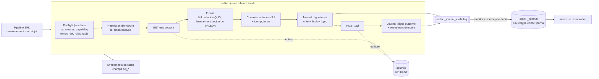
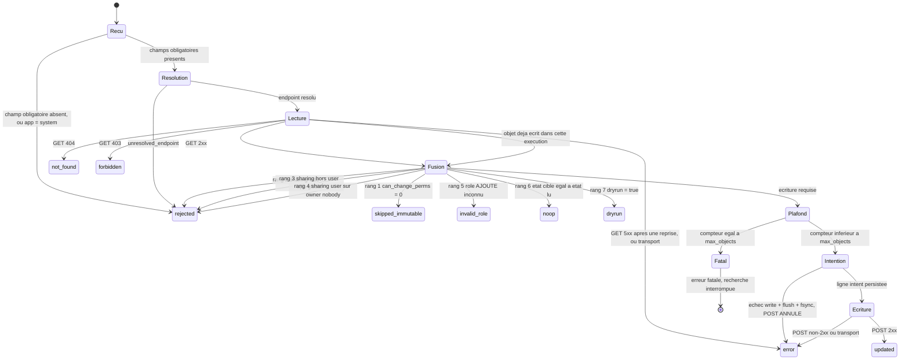

# SA-acl-tools

Application Splunk fournissant la commande de recherche personnalisée **`editacl`**,
qui réécrit en masse les ACL (permissions de lecture et d'écriture, portée de partage)
d'objets de connaissance Splunk arbitraires, via l'API REST, à partir d'un pipeline SPL
décrivant l'état cible.

Cas d'usage moteur : le décommissionnement d'un jeu de rôles hérités, par
**substitution** (remplacement par les rôles d'une nouvelle structure de droits) ou par
**dépréciation** (renommage en `deprecated_<nom>` avant retrait).

> **L'opération est irréversible.** Le journal write-ahead et la macro de restauration
> sont le seul filet de sécurité. Lire la section [Retour arrière](#retour-arrière)
> **avant** la première écriture réelle, pas après.

---

## Sommaire

- [Ce que fait la commande](#ce-que-fait-la-commande)
- [Installation](#installation)
- [Habilitation](#habilitation)
- [Syntaxe](#syntaxe)
- [Contrat d'entrée](#contrat-dentrée)
- [Ce que `fields` décide — et ce qu'il ne décide pas](#ce-que-fields-décide--et-ce-quil-ne-décide-pas)
- [Sortie](#sortie)
- [Machine à états](#machine-à-états)
- [Journal](#journal)
- [Retour arrière](#retour-arrière)
- [Inventaire des objets à traiter](#inventaire-des-objets-à-traiter)
- [Recherches livrées](#recherches-livrées)
- [Table de correspondance et re-validation sur socle cible](#table-de-correspondance-et-re-validation-sur-socle-cible)
- [Tests](#tests)
- [Dépendances vendorisées](#dépendances-vendorisées)
- [Limites connues](#limites-connues)
- [Licence](#licence)

---

## Ce que fait la commande



Points structurants du schéma, tous vérifiés par la suite de tests :

- **La ligne `intent` précède le POST** et est synchronisée sur disque. Si elle échoue,
  le POST est annulé. C'est ce qui rend l'opération réversible.
- **Le GET fait autorité** : les valeurs ACL portées par l'événement d'entrée sont
  considérées comme potentiellement périmées et ne servent qu'à alimenter les attributs
  listés dans `fields`.
- **Aucune parallélisation.** Les appels REST sont sérialisés, l'ordre de sortie suit
  l'ordre d'entrée.

---

## Installation

1. Déposer le répertoire `SA-acl-tools/` sous `$SPLUNK_HOME/etc/apps/` du **search
   head** (jamais sur un indexeur : la commande est déclarée `local = true`).
2. Redémarrer `splunkd`. Le redémarrage est **nécessaire** : sans lui la capability
   déclarée par l'app n'entre pas au référentiel et ne peut pas être attribuée.
3. Vérifier l'intégrité des dépendances vendorisées :

   ```sh
   sh tools/verify_vendor.sh $SPLUNK_HOME/bin/python3
   ```

4. Attribuer la capability `edit_acl_bulk` (voir [Habilitation](#habilitation)).
5. **Exécuter la procédure de re-validation de la table** sur le socle cible — c'est un
   **prérequis à tout usage réel**, pas une précaution (voir
   [Table de correspondance](#table-de-correspondance-et-re-validation-sur-socle-cible)).
6. Première exécution **en simulation** (`dryrun=t`, valeur par défaut) sur un
   périmètre restreint.

### Vérification TLS

Par défaut, la vérification du certificat de `splunkd` est **activée**, avec le CA
bundle de `$SPLUNK_HOME/etc/auth/cacert.pem` s'il est présent. Sur un socle à
certificats auto-signés dont le bundle n'est pas exploitable, créer
`local/editacl.conf` :

```ini
[editacl]
verify_ssl = false
```

La commande émet alors un avertissement à chaque exécution. Ce fichier n'est **pas**
livré dans l'archive : une montée de version ne peut donc pas l'écraser.

---

## Habilitation

Deux habilitations distinctes, qui ne se remplacent pas.

| Habilitation | Rôle | Conséquence si absente |
|---|---|---|
| `edit_acl_bulk` | Autorise l'usage de `editacl` | **Erreur fatale**, la recherche s'interrompt |
| `admin_all_objects` | Permet à l'inventaire de remonter les objets privés d'autrui, et à splunkd d'accepter l'écriture sur un objet non possédé | **Aucune erreur** : le périmètre est silencieusement tronqué |

`edit_acl_bulk` est déclarée par `default/authorize.conf`. Splunk n'offre **pas** de
gating natif des commandes de recherche par capability : le contrôle est implémenté
dans le code, en tête d'exécution, et constitue une erreur fatale. Un contournement par
appel direct au script est sans effet — sans `admin_all_objects` ou possession de
l'objet, splunkd rejettera les écritures.

La capability s'attribue **hors de cette app**, par la chaîne de gestion des rôles.
L'héritage `imported_roles` est résolu côté serveur : un rôle qui importe un rôle
porteur de la capability la voit remonter.

> **La troncature par capability est la première des deux troncatures d'inventaire.**
> Sans `admin_all_objects`, l'opérateur traite un sous-ensemble **sans le moindre
> message**. Elle se cumule à celle décrite dans
> [Inventaire](#inventaire-des-objets-à-traiter).

---

## Syntaxe

```
| editacl [fields=<liste>] [dryrun=<bool>] [validate_roles=<bool>]
          [journal=<bool>] [max_objects=<entier>]
```

| Paramètre | Type | Défaut | Description |
|---|---|---|---|
| `fields` | liste | `perms.read,perms.write` | Attributs ACL à prendre depuis l'événement. Valeurs admises : `perms.read`, `perms.write`, `sharing`. Toute autre valeur — **y compris `owner`** — est une erreur fatale de paramètre. |
| `dryrun` | booléen | `true` | Aucune écriture. Le GET est effectué, la fusion calculée, le résultat émis et journalisé. |
| `validate_roles` | booléen | `true` | Contrôle de l'existence des rôles **ajoutés** avant écriture. |
| `journal` | booléen | `true` | Consignation dans le journal indexé. |
| `max_objects` | entier | `500` | Nombre maximal d'objets **écrits** par exécution. |

### `max_objects` est un compteur d'écritures, pas une pré-condition sur le lot

Une commande *streaming* reçoit ses événements par lots successifs et ne connaît à
aucun moment la cardinalité totale de son entrée. Conséquences, toutes voulues :

- le compteur est incrémenté à chaque POST **émis**, qu'il aboutisse ou échoue ; les
  statuts sans POST ne comptent pas ;
- à l'atteinte du plafond, la recherche s'interrompt par erreur fatale, et le nombre
  d'objets écrits vaut **exactement** `max_objects` ;
- un lot comportant **exactement** `max_objects` objets à écrire se termine **sans**
  erreur ;
- **les objets écrits avant le plafond ne sont pas annulés.** Il n'y a aucune atomicité
  de lot, et il n'y en aura pas : sur plusieurs centaines d'objets, un abandon global
  sur échec unitaire produirait un état partiel non caractérisé. Le journal caractérise
  intégralement l'état partiel, et reste le moyen de le reprendre ou de l'annuler.

### Une liste de valeurs passée à `fields` doit être entre guillemets

```
| editacl fields=perms.read,perms.write dryrun=f      <-- NE FAIT PAS CE QU'ON CROIT
| editacl fields="perms.read,perms.write" dryrun=f    <-- correct
```

Le parseur SPL traite la virgule comme un **séparateur d'arguments de commande** : dans
la forme non quotée, la commande ne reçoit que `perms.read`, et `perms.write` est
ignoré **silencieusement**. Aucune erreur n'est émise ; l'objet est écrit avec un seul
attribut modifié. Toujours quoter `fields` dès qu'il porte plus d'une valeur.

Un `fields` **omis** vaut le défaut `perms.read,perms.write` et n'est pas concerné : la
valeur par défaut est portée par le code, elle ne traverse pas le parseur SPL.

### Exemples

Substitution d'un rôle obsolète, **en simulation**, sur l'inventaire complet :

```
| `acl_inventory`
| search "eai:acl.perms.write"="ancien_role" OR "eai:acl.perms.read"="ancien_role"
| eval "eai:acl.perms.read" = mvmap('eai:acl.perms.read',
        if('eai:acl.perms.read'="ancien_role", "nouveau_role_lecture",
           'eai:acl.perms.read'))
| eval "eai:acl.perms.write" = mvmap('eai:acl.perms.write',
        if('eai:acl.perms.write'="ancien_role", "nouveau_role_admin",
           'eai:acl.perms.write'))
| editacl fields="perms.read,perms.write" dryrun=t
| stats count by acl_status "eai:type" "eai:acl.app"
```

Dépréciation par préfixage, **en écriture réelle**, restreinte aux recherches
sauvegardées et aux vues :

```
| `acl_inventory(savedsearch,views)`
| search "eai:acl.perms.write" IN ("role_a","role_b")
| eval "eai:acl.perms.write" = mvmap('eai:acl.perms.write',
        if('eai:acl.perms.write' IN ("role_a","role_b"),
           "deprecated_" . 'eai:acl.perms.write', 'eai:acl.perms.write'))
| editacl fields=perms.write dryrun=f max_objects=2000
| where acl_status!="noop"
```

La forme paramétrée est le levier de coût pour un usage interactif : on n'énumère que
les familles visées. Voir [Inventaire](#inventaire-des-objets-à-traiter).

---

## Contrat d'entrée

Chaque événement d'entrée désigne **un** objet.

| Champ | Obligatoire | Rôle |
|---|---|---|
| `title` | oui | Nom de l'objet, dernier segment du chemin REST |
| `eai:acl.app` | oui | Contexte applicatif du namespace |
| `eai:acl.owner` | oui | Propriétaire courant, second composant du namespace — **adressage uniquement** |
| `id` | l'un des deux | URI complète de l'objet, exploitable si elle provient d'un endpoint natif |
| `eai:type` | l'un des deux | Type d'objet, résolu par la table de correspondance |
| `eai:acl.perms.read` | non | Valeur cible, lue **seulement** si `perms.read` figure dans `fields` |
| `eai:acl.perms.write` | non | idem |
| `eai:acl.sharing` | non | idem |

**`eai:acl.owner` n'est jamais une valeur cible.** Le champ sert exclusivement à
construire le namespace d'adressage ; il ne peut pas simultanément désigner l'adresse
courante de l'objet et une valeur cible — un changement de propriétaire adresserait un
objet inexistant. La reprise de propriété est **hors périmètre**, et l'est jusque dans
le type de données : aucune structure du code ne peut porter un propriétaire cible.

### Résolution de l'endpoint

Deux voies **complémentaires et disjointes**, pas primaire et repli :

1. **Depuis `id`**, si le chemin extrait ne pointe pas sur `admin/directory` — le
   handler d'agrégation sait lister, pas écrire une ACL.
2. **Depuis `eai:type`**, par la table de correspondance. Type inconnu → rejet
   explicite, `acl_error = "unresolved_endpoint:<type>"`. **Aucune heuristique de
   dérivation** n'est admise : l'analogie de nommage casse en pratique
   (`commands` → `admin/commandsconf`, `conf-times` → `data/ui/times`).

Dans les deux cas l'URI est **reconstruite**, jamais reprise telle quelle : le champ
`id` natif double-encode la barre oblique mais pas les autres caractères spéciaux.

L'encodage du segment `title` suit une **règle unique**, établie empiriquement : simple
`%`-encodage du segment entier, sans caractère réservé. La barre oblique devient `%2F`
et n'appelle aucun traitement particulier.

| Classe | Forme retenue | Exemple |
|---|---|---|
| espace | `%20` | `Ma recherche` → `Ma%20recherche` |
| barre oblique | `%2F` | `Rapport/Mensuel` → `Rapport%2FMensuel` |
| non-ASCII | UTF-8 puis `%`-encodage | `éàü` → `%C3%A9%C3%A0%C3%BC` |
| pourcent | `%25` | `Taux 100%` → `Taux%20100%25` |

Le double encodage est un **piège asymétrique** : il fonctionne pour la barre oblique
seule et casse espace, accent et pourcent.

---

## Ce que `fields` décide — et ce qu'il ne décide pas

**Le paramètre `fields` décide seul de ce qui est modifié ; le contenu de l'événement
décide seulement de la valeur.** La présence ou l'absence d'un champ dans l'événement
n'a **aucun** pouvoir de préservation.

| Attribut dans `fields` | Champ dans l'événement | Effet |
|---|---|---|
| non | quel qu'il soit | Valeur du GET préservée — le contenu de l'événement est **ignoré** |
| oui | renseigné | Valeur de l'événement appliquée |
| oui | absent, nul ou vide | Attribut **vidé** (`perms.read=` dans le POST) |

Côté permissions, « champ absent », « champ nul » et « champ vide » sont donc **le même
cas**. C'est délibéré : cette convention élimine l'ambiguïté d'un champ multivalué
qu'un `eval` réduit à null lorsque toutes ses valeurs sont supprimées — situation
nominale du décommissionnement, où un objet dont l'unique rôle en écriture était le
rôle obsolète doit se retrouver avec `perms.write` vide.

Un attribut vide n'est **jamais** matérialisé en `*`, ni en aucune autre valeur par
défaut.

**Exception `sharing`.** `sharing=` n'est pas une portée valide. Si `sharing` figure
dans `fields` et que le champ est absent, nul ou vide, l'événement est **rejeté**
(`acl_error = "sharing_empty_not_allowed"`), sans POST et sans incrément du compteur.
Conséquence pratique : un pipeline qui liste `sharing` dans `fields` mais ne porte pas
`eai:acl.sharing` sur toutes ses lignes verra ces lignes rejetées en bloc. C'est
bruyant et c'est voulu — le rejet est visible et non destructif, l'inverse ne l'est pas.

### Les quatre attributs sont toujours transmis

L'endpoint `/acl` opère en **remplacement intégral** : toute omission équivaut à un
effacement. Le corps du POST porte donc toujours `owner`, `sharing`, `perms.read` et
`perms.write`, `owner` valant invariablement celui lu par le GET.

### Idempotence

L'état fusionné est comparé à l'état lu après normalisation identique des deux côtés —
découpage, `trim`, **suppression des éléments vides**, déduplication, tri. La
comparaison porte sur les collections triées : une permutation d'ordre des rôles est un
`noop`.

> La suppression des éléments vides n'est pas cosmétique. Après un POST portant
> `perms.read=` vide, le GET suivant ne renvoie ni `[]` ni `null` mais **`[""]`** — une
> liste contenant une chaîne vide. Sans ce filtrage, la détection d'idempotence
> échouerait sur **tout** objet à permission vide, et une seconde passe réécrirait.

### `validate_roles` ne porte que sur les rôles ajoutés

Un rôle inconnu **déjà présent** sur l'objet et non modifié par l'opération ne bloque
pas l'écriture ; il est signalé par `acl_warning = "stale_role_preserved:<liste>"`.

La lecture inverse rendrait l'outil inutilisable sur exactement la plateforme qu'il
vise : bloquer une écriture au motif qu'un rôle mort traîne dans `perms.read` alors
qu'on modifie `perms.write` empêche le correctif sans faire disparaître la référence
morte. L'audit de la dette préexistante relève des recherches d'inventaire, pas du
garde-fou.

Le rôle `*` est une valeur légitime du référentiel et n'est **jamais** développé en
liste de rôles.

---

## Sortie

Chaque événement d'entrée produit **exactement un** événement de sortie, conservant
l'intégralité de ses champs, augmenté de :

| Champ | Contenu |
|---|---|
| `acl_status` | `updated`, `noop`, `dryrun`, `rejected`, `not_found`, `forbidden`, `invalid_role`, `skipped_immutable`, `error` |
| `acl_endpoint` | Chemin de l'objet ciblé, **sans** schéma, hôte, port ni suffixe `/acl` |
| `acl_http_code` | Code HTTP du POST, ou du GET en cas d'échec amont. **Sentinelle `0`** en l'absence de tout échange HTTP |
| `acl_error` | Message d'erreur, tronqué à 512 caractères |
| `acl_warning` | Avertissements non bloquants, **concaténés par `;`** dans un ordre stable |
| `acl_owner` | Propriétaire de l'objet, lu et retransmis inchangé |
| `acl_before_perms_read`, `acl_before_perms_write`, `acl_before_sharing` | État antérieur, normalisé |
| `acl_after_perms_read`, `acl_after_perms_write`, `acl_after_sharing` | État transmis |
| `acl_journaled` | Ligne `intent` écrite **et synchronisée sur disque** |

Avertissements possibles : `sharing_change`, `app_disabled`,
`stale_role_preserved:<liste>`, `journal_outcome_failed`.

---

## Machine à états

Les états terminaux en minuscules sont les neuf `acl_status`. Chacun produit
**exactement une** ligne `outcome` puis **un** événement de sortie. L'état fatal ne
produit ni ligne `intent`, ni ligne `outcome`, ni événement de sortie.



**L'ordre des rangs 1 à 7 est normatif** : il détermine quel statut l'emporte quand
plusieurs conditions sont réunies. Deux conséquences à connaître :

- `can_change_perms` est lu **dans la réponse du GET**, jamais dans l'événement
  d'entrée — s'en remettre à l'événement rendrait le garde-fou contournable par un
  `eval` en amont ;
- le rang 6 précède le rang 7 : **un objet déjà conforme est un `noop` même en
  simulation.** C'est l'information utile, et c'est ce qui permet de mesurer la
  convergence d'un lot sans écrire.

### Erreurs fatales

Liste **limitative**. Toute autre erreur portant sur un objet donné est une erreur par
événement, et le pipeline se poursuit.

- capability `edit_acl_bulk` absente ;
- paramètre invalide : `fields` contenant une valeur non admise — dont `owner` — ou
  `max_objects` non entier positif ;
- exécution en recherche temps réel détectée ;
- `splunkd_uri` ou `session_key` indisponibles ;
- table de correspondance illisible ;
- atteinte de `max_objects` ;
- fichier de journal non ouvrable alors que `journal=true` **et** `dryrun=false`.

---

## Journal

Deux fichiers sous `$SPLUNK_HOME/var/log/splunk/`, collectés vers `_internal` sous des
sourcetypes dédiés.

| Fichier | Rotation | Contenu | Sourcetype |
|---|---|---|---|
| `editacl_journal_<sid>.log` | **aucune — un fichier par exécution** | Deux lignes JSON par objet écrit. Jeu de restauration. | `editacl:journal` |
| `editacl.log` | 5 Mo × 5 | Diagnostic d'exécution | `editacl:diag` |

**Un fichier par `sid`** : un handler rotatif partagé n'est pas sûr entre processus.
Deux exécutions concurrentes sur le même membre — une recherche planifiée qui croise
une recherche manuelle — peuvent perdre des lignes au moment d'une rotation. Le journal
étant le **seul** filet de sécurité d'une opération irréversible, une fenêtre connue de
perte de lignes n'est pas acceptable quand le correctif coûte un nom de fichier.

### Deux lignes par écriture

```mermaid
sequenceDiagram
  participant P as editacl
  participant J as journal (disque)
  participant S as splunkd

  Note over P: plafond max_objects controle AVANT toute ecriture
  P->>J: ligne intent (etat anterieur + charge utile)
  J-->>P: write + flush + fsync
  alt fsync en echec
    P-->>P: POST ANNULE, statut error, acl_journaled=false
  else fsync OK
    P->>S: POST <endpoint>/acl
    S-->>P: code HTTP
  end
  P->>J: ligne outcome (statut, code, erreur)
  Note over J: une intent sans outcome = interruption entre fsync et reponse ;<br/>le POST peut avoir abouti — trancher par splunkd_access.log
```

- `intent` est écrite **avant** chaque POST, avec `flush()` puis `os.fsync()`. Son échec
  **annule** le POST pour l'objet concerné.
- `outcome` est écrite après traitement de **chaque** événement, quel que soit le
  statut — y compris `noop`, `dryrun` et les rejets. Son échec n'annule rien mais est
  signalé par `acl_warning = "journal_outcome_failed"`.
- Le champ `title` est journalisé **non encodé** : la restauration le réinjecte tel
  quel.
- La chaîne `endpoint` est un **contrat** : rigoureusement identique sur `intent` et
  `outcome`, calculée une seule fois, sans schéma ni hôte ni port ni suffixe `/acl`.

**Invariants vérifiables**, chacun couvert par un test unitaire :

1. une ligne `outcome` par événement de sortie, sans exception ;
2. une ligne `intent` par POST tenté ;
3. une ligne `intent` sans `outcome` signale une interruption entre la synchronisation
   sur disque et la réponse du POST — **le POST peut avoir abouti**.

### Rétention et acheminement

Deux points à vérifier à l'installation :

- **Rétention.** `_internal` est par défaut gelé à 28 jours. Si la fenêtre
  d'exploitation du journal doit excéder cette durée, redéfinir `index` dans
  `local/inputs.conf` vers un index dédié. C'est le **seul** point de configuration à
  modifier.
- **Acheminement.** Le journal n'est interrogeable depuis le search head que si
  celui-ci transfère ses logs internes vers les indexeurs — configuration courante mais
  pas universelle. À défaut, `_internal` reste local au membre ayant exécuté la
  commande, et la consolidation multi-membres tombe.

### Politique de purge

Le nombre de fichiers `editacl_journal_<sid>.log` croît avec le nombre d'exécutions,
**sans plafond automatique**. Le volume unitaire est marginal (deux lignes JSON par
objet écrit), mais la croissance est monotone.

Purge recommandée **par ancienneté**, jamais par taille ni par nombre :

```sh
# A planifier hors fenetre d'exploitation, apres s'etre assure que les executions
# concernees sont indexees ET que leur fenetre de restauration est close.
find "$SPLUNK_HOME/var/log/splunk" -name 'editacl_journal_*.log' -mtime +90 -delete
```

Choisir l'ancienneté en fonction de la **rétention réelle de l'index cible**, pas de
l'espace disque : tant que les événements ne sont pas indexés, le fichier est la seule
voie de restauration ; une fois indexés, il en reste la voie de secours immédiate.

---

## Retour arrière

La macro `editacl_rollback(<sid>)` produit un pipeline directement réinjectable :

```
| `editacl_rollback(1754483000.1)`
| editacl fields="perms.read,perms.write,sharing" dryrun=f
```

Elle émet sept champs — `title`, `eai:acl.app`, `eai:acl.owner`, `eai:acl.perms.read`,
`eai:acl.perms.write`, `eai:acl.sharing`, `eai:type` — soit exactement le contrat
d'entrée de la commande.

Elle ne restaure que les objets dont une ligne `outcome` atteste que l'écriture a **bien
abouti** : un objet dont le POST a échoué n'a pas été modifié et ne doit pas être
« restauré » vers un état qu'il n'a jamais quitté.

> **La plage temporelle de la recherche appelante doit couvrir l'exécution à
> restaurer.** La macro interroge un index ; lancée sur les quinze dernières minutes,
> elle ne verra pas une exécution de la veille et ne restaurera rien — sans erreur.

Le `sid` s'obtient par `| eval sid=$sid$`, par l'inspecteur de recherche, ou par le nom
du fichier de journal de l'exécution (`editacl_journal_<sid>.log`).

**La restauration d'une permission vide est correcte par construction.** Si
`before_perms_read` vaut la chaîne vide, l'extraction JSON à l'indexation ne matérialise
pas le champ ; la sortie de la macro ne porte donc pas `eai:acl.perms.read`. À la
réinjection, `perms.read` figure dans `fields` mais le champ est absent de l'événement
— et « absent » et « vide » sont traités identiquement, donc l'attribut est vidé.

### Limites du retour arrière

- Il **n'est pas transactionnel**.
- Il ne rétablit pas un objet supprimé entre-temps.
- Il n'est exploitable **qu'après indexation** du journal — latence de quelques
  secondes à quelques dizaines de secondes selon la charge de la chaîne d'ingestion. Le
  fichier sur disque reste la voie de secours immédiate.
- Il s'appuie sur la résolution par `eai:type`, `id` n'étant pas journalisé : **la
  couverture de la table conditionne directement la capacité de retour arrière.**

---

## Inventaire des objets à traiter

C'est le point sur lequel un opérateur se trompe silencieusement. Deux troncatures
indépendantes se cumulent.

### 1. Troncature par capability

Sans `admin_all_objects`, l'inventaire ne remonte pas les objets privés d'autrui.
**Aucune erreur n'est émise.**

### 2. Troncature structurelle de `admin/directory`

`| rest /servicesNS/-/-/admin/directory` **ne remonte pas tous les objets de
connaissance**, indépendamment des capabilities. Mesuré sur une instance Splunk
Enterprise 9.4.6 standalone, opérateur en `admin_all_objects` :

| Mesure | Valeur |
|---|---|
| Objets vus par `admin/directory` | **894** |
| Objets vus par l'union des endpoints natifs | **1 476** |
| **Couverture** | **60,6 %** |

Familles **totalement absentes** de `admin/directory` :

| Famille | Objets non vus |
|---|---|
| fichiers de lookup | **526** — la population la plus nombreuse de l'instance |
| `fields` | 29 |
| champs calculés `EVAL-` | 12 |
| actions d'alerte historiques | 6 |
| modèles de données | 3 |
| `viewstates` | 2 |
| `tags` | 2 |
| `ntags` | 2 |

La troncature est même **partielle à l'intérieur d'un endpoint** : les actions d'alerte
modulaires figurent dans `admin/directory`, les six actions historiques non.

De plus, **100 %** des `id` émis par `admin/directory` sont auto-référents — ils
pointent sur `.../admin/directory/<title>` et non sur l'objet. Avec cette source, la
table de correspondance n'est pas un repli : c'est la voie **unique** de résolution.

Ces objets restent **adressables et leur `/acl` modifiable** : l'obstacle est
l'inventaire, pas l'écriture.

### La parade : la macro `acl_inventory`

L'inventaire se bâtit sur les **endpoints natifs**. La macro `acl_inventory` les
interroge famille par famille et normalise leur sortie sur le contrat d'entrée de la
commande. Elle est **invocable en ligne**, dans n'importe quelle recherche :

```
| `acl_inventory`                                  <-- toutes les familles
| `acl_inventory(savedsearch)`                     <-- une famille
| `acl_inventory(savedsearch,views,eventtypes)`    <-- plusieurs familles
```

Sa sortie porte **exactement** huit champs, dans cet ordre : `title`, `eai:acl.app`,
`eai:acl.owner`, `eai:acl.perms.read`, `eai:acl.perms.write`, `eai:acl.sharing`,
`eai:type`, `id`. Elle alimente `editacl` **sans transformation intermédiaire**.


**Trois points de conception.**

1. **La sélection précède les appels REST.** Une famille non demandée ne coûte rien. Un
   opérateur qui ne traite que des recherches sauvegardées ne paie pas l'énumération
   des fichiers de lookup, qui sont souvent la population la plus nombreuse.
2. **`eai:type` est synthétisé quand l'endpoint natif n'en émet pas** — ce qui est le
   cas de la grande majorité d'entre eux. La valeur retenue est la clé de la table de
   correspondance associée à la famille interrogée ; la valeur nativement émise, quand
   il y en a une, est préservée telle quelle. **Sans cette synthèse, l'aller
   fonctionnerait mais le retour arrière serait impossible** : `editacl_rollback`
   résout par `eai:type`, `id` n'étant pas journalisé.
3. **Les noms de famille sont les clés de la table**, portés par le lookup
   `acl_object_families` (colonne `family`). Une famille par handler natif : deux clés
   de la table qui visent le même handler ne donnent qu'une seule famille, sans quoi
   l'inventaire énumérerait deux fois le même endpoint.

**Coût.** L'inventaire complet émet un appel REST par famille. C'est l'ordre de
grandeur de la trentaine d'appels, pas de l'appel unique — c'est le prix de la
couverture intégrale. Sur un search head chargé, préférer la forme paramétrée en usage
interactif, et la planification sur les gros périmètres.

`| rest … /admin/directory` reste utilisable comme **voie rapide**, à la condition
expresse d'assumer les chiffres ci-dessus : ce n'est pas un inventaire, c'est un
sous-ensemble.

---

## Recherches livrées

Trois recherches sauvegardées, **bâties sur la macro d'inventaire** et non sur
`admin/directory`. Aucune n'est planifiée : l'inventaire est une macro invocable en
ligne, la planification est un usage recommandé sur les gros périmètres, jamais la
modalité d'accès. Pour en planifier une, activer `enableSched` dans
`local/savedsearches.conf`.

| Recherche | Ce qu'elle produit |
|---|---|
| `ACL — inventaire par rôle` | Ventilation lecture/écriture par rôle, application et type d'objet. Point de départ d'un audit d'habilitation. |
| `ACL — références aux rôles décommissionnés` | Objets dont l'ACL référence encore un rôle listé par le lookup `acl_decommissioned_roles`. Sa sortie porte le contrat d'entrée de `editacl` et **alimente directement le pipeline de modification**. |
| `ACL — journal des modifications` | Historique indexé par `sid`, statut, application et type. La colonne `restauration` porte la commande de retour arrière de l'exécution concernée. |

Le lookup `acl_decommissioned_roles` livré ne contient que des **identifiants
génériques d'exemple** (`ancien_role`, `role_a`, `role_b`). Le remplacer par la liste
réelle — de préférence dans `lookups/` de l'app locale, qu'une mise à jour de l'app ne
peut pas écraser.

---

## Table de correspondance et re-validation sur socle cible

`bin/acl_endpoint_map.json`, structure `{ "<eai:type>": "<handler_path>" }`.

État de la table livrée, établie sur Splunk Enterprise 9.4.6 : **28 entrées, 28
validées par un GET réel sur un objet témoin, aucun type non résolu**. Quatre entrées
portent une réserve explicite — `tags`, `lookup-table-file`, `times` et `models` : leur
handler est prouvé par GET, mais la clé n'a jamais été observée comme valeur d'`eai:type`
en 9.4.6. Elles sont conservées par prudence de version.

### Extension par l'exploitant, sans modification du code

Créer `lookups/acl_endpoint_map_override.csv` (colonnes `eai_type`, `handler_path`) à
partir du modèle `acl_endpoint_map_override.csv.example`. Il est chargé **après** le
JSON et le surcharge.

**L'archive ne contient jamais le fichier réel** : une mise à jour de l'app ne peut donc
pas l'écraser, puisqu'elle ne le contient pas. Le conserver néanmoins hors de l'app
comme ceinture.

Un `handler_path` non conforme au motif attendu est **écarté** avec une trace de
diagnostic, jamais utilisé : le fichier est éditable, il constitue une entrée non
fiable, et un chemin forgé pourrait viser un endpoint arbitraire.

### Re-validation — prérequis à tout usage réel

**La table n'est pas présumée valable sur une autre version que 9.4.6.** Comme la table
est la voie de résolution unique dès que l'inventaire provient de `admin/directory`, une
nomenclature qui a changé se traduit par des rejets — ou pire, par un endpoint valide
mais faux.

La procédure de re-validation doit, sur le socle cible :

1. énumérer les `eai:type` distincts effectivement présents ;
2. les confronter à la table livrée ;
3. produire trois listes — correspondances confirmées par un GET réel, correspondances
   de la table introuvables sur le socle, types présents sur le socle et absents de la
   table.

La troisième liste se traite par le fichier d'override, sans modification du code.

La procédure est livrée sous `tools/revalidate_mapping.py`. Elle s'exécute sur le socle
cible, contre l'API REST de l'instance :

```sh
<commande fournissant le mot de passe> | python3 tools/revalidate_mapping.py \
    [--user admin] [--splunkd-uri https://127.0.0.1:8089] [--insecure]
```

Le mot de passe est lu sur la **première ligne de l'entrée standard** : jamais en
argument de ligne de commande, jamais écrit sur disque, jamais imprimé. Code de retour
`1` si la liste C n'est pas vide.

`tools/` ne fait pas partie de l'archive déployable. Le script résout ses chemins
relativement à son répertoire parent : pour l'exécuter sur le socle, le déposer dans
`$SPLUNK_HOME/etc/apps/SA-acl-tools/tools/` — il y trouve alors `bin/acltools`,
`bin/acl_endpoint_map.json`, l'override éventuel et `lookups/acl_object_families.csv`
de l'app **réellement installée**, ce qui est le seul état qui compte.

Elle produit une **quatrième** section, non exigée mais nécessaire : le contrôle de
cohérence entre `bin/acl_endpoint_map.json`, que lit le code Python, et
`lookups/acl_object_families.csv`, que lit la macro d'inventaire — SPL ne sachant pas
lire de JSON, la même information existe sous deux formes, et une divergence rendrait
l'inventaire et la résolution incohérents.

> **Pourquoi un script et non une recherche SPL.** La construction de l'URI d'un objet
> obéit à une règle d'encodage unique et non évidente, implémentée une seule fois dans
> `acltools/endpoint.py`. La réécrire en SPL créerait une seconde implémentation qui
> divergerait — le défaut exact que la règle du point d'injection unique interdit. Le
> script **réutilise** `Mapping.coverage()` et `build_object_path()` ; il ne
> réimplémente rien.

---

## Tests

Suite unitaire **exécutable hors Splunk, sans instance et sans réseau**. Aucune
dépendance de développement : `unittest` de la bibliothèque standard suffit.

```sh
python -m unittest discover -s tests -t . -v
```

Elle couvre notamment :

- **les dix-huit lignes de la matrice de fusion**, une par test nommé, sans
  regroupement ;
- la normalisation des listes de rôles, y compris le cas `[""]` ;
- la reconstruction d'URI sur les quatre classes de caractères ;
- l'ordre normatif des sept contrôles préalables à l'écriture ;
- `validate_roles` sur rôle ajouté contre rôle conservé ;
- les trois invariants du journal, et le contrat de champs de la macro de restauration ;
- l'**étanchéité des couches** : aucun module du noyau n'importe le réseau hors du
  client REST, et aucun ne mentionne le SDK.

Ce dernier test n'est pas décoratif : sans lui, la règle d'import n'est qu'une intention
en commentaire, et il suffit d'un import ajouté à la va-vite pour que la matrice de
fusion cesse d'être éprouvable sur une machine sans instance.

### Environnement d'intégration

Les tests d'intégration exigent une instance et une app jetable portant un objet de
chaque grande famille, dans les trois portées de partage, avec et sans permissions
explicites. Son amorçage est scripté, en deux volets — le second n'existe que parce que
les objets **privés** (`sharing=user`, namespace utilisateur) et les objets à **nom
spécial** (barre oblique, espace, accent, pourcent) ne se déclarent pas proprement en
fichier de configuration :

```sh
bash tools/acl_probe_bootstrap.sh                    # objets declares en .conf
# puis, apres redemarrage de splunkd :
<mot de passe> | python3 tools/acl_probe_bootstrap_rest.py   # objets prives + noms speciaux
```

Les deux scripts sont **idempotents** (écriture par gabarit, jamais d'ajout ; un objet
déjà présent ressort en HTTP 409, traité comme un succès) et acceptent `--remove`. Le
mot de passe est lu sur la première ligne de l'entrée standard. Les identifiants créés
sont volontairement génériques.

### Découpage

| Couche | Contenu | Import autorisé |
|---|---|---|
| Noyau pur | normalisation, fusion, résolution d'endpoint, table, sérialisation du journal, machine à états | bibliothèque standard, **hors réseau** |
| Adaptateurs | client REST (`acltools/rest.py`), écrivain de journal | bibliothèque standard, réseau autorisé **dans `rest.py` seulement** |
| Enveloppe | `bin/editacl.py` | le SDK — surface volontairement minimale, **aucune règle métier** |

---

## Dépendances vendorisées

`bin/lib/` contient **une seule** dépendance : le SDK Python de Splunk, en version
figée au patch, installée à empreintes vérifiées. Le noyau `bin/acltools/` n'a **aucune**
dépendance tierce — les appels REST sont écrits en HTTP brut sur `urllib` + `ssl`.

Le répertoire est **généré et versionné** : l'archive doit être déployable sans réseau.
Sa reconstruction et sa vérification sont scriptées.

```sh
sh tools/vendor.sh        /chemin/vers/python3   # reconstruit bin/lib/
sh tools/verify_vendor.sh /chemin/vers/python3   # verifie le manifeste d'empreintes
```

Toute montée de version passe par `tools/requirements-vendor.txt` puis la réexécution
des deux scripts — **jamais** par une édition directe dans `bin/lib/`, que
`verify_vendor.sh` détecterait. Détail : [`bin/lib/VENDOR.md`](bin/lib/VENDOR.md).

---

## Limites connues

| Limite | Conséquence | Parade |
|---|---|---|
| **Table établie sur 9.4.6** | Une nomenclature différente sur un autre socle produit des rejets, voire un endpoint valide mais faux | Re-validation sur le socle cible, **prérequis à tout usage réel** ; fichier d'override |
| **Double troncature d'inventaire** | L'opérateur traite un sous-ensemble sans le moindre message | `admin_all_objects` + inventaire par endpoints natifs |
| **Détection du temps réel non encore éprouvée** | Le garde-fou repose sur `isRealTimeSearch`, avec repli sur les bornes temporelles. Si l'information n'est pas exposée, la commande émet un **avertissement** et poursuit | Ne pas invoquer `editacl` depuis une recherche temps réel ; `run_in_preview = false` et l'idempotence restent les deux premières lignes de défense |
| **Aucune atomicité de lot** | Un arrêt en cours laisse un état partiel | Le journal caractérise intégralement l'état partiel |
| **Aucune reprise sur le POST** | Un échec de transport après émission laisse une `intent` sans `outcome` | Contrôle croisé avec `splunkd_access.log` pour déterminer si l'écriture a eu lieu. Une reprise ne distinguerait pas « le POST n'est pas parti » de « le POST a abouti et la réponse s'est perdue » |
| **Réplication en cluster de search heads** | Chaque écriture déclenche une réplication d'objet de connaissance | Lots bornés par `max_objects`, déroulement hors fenêtre de forte activité. La commande sérialise ses appels et n'implémente **aucune** temporisation automatique |
| **Restauration postérieure à l'indexation** | Le journal n'est interrogeable qu'après ingestion | Le fichier de l'exécution est auto-contenu et exploitable immédiatement |
| **`app_disabled` coûte un appel REST par app distincte** | Latence marginale sur un lot multi-apps | Mémoïsé par app |
| **Reprise de propriété hors périmètre** | `owner` ne peut pas être modifié | Hors périmètre par construction — `owner` est l'adresse de l'objet, pas une valeur cible |
| **`fields` non quoté est tronqué par SPL** | Seule la première valeur est appliquée, **sans erreur** | Quoter systématiquement : `fields="perms.read,perms.write"` |
| **Coût de l'inventaire complet** | Un appel REST par famille, une trentaine au total | Forme paramétrée en usage interactif ; planification sur les gros périmètres |
| **Familles d'inventaire figées par un lookup** | Une famille absente de `acl_object_families` n'est pas inventoriée | `tools/revalidate_mapping.py` compare le lookup à la table et signale toute divergence |

---

## Licence

[Apache License 2.0](LICENSE). Le SDK vendorisé sous `bin/lib/` est distribué sous la
même licence.
