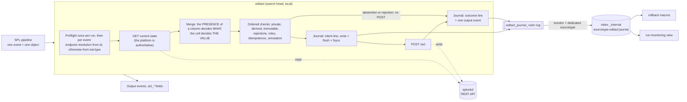

# SA-acl-tools

Splunk application shipping the custom search command **`editacl`**, which rewrites in
bulk the ACLs - read and write permissions, sharing scope, owner - of Splunk knowledge
objects, through the REST API, from an SPL pipeline describing the target state. It also
ships an inventory macro, two rollback macros, four saved searches and a run monitoring
view. Driving use case: decommissioning legacy roles, by **substitution** with the roles
of a new entitlement structure, or by **deprecation** (renaming to `deprecated_<name>`).

> **The operation is irreversible.** The write-ahead journal and the rollback macros are
> the only safety net. Read [Rollback](#the-other-shipped-objects) **before** the first
> real write.

This document is for whoever **runs** the tool. The architecture, the measurements the
behaviour rests on, the traps and the design decisions live in
[`DEVNOTES.md`](DEVNOTES.md), which is not shipped in the deployable archive.



The intent line precedes the POST and is synchronised to disk: if it cannot be written,
the POST is cancelled, which is what makes the operation reversible. Nothing runs in
parallel, and one input event always produces exactly one output event.

---

## Installation

Build the archive from a **git reference**, never from the working tree. `tests/`,
`tools/` and `DEVNOTES.md` are left out by `.gitattributes`; `bin/lib/` is included, so
the archive deploys with no network access. Anchor any check of its content on
`^SA-acl-tools/`: the archive prefix itself contains the substring `tools/`.

```sh
git archive --format=tar.gz --prefix=SA-acl-tools/ \
    -o SA-acl-tools-$(git rev-parse --short HEAD).tar.gz HEAD
tar tzf SA-acl-tools-<ref>.tar.gz | grep -E '^SA-acl-tools/(tests|tools)/'   # empty
```

1. Drop `SA-acl-tools/` under `$SPLUNK_HOME/etc/apps/` of the **search head** - never on
   an indexer, the command is declared `local = true`.
2. Restart `splunkd`. Without it the capability does not enter the repository and cannot
   be granted, and the search assistant ignores the command.
3. Check the vendored SDK: `sh tools/verify_vendor.sh $SPLUNK_HOME/bin/python3`. `tools/`
   is not in the archive; fetch it from the repository into
   `$SPLUNK_HOME/etc/apps/SA-acl-tools/tools/`, where it finds the app as installed.
4. **Grant the `edit_acl_bulk` capability.** `default/authorize.conf` declares it and
   grants it to the `admin` role, so the tool works as deployed for accounts that already
   hold `admin_all_objects`. Granting it to other roles is outside this app.
5. **Re-validate the mapping table on the target platform** - a prerequisite to any real
   use. The password is read from the first line of standard input; return code `1` lists
   the types present on the platform and absent from the table, which you treat through
   `lookups/acl_endpoint_map_override.csv` (columns `eai_type`, `handler_path`):

   ```sh
   <command supplying the password> | python3 tools/revalidate_mapping.py \
       [--user admin] [--splunkd-uri https://127.0.0.1:8089] [--insecure]
   ```

6. **Grant read access to the journal index** to whoever must use the monitoring view,
   the rollback macros or the change-journal search - outside this app: no
   `srchIndexesAllowed`, no `srchIndexesDefault`, no `srchFilter` is declared here.
7. First run **in simulation** (`dryrun=t`, the default) on a restricted scope.

**Self-signed certificate.** Verification of the `splunkd` certificate is on by default,
using `$SPLUNK_HOME/etc/auth/cacert.pem` when present. Failing that, create
`local/editacl.conf` with `[editacl]` then `verify_ssl = false`; the command then warns on
every run. That file is not in the archive, so an upgrade cannot overwrite it.

---

## The command

```
| editacl [title=<field>] [app=<field>] [id=<field>] [type=<field>] [sharing=<field>]
          [new_perms_read=<field>] [new_perms_write=<field>]
          [new_sharing=<field>] [new_owner=<field>]
          [dryrun=<bool>] [validate_roles=<bool>] [journal=<bool>]
          [max_objects=<int>]
```

**Every parameter names the SPL field to read one piece of information from**, and
defaults to the platform's native field name - which is why a pipeline built on
`acl_inventory` needs **no parameter at all**, and why a pipeline that renames its fields
only has to name the new ones.

| Parameter | Default | Role |
|---|---|---|
| `title` | `title` | Name of the object. Required, with a value |
| `app` | `eai:acl.app` | Application of the namespace. Required, with a value |
| `id` | `id` | Full URI, primary resolution path |
| `type` | `eai:type` | Object type, resolution through the mapping table |
| `sharing` | `eai:acl.sharing` | **Current** scope, used to skip private objects |
| `new_perms_read` | `eai:acl.perms.read` | Target `perms.read` |
| `new_perms_write` | `eai:acl.perms.write` | Target `perms.write` |
| `new_sharing` | `eai:acl.sharing` | Target `sharing` |
| `new_owner` | `eai:acl.owner` | Target `owner`. A target value, never an address |
| `dryrun` | `true` | No write at all. The GET happens, the merge is computed and journalled |
| `validate_roles` | `true` | Checks that the **added** roles exist before writing |
| `journal` | `true` | Records into the indexed journal |
| `max_objects` | `10` | Maximum number of objects **written** per run. No effect in simulation |

**What decides between modifying and preserving an attribute is the presence of its
column** in the result set, and nothing else: a column absent preserves the attribute as
the GET reads it, a column present with an empty cell empties it, a column present with a
value applies it. Dropping a column - `| fields - "eai:acl.perms.read"` - is therefore how
you preserve an attribute. `sharing` and `owner` cannot be emptied: an empty cell on their
column rejects the event, as does a scope outside `{user, app, global}`.

---

## Statuses and output

Each input event produces **exactly one** output event, keeping all of its fields, plus
fourteen columns - always present, empty where a status has nothing to show.

| Field | Content |
|---|---|
| `acl_status` | `updated`, `noop`, `dryrun`, `rejected`, `not_found`, `forbidden`, `invalid_role`, `skipped_immutable`, `skipped_derived`, `skipped_private`, `skipped_ceiling`, `error` |
| `acl_endpoint` | Path of the targeted object, without scheme, host, port or `/acl` suffix |
| `acl_type` | Type of the object as the command settled it, in the vocabulary of `eai:type` |
| `acl_http_code` | HTTP code of the POST, or of the GET on an upstream failure. `0` when no exchange took place |
| `acl_error` | Error message, truncated at 512 characters |
| `acl_warning` | Non-blocking warnings, joined by `;` |
| `acl_before_*`, `acl_after_*` | Owner, `perms.read`, `perms.write` and `sharing` before and after, normalised |
| `acl_journaled` | The `intent` line was written **and synchronised to disk** |

Those are the twelve `acl_status` values, derived from the code by the test suite rather
than maintained by hand. What each one means: `updated` the POST succeeded;
`noop` the target state equals the state read, with no POST **even in simulation**;
`dryrun` a real run **would have changed** this object; `rejected` the input row is
unusable - missing name or application, unresolved type, empty `sharing` or `owner`,
scope outside `{user, app, global}`; `not_found` and `forbidden` the GET answered `404`
or `403`; `invalid_role` an **added** role does not exist, roles already present and
untouched never blocking; `skipped_immutable` the platform declares the permissions
unchangeable; `skipped_derived` the object is derived from an `eventtype`;
`skipped_private` its current scope is `user`, where permissions grant nothing anyway;
`skipped_ceiling` `max_objects` was reached, with no GET and no POST; `error` the POST
failed, or the `intent` line could not be persisted, which cancels the POST.

Warnings carried by `acl_warning`: `sharing_change`, `owner_change`, `app_disabled`,
`stale_role_preserved:<list>`, `journal_outcome_failed`, `duplicate_post_suppressed`,
`runtime_divergence_possible`, `carrier_probe_inconclusive:<code>`,
`private_detected_by_id_namespace`, `scope_undetermined`.

---

## The other shipped objects

**`acl_inventory`** enumerates the knowledge objects through the native endpoints, family
by family, and normalises their output onto the input contract of the command. It is
invocable inline, and its arguments are the keys of the `acl_object_families` lookup:

```
| `acl_inventory`                                  <-- every family
| `acl_inventory(savedsearch)`                     <-- one family
| `acl_inventory(savedsearch,views,eventtypes)`    <-- several families
```

It emits exactly eight fields - `title`, `eai:acl.app`, `eai:acl.owner`,
`eai:acl.perms.read`, `eai:acl.perms.write`, `eai:acl.sharing`, `eai:type`, `id` - and
feeds `editacl` with no intermediate transformation. A complete inventory costs one REST
call per family, on the order of thirty; a family not requested costs nothing, so prefer
the parameterised form for interactive use.

**`editacl_rollback(<sid>)`** previews the rollback set of a run - the objects to restore
and their prior state - and writes nothing. **`editacl_rollback_apply(<sid>)`** is the
same set followed by the complete `| editacl` invocation, ceiling included, and it
writes. Only objects whose journal attests the write **did** succeed are restored. The
`sid` comes from `| eval sid=$sid$`, from the search inspector, or from the name of the
journal file (`editacl_journal_<sid>.log`).

```
| `editacl_rollback(1754483000.1)`          <-- look
| `editacl_rollback_apply(1754483000.1)`    <-- then restore
```

> **The leading pipe is not cosmetic.** Both macros are only valid in **generating**
> position. Written `` search `editacl_rollback(<sid>)` ``, the search matches the literal
> term `search` and returns **zero rows, `HTTP 200`, without one message**. And the time
> range of the calling search must cover the run, whose journal must already be indexed:
> run over the last fifteen minutes, the macro restores nothing, with no error.

**`editacl - run monitor`** is a Simple XML view, shipped under
`default/data/ui/views/editacl_runs.xml` and exported to the system so it opens from any
app context. It answers two questions: which runs took place, and how did the one you
select go. Select a run by clicking a row of the *Runs* list, by typing a `sid` into the
*Run (sid)* box, or by opening `.../app/<app>/editacl_runs?form.sid_in=<sid>` - the form
that makes a `sid` quotable in an operations note. The panels then show the run summary,
the status and HTTP code breakdowns, the breakdown by application and object type, the
ACL changes, the resolved objects with their before/after state, and the errors. **Read
the *Entitlement check* panel before concluding anything from this view, empty or not.**

**Four saved searches**, built on the inventory macro. None is scheduled; turn
`enableSched` on in `local/savedsearches.conf` to schedule one.

| Search | What it produces |
|---|---|
| `ACL - inventory by role` | Read/write breakdown by role, application and object type. Starting point for an entitlement audit |
| `ACL - references to decommissioned roles` | Objects whose ACL still references a role of the `acl_decommissioned_roles` lookup. Feeds the modification pipeline directly |
| `ACL - eventtype / derived object divergences` | Carrier/derived pairs whose ACL diverges, and tracked roles a derived object references without its carrier doing so. Run it **before** a campaign |
| `ACL - change journal` | Indexed history by `sid`, status, application and type. The `rollback` column carries the rollback command for the run |

The shipped `acl_decommissioned_roles` lookup only holds generic example identifiers
(`legacy_role`, `role_a`, `role_b`). Replace it with the real list, preferably in
`lookups/` of the local app, which an upgrade cannot overwrite.

---

## Examples

Substituting an obsolete role, **in simulation**, over the complete inventory. No
parameter: the macro emits the native field names, which the defaults pick up.

```
| `acl_inventory`
| search "eai:acl.perms.write"="legacy_role" OR "eai:acl.perms.read"="legacy_role"
| eval "eai:acl.perms.read" = mvmap('eai:acl.perms.read',
        if('eai:acl.perms.read'="legacy_role", "new_role_read", 'eai:acl.perms.read'))
| eval "eai:acl.perms.write" = mvmap('eai:acl.perms.write',
        if('eai:acl.perms.write'="legacy_role", "new_role_admin", 'eai:acl.perms.write'))
| editacl
| stats count by acl_status "eai:type" "eai:acl.app"
```

**Emptying `perms.write`, writing for real** - the nominal decommissioning pipeline. An
`mvmap` that removes the last value leaves the column in place with a null cell, and the
attribute is emptied. The ceiling is spelled out because the batch exceeds ten objects:

```
| `acl_inventory(savedsearch)`
| search "eai:acl.perms.write"="legacy_role"
| eval "eai:acl.perms.write" = mvmap('eai:acl.perms.write',
        if('eai:acl.perms.write'="legacy_role", null(), 'eai:acl.perms.write'))
| editacl dryrun=f max_objects=1000
| where acl_status!="noop"
```

**Resuming a batch stopped by the ceiling** - replay it with a higher ceiling. Objects
already written come out `noop` through idempotence, so there is no double write:

```
| `acl_inventory(savedsearch)` | search ... | eval ...
| editacl dryrun=f                          <-- 10 updated, 30 skipped_ceiling
| editacl dryrun=f max_objects=100          <-- 10 noop,    30 updated
```

---

## Before you use it

Limits that change what you have to do. The reasoning behind each one is in
[`DEVNOTES.md`](DEVNOTES.md).

- **Read access to the journal index is a prerequisite** of the view, of both rollback
  macros and of the change-journal search. Grant it before the first run.
- **An account without the `editacl_auditor` role gets a `404` on the view, not a `403`**:
  a missing role, not a broken deployment. An account holding `admin_all_objects` reads
  the view anyway, whatever the role.
- **Redirecting the journal index takes TWO overrides**, `local/inputs.conf` to ingest
  **and** `local/macros.conf` to read. With only the first, the view goes stale and the
  rollback macros return an empty set reported as a success.
- **A run launched with `journal=false` appears in no panel built on the journal**; the
  *Runs started with no journal line* panel surfaces it from the diagnostic sourcetype.
- **Writing an `eventtype` aligns its derived objects by cascade, and that alignment
  cannot be rolled back.** Run the divergence search before a campaign; it pairs objects
  **by application** and misses a carrier shared globally from another one.
- **The `ntags` family refuses every ACL write**: `skipped_immutable`, no POST, no
  workaround.
- **A pipeline that only fills a field on some of its rows empties the attribute on the
  others.** Keep the current value on the `else` branch, or filter upstream instead.
- **Without `admin_all_objects` the inventory is silently truncated** of other people's
  private objects, and splunkd refuses writes on objects you do not own.
- **`| rest .../admin/directory` sees 60.6 % of the objects** on the reference platform,
  whatever the capabilities. Build every batch on `acl_inventory`.
- **The mapping table was established on Splunk Enterprise 9.4.6** - 28 entries, each
  validated by a real GET. Re-validate it on your platform before any real use.
- **`dryrun` defaults to `true`**: nothing is written until you pass `dryrun=f`, and only
  `acl_status` tells a simulation from a real run.
- **`max_objects` defaults to 10 and counts writes, not events**: the rest of the batch
  comes out `skipped_ceiling`, the output stays complete, and what was already written is
  **not** rolled back.
- **A fatal error loses the search output** (`resultCount = 0`) and marks the job failed.
  The journal stays complete and remains the way to resume and to undo.
- **An `HTTP 5xx` on persistence does not mean nothing changed**: the disk is intact, the
  runtime view of splunkd is mutated. Recover with
  `POST /servicesNS/nobody/<app>/admin/<family>/_reload`, **not** with a rollback.
- **A green second pass does not prove the rollback set is right.** Verify a rollback by
  replaying it and comparing field by field, never by observing a `noop` rate.
- **Private and derived objects are never written**, though the inventory keeps listing
  them: the abstention bears on writing, not on the view.
- **Do not `stats ... BY` an `acl_*` column that can be empty** - an empty value emitted
  by a search command is dropped from the grouping with no message. Label first:
  `| eval acl_type = if(coalesce(acl_type,"")!="", acl_type, "(type not established)")`.
  Likewise, `acl_journaled` reports the `intent` line only, so it is `false` on every
  line of a simulation, which nonetheless journals an `outcome` line.
- **Journal files are never purged automatically**, and `_internal` freezes at 28 days.
  Purge by age, once the restore window is closed:
  `find "$SPLUNK_HOME/var/log/splunk" -name 'editacl_journal_*.log' -mtime +90 -delete`.
  The journal is only searchable from a search head that forwards its internal logs.
- **Every write triggers a knowledge object replication** on a search head cluster. Keep
  batches bounded and run outside peak hours. Moving an object between applications and
  renaming one are out of scope, knowingly.
- **Of the monitoring view, only the click has been observed in a browser.** The box and
  the deep link are held by tests only; if one way in does nothing, use another.
- **The freshness signal of the view has a blind band of 42 to 48 hours** on the default
  time range, and it does not diagnose: a quiet period and a stopped journal read alike.
  Read the date of the most recent line, which no threshold can suppress.
- **The journal format carries no version marker.** After an upgrade of this app, lines
  written before and after a format change coexist in the retention window and are all
  read as current. Wait the window out, or narrow the time range.
- **The saved searches were renamed when the repository moved to English**: an upgrade
  creates the new objects and leaves the old ones behind. Clean up
  `local/savedsearches.conf` yourself.

---

## Licence

[Apache License 2.0](LICENSE). The SDK vendored under `bin/lib/` is distributed under the
same licence.
