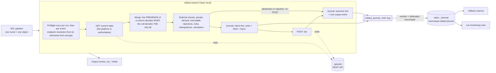
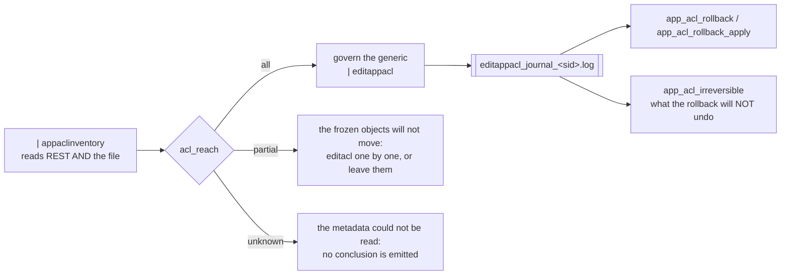

# SA-acl-tools

Splunk application shipping three custom search commands for Splunk permissions: **two
write** them through the REST API from an SPL pipeline describing the target state, and
**one only reads**. They work at **two levels**, and the level is what tells the two writers
apart:

| Command | Writes? | Level | What it touches |
|---|---|---|---|
| `editacl` | **yes** | one object | The ACL of each knowledge object the pipeline enumerates |
| `appaclinventory` | **no** | one application | Nothing at all. It **reports** the generic stanzas, where their permissions are written, and what a write would do |
| `editappacl` | **yes** | one application | The generic stanzas `[]` and `[<family>]` of an application, which govern every object that has none of its own |

Read first, write second: `appaclinventory` is the command you run before either of the
other two.

It also ships an inventory macro, five rollback and reporting macros, six saved searches
and a run monitoring view. Driving use case: decommissioning legacy roles, by
**substitution** with the roles of a new entitlement structure, or by **deprecation**
(renaming to `deprecated_<name>`).

> **The operation is irreversible.** The write-ahead journal and the rollback macros are
> the only safety net. Read [Rollback](#the-other-shipped-objects) **before** the first
> real write.

> ### Order of use, and it is not a preference
>
> **Generic first, specific by exception. Never the other way round.**
>
> An object that `editacl` writes carries its **own** metadata stanza from then on, and
> **no measured REST path removes one**. That object stops inheriting the generic
> permissions of its application **for good**. So:
>
> 1. **Governing an application starts with its generic stanzas.** Every object treated
>    by `editacl` beforehand is an object permanently removed from that governance.
> 2. **`editacl` is the instrument of the exception** - an object whose rights must
>    differ from the default of its family - not the instrument of the rule.
> 3. **On an estate already treated by `editacl`, writing the generic changes nothing for
>    the objects already treated**, and there is no REST path to free them. Two ways out
>    only: rewrite them one by one with `editacl`, or accept that they stay out of reach
>    of the generic.
> 4. **`appaclinventory` is the instrument of the decision.** Run it **before** either
>    write tool: `acl_objects_with_own_perms` and `acl_reach` say, per application and
>    per family, how much generic governance is still possible.
>
> Setting **empty** permissions is not a removal: a stanza with empty permissions leaves
> the object **unreachable**; a removed stanza makes it **inherit again**. Two opposite
> states, not two spellings of one.

This document is for whoever **runs** the tool, and it is meant to be sufficient: every
answer you need while operating is here or in the output of the commands. Nothing sends you
to a file that is not installed alongside them.



The intent line precedes the POST and is synchronised to disk: if it cannot be written,
the POST is cancelled, which is what makes the operation reversible. Nothing runs in
parallel, and one input event always produces exactly one output event.

---

## Installation

Build the archive from a **git reference**, never from the working tree. `tests/`,
`tools/` and development notes are left out by `.gitattributes`; `bin/lib/` is included, so
the archive deploys with no network access. Anchor any check of its content on
`^SA-acl-tools/`: the archive prefix itself contains the substring `tools/`.

```sh
git archive --format=tar.gz --prefix=SA-acl-tools/ \
    -o SA-acl-tools-$(git rev-parse --short HEAD).tar.gz HEAD
tar tzf SA-acl-tools-<ref>.tar.gz | grep -E '^SA-acl-tools/(tests|tools)/'   # empty
```

1. Drop `SA-acl-tools/` under `$SPLUNK_HOME/etc/apps/` of the **search head** - never on
   an indexer, the command is declared `local = true`.
2. Restart `splunkd`. Without it the three capabilities do not enter the repository and
   cannot be granted, and the search assistant ignores the three commands.
3. Check the vendored SDK: `sh tools/verify_vendor.sh $SPLUNK_HOME/bin/python3`. `tools/`
   is not in the archive; fetch it from the repository into
   `$SPLUNK_HOME/etc/apps/SA-acl-tools/tools/`, where it finds the app as installed.
4. **Grant the three capabilities.** `default/authorize.conf` declares
   `edit_acl_bulk`, `edit_app_acl_bulk` and `list_app_acl`, and grants all three to the
   `admin` role, so the tool works as deployed for accounts that already hold
   `admin_all_objects`. Granting them to other roles is outside this app. They are three
   because they authorise three different things: rewriting the ACL of objects the
   pipeline **enumerates**, moving the rights of objects the pipeline **does not**
   enumerate, and reading provenance out of the metadata files - which is a read the
   REST API would have filtered.
5. **Re-validate the two tables on the target platform** - a prerequisite to any real
   use. The password is read from the first line of standard input; return code `1` lists
   what the table does not cover, which you treat through the matching override file:

   ```sh
   <command supplying the password> | python3 tools/revalidate_mapping.py \
       [--user admin] [--splunkd-uri https://127.0.0.1:8089] [--insecure]

   <command supplying the password> | python3 tools/revalidate_app_acl_mapping.py \
       [--user admin] [--splunkd-uri https://127.0.0.1:8089] [--insecure]
   ```

   The first one covers the object types of `editacl`
   (`lookups/acl_endpoint_map_override.csv`, columns `eai_type`, `handler_path`); the
   second covers the families of `editappacl`
   (`lookups/app_acl_family_map_override.csv`, columns `family`, `handler_path`). Both
   read and neither writes. The second one must be run **from the installed app** or with
   `SPLUNK_HOME` set: its third list is read from the metadata files, which is the only
   place a family the table ignores can be seen at all. **A file in `lookups/` is
   overwritten by a version upgrade: back your override up before upgrading.**

6. **Grant read access to the journal index** to whoever must use the monitoring view,
   the rollback macros or the change-journal search - outside this app: no
   `srchIndexesAllowed`, no `srchIndexesDefault`, no `srchFilter` is declared here.
7. First run **in simulation** (`dryrun=t`, the default) on a restricted scope. **On a
   platform with a self-signed certificate this first run fails**, and it is the step most
   first installations stop at: the command verifies the `splunkd` certificate by default.
   The failure is explicit - a fatal message that names its own remedy - and that remedy is
   the note immediately below this list. It is one file to create.

**Self-signed certificate.** Verification of the `splunkd` certificate is on by default,
using `$SPLUNK_HOME/etc/auth/cacert.pem` when present. Failing that, create
`local/editacl.conf` with `[editacl]` then `verify_ssl = false`; the command then warns on
every run. That file is not in the archive, so an upgrade cannot overwrite it.

---

## The command

```
| editacl [title=<field>] [app=<field>] [id=<field>] [type=<field>] [sharing=<field>]
          [new_perms_read=<field>] [new_perms_write=<field>]
          [new_sharing=<field>] [new_owner=<field>]
          [dryrun=<bool>] [validate_roles=<bool>] [journal=<bool>]
          [max_objects=<int>]
```

**Every parameter names the SPL field to read one piece of information from**, and
defaults to the platform's native field name - which is why a pipeline built on
`acl_inventory` needs **no parameter at all**, and why a pipeline that renames its fields
only has to name the new ones.

| Parameter | Default | Role |
|---|---|---|
| `title` | `title` | Name of the object. Required, with a value |
| `app` | `eai:acl.app` | Application of the namespace. Required, with a value |
| `id` | `id` | Full URI, primary resolution path |
| `type` | `eai:type` | Object type, resolution through the mapping table |
| `sharing` | `eai:acl.sharing` | **Current** scope, used to skip private objects |
| `new_perms_read` | `eai:acl.perms.read` | Target `perms.read` |
| `new_perms_write` | `eai:acl.perms.write` | Target `perms.write` |
| `new_sharing` | `eai:acl.sharing` | Target `sharing` |
| `new_owner` | `eai:acl.owner` | Target `owner`. A target value, never an address |
| `dryrun` | `true` | No write at all. The GET happens, the merge is computed and journalled |
| `validate_roles` | `true` | Checks that the **added** roles exist before writing |
| `journal` | `true` | Records into the indexed journal |
| `max_objects` | `10` | Maximum number of objects **written** per run. No effect in simulation |

**What decides between modifying and preserving an attribute is the presence of its
column** in the result set, and nothing else: a column absent preserves the attribute as
the GET reads it, a column present with an empty cell empties it, a column present with a
value applies it. Dropping a column - `| fields - "eai:acl.perms.read"` - is therefore how
you preserve an attribute. `sharing` and `owner` cannot be emptied: an empty cell on their
column rejects the event, as does a scope outside `{user, app, global}`.

---

## Statuses and output

Each input event produces **exactly one** output event, keeping all of its fields, plus
fourteen columns - always present, empty where a status has nothing to show.

| Field | Content |
|---|---|
| `acl_status` | `updated`, `noop`, `dryrun`, `rejected`, `not_found`, `forbidden`, `invalid_role`, `skipped_immutable`, `skipped_derived`, `skipped_private`, `skipped_ceiling`, `error` |
| `acl_endpoint` | Path of the targeted object, without scheme, host, port or `/acl` suffix |
| `acl_type` | Type of the object as the command settled it, in the vocabulary of `eai:type` |
| `acl_http_code` | HTTP code of the POST, or of the GET on an upstream failure. `0` when no exchange took place |
| `acl_error` | Error message, truncated at 512 characters |
| `acl_warning` | Non-blocking warnings, joined by `;` |
| `acl_before_*`, `acl_after_*` | Owner, `perms.read`, `perms.write` and `sharing` before and after, normalised |
| `acl_journaled` | The `intent` line was written **and synchronised to disk** |

Those are the twelve `acl_status` values, derived from the code by the test suite rather
than maintained by hand. What each one means: `updated` the POST succeeded;
`noop` the target state equals the state read, with no POST **even in simulation**;
`dryrun` a real run **would have changed** this object; `rejected` the input row is
unusable - missing name or application, unresolved type, empty `sharing` or `owner`,
scope outside `{user, app, global}`; `not_found` and `forbidden` the GET answered `404`
or `403`; `invalid_role` an **added** role does not exist, roles already present and
untouched never blocking; `skipped_immutable` the platform declares the permissions
unchangeable; `skipped_derived` the object is derived from an `eventtype`;
`skipped_private` its current scope is `user`, where permissions grant nothing anyway;
`skipped_ceiling` `max_objects` was reached, with no GET and no POST; `error` the POST
failed, or the `intent` line could not be persisted, which cancels the POST.

Warnings carried by `acl_warning`: `sharing_change`, `owner_change`, `app_disabled`,
`stale_role_preserved:<list>`, `journal_outcome_failed`, `duplicate_post_suppressed`,
`runtime_divergence_possible`, `carrier_probe_inconclusive:<code>`,
`private_detected_by_id_namespace`, `scope_undetermined`.

---

## The other shipped objects

**`acl_inventory`** enumerates the knowledge objects through the native endpoints, family
by family, and normalises their output onto the input contract of the command. It is
invocable inline, and its arguments are the keys of the `acl_object_families` lookup:

```
| `acl_inventory`                                  <-- every family
| `acl_inventory(savedsearch)`                     <-- one family
| `acl_inventory(savedsearch,views,eventtypes)`    <-- several families
```

It emits exactly eight fields - `title`, `eai:acl.app`, `eai:acl.owner`,
`eai:acl.perms.read`, `eai:acl.perms.write`, `eai:acl.sharing`, `eai:type`, `id` - and
feeds `editacl` with no intermediate transformation. A complete inventory costs one REST
call per family, on the order of thirty; a family not requested costs nothing, so prefer
the parameterised form for interactive use.

**`editacl_rollback(<sid>)`** previews the rollback set of a run - the objects to restore
and their prior state - and writes nothing. **`editacl_rollback_apply(<sid>)`** is the
same set followed by the complete `| editacl` invocation, ceiling included, and it
writes. Only objects whose journal attests the write **did** succeed are restored. The
`sid` comes from `| eval sid=$sid$`, from the search inspector, or from the name of the
journal file (`editacl_journal_<sid>.log`).

```
| `editacl_rollback(1754483000.1)`          <-- look
| `editacl_rollback_apply(1754483000.1)`    <-- then restore
```

> **The leading pipe is not cosmetic.** Both macros are only valid in **generating**
> position. Written `` search `editacl_rollback(<sid>)` ``, the search matches the literal
> term `search` and returns **zero rows, `HTTP 200`, without one message**. And the time
> range of the calling search must cover the run, whose journal must already be indexed:
> run over the last fifteen minutes, the macro restores nothing, with no error.

**`editacl - run monitor`** is a Simple XML view, shipped under
`default/data/ui/views/editacl_runs.xml` and exported to the system so it opens from any
app context. It answers two questions: which runs took place, and how did the one you
select go. Select a run by clicking a row of the *Runs* list, by typing a `sid` into the
*Run (sid)* box, or by opening `.../app/<app>/editacl_runs?form.sid_in=<sid>` - the form
that makes a `sid` quotable in an operations note. The panels then show the run summary,
the status and HTTP code breakdowns, the breakdown by application and object type, the
ACL changes, the resolved objects with their before/after state, and the errors. **Read
the *Entitlement check* panel before concluding anything from this view, empty or not.**

**Four saved searches**, built on the inventory macro. None is scheduled; turn
`enableSched` on in `local/savedsearches.conf` to schedule one.

| Search | What it produces |
|---|---|
| `ACL - inventory by role` | Read/write breakdown by role, application and object type. Starting point for an entitlement audit |
| `ACL - references to decommissioned roles` | Objects whose ACL still references a role of the `acl_decommissioned_roles` lookup. Feeds the modification pipeline directly |
| `ACL - eventtype / derived object divergences` | Carrier/derived pairs whose ACL diverges, and tracked roles a derived object references without its carrier doing so. Run it **before** a campaign |
| `ACL - change journal` | Indexed history by `sid`, status, application and type. The `rollback` column carries the rollback command for the run |

The shipped `acl_decommissioned_roles` lookup only holds generic example identifiers
(`legacy_role`, `role_a`, `role_b`). Replace it with the real list, preferably in
`lookups/` of the local app, which an upgrade cannot overwrite.

---

## Governing an application instead of an object

A Splunk application carries a metadata file whose **generic stanzas** decide the
permissions of every object that has none of its own:

```
[]                     <-- the application default: every object with nothing above it
[views]                <-- the family default: every view of the application
[views/my_dashboard]   <-- one object. `editacl` writes these; nothing removes them
```

The chain is measured in all three of its levels: `[<family>/<object>]` wins over
`[<family>]`, which wins over `[]`. Specificity wins over the layer the stanza lives in,
so `default.meta` and `local.meta` are read as **one set of stanzas**.



**Why the inventory is a command and not a macro.** Through REST, an object that
**inherits** and an object carrying its **own** stanza of the same value return a strictly
identical ACL block. Provenance has no REST answer at all, and an SPL macro cannot read a
file. So `appaclinventory` is a **command**, invoked with a leading pipe and **never
between backticks**, whereas `acl_inventory` is a macro and is invoked between backticks.

**The commands of this app carry no underscore, and that is not a style rule.** Measured on
Splunk 9.4.6: the search parser **ends a command name at the first underscore**. A command
declared `a_b_c` is looked up as `a`, and answers `Unknown search command 'a'` - in leading
position as well as downstream, with no escaping that gets round it. Underscores belong to
macro names, which resolve differently; they never appear in a command name here.

```
| appaclinventory        <-- correct: it is a command
| `appaclinventory`      <-- fails: it is not a macro
| `acl_inventory`        <-- correct: that one IS a macro
```

---

## The inventory command

```
| appaclinventory [apps=<string>] [families=<string>]
```

| Parameter | Default | Role |
|---|---|---|
| `apps` | `*` | Comma-separated applications, `*` patterns allowed. Characters outside `A-Za-z0-9_,*-` are dropped |
| `families` | *(none)* | Families to emit **even** when they carry neither a stanza nor a frozen object |

## What the inventory gives you, column by column

**Read this table instead of the code.** Every column below answers one question, and the
table says which. Nineteen columns, in the order they come out.

**Four levels, and no column mixes two.** That is what makes the table readable: some
columns say what the **file** carries, some what the **platform** applies, some what
**stands between** the two, and some identify the row.

> **Start with `acl_write_effect`.** It is the column that tells you whether the write you
> are about to launch can be undone. Everything else describes a state; that one describes
> the consequence of an action.

> **No column is ever empty without another saying why - nor without another saying whether
> the empty means "absent" or "empty set".** If the three `eai:acl.*` cells are blank,
> `acl_effective_status` says what stopped the read. If the two `acl_file_perms_*` cells are
> blank, `acl_perms_source` says which of the two emptinesses it is: `none` means the
> permissions are written **nowhere**, `local` or `default` mean they are written **there
> and are empty**. Those two states are opposites, and they decide different writes.

### Identification - which stanza is this row about, and why is it here

| Column | The question it answers | Values |
|---|---|---|
| `eai:acl.app` | Which application | a name |
| `acl_stanza_kind` | Is this the application default, or one family | `app_default`, `family_default` |
| `acl_stanza` | Which stanza, written as the file writes it, brackets included | `[]`, `[views]`, `[commands]` |
| `acl_handler` | Which REST path the tool reaches this family by | a path, or empty |
| `acl_row_reason` | **Why this row exists at all** | `app_row`, `stanza_exists`, `objects_exist`, `requested` |

An empty `acl_handler` means the tool has no route to this family, and `acl_write_effect`
says so with `no_route`. On an application row it is empty because a `[]` address needs no
handler, and `acl_stanza_kind` says that.

`acl_row_reason` is the column to read first when a row surprises you. `stanza_exists` means
the stanza is written in a metadata file. **`objects_exist` means it is not** - the family is
listed because some of its objects carry a stanza of their own, which is enough to make the
family worth showing. `requested` means you asked for it with `families=`.

### Platform - what splunkd applies right now

| Column | The question it answers | Values |
|---|---|---|
| `eai:acl.perms.read` | Which roles read, today | roles, comma-separated |
| `eai:acl.perms.write` | Which roles write, today | roles, comma-separated |
| `eai:acl.sharing` | Which scope applies, today | `app`, `global`, `user` |
| `acl_effective_status` | Were those three **read**, and if not why | `ok`, `app_disabled`, `unreadable` |

This column answers one question only: could the platform be read. When there is no route to
read through, it says `unreadable` and `acl_write_effect` says why.

### Decision - what a write would do, and what stands in its way

| Column | The question it answers | Values |
|---|---|---|
| `acl_write_effect` | **What a write to this stanza would do, and whether you could undo it** | `overwrite_reversible`, `create_irreversible`, `no_route` |
| `acl_objects_with_own_perms` | How many objects carry **their own permissions** and therefore escape this stanza | a count |
| `acl_families_with_own_perms` | How many families of this application carry their own permissions and therefore escape `[]` | a count |
| `acl_reach` | Does this stanza reach every object in its scope | `all`, `partial`, `unknown` |

**`acl_write_effect` is the safety column.**

- `overwrite_reversible` - the stanza already carries its permissions in the **local** layer.
  A write replaces them, and `` `app_acl_rollback(<sid>)` `` can put them back.
- `create_irreversible` - the permissions are **not** in the local layer, whether they sit in
  the default layer or nowhere. A write **materialises** them there, and **nothing removes
  them afterwards**: no rollback, no REST path. `editappacl` refuses such a target unless you
  pass `allow_create=true`. **This is the common case on a freshly installed application**,
  whose stanzas are all shipped in the default layer.
- `no_route` - the tool has no handler for this family and cannot write to it by name.

`acl_reach` reads `all` only when nothing stands in the way **and** a route exists. It reads
`unknown` when the metadata could not be read in full, or when there is no route - a scope
the tool cannot act on is not known to be reached. Both causes are named by the column beside
it: `acl_file_read` for the first, `acl_write_effect` for the second.

The scope of `acl_objects_with_own_perms` is the scope of the row: the family on a family
row, the whole application on an application row. `acl_families_with_own_perms` is an
application fact and is repeated on every row of that application - do not sum it.

**An object only counts if its stanza actually carries permissions.** Splunk writes a stanza
for every object you create or edit, carrying `owner`, `version` and `modtime` and nothing
else; such an object still inherits, and is not counted.

### File - what the metadata carries, literally

| Column | The question it answers | Values |
|---|---|---|
| `acl_perms_source` | **Where this stanza's permissions are written** - so which layer the two cells below quote, and what a write would do | `local`, `default`, `none` |
| `acl_file_perms_read` | What that stanza writes for reading | roles, or empty |
| `acl_file_perms_write` | What it writes for writing | roles, or empty |
| `acl_file_export` | What the stanza writes for `export` | the text, or empty |
| `acl_file_read` | Were the metadata files read **in full** | `ok`, `partial:<n>`, `unreadable` |

`acl_perms_source` is decided by one thing: whether an `access` key exists, and in which
layer. `none` means **no `access` key anywhere** - the stanza may still exist and carry an
`export`, which is why `acl_file_export` can be filled while the two permission cells are
empty.

**These columns quote the file; the `eai:acl.*` columns show what splunkd applies.** When the
two disagree, something else is deciding - the other layer, or a generic stanza one level up.
That comparison is the reason both are here.

`acl_perms_source` says **where the permissions are written**, and nothing more. It does not
say where the effective permissions come from: answering that would mean replaying Splunk's
own inheritance resolution, which this tool deliberately never does.

`acl_file_read` is about the **files**, not the stanza. `partial:<n>` means `n` lines were
skipped while parsing, so the counts may understate; `unreadable` means no count on this row
can be trusted.

### Context

| Column | The question it answers | Values |
|---|---|---|
| `acl_member` | Which member the metadata was read on | a name, or `unknown` |

`unknown` means the platform would not give its own name. Run the inventory on each member
and compare the tables: a difference is a metadata replication gap, which no configuration
audit sees.

### Which rows come out

One row per application, always. Then one row per family, when **any** of these is true -
and `acl_row_reason` tells you which:

1. the family header is written in one of the two metadata files (`stanza_exists`);
2. at least one object of that family carries a stanza of its own - **it exists, whether or
   not it freezes anything** (`objects_exist`);
3. you named the family in `families=` (`requested`).

Condition 2 is about **presence, not freezing**. A family whose objects were merely opened
and saved in the interface will appear, with `acl_objects_with_own_perms = 0` and
`acl_reach = all` - the row then says exactly that. A family matching none of the three does
not appear, which does not mean it cannot be governed: only that today it is neither
governed nor frozen.

## The application-level write command

```
| editappacl [app=<field>] [stanza_kind=<field>] [handler=<field>] [stanza=<field>]
             [new_perms_read=<field>] [new_perms_write=<field>] [new_sharing=<field>]
             [dryrun=<bool>] [allow_create=<bool>] [validate_roles=<bool>]
             [journal=<bool>] [max_stanzas=<int>] [max_impacted_objects=<int>]
```

| Parameter | Default | Role |
|---|---|---|
| `app` | `eai:acl.app` | Target application. Required, with a value. `system` is rejected |
| `stanza_kind` | `acl_stanza_kind` | `app_default` or `family_default`. **Required, never deduced** |
| `handler` | `acl_handler` | Handler path, **primary** resolution route. Does not go through the shipped table |
| `stanza` | `acl_stanza` | Family name, secondary route, through the table |
| `new_perms_read` | `eai:acl.perms.read` | Target `perms.read` |
| `new_perms_write` | `eai:acl.perms.write` | Target `perms.write` |
| `new_sharing` | `eai:acl.sharing` | Target `sharing`, **`app` or `global` only** |
| `dryrun` | `true` | No write at all |
| `allow_create` | `false` | Authorises the **irreversible** creation of a missing stanza |
| `validate_roles` | `true` | Checks that the **added** roles exist before writing |
| `journal` | `true` | Records into the indexed journal |
| `max_stanzas` | `5` | Maximum number of stanzas **written** per run. **A choice, not a measurement** |
| `max_impacted_objects` | `200` | Maximum **sum of the estimated blast radii** of the stanzas written. **A choice, not a measurement** |

The presence semantics are those of `editacl`: a column absent from the result set
preserves the attribute, a column present with an empty cell empties it, a column present
with a value applies it. **There is no owner parameter**: the value is inert on one write
path and refused with `400` on the other, so exposing one would be a false promise.
`sharing` is the only lever on the export, and `user` is refused per event.

**Both permissions are always transmitted**, whatever you asked for. The write path
replaces the whole `access` line as soon as one permission is present, so sending only
`perms.write` **deletes** `perms.read`.

> ### `acl_handler` addresses any handler, and that door is deliberate
>
> The shipped family table bounds **resolution by name**, never the **write perimeter**.
> Passing `acl_handler` explicitly addresses **any handler**, including a family the table
> does not know and that nobody ever measured - writing a `[alerts]` header, for instance,
> works.
>
> **The door is kept open, for three reasons in order of weight.** One, closing it would
> bring back the defect of the previous project: a target written through an off-table
> handler would become **unrestorable**, resolution once again depending on the coverage of
> the table. Two, the table never claimed to be exhaustive - `searchbnf`, `sourcetypes`,
> `manager` and `searchscripts` exist on the reference platform without appearing in it, and
> confining writes to the table would forbid **real** families on the grounds that one
> measurement campaign did not sweep them. Three, this is not where the guard rail is: what
> bounds a write is the dedicated capability, the refusal to create by default, the two
> ceilings and the simulation-by-default - four dispositifs, all exercised on a real
> instance.
>
> **What you take on by using it.** You address a handler no measurement covered, so there
> is no guarantee that the `POST` succeeds - three families are measured **negative**, see
> the list of unreachable families below - and no guarantee that the stanza name written is
> the one you expect: **the stanza name follows the underlying configuration file, not the
> URI path**. `data/ui/workflow-actions` writes `[workflow_actions]`, with an underscore
> where the URI has a hyphen. Run the re-validation procedure, or a simulation, before
> trusting an off-table handler.

> ### Creating a stanza cannot be undone
>
> No measured REST path removes a generic stanza, at any level. Modifying one is
> reversible; **creating one is not**. Writing `[]` into the `local.meta` of an
> application that had none masks the `[]` of its `default.meta` - the permissions shipped
> with the application - permanently.
>
> **A stanza that exists without carrying permissions counts as a creation too**, and for
> the same reason: nothing removes a key from a stanza any more than it removes the
> stanza. Writing permissions where there were none masks an inherited value for good, so
> such a target comes out `created` rather than `updated`, and `allow_create=false` refuses
> it. Reporting it as a modification would promise you a rollback that cannot work -
> replaying the previous *effective* values would write the permissions in explicitly and
> freeze the family instead of restoring it.
>
> The command therefore **refuses to create by default**: a missing target comes out
> `rejected` / `irreversible_creation`, with no call at all. `allow_create=true` is the
> deliberate act, and the cost is paid once per application - the first governance of an
> app is necessarily a creation, the following ones are modifications.
>
> **In simulation the refusal is visible**, which is the point: `dryrun=true` with
> `allow_create=false` shows you, before writing anything, which targets need the explicit
> act and which are plain modifications.

**Two ceilings, counting two different things.** `max_stanzas` bounds the number of
**acts** - some of which cannot be undone; `max_impacted_objects` bounds the estimated
**blast radius**. Neither is enough alone: one write on the default of a large application
is a single act with an immense reach, and twenty writes on empty families move nothing.
**Neither ever fires in simulation**, which sends no POST, so a `dryrun` always covers the
whole batch.

> ### Run one `editappacl` at a time on a given application
>
> **This is an operating rule, because no mechanism enforces it.** The refusal of a
> duplicate target is **within a single run**: nothing coordinates two runs launched at the
> same time against the same stanza.
>
> The scenario to avoid is precise. Both runs read the provenance before either has written;
> both classify the target as a materialisation; the second one journals empty `before_*`
> and `reversible="false"` while it has in fact **modified** an existing value. That prior
> value is then restorable by nothing - `app_acl_rollback` ignores the target, and
> `app_acl_irreversible` lists it as a creation that it was not.
>
> The risk is established by reading the code and **has not been reproduced**: an attempt to
> race two runs on the same missing stanza serialised cleanly. It is stated here because no
> technical dispositif covers it, and because the cost of the rule is nil - a campaign on
> one application is one run.

**A target whose value already matches** comes out `noop` when it carries a stanza, and
`noop_inherited` when it does not. The command deliberately does **not** materialise a
stanza whose effect would be nil: it would change no right today and would remove the
family from the reach of `[]` for ever.

---

## Application-level statuses and output

Each input event produces exactly one output event, keeping all of its fields, plus
seventeen columns - always present, empty where a status has nothing to show.

| Field | Content |
|---|---|
| `acl_status` (editappacl) | `updated`, `created`, `noop`, `noop_inherited`, `dryrun`, `rejected`, `not_found`, `forbidden`, `invalid_role`, `skipped_ceiling`, `skipped_impact_ceiling`, `error` |
| `acl_endpoint` | Write path targeted, without scheme, host or port |
| `acl_stanza_kind`, `acl_stanza`, `acl_handler` | Resolved target, re-emitted as it was used |
| `acl_reversible` | `true`, `false` or `unknown` - can this write be undone |
| `acl_impacted_estimate` | Estimated number of objects whose effective rights move. Empty when not computed |
| `acl_http_code` | HTTP code of the POST, or of the GET on an upstream failure. `0` when no exchange took place |
| `acl_error` | Error message, truncated at 512 characters |
| `acl_warning` | Non-blocking warnings, joined by `;` |
| `acl_before_*`, `acl_after_*` | `perms.read`, `perms.write` and `sharing` before and after, normalised |
| `acl_journaled` | The `intent` line was written **and synchronised to disk** |

Those are the twelve values of `acl_status` that `editappacl` produces, derived from the
code by the test suite rather than maintained by hand. What each one means: `updated` the
POST succeeded on a stanza that already existed; `created` the POST succeeded on a stanza
that did **not** exist, which is the irreversible case; `noop` the target state equals the
state read and the stanza is there, with no POST even in simulation; `noop_inherited` the
same, except that the value is **inherited** and the command declines to materialise it;
`dryrun` a real run **would have written** this stanza; `rejected` the row is unusable or
the write is refused - missing or out-of-domain `stanza_kind`, missing application,
`system`, duplicate target, unresolved family, empty or invalid `sharing`, unreadable
provenance, or a creation without `allow_create`; `not_found` and `forbidden` the GET
answered `404` or `403`; `invalid_role` an **added** role does not exist; `skipped_ceiling`
`max_stanzas` was reached; `skipped_impact_ceiling` this target alone or the running total
would exceed `max_impacted_objects`; `error` the POST failed, or the `intent` line could
not be persisted, which cancels the POST.

Warnings carried by `acl_warning` (editappacl): `irreversible_creation`,
`provenance_unavailable`, `not_materialized`, `no_inheriting_object`, `sharing_change`,
`stale_role_preserved:<list>`, `write_may_have_occurred`, `runtime_divergence_possible`,
`journal_outcome_failed`, `self_app_target`, `app_disabled`.

> **A non-2xx answer does not prove that nothing was written.** A `403` was measured
> coming back from a POST that had written all the same. Such a target carries
> `write_may_have_occurred`, the journal records `write_asserted="unknown"`, and it
> **enters** the rollback set - rewriting the prior state of a stanza that did not move is
> a `noop` by idempotence, so the wider selection cannot hurt while the narrower one can
> miss a mutation.

---

## The application-level macros and searches

`editappacl` writes **its own** journal file with **its own** sourcetype, separate from
`editacl`: the two can share a `sid` in one search, and a line of one carries an object
where a line of the other carries a stanza whose reach is several objects.

| Macro | What it does |
|---|---|
| `app_acl_journal_source` | Source of the application-level journal. The single place its index is written |
| `app_acl_diag_source` | Source of the application-level diagnostic |
| `app_acl_rollback(<sid>)` | Rollback set of a run, as a **preview**. Writes nothing |
| `app_acl_rollback_apply(<sid>)` | The same set followed by the complete `\| editappacl` invocation. It **writes** |
| `app_acl_irreversible(<sid>)` | The written targets the rollback does **not** cover, with the value created and the inherited value it masked |

```
| `app_acl_rollback(1754483000.1)`          <-- look at what would be restored
| `app_acl_irreversible(1754483000.1)`      <-- look at what will NOT be
| `app_acl_rollback_apply(1754483000.1)`    <-- then restore
```

**Limits of the rollback, and the list is exhaustive.** It is not transactional; it does
**not cover creations**, which is irreducible; it does not cover targets whose provenance
could not be established at write time; it is only usable **once the journal is indexed**,
the run's own file staying the immediate fallback; and it restores the **value** of a
stanza, never its **absence**.

`app_acl_rollback_apply` carries `allow_create=f` and that is not negotiable: a restore
never creates anything.

**Two saved searches**, neither scheduled. `App ACL - irreversible writes` lists the
creations per run with their target and estimated reach, and carries the
`app_acl_irreversible` call for each. `App ACL - governability of the estate` ventilates
the applications by `acl_reach`, per member.

**Redirecting both journal indexes takes FOUR overrides in all**, not two: `local/inputs.conf`
and `local/macros.conf`, for **each** of the two journal sets. Applying one and not the
other leaves the shipped searches reading the old index and returning an empty result
without saying so.

**Three families are known not to be reachable** and are deliberately absent from the
shipped table, so they come out `unresolved_family` before any call: `visualizations`
(the write answers `500 No capability specified`), `ntags` (the read answers `404`, the
write refuses `perms.read`), and `props` addressed through `data/props/extractions` or
`admin/props-extract` - which is harmless, `[props]` being reachable through seven other
handlers including the one the table designates. They are not named in the code: carving a
property of the platform into the tool would freeze something the next version may
contradict.

---

## Examples

Substituting an obsolete role, **in simulation**, over the complete inventory. No
parameter: the macro emits the native field names, which the defaults pick up.

```
| `acl_inventory`
| search "eai:acl.perms.write"="legacy_role" OR "eai:acl.perms.read"="legacy_role"
| eval "eai:acl.perms.read" = mvmap('eai:acl.perms.read',
        if('eai:acl.perms.read'="legacy_role", "new_role_read", 'eai:acl.perms.read'))
| eval "eai:acl.perms.write" = mvmap('eai:acl.perms.write',
        if('eai:acl.perms.write'="legacy_role", "new_role_admin", 'eai:acl.perms.write'))
| editacl
| stats count by acl_status "eai:type" "eai:acl.app"
```

**Emptying `perms.write`, writing for real** - the nominal decommissioning pipeline. An
`mvmap` that removes the last value leaves the column in place with a null cell, and the
attribute is emptied. The ceiling is spelled out because the batch exceeds ten objects:

```
| `acl_inventory(savedsearch)`
| search "eai:acl.perms.write"="legacy_role"
| eval "eai:acl.perms.write" = mvmap('eai:acl.perms.write',
        if('eai:acl.perms.write'="legacy_role", null(), 'eai:acl.perms.write'))
| editacl dryrun=f max_objects=1000
| where acl_status!="noop"
```

**Resuming a batch stopped by the ceiling** - replay it with a higher ceiling. Objects
already written come out `noop` through idempotence, so there is no double write:

```
| `acl_inventory(savedsearch)` | search ... | eval ...
| editacl dryrun=f                          <-- 10 updated, 30 skipped_ceiling
| editacl dryrun=f max_objects=100          <-- 10 noop,    30 updated
```

---

## Before you use it

Limits that change what you have to do. Each one says what to do about it; where the
reason is short enough to matter here, it is given.

- **Read access to the journal index is a prerequisite** of the view, of both rollback
  macros and of the change-journal search. Grant it before the first run.
- **An account without the `editacl_auditor` role gets a `404` on the view, not a `403`**:
  a missing role, not a broken deployment. An account holding `admin_all_objects` reads
  the view anyway, whatever the role.
- **Redirecting the `editacl` journal index takes TWO overrides**, `local/inputs.conf` to
  ingest **and** `local/macros.conf` to read. With only the first, the view goes stale and
  the rollback macros return an empty set reported as a success. **Counting the
  application-level journal, it is four in all** - two per journal set, one file each,
  and the two sets are independent.
- **A run launched with `journal=false` appears in no panel built on the journal**; the
  *Runs started with no journal line* panel surfaces it from the diagnostic sourcetype.
- **Writing an `eventtype` aligns its derived objects by cascade, and that alignment
  cannot be rolled back.** Run the divergence search before a campaign; it pairs objects
  **by application** and misses a carrier shared globally from another one.
- **The `ntags` family refuses every ACL write**: `skipped_immutable`, no POST, no
  workaround.
- **A pipeline that only fills a field on some of its rows empties the attribute on the
  others.** Keep the current value on the `else` branch, or filter upstream instead.
- **Without `admin_all_objects` the inventory is silently truncated** of other people's
  private objects, and splunkd refuses writes on objects you do not own.
- **`| rest .../admin/directory` sees 60.6 % of the objects** on the reference platform,
  whatever the capabilities. Build every batch on `acl_inventory`.
- **The mapping table was established on Splunk Enterprise 9.4.6** - 28 entries, each
  validated by a real GET. Re-validate it on your platform before any real use.
- **`dryrun` defaults to `true`**: nothing is written until you pass `dryrun=f`, and only
  `acl_status` tells a simulation from a real run.
- **`max_objects` defaults to 10 and counts writes, not events**: the rest of the batch
  comes out `skipped_ceiling`, the output stays complete, and what was already written is
  **not** rolled back.
- **A fatal error loses the search output** (`resultCount = 0`) and marks the job failed.
  The journal stays complete and remains the way to resume and to undo.
- **An `HTTP 5xx` on persistence does not mean nothing changed**: the disk is intact, the
  runtime view of splunkd is mutated. Recover with
  `POST /servicesNS/nobody/<app>/admin/<family>/_reload`, **not** with a rollback.
- **A green second pass does not prove the rollback set is right.** Verify a rollback by
  replaying it and comparing field by field, never by observing a `noop` rate.
- **Private and derived objects are never written**, though the inventory keeps listing
  them: the abstention bears on writing, not on the view.
- **Do not `stats ... BY` an `acl_*` column that can be empty** - an empty value emitted
  by a search command is dropped from the grouping with no message. Label first:
  `| eval acl_type = if(coalesce(acl_type,"")!="", acl_type, "(type not established)")`.
  Likewise, `acl_journaled` reports the `intent` line only, so it is `false` on every
  line of a simulation, which nonetheless journals an `outcome` line.
- **Journal files are never purged automatically**, and `_internal` freezes at 28 days.
  Purge by age, once the restore window is closed:
  `find "$SPLUNK_HOME/var/log/splunk" -name 'editacl_journal_*.log' -mtime +90 -delete`.
  The journal is only searchable from a search head that forwards its internal logs.
- **Every write triggers a knowledge object replication** on a search head cluster. Keep
  batches bounded and run outside peak hours. Moving an object between applications and
  renaming one are out of scope, knowingly.
- **Of the monitoring view, only the click has been observed in a browser.** The box and
  the deep link are held by tests only; if one way in does nothing, use another.
- **The freshness signal of the view has a blind band of 42 to 48 hours** on the default
  time range, and it does not diagnose: a quiet period and a stopped journal read alike.
  Read the date of the most recent line, which no threshold can suppress.
- **The journal format carries no version marker.** After an upgrade of this app, lines
  written before and after a format change coexist in the retention window and are all
  read as current. Wait the window out, or narrow the time range.
- **The saved searches were renamed when the repository moved to English**: an upgrade
  creates the new objects and leaves the old ones behind. Clean up
  `local/savedsearches.conf` yourself.

Limits proper to the application level:

- **Run `appaclinventory` before either write tool.** Every object `editacl` has
  already written is out of reach of the generic, permanently, and the inventory is the
  only thing that says how many there are.
- **`| appaclinventory` is a command, `` | `acl_inventory` `` is a macro.** A command
  invoked between backticks fails at run time. And a command name **never carries an
  underscore**: the parser of 9.4.6 truncates it at the first one, so the search would look
  up a command that does not exist.
- **Creating a generic stanza cannot be undone**, and `allow_create=false` is what stands
  in the way. What a rollback will not undo is listed by
  `` | `app_acl_irreversible(<sid>)` ``, and by nothing else.
- **`acl_impacted_estimate` is an estimate and never a count.** It is a **lower bound**
  for an account that cannot see every object; private objects are excluded from it,
  their metadata living outside the read perimeter; and families the shipped table does
  not cover cannot be enumerated at all.
- **`acl_impacted_estimate = 0` is not a `noop`.** The target has no inheriting object
  today - all frozen, or the family empty here - but the write still changes the default
  applicable to objects **created later**. Such a target carries
  `acl_warning="no_inheriting_object"`.
- **The inventory reads the metadata of the member it runs on.** On a search head
  cluster that is representative of the cluster only while replication is healthy - and
  turned round, that is an instrument: run it on each member and compare, and a metadata
  replication gap becomes visible, which no configuration audit sees, Splunk's change
  tracking recording `.conf` files and not `.meta` ones. Discriminate on `acl_member`,
  or on `splunk_server` if that column comes out empty.
- **Private metadata is neither read nor written.** A residual
  `etc/users/<user>/<app>/metadata/local.meta` can make one user see rights the inventory
  knows nothing about, so an application may be reported governable while somebody sees
  something else. Detecting those residues is out of scope.
- **Writing a generic stanza changes nothing for an already frozen object**, and that is
  the whole point of consulting `acl_objects_with_own_perms` first.
- **Run one `editappacl` at a time on a given application.** Nothing enforces it: the
  duplicate refusal is within a single run, and two concurrent runs can each report a
  creation while one of them modified an existing value - whose prior state is then
  restorable by nothing.
- **`acl_handler` addresses any handler, including families the shipped table ignores.**
  The door is deliberate; what you take on is a handler no measurement covered, with no
  guarantee that the write succeeds nor that the stanza name is the one you expect.
- **`max_stanzas` and `max_impacted_objects` default to 5 and 200, which are choices and
  not measurements.** The real magnitude of a generic write has not been quantified.
- **The family table was established on Splunk Enterprise 9.4.6**, 19 families each
  validated by a real write, out of 31 handlers swept. Nothing establishes the behaviour
  of the other handlers, nor of families brought in by third-party apps. Re-validate
  before any real use.
- **Verifying a campaign compares the `.meta` files themselves** - a fingerprint, or a
  reading through the API - and never Splunk's configuration change tracking, which does
  not see metadata files at all. Three successive audits of the previous project declared
  a lab back to its baseline while 1 224 stanzas were mutated.

---

## Licence

[Apache License 2.0](LICENSE). The SDK vendored under `bin/lib/` is distributed under the
same licence.
