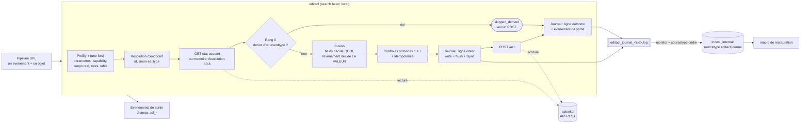
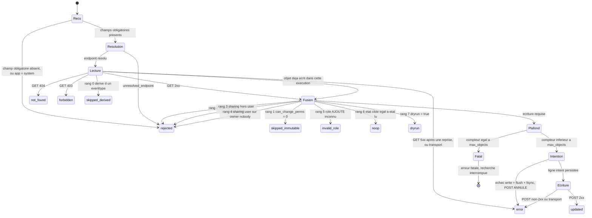
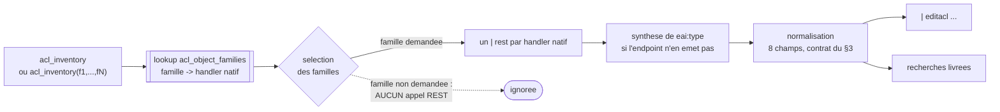

# SA-acl-tools

Application Splunk fournissant la commande de recherche personnalisée **`editacl`**,
qui réécrit en masse les ACL (permissions de lecture et d'écriture, portée de partage)
d'objets de connaissance Splunk arbitraires, via l'API REST, à partir d'un pipeline SPL
décrivant l'état cible.

Cas d'usage moteur : le décommissionnement d'un jeu de rôles hérités, par
**substitution** (remplacement par les rôles d'une nouvelle structure de droits) ou par
**dépréciation** (renommage en `deprecated_<nom>` avant retrait).

> **L'opération est irréversible.** Le journal write-ahead et la macro de restauration
> sont le seul filet de sécurité. Lire la section [Retour arrière](#retour-arrière)
> **avant** la première écriture réelle, pas après.

---

## Sommaire

- [Ce que fait la commande](#ce-que-fait-la-commande)
- [Fabrication de l'archive déployable](#fabrication-de-larchive-déployable)
- [Installation](#installation)
- [Habilitation](#habilitation)
- [Syntaxe](#syntaxe)
- [Contrat d'entrée](#contrat-dentrée)
- [Ce que `fields` décide — et ce qu'il ne décide pas](#ce-que-fields-décide--et-ce-quil-ne-décide-pas)
- [Objets dérivés — l'écriture s'abstient](#objets-dérivés--lécriture-sabstient)
- [Sortie](#sortie)
- [Machine à états](#machine-à-états)
- [Journal](#journal)
- [Retour arrière](#retour-arrière)
- [Inventaire des objets à traiter](#inventaire-des-objets-à-traiter)
- [Recherches livrées](#recherches-livrées)
- [Table de correspondance et re-validation sur socle cible](#table-de-correspondance-et-re-validation-sur-socle-cible)
- [Tests](#tests)
- [Dépendances vendorisées](#dépendances-vendorisées)
- [Limites connues](#limites-connues)
- [Licence](#licence)

---

## Ce que fait la commande



Points structurants du schéma, tous vérifiés par la suite de tests :

- **La ligne `intent` précède le POST** et est synchronisée sur disque. Si elle échoue,
  le POST est annulé. C'est ce qui rend l'opération réversible.
- **Le GET fait autorité** : les valeurs ACL portées par l'événement d'entrée sont
  considérées comme potentiellement périmées et ne servent qu'à alimenter les attributs
  listés dans `fields`.
- **Aucune parallélisation.** Les appels REST sont sérialisés, l'ordre de sortie suit
  l'ordre d'entrée.
- **Le rang 0 est en amont de la fusion**, et il s'applique quelle que soit l'origine de
  l'état lu — GET réel ou mémoire d'exécution. Un objet dérivé d'un `eventtype` ressort
  donc en `skipped_derived` sans jamais atteindre la fusion ni le journal `intent`
  (voir [Objets dérivés](#objets-dérivés--lécriture-sabstient)).

---

## Fabrication de l'archive déployable

L'archive se fabrique depuis le dépôt, à partir d'une **référence git**, jamais depuis
le répertoire de travail — ce qui rend le contenu livré traçable à un commit et
reproductible par quiconque :

```sh
git archive --format=tar.gz --prefix=SA-acl-tools/ \
    -o SA-acl-tools-$(git rev-parse --short HEAD).tar.gz HEAD
```

Le périmètre est porté par les attributs `export-ignore` de `.gitattributes`, pas par
la mémoire de l'opérateur : `tests/` et `tools/` en sont **écartés** — ils vivent dans
le dépôt, jamais dans l'app installée — de même que les fichiers de service du dépôt.
`bin/lib/` y est en revanche **inclus** : l'archive doit être déployable sans réseau.
Le fichier d'override de la table n'y figure jamais non plus, n'étant pas versionné.

Contrôle du contenu avant déploiement :

```sh
tar tzf SA-acl-tools-<ref>.tar.gz | grep -E '^SA-acl-tools/(tests|tools)/'   # vide
```

---

## Installation

1. Déposer le répertoire `SA-acl-tools/` sous `$SPLUNK_HOME/etc/apps/` du **search
   head** (jamais sur un indexeur : la commande est déclarée `local = true`).
2. Redémarrer `splunkd`. Le redémarrage est **nécessaire** : sans lui la capability
   déclarée par l'app n'entre pas au référentiel et ne peut pas être attribuée.
3. Vérifier l'intégrité des dépendances vendorisées :

   ```sh
   sh tools/verify_vendor.sh $SPLUNK_HOME/bin/python3
   ```

   `tools/` **n'est pas dans l'archive** — il vit dans le dépôt (voir
   [Fabrication de l'archive](#fabrication-de-larchive-déployable)). Récupérer le
   répertoire depuis le dépôt et le déposer dans
   `$SPLUNK_HOME/etc/apps/SA-acl-tools/tools/`, où les deux scripts de cette procédure
   d'installation trouveront l'app **réellement installée**.

4. Attribuer la capability `edit_acl_bulk` (voir [Habilitation](#habilitation)).
5. **Exécuter la procédure de re-validation de la table** sur le socle cible — c'est un
   **prérequis à tout usage réel**, pas une précaution (voir
   [Table de correspondance](#table-de-correspondance-et-re-validation-sur-socle-cible)).
6. Première exécution **en simulation** (`dryrun=t`, valeur par défaut) sur un
   périmètre restreint.

### Vérification TLS

Par défaut, la vérification du certificat de `splunkd` est **activée**, avec le CA
bundle de `$SPLUNK_HOME/etc/auth/cacert.pem` s'il est présent. Sur un socle à
certificats auto-signés dont le bundle n'est pas exploitable, créer
`local/editacl.conf` :

```ini
[editacl]
verify_ssl = false
```

La commande émet alors un avertissement à chaque exécution. Ce fichier n'est **pas**
livré dans l'archive : une montée de version ne peut donc pas l'écraser.

**Symptôme si le réglage manque.** L'échec se produit sur le premier appel REST de
l'exécution — le contrôle d'habilitation — et la commande s'interrompt par une erreur
fatale qui désigne explicitement TLS et le paramètre :

```
echec de la verification TLS du certificat de splunkd. Socle a certificat auto-signe :
creer le fichier local/editacl.conf de l'app SA-acl-tools avec [editacl] puis
verify_ssl = false, ou installer le CA de la plateforme dans
$SPLUNK_HOME/etc/auth/cacert.pem. (detail : transport:SSLCertVerificationError: ...)
```

Un échec de transport **non** imputable à TLS (splunkd injoignable, connexion refusée)
produit un message distinct, qui ne mentionne pas `verify_ssl` : les deux causes ne se
traitent pas de la même façon.

---

## Habilitation

Deux habilitations distinctes, qui ne se remplacent pas.

| Habilitation | Rôle | Conséquence si absente |
|---|---|---|
| `edit_acl_bulk` | Autorise l'usage de `editacl` | **Erreur fatale**, la recherche s'interrompt |
| `admin_all_objects` | Permet à l'inventaire de remonter les objets privés d'autrui, et à splunkd d'accepter l'écriture sur un objet non possédé | **Aucune erreur** : le périmètre est silencieusement tronqué |

`edit_acl_bulk` est déclarée par `default/authorize.conf`. Splunk n'offre **pas** de
gating natif des commandes de recherche par capability : le contrôle est implémenté
dans le code, en tête d'exécution, et constitue une erreur fatale. Un contournement par
appel direct au script est sans effet — sans `admin_all_objects` ou possession de
l'objet, splunkd rejettera les écritures.

La capability s'attribue **hors de cette app**, par la chaîne de gestion des rôles.
L'héritage `imported_roles` est résolu côté serveur : un rôle qui importe un rôle
porteur de la capability la voit remonter.

> **La troncature par capability est la première des deux troncatures d'inventaire.**
> Sans `admin_all_objects`, l'opérateur traite un sous-ensemble **sans le moindre
> message**. Elle se cumule à celle décrite dans
> [Inventaire](#inventaire-des-objets-à-traiter).

---

## Syntaxe

```
| editacl [fields=<liste>] [dryrun=<bool>] [validate_roles=<bool>]
          [journal=<bool>] [max_objects=<entier>]
```

| Paramètre | Type | Défaut | Description |
|---|---|---|---|
| `fields` | liste | `perms.read,perms.write` | Attributs ACL à prendre depuis l'événement. Valeurs admises : `perms.read`, `perms.write`, `sharing`. Toute autre valeur — **y compris `owner`** — est une erreur fatale de paramètre. |
| `dryrun` | booléen | `true` | Aucune écriture. Le GET est effectué, la fusion calculée, le résultat émis et journalisé. |
| `validate_roles` | booléen | `true` | Contrôle de l'existence des rôles **ajoutés** avant écriture. |
| `journal` | booléen | `true` | Consignation dans le journal indexé. |
| `max_objects` | entier | `500` | Nombre maximal d'objets **écrits** par exécution. |

### `max_objects` est un compteur d'écritures, pas une pré-condition sur le lot

Une commande *streaming* reçoit ses événements par lots successifs et ne connaît à
aucun moment la cardinalité totale de son entrée. Conséquences, toutes voulues :

- le compteur est incrémenté à chaque POST **émis**, qu'il aboutisse ou échoue ; les
  statuts sans POST ne comptent pas ;
- à l'atteinte du plafond, la recherche s'interrompt par erreur fatale, et le nombre
  d'objets écrits vaut **exactement** `max_objects` ;
- un lot comportant **exactement** `max_objects` objets à écrire se termine **sans**
  erreur ;
- **les objets écrits avant le plafond ne sont pas annulés.** Il n'y a aucune atomicité
  de lot, et il n'y en aura pas : sur plusieurs centaines d'objets, un abandon global
  sur échec unitaire produirait un état partiel non caractérisé. Le journal caractérise
  intégralement l'état partiel, et reste le moyen de le reprendre ou de l'annuler.

#### À l'atteinte du plafond, la sortie de recherche est intégralement perdue

Ce n'est pas une troncature : `resultCount = 0`. Les événements déjà émis — y compris
les `updated` — disparaissent avec les autres. Le comportement vient de la plateforme,
et il n'est pas modifiable depuis une commande de recherche.

**Le journal reste la seule trace exploitable de ce qui a été écrit**, et il est
complet : deux lignes par objet, `before` et `after` inclus. La reprise et l'annulation
passent par lui, exactement comme dans le cas nominal :

```
| `editacl_rollback(<sid>)`          ← prévisualiser ce qui serait rétabli
| `editacl_rollback_apply(<sid>)`    ← rétablir
```

Le `sid` s'obtient par l'inspecteur de recherche ou par le nom du fichier de journal.
`editacl.log` porte de son côté la ligne `CRITICAL … erreur fatale : max_objects
atteint (<n>)`, qui date l'interruption.

**Le job est marqué en échec** — `dispatchState = FAILED`, `isFailed = true`. Ce n'était
pas le cas auparavant : le job ressortait `DONE` à zéro résultat, indiscernable d'un lot
vide pour une recherche planifiée ou une alerte, et le `MSG[ERROR]` n'était visible que
pour qui inspectait le job. Le marquage tient à un seul fait, mesuré sur Splunk 9.4.6 :
la commande n'émet **pas** de chunk final `finished: true` avant de quitter en code non
nul. Conséquence à connaître, la liste des messages du job porte alors deux entrées —
celle de la commande, explicite, et celle de splunkd, générique :

```
MSG[ERROR] max_objects atteint (2) : la recherche est interrompue, les objets deja
           ecrits ne sont pas annules.
MSG[ERROR] Error in 'editacl' command: External search command exited unexpectedly
           with non-zero error code 1.
```

La seconde est exacte et attendue. Le même mécanisme s'applique à **toutes** les
erreurs fatales de la liste ci-dessous, pas seulement au plafond.

### Une liste de valeurs passée à `fields` doit être entre guillemets

La seule forme correcte, dès que `fields` porte plus d'une valeur :

```
| editacl fields="perms.read,perms.write" dryrun=f
```

**La même ligne privée de ses guillemets ne fait pas ce qu'on croit.** Le parseur SPL
traite la virgule comme un **séparateur d'arguments de commande** : tout ce qui suit la
première virgule est consommé comme un argument distinct et perdu.

| Forme de l'argument | Ce que la commande reçoit |
|---|---|
| liste **entre guillemets** | les attributs listés, tous |
| liste **sans guillemets** | la **première valeur seulement** — le reste est ignoré |

Aucune erreur n'est émise, aucun avertissement : l'objet est écrit avec un seul attribut
modifié et `acl_status` vaut `updated`. Aucune parade n'est possible côté code —
`fields="perms.read"` légitime et une liste tronquée arrivent identiques à la commande.

Là où cette faute coûte le plus cher, c'est en **restauration** : une liste non quotée
rétablit `perms.read`, laisse `perms.write` et `sharing` dans leur état muté, et
rapporte un succès. C'est pourquoi la macro `editacl_rollback_apply(<sid>)` porte
l'invocation complète et correctement quotée — elle supprime la classe d'erreur au lieu
de la documenter.

Ce dépôt ne contient **aucune** occurrence de la forme non quotée à plus d'une valeur,
y compris en commentaire ou en contre-exemple, afin qu'aucune ligne ne puisse être
copiée telle quelle. Contrôle :

```sh
grep -rnE 'fields=[A-Za-z._]+(,[A-Za-z._]+)+' --exclude-dir=.git --exclude-dir=__pycache__ .
```

Un `fields` **omis** vaut le défaut `perms.read,perms.write` et n'est pas concerné : la
valeur par défaut est portée par le code, elle ne traverse pas le parseur SPL.

### Exemples

Substitution d'un rôle obsolète, **en simulation**, sur l'inventaire complet :

```
| `acl_inventory`
| search "eai:acl.perms.write"="ancien_role" OR "eai:acl.perms.read"="ancien_role"
| eval "eai:acl.perms.read" = mvmap('eai:acl.perms.read',
        if('eai:acl.perms.read'="ancien_role", "nouveau_role_lecture",
           'eai:acl.perms.read'))
| eval "eai:acl.perms.write" = mvmap('eai:acl.perms.write',
        if('eai:acl.perms.write'="ancien_role", "nouveau_role_admin",
           'eai:acl.perms.write'))
| editacl fields="perms.read,perms.write" dryrun=t
| stats count by acl_status "eai:type" "eai:acl.app"
```

Dépréciation par préfixage, **en écriture réelle**, restreinte aux recherches
sauvegardées et aux vues :

```
| `acl_inventory(savedsearch,views)`
| search "eai:acl.perms.write" IN ("role_a","role_b")
| eval "eai:acl.perms.write" = mvmap('eai:acl.perms.write',
        if('eai:acl.perms.write' IN ("role_a","role_b"),
           "deprecated_" . 'eai:acl.perms.write', 'eai:acl.perms.write'))
| editacl fields=perms.write dryrun=f max_objects=2000
| where acl_status!="noop"
```

La forme paramétrée est le levier de coût pour un usage interactif : on n'énumère que
les familles visées. Voir [Inventaire](#inventaire-des-objets-à-traiter).

---

## Contrat d'entrée

Chaque événement d'entrée désigne **un** objet.

| Champ | Obligatoire | Rôle |
|---|---|---|
| `title` | oui | Nom de l'objet, dernier segment du chemin REST |
| `eai:acl.app` | oui | Contexte applicatif du namespace |
| `eai:acl.owner` | oui | Propriétaire courant, second composant du namespace — **adressage uniquement** |
| `id` | l'un des deux | URI complète de l'objet, exploitable si elle provient d'un endpoint natif |
| `eai:type` | l'un des deux | Type d'objet, résolu par la table de correspondance |
| `eai:acl.perms.read` | non | Valeur cible, lue **seulement** si `perms.read` figure dans `fields` |
| `eai:acl.perms.write` | non | idem |
| `eai:acl.sharing` | non | idem |

**`eai:acl.owner` n'est jamais une valeur cible.** Le champ sert exclusivement à
construire le namespace d'adressage ; il ne peut pas simultanément désigner l'adresse
courante de l'objet et une valeur cible — un changement de propriétaire adresserait un
objet inexistant. La reprise de propriété est **hors périmètre**, et l'est jusque dans
le type de données : aucune structure du code ne peut porter un propriétaire cible.

### Résolution de l'endpoint

Deux voies **complémentaires et disjointes**, pas primaire et repli :

1. **Depuis `id`**, si le chemin extrait ne pointe pas sur `admin/directory` — le
   handler d'agrégation sait lister, pas écrire une ACL.
2. **Depuis `eai:type`**, par la table de correspondance. Type inconnu → rejet
   explicite, `acl_error = "unresolved_endpoint:<type>"`. **Aucune heuristique de
   dérivation** n'est admise : l'analogie de nommage casse en pratique
   (`commands` → `admin/commandsconf`, `conf-times` → `data/ui/times`).

Dans les deux cas l'URI est **reconstruite**, jamais reprise telle quelle : le champ
`id` natif double-encode la barre oblique mais pas les autres caractères spéciaux.

L'encodage du segment `title` suit une **règle unique**, établie empiriquement : simple
`%`-encodage du segment entier, sans caractère réservé. La barre oblique devient `%2F`
et n'appelle aucun traitement particulier.

| Classe | Forme retenue | Exemple |
|---|---|---|
| espace | `%20` | `Ma recherche` → `Ma%20recherche` |
| barre oblique | `%2F` | `Rapport/Mensuel` → `Rapport%2FMensuel` |
| non-ASCII | UTF-8 puis `%`-encodage | `éàü` → `%C3%A9%C3%A0%C3%BC` |
| pourcent | `%25` | `Taux 100%` → `Taux%20100%25` |

Le double encodage est un **piège asymétrique** : il fonctionne pour la barre oblique
seule et casse espace, accent et pourcent.

---

## Ce que `fields` décide — et ce qu'il ne décide pas

**Le paramètre `fields` décide seul de ce qui est modifié ; le contenu de l'événement
décide seulement de la valeur.** La présence ou l'absence d'un champ dans l'événement
n'a **aucun** pouvoir de préservation.

| Attribut dans `fields` | Champ dans l'événement | Effet |
|---|---|---|
| non | quel qu'il soit | Valeur du GET préservée — le contenu de l'événement est **ignoré** |
| oui | renseigné | Valeur de l'événement appliquée |
| oui | absent, nul ou vide | Attribut **vidé** (`perms.read=` dans le POST) |

Côté permissions, « champ absent », « champ nul » et « champ vide » sont donc **le même
cas**. C'est délibéré : cette convention élimine l'ambiguïté d'un champ multivalué
qu'un `eval` réduit à null lorsque toutes ses valeurs sont supprimées — situation
nominale du décommissionnement, où un objet dont l'unique rôle en écriture était le
rôle obsolète doit se retrouver avec `perms.write` vide.

Un attribut vide n'est **jamais** matérialisé en `*`, ni en aucune autre valeur par
défaut.

**Exception `sharing`.** `sharing=` n'est pas une portée valide. Si `sharing` figure
dans `fields` et que le champ est absent, nul ou vide, l'événement est **rejeté**
(`acl_error = "sharing_empty_not_allowed"`), sans POST et sans incrément du compteur.
Conséquence pratique : un pipeline qui liste `sharing` dans `fields` mais ne porte pas
`eai:acl.sharing` sur toutes ses lignes verra ces lignes rejetées en bloc. C'est
bruyant et c'est voulu — le rejet est visible et non destructif, l'inverse ne l'est pas.

### Les quatre attributs sont toujours transmis

L'endpoint `/acl` opère en **remplacement intégral** : toute omission équivaut à un
effacement. Le corps du POST porte donc toujours `owner`, `sharing`, `perms.read` et
`perms.write`, `owner` valant invariablement celui lu par le GET.

### Idempotence

L'état fusionné est comparé à l'état lu après normalisation identique des deux côtés —
découpage, `trim`, **suppression des éléments vides**, déduplication, tri. La
comparaison porte sur les collections triées : une permutation d'ordre des rôles est un
`noop`.

> La suppression des éléments vides n'est pas cosmétique. Après un POST portant
> `perms.read=` vide, le GET suivant ne renvoie ni `[]` ni `null` mais **`[""]`** — une
> liste contenant une chaîne vide. Sans ce filtrage, la détection d'idempotence
> échouerait sur **tout** objet à permission vide, et une seconde passe réécrirait.

#### Portée réelle de ce contrôle

**Un lot vert en seconde passe n'établit pas que son jeu de restauration est juste.**

L'idempotence ne détecte qu'**un des deux modes de défaillance connus**. Elle signale le
cas où l'**état** est faux — la seconde passe ne converge pas, des objets ressortent
`updated` alors qu'ils devraient tous être `noop`. Elle reste **totalement silencieuse**
sur le cas où c'est le **jeu de restauration** qui est faux : ce cas ressort à cent pour
cent `noop`, exactement comme un lot sain.

La raison est mécanique : l'idempotence compare l'état cible à l'état lu **maintenant**.
Elle ne compare jamais l'état journalisé comme antérieur à l'état qui était réellement
antérieur. Un `before_*` capté après qu'un autre objet du même lot a déjà muté celui-ci
est un `before_*` faux, et rien dans une seconde passe ne le révèle.

Cette limite **dépasse le cas des objets dérivés**. Elle vaut pour toute situation où
l'état d'un objet peut changer entre son préflight et la fin du lot. Vérifier un retour
arrière suppose de le **rejouer** et de comparer champ à champ, pas de constater un taux
de `noop`.

### `validate_roles` ne porte que sur les rôles ajoutés

Un rôle inconnu **déjà présent** sur l'objet et non modifié par l'opération ne bloque
pas l'écriture ; il est signalé par `acl_warning = "stale_role_preserved:<liste>"`.

La lecture inverse rendrait l'outil inutilisable sur exactement la plateforme qu'il
vise : bloquer une écriture au motif qu'un rôle mort traîne dans `perms.read` alors
qu'on modifie `perms.write` empêche le correctif sans faire disparaître la référence
morte. L'audit de la dette préexistante relève des recherches d'inventaire, pas du
garde-fou.

Le rôle `*` est une valeur légitime du référentiel et n'est **jamais** développé en
liste de rôles.

---

## Objets dérivés — l'écriture s'abstient

Certains objets de connaissance ne sont pas autonomes : ils sont la **matérialisation
interne** d'une fonction portée par un autre objet. C'est le cas de l'objet `fvtags`
engendré par la pose d'un tag sur un `eventtype`.

Écrire l'ACL de l'`eventtype` **propage** cette ACL au dérivé — sans POST, sans réponse
HTTP, donc sans que la commande puisse l'observer. La commande **refuse donc de modifier
un objet identifié comme dérivé d'un `eventtype`** :

```
acl_status = "skipped_derived"
acl_error  = "derived_object:<nom du porteur>"
```

Aucun POST n'est émis, `max_objects` n'est pas décompté, et une ligne de journal
`phase=outcome` est écrite comme pour tout autre statut. Le contrôle est au **rang 0** :
il précède tous les autres.

### Pourquoi s'abstenir plutôt que traiter

Écrire le dérivé conduit, selon l'ordre du pipeline, soit à un **état final faux** — la
cascade du porteur écrase la valeur qu'on vient d'écrire — soit à un **jeu de
restauration faux** — le préflight du dérivé lit un état déjà cascadé et journalise une
valeur antérieure qui n'a jamais existé. **Aucun ordre ne donne les deux corrects.**
L'abstention élimine les deux modes.

**Effet favorable** : quand le porteur est écrit, la cascade **aligne** le dérivé sur
lui. L'outil fait donc converger le parc vers l'état cohérent au fil des lots, sans
jamais écrire l'objet dérivé lui-même. Cet alignement a une contrepartie quand le
dérivé était divergent : il n'est pas réversible, voir
[Limites du retour arrière](#limites-du-retour-arrière).

### La relation de dérivation est découverte, pas construite

La commande ne recompose **jamais** un nom d'objet dérivé par concaténation à partir du
nom d'un porteur. Un lien deviné produirait un jour un homonyme, avec les mêmes
conséquences qu'un endpoint deviné. Le sens de parcours est **inverse**, et chacune de
ses trois étapes s'appuie sur une donnée fournie par splunkd :

1. **la famille** vient du chemin de handler résolu, lui-même issu du champ `id` émis
   par l'endpoint natif ou de la table de correspondance validée par GET réel ;
2. **l'identité de l'objet** est celle que splunkd renvoie dans la réponse du GET
   (`entry[0].name`), jamais le champ `title` de l'événement d'entrée — qu'un `eval` en
   amont peut avoir forgé. C'est la clé composite de la famille, dont la grammaire
   `<champ>=<valeur>` est celle de la plateforme : c'est sous cette forme que splunkd
   nomme l'objet, l'adresse, le crée et l'écrit dans `tags.conf` ;
3. **l'existence du porteur est confirmée par un GET réel** sur `saved/eventtypes` dans
   le même namespace. C'est l'étape qui fait de la relation une observation.

Conséquence directe et vérifiable : un `fvtags` **orphelin** — dont le porteur désigné
n'existe pas — reste **modifiable**. Aucune cascade ne peut l'atteindre, il n'y a donc
aucune raison de s'en abstenir. Une heuristique de nommage, elle, l'écarterait à tort.

Si le GET de confirmation ne peut ni établir ni infirmer l'existence du porteur — `403`,
`5xx`, échec de transport — l'abstention est prononcée quand même, et tracée par
`acl_warning = "carrier_probe_inconclusive:<code>"`. C'est délibérément conservateur :
écrire un dérivé dont le porteur pourrait exister fausse le jeu de restauration **en
silence**, tandis qu'une abstention de trop est visible et sans effet sur l'état du parc.

### L'inventaire, lui, reste exhaustif

`acl_inventory` continue de lister les objets dérivés. **Aucun filtrage à l'inventaire :
c'est la modification qui s'abstient, pas la vue.** Un opérateur doit pouvoir constater
l'existence de ce que l'outil ne traite pas.

### L'angle mort, et son traitement

Un objet dérivé divergent **dont le porteur n'entre pas dans le lot** n'est atteint par
aucune cascade. S'il porte une référence à un rôle décommissionné que son porteur ne
porte pas, le lot filtré sur ce rôle ne remonte pas le porteur, rien ne se déclenche, et
**cette référence survit**. C'est le seul endroit où l'objectif de disparition effective
des références n'est pas tenu par la commande seule.

Cette divergence relève de la **configuration amont** — typiquement un `eventtype` poussé
par un deployer avec une stanza de métadonnée qui lui est propre, sans que la mécanique
de matérialisation du dérivé ait tourné. Elle **se traite en amont, côté deployer**,
avant la reprise des configurations locales : c'est là que la stanza manquante doit être
ajoutée, ou la stanza du seul porteur retirée pour laisser la cascade faire son travail.

La recherche livrée **`ACL — divergences eventtype / objets dérivés`** rend ce volume
mesurable sur le socle cible : elle liste les couples dont l'ACL diverge et signale
nommément les rôles suivis qu'un dérivé référence sans que son porteur les référence.
La lancer **avant** une campagne de décommissionnement dit exactement ce que la campagne
ne pourra pas atteindre.

### Portée

La règle est bornée aux dérivés d'un `eventtype`. Le motif « écrire l'ACL de A modifie
l'ACL de B » a été cherché sur 11 des 27 familles et ne se retrouve nulle part hors de la
grappe des tags ; les 16 familles restantes sont **inférées** exemptes, non observées.

Elle ne s'étend pas non plus à la famille `tags` (`admin/tags`), bien que ses objets
soient eux aussi dérivés d'un `eventtype`. Un objet `admin/tags` acquiert une stanza de
métadonnée propre dès sa première écriture d'ACL et cesse alors d'être exposé à la
cascade : s'en abstenir définitivement le soustrairait au décommissionnement **sans
qu'aucune cascade ne vienne l'aligner en contrepartie**.

---

## Sortie

Chaque événement d'entrée produit **exactement un** événement de sortie, conservant
l'intégralité de ses champs, augmenté de :

| Champ | Contenu |
|---|---|
| `acl_status` | `updated`, `noop`, `dryrun`, `rejected`, `not_found`, `forbidden`, `invalid_role`, `skipped_immutable`, `skipped_derived`, `error` |
| `acl_endpoint` | Chemin de l'objet ciblé, **sans** schéma, hôte, port ni suffixe `/acl` |
| `acl_http_code` | Code HTTP du POST, ou du GET en cas d'échec amont. **Sentinelle `0`** en l'absence de tout échange HTTP |
| `acl_error` | Message d'erreur, tronqué à 512 caractères |
| `acl_warning` | Avertissements non bloquants, **concaténés par `;`** dans un ordre stable |
| `acl_owner` | Propriétaire de l'objet, lu et retransmis inchangé |
| `acl_before_perms_read`, `acl_before_perms_write`, `acl_before_sharing` | État antérieur, normalisé |
| `acl_after_perms_read`, `acl_after_perms_write`, `acl_after_sharing` | État transmis |
| `acl_journaled` | Ligne `intent` écrite **et synchronisée sur disque** |

Avertissements possibles : `sharing_change`, `app_disabled`,
`stale_role_preserved:<liste>`, `journal_outcome_failed`,
`duplicate_post_suppressed`, `runtime_divergence_possible`,
`carrier_probe_inconclusive:<code>`.

`runtime_divergence_possible` est émis sur **tout** POST répondant en `5xx`, pas sur le
seul `500` : la divergence tient à ce que le handler a muté son état en mémoire avant
d'échouer à le persister, ce qu'un `502`, un `503` ou un `507` produisent aussi bien.

### Déduplication : un objet n'est soumis qu'une fois au même état cible

Le pipeline d'entrée peut présenter deux fois le même objet. Une **déduplication
interne par URI** couvre la portée de l'exécution : elle économise le GET et le POST,
jamais un événement de sortie ni une ligne `outcome`.

Elle vaut que le premier POST ait abouti **ou non**. Si l'écriture a été refusée,
l'objet n'a pas changé d'état ; le doublon ressort avec le **résultat du premier
envoi** — même `acl_status`, même `acl_error`, même `acl_http_code` — augmenté de
`acl_warning = "duplicate_post_suppressed"`, sans nouvelle ligne `intent`, sans nouveau
POST et sans consommer une unité de `max_objects`. Un doublon demandant un état cible
**différent** est, lui, une demande distincte et donne bien lieu à une seconde
écriture.

---

## Machine à états

Les états terminaux en minuscules sont les neuf `acl_status`. Chacun produit
**exactement une** ligne `outcome` puis **un** événement de sortie. L'état fatal ne
produit ni ligne `intent`, ni ligne `outcome`, ni événement de sortie.



**L'ordre des rangs 0 à 7 est normatif** : il détermine quel statut l'emporte quand
plusieurs conditions sont réunies. Trois conséquences à connaître :

- le rang 0 précède tous les autres : un objet dérivé d'un `eventtype` ressort en
  `skipped_derived` même s'il est immuable, même en simulation, même s'il est déjà
  conforme (voir [Objets dérivés](#objets-dérivés--lécriture-sabstient)) ;
- `can_change_perms` est lu **dans la réponse du GET**, jamais dans l'événement
  d'entrée — s'en remettre à l'événement rendrait le garde-fou contournable par un
  `eval` en amont ;
- le rang 6 précède le rang 7 : **un objet déjà conforme est un `noop` même en
  simulation.** C'est l'information utile, et c'est ce qui permet de mesurer la
  convergence d'un lot sans écrire.

### Erreurs fatales

Liste **limitative**. Toute autre erreur portant sur un objet donné est une erreur par
événement, et le pipeline se poursuit.

- capability `edit_acl_bulk` absente ;
- paramètre invalide : `fields` contenant une valeur non admise — dont `owner` — ou
  `max_objects` non entier positif ;
- exécution en recherche temps réel détectée ;
- `splunkd_uri` ou `session_key` indisponibles ;
- table de correspondance illisible ;
- atteinte de `max_objects` ;
- fichier de journal non ouvrable alors que `journal=true` **et** `dryrun=false`.

### Refus d'exécution en recherche temps réel

Le garde-fou lit `isRealTimeSearch` sur `GET /services/search/jobs/<sid>`, avec repli
sur l'inspection de `earliest_time` / `latest_time`.

**La détection est éprouvée sur Splunk 9.4.6** — recherche soumise en `search_mode =
realtime`, bornes `rt-60s` → `rt` : `isRealTimeSearch = True` est bien exposé, et
l'exécution est refusée par erreur fatale. Le refus reste donc une erreur fatale, et
non un avertissement.

Elle n'est pas re-validée sur un autre socle. Si l'information n'était pas exposée et
que le repli n'aboutissait pas, la commande émettrait un **avertissement** signalant
que le garde-fou n'a pas pu s'appliquer, et poursuivrait — `run_in_preview = false` et
l'idempotence restent les deux premières lignes de défense.

---

## Journal

Deux fichiers sous `$SPLUNK_HOME/var/log/splunk/`, collectés vers `_internal` sous des
sourcetypes dédiés.

| Fichier | Rotation | Contenu | Sourcetype |
|---|---|---|---|
| `editacl_journal_<sid>.log` | **aucune — un fichier par exécution** | Deux lignes JSON par objet écrit. Jeu de restauration. | `editacl:journal` |
| `editacl.log` | 5 Mo × 5 | Diagnostic d'exécution | `editacl:diag` |

**Un fichier par `sid`** : un handler rotatif partagé n'est pas sûr entre processus.
Deux exécutions concurrentes sur le même membre — une recherche planifiée qui croise
une recherche manuelle — peuvent perdre des lignes au moment d'une rotation. Le journal
étant le **seul** filet de sécurité d'une opération irréversible, une fenêtre connue de
perte de lignes n'est pas acceptable quand le correctif coûte un nom de fichier.

> **Les deux fichiers n'ont pas la même nature, et c'est délibéré.** Le journal de
> restauration porte l'état antérieur d'objets mutés : sa perte est inacceptable, d'où
> l'absence de rotation. Le fichier de diagnostic ne porte aucun état restaurable : sa
> perte n'est **pas** critique, il reste donc unique et rotatif. Conséquence directe :
> **aucun échec du diagnostic n'est fatal**, et aucun ne diffère ni n'annule une
> écriture. Un diagnostic qui interromprait l'opération qu'il observe ajouterait une
> défaillance à celle qu'il signale.

### `editacl.log` — diagnostic d'exécution

Texte brut, une ligne par enregistrement, horodatage ISO 8601 avec fuseau et
millisecondes, `sid` en tête de chaque message pour distinguer des exécutions
concurrentes :

```
2026-08-06T16:29:53.030+00:00 INFO sid=1786033792.6 demarrage editacl version=1.0.0 user=... splunkd=...
2026-08-06T16:29:53.031+00:00 INFO sid=1786033792.6 parametres fields=perms.write dryrun=false validate_roles=true journal=true max_objects=5
2026-08-06T16:29:53.190+00:00 INFO sid=1786033792.6 controle d'habilitation : capability accordee
2026-08-06T16:29:53.240+00:00 INFO sid=1786033792.6 controle temps reel : batch
2026-08-06T16:29:53.310+00:00 INFO sid=1786033792.6 table de correspondance : 28 entrees (28 livrees, 0 d'override, 0 surchargees, 0 ecartees)
2026-08-06T16:29:53.350+00:00 INFO sid=1786033792.6 journal de restauration ouvert : .../editacl_journal_1786033792.6.log
2026-08-06T16:29:54.020+00:00 CRITICAL sid=1786033792.6 erreur fatale : max_objects atteint (5) : ...
```

Il porte ce qu'énumère le cahier des charges : **démarrage** (version de l'app,
utilisateur, membre, `splunkd_uri`, état de la vérification TLS), **paramètres** validés
et leurs avertissements, **contrôle d'habilitation**, contrôle du mode temps réel,
**résolution de la table de correspondance** — décompte et entrées écartées, override
compris —, ouverture du journal de restauration, et **erreurs fatales**.

> **Aucun secret n'y entre.** La garantie est d'abord structurelle : le module de
> diagnostic ne reçoit jamais la clé de session — aucune de ses méthodes n'a de
> paramètre qui la porte, et le client REST ne lui parle pas. Une rédaction couvre en
> seconde ligne les messages d'erreur recopiés depuis la plateforme : en-tête
> `Authorization`, `session_key`, `token`, `password`, `api_key` et apparentés sont
> remplacés par `[redige]`, **jamais tronqués** — un secret tronqué reste un secret
> partiellement divulgué. Ce fichier est collecté vers un index : il est lu par bien
> plus de monde que le disque du search head.

C'est la seule trace d'une erreur fatale qui survive à la fin de la recherche : le
message utilisateur est éphémère et le job disparaît à son expiration.

### Deux lignes par écriture

```mermaid
sequenceDiagram
  participant P as editacl
  participant J as journal (disque)
  participant S as splunkd

  Note over P: plafond max_objects controle AVANT toute ecriture
  P->>J: ligne intent (etat anterieur + charge utile)
  J-->>P: write + flush + fsync
  alt fsync en echec
    P-->>P: POST ANNULE, statut error, acl_journaled=false
  else fsync OK
    P->>S: POST <endpoint>/acl
    S-->>P: code HTTP
  end
  P->>J: ligne outcome (statut, code, erreur)
  Note over J: une intent sans outcome = interruption entre fsync et reponse ;<br/>le POST peut avoir abouti — trancher par splunkd_access.log
```

- `intent` est écrite **avant** chaque POST, avec `flush()` puis `os.fsync()`. Son échec
  **annule** le POST pour l'objet concerné.
- `outcome` est écrite après traitement de **chaque** événement, quel que soit le
  statut — y compris `noop`, `dryrun` et les rejets. Son échec n'annule rien mais est
  signalé par `acl_warning = "journal_outcome_failed"`.
- Le champ `title` est journalisé **non encodé** : la restauration le réinjecte tel
  quel.
- La chaîne `endpoint` est un **contrat** : rigoureusement identique sur `intent` et
  `outcome`, calculée une seule fois, sans schéma ni hôte ni port ni suffixe `/acl`.

**Invariants vérifiables**, chacun couvert par un test unitaire :

1. une ligne `outcome` par événement de sortie, sans exception ;
2. une ligne `intent` par POST tenté ;
3. une ligne `intent` sans `outcome` signale une interruption entre la synchronisation
   sur disque et la réponse du POST — **le POST peut avoir abouti**.

### Rétention et acheminement

Deux points à vérifier à l'installation :

- **Rétention.** `_internal` est par défaut gelé à 28 jours. Si la fenêtre
  d'exploitation du journal doit excéder cette durée, redéfinir `index` dans
  `local/inputs.conf` vers un index dédié. C'est le **seul** point de configuration à
  modifier.
- **Acheminement.** Le journal n'est interrogeable depuis le search head que si
  celui-ci transfère ses logs internes vers les indexeurs — configuration courante mais
  pas universelle. À défaut, `_internal` reste local au membre ayant exécuté la
  commande, et la consolidation multi-membres tombe.

### Politique de purge

Le nombre de fichiers `editacl_journal_<sid>.log` croît avec le nombre d'exécutions,
**sans plafond automatique**. Le volume unitaire est marginal (deux lignes JSON par
objet écrit), mais la croissance est monotone.

Purge recommandée **par ancienneté**, jamais par taille ni par nombre :

```sh
# A planifier hors fenetre d'exploitation, apres s'etre assure que les executions
# concernees sont indexees ET que leur fenetre de restauration est close.
find "$SPLUNK_HOME/var/log/splunk" -name 'editacl_journal_*.log' -mtime +90 -delete
```

Choisir l'ancienneté en fonction de la **rétention réelle de l'index cible**, pas de
l'espace disque : tant que les événements ne sont pas indexés, le fichier est la seule
voie de restauration ; une fois indexés, il en reste la voie de secours immédiate.

---

## Retour arrière

Deux macros, deux gestes distincts.

| Macro | Ce qu'elle fait | Écrit ? |
|---|---|---|
| `editacl_rollback(<sid>)` | **prévisualise** le jeu de restauration — les objets à rétablir et leur état antérieur | non |
| `editacl_rollback_apply(<sid>)` | le même jeu, **suivi de l'invocation `\| editacl` complète et correctement quotée** | **oui** |

`editacl_rollback(<sid>)` est la porte d'entrée par défaut : on regarde avant d'écrire.

```
| `editacl_rollback(1754483000.1)`
```

Une fois le jeu de restauration vérifié, l'appliquer. Deux formes équivalentes — la
seconde est préférable :

```
| `editacl_rollback(1754483000.1)`
| editacl fields="perms.read,perms.write,sharing" dryrun=f
```

```
| `editacl_rollback_apply(1754483000.1)`
```

**Pourquoi préférer la seconde.** La première dépend de guillemets saisis à la main, au
moment précis où l'opérateur restaure après un incident. Une liste non quotée rétablit
`perms.read`, laisse `perms.write` et `sharing` mutés, et rapporte un succès (voir
[Une liste de valeurs passée à `fields` doit être entre guillemets](#une-liste-de-valeurs-passée-à-fields-doit-être-entre-guillemets)).
`editacl_rollback_apply` porte l'invocation dans la macro : la classe d'erreur
disparaît au lieu d'être documentée.

`editacl_rollback(<sid>)` émet sept champs — `title`, `eai:acl.app`, `eai:acl.owner`, `eai:acl.perms.read`,
`eai:acl.perms.write`, `eai:acl.sharing`, `eai:type` — soit exactement le contrat
d'entrée de la commande.

Elle ne restaure que les objets dont une ligne `outcome` atteste que l'écriture a **bien
abouti** : un objet dont le POST a échoué n'a pas été modifié et ne doit pas être
« restauré » vers un état qu'il n'a jamais quitté.

> **La plage temporelle de la recherche appelante doit couvrir l'exécution à
> restaurer.** La macro interroge un index ; lancée sur les quinze dernières minutes,
> elle ne verra pas une exécution de la veille et ne restaurera rien — sans erreur.

Le `sid` s'obtient par `| eval sid=$sid$`, par l'inspecteur de recherche, ou par le nom
du fichier de journal de l'exécution (`editacl_journal_<sid>.log`).

**La restauration d'une permission vide est correcte par construction.** Si
`before_perms_read` vaut la chaîne vide, l'extraction JSON à l'indexation ne matérialise
pas le champ ; la sortie de la macro ne porte donc pas `eai:acl.perms.read`. À la
réinjection, `perms.read` figure dans `fields` mais le champ est absent de l'événement
— et « absent » et « vide » sont traités identiquement, donc l'attribut est vidé.

### Limites du retour arrière

- Il **n'est pas transactionnel**.
- Il ne rétablit pas un objet supprimé entre-temps.
- Il n'est exploitable **qu'après indexation** du journal — latence de quelques
  secondes à quelques dizaines de secondes selon la charge de la chaîne d'ingestion. Le
  fichier sur disque reste la voie de secours immédiate.
- Il s'appuie sur la résolution par `eai:type`, `id` n'étant pas journalisé : **la
  couverture de la table conditionne directement la capacité de retour arrière.**
- Il **ne couvre pas** un objet refusé en `HTTP 500` de persistance, dont l'état
  observable a pourtant pu changer — voir ci-dessous. L'exclusion est correcte, la
  remise en état passe par une autre voie.
- Il **n'est pas réversible pour un objet dérivé qui était divergent** et que la
  cascade a aligné — voir ci-dessous.

### Un objet dérivé aligné par cascade n'est pas restaurable

Écrire un `eventtype` dont l'objet dérivé était **divergent** aligne ce dérivé par
cascade : la plateforme lui applique la valeur écrite sur le porteur, sans POST de la
commande et donc **sans ligne de journal**. Restaurer le porteur lui réécrit la valeur
antérieure **du porteur**, qui n'est pas celle que le dérivé portait. **L'opération
n'est pas réversible pour cet objet.**

Le comportement est voulu — c'est l'« effet favorable » décrit à
[Objets dérivés — l'écriture s'abstient](#objets-dérivés--lécriture-sabstient), qui
fait converger le parc vers l'état cohérent. Il n'en constitue pas moins une limite du
retour arrière, et c'est à ce titre qu'il figure ici.

**Ce à quoi la limite ne s'applique pas.** Sur un couple **aligné** — porteur et dérivé
portant déjà la même ACL, qui est le cas nominal — l'aller-retour est correct : la
cascade réécrit au dérivé la valeur du porteur à l'aller, la restauration du porteur la
lui réécrit au retour, et le dérivé retrouve exactement son état antérieur.

La parade est en amont, pas en aval : la
[recherche d'audit des divergences](#recherches-livrées) énumère les couples divergents.
La passer **avant** un lot d'écriture, et traiter les divergences relevées, ramène le
parc au cas nominal — donc au cas où la restauration est fidèle.

### Un `HTTP 500` de persistance ne veut pas dire « rien n'a changé »

Il veut dire « rien n'a été **persisté** ». Mesuré : lorsque splunkd refuse le POST par

```
In handler '<famille>': Could not flush changes to disk: ... metadata/local.meta
```

le fichier `local.meta` est **intact** — empreinte inchangée — mais la **vue runtime**
de splunkd a déjà été mutée. C'est cette vue que servent les GET, que voient les
utilisateurs et les recherches, et sur laquelle portent les contrôles d'accès, jusqu'au
prochain rechargement de configuration ou redémarrage du membre.

La commande ne peut pas empêcher cette divergence : elle est produite par la
plateforme. Elle la **signale** :

- l'événement ressort en `acl_status = "error"`, `acl_http_code = 500`, le message
  d'erreur de splunkd étant remonté intégralement dans `acl_error` — il nomme la cause
  racine (permissions, disque plein, système de fichiers en lecture seule) ;
- il porte `acl_warning = "runtime_divergence_possible"` ;
- la recherche émet, **une fois par exécution**, un `MSG[WARN]` explicite.

**La remise en état ne passe pas par `editacl_rollback`.** La macro ne retient que les
lignes `outcome` de statut `updated` : elle exclut donc l'objet, et c'est correct au
regard du disque — restaurer un objet que le disque n'a jamais vu changer serait une
écriture de trop. Le levier de résorption est un **rechargement de configuration** de
la famille concernée, qui réaligne le runtime sur le disque, lequel fait foi :

```
POST /servicesNS/nobody/<app>/admin/<famille>/_reload
```

à défaut, un redémarrage du membre. Traiter la cause racine du refus d'écriture
**avant** de rejouer le lot.

> **Non tranché.** Sur un cluster de search heads, un état runtime muté mais non
> persisté se réplique-t-il vers les autres membres ? La question n'a pas pu être
> observée sur une instance autonome.

---

## Inventaire des objets à traiter

C'est le point sur lequel un opérateur se trompe silencieusement. Deux troncatures
indépendantes se cumulent.

### 1. Troncature par capability

Sans `admin_all_objects`, l'inventaire ne remonte pas les objets privés d'autrui —
ceux dont l'ACL porte `sharing = user` et un `owner` différent de l'opérateur.
**Aucune erreur n'est émise.**

**Aucun chiffre de référence n'est donné ici, et c'est délibéré.** Contrairement à la
troncature suivante, qui est une propriété **structurelle** de `admin/directory` et se
mesure donc une fois pour toutes, celle-ci est une propriété de la **population**
d'objets du socle : elle vaut zéro sur une instance sans objets privés et peut valoir
l'essentiel du parc sur un search head à forte activité utilisateur. Un chiffre relevé
sur une instance de référence ne s'y transposerait pas — il rassurerait à tort.

Elle se mesure sur le socle cible, depuis un compte qui **détient**
`admin_all_objects` :

```
| `acl_inventory`
| stats count AS total,
        count(eval('eai:acl.sharing'=="user")) AS prives,
        dc(eval(if('eai:acl.sharing'=="user", 'eai:acl.owner', null()))) AS proprietaires
| eval part_invisible_pct = round(100 * prives / total, 1)
```

`prives` est le majorant de ce qu'un opérateur **sans** la capability ne verrait pas —
majorant, puisque ses propres objets privés lui restent visibles. Un `prives` non nul
signifie qu'il faut la capability, pas qu'il faut se contenter du reste.

### 2. Troncature structurelle de `admin/directory`

`| rest /servicesNS/-/-/admin/directory` **ne remonte pas tous les objets de
connaissance**, indépendamment des capabilities. Mesuré sur une instance Splunk
Enterprise 9.4.6 standalone, opérateur en `admin_all_objects` :

| Mesure | Valeur |
|---|---|
| Objets vus par `admin/directory` | **894** |
| Objets vus par l'union des endpoints natifs | **1 476** |
| **Couverture** | **60,6 %** |

Familles **totalement absentes** de `admin/directory` :

| Famille | Objets non vus |
|---|---|
| fichiers de lookup | **526** — la population la plus nombreuse de l'instance |
| `fields` | 29 |
| champs calculés `EVAL-` | 12 |
| actions d'alerte historiques | 6 |
| modèles de données | 3 |
| `viewstates` | 2 |
| `tags` | 2 |
| `ntags` | 2 |

La troncature est même **partielle à l'intérieur d'un endpoint** : les actions d'alerte
modulaires figurent dans `admin/directory`, les six actions historiques non.

De plus, **100 %** des `id` émis par `admin/directory` sont auto-référents — ils
pointent sur `.../admin/directory/<title>` et non sur l'objet. Avec cette source, la
table de correspondance n'est pas un repli : c'est la voie **unique** de résolution.

Ces objets restent **adressables et leur `/acl` modifiable** : l'obstacle est
l'inventaire, pas l'écriture.

### La parade : la macro `acl_inventory`

L'inventaire se bâtit sur les **endpoints natifs**. La macro `acl_inventory` les
interroge famille par famille et normalise leur sortie sur le contrat d'entrée de la
commande. Elle est **invocable en ligne**, dans n'importe quelle recherche :

```
| `acl_inventory`                                  <-- toutes les familles
| `acl_inventory(savedsearch)`                     <-- une famille
| `acl_inventory(savedsearch,views,eventtypes)`    <-- plusieurs familles
```

Sa sortie porte **exactement** huit champs, dans cet ordre : `title`, `eai:acl.app`,
`eai:acl.owner`, `eai:acl.perms.read`, `eai:acl.perms.write`, `eai:acl.sharing`,
`eai:type`, `id`. Elle alimente `editacl` **sans transformation intermédiaire**.



**Trois points de conception.**

1. **La sélection précède les appels REST.** Une famille non demandée ne coûte rien. Un
   opérateur qui ne traite que des recherches sauvegardées ne paie pas l'énumération
   des fichiers de lookup, qui sont souvent la population la plus nombreuse.
2. **`eai:type` est synthétisé quand l'endpoint natif n'en émet pas** — ce qui est le
   cas de la grande majorité d'entre eux. La valeur retenue est la clé de la table de
   correspondance associée à la famille interrogée ; la valeur nativement émise, quand
   il y en a une, est préservée telle quelle. **Sans cette synthèse, l'aller
   fonctionnerait mais le retour arrière serait impossible** : `editacl_rollback`
   résout par `eai:type`, `id` n'étant pas journalisé.
3. **Les noms de famille sont les clés de la table**, portés par le lookup
   `acl_object_families` (colonne `family`). Une famille par handler natif : deux clés
   de la table qui visent le même handler ne donnent qu'une seule famille, sans quoi
   l'inventaire énumérerait deux fois le même endpoint.

**Coût.** L'inventaire complet émet un appel REST par famille. C'est l'ordre de
grandeur de la trentaine d'appels, pas de l'appel unique — c'est le prix de la
couverture intégrale. Sur un search head chargé, préférer la forme paramétrée en usage
interactif, et la planification sur les gros périmètres.

`| rest … /admin/directory` reste utilisable comme **voie rapide**, à la condition
expresse d'assumer les chiffres ci-dessus : ce n'est pas un inventaire, c'est un
sous-ensemble.

---

## Recherches livrées

Quatre recherches sauvegardées, **bâties sur la macro d'inventaire** et non sur
`admin/directory`. Aucune n'est planifiée : l'inventaire est une macro invocable en
ligne, la planification est un usage recommandé sur les gros périmètres, jamais la
modalité d'accès. Pour en planifier une, activer `enableSched` dans
`local/savedsearches.conf`.

| Recherche | Ce qu'elle produit |
|---|---|
| `ACL — inventaire par rôle` | Ventilation lecture/écriture par rôle, application et type d'objet. Point de départ d'un audit d'habilitation. |
| `ACL — références aux rôles décommissionnés` | Objets dont l'ACL référence encore un rôle listé par le lookup `acl_decommissioned_roles`. Sa sortie porte le contrat d'entrée de `editacl` et **alimente directement le pipeline de modification**. |
| `ACL — divergences eventtype / objets dérivés` | Couples porteur/dérivé dont l'ACL diverge, et **rôles suivis qu'un dérivé référence sans que son porteur les référence**. C'est exactement le périmètre que `editacl` n'atteint jamais : voir [Objets dérivés](#objets-dérivés--lécriture-sabstient). À lancer **avant** une campagne de décommissionnement. |
| `ACL — journal des modifications` | Historique indexé par `sid`, statut, application et type. La colonne `restauration` porte la commande de retour arrière de l'exécution concernée. |

Le lookup `acl_decommissioned_roles` livré ne contient que des **identifiants
génériques d'exemple** (`ancien_role`, `role_a`, `role_b`). Le remplacer par la liste
réelle — de préférence dans `lookups/` de l'app locale, qu'une mise à jour de l'app ne
peut pas écraser.

### Limite de la recherche de divergences : l'appariement est cadré par application

Le rapprochement porteur/dérivé s'appuie sur un `stats … BY "eai:acl.app",
acl_carrier` : **deux objets ne sont appariés que s'ils sont rattachés à la même
application.** Un `eventtype` partagé en `global` depuis une autre application que celle
où réside son objet dérivé ne serait donc pas apparié, et la divergence correspondante
ne serait pas remontée.

Ce cas n'a **pas été observé** sur le socle de référence. Avant de tenir le décompte
pour exhaustif sur le socle cible, le vérifier — par exemple en comparant le nombre de
couples appariés au nombre de dérivés inventoriés :

```
| `acl_inventory(eventtypes,fvtags)`
| rex field=title "^(?<acl_pair_field>[^=]+)=(?<acl_pair_value>.*)$"
| where 'eai:type'=="fvtags" AND acl_pair_field=="eventtype"
| stats dc(title) AS derives_inventories
```

Un écart avec le nombre de couples que la recherche de divergences apparie signale des
dérivés dont le porteur réside dans une autre application.

---

## Table de correspondance et re-validation sur socle cible

`bin/acl_endpoint_map.json`, structure `{ "<eai:type>": "<handler_path>" }`.

État de la table livrée, établie sur Splunk Enterprise 9.4.6 : **28 entrées, 28
validées par un GET réel sur un objet témoin, aucun type non résolu**. Quatre entrées
portent une réserve explicite — `tags`, `lookup-table-file`, `times` et `models` : leur
handler est prouvé par GET, mais la clé n'a jamais été observée comme valeur d'`eai:type`
en 9.4.6. Elles sont conservées par prudence de version.

### Extension par l'exploitant, sans modification du code

Créer `lookups/acl_endpoint_map_override.csv` (colonnes `eai_type`, `handler_path`) à
partir du modèle `acl_endpoint_map_override.csv.example`. Il est chargé **après** le
JSON et le surcharge.

**L'archive ne contient jamais le fichier réel** : une mise à jour de l'app ne peut donc
pas l'écraser, puisqu'elle ne le contient pas. Le conserver néanmoins hors de l'app
comme ceinture.

Un `handler_path` non conforme au motif attendu est **écarté** avec une trace de
diagnostic, jamais utilisé : le fichier est éditable, il constitue une entrée non
fiable, et un chemin forgé pourrait viser un endpoint arbitraire.

### Re-validation — prérequis à tout usage réel

**La table n'est pas présumée valable sur une autre version que 9.4.6.** Comme la table
est la voie de résolution unique dès que l'inventaire provient de `admin/directory`, une
nomenclature qui a changé se traduit par des rejets — ou pire, par un endpoint valide
mais faux.

La procédure de re-validation doit, sur le socle cible :

1. énumérer les `eai:type` distincts effectivement présents ;
2. les confronter à la table livrée ;
3. produire trois listes — correspondances confirmées par un GET réel, correspondances
   de la table introuvables sur le socle, types présents sur le socle et absents de la
   table.

La troisième liste se traite par le fichier d'override, sans modification du code.

La procédure est livrée sous `tools/revalidate_mapping.py`. Elle s'exécute sur le socle
cible, contre l'API REST de l'instance :

```sh
<commande fournissant le mot de passe> | python3 tools/revalidate_mapping.py \
    [--user admin] [--splunkd-uri https://127.0.0.1:8089] [--insecure]
```

Le mot de passe est lu sur la **première ligne de l'entrée standard** : jamais en
argument de ligne de commande, jamais écrit sur disque, jamais imprimé. Code de retour
`1` si la liste C n'est pas vide.

`tools/` ne fait pas partie de l'archive déployable. Le script résout ses chemins
relativement à son répertoire parent : pour l'exécuter sur le socle, le déposer dans
`$SPLUNK_HOME/etc/apps/SA-acl-tools/tools/` — il y trouve alors `bin/acltools`,
`bin/acl_endpoint_map.json`, l'override éventuel et `lookups/acl_object_families.csv`
de l'app **réellement installée**, ce qui est le seul état qui compte.

Elle produit une **quatrième** section, non exigée mais nécessaire : le contrôle de
cohérence entre `bin/acl_endpoint_map.json`, que lit le code Python, et
`lookups/acl_object_families.csv`, que lit la macro d'inventaire — SPL ne sachant pas
lire de JSON, la même information existe sous deux formes, et une divergence rendrait
l'inventaire et la résolution incohérents.

> **Pourquoi un script et non une recherche SPL.** La construction de l'URI d'un objet
> obéit à une règle d'encodage unique et non évidente, implémentée une seule fois dans
> `acltools/endpoint.py`. La réécrire en SPL créerait une seconde implémentation qui
> divergerait — le défaut exact que la règle du point d'injection unique interdit. Le
> script **réutilise** `Mapping.coverage()` et `build_object_path()` ; il ne
> réimplémente rien.

---

## Tests

Suite unitaire **exécutable hors Splunk, sans instance et sans réseau**. Aucune
dépendance de développement : `unittest` de la bibliothèque standard suffit.

```sh
python -m unittest discover -s tests -t . -v
```

Elle couvre notamment :

- **les dix-huit lignes de la matrice de fusion**, une par test nommé, sans
  regroupement ;
- la normalisation des listes de rôles, y compris le cas `[""]` ;
- la reconstruction d'URI sur les quatre classes de caractères ;
- l'ordre normatif des sept contrôles préalables à l'écriture ;
- `validate_roles` sur rôle ajouté contre rôle conservé ;
- les trois invariants du journal, et le contrat de champs de la macro de restauration ;
- l'**étanchéité des couches** : aucun module du noyau n'importe le réseau hors du
  client REST, et aucun ne mentionne le SDK.

Ce dernier test n'est pas décoratif : sans lui, la règle d'import n'est qu'une intention
en commentaire, et il suffit d'un import ajouté à la va-vite pour que la matrice de
fusion cesse d'être éprouvable sur une machine sans instance.

### Environnement d'intégration

Les tests d'intégration exigent une instance et une app jetable portant un objet de
chaque grande famille, dans les trois portées de partage, avec et sans permissions
explicites. Son amorçage est scripté, en deux volets — le second n'existe que parce que
les objets **privés** (`sharing=user`, namespace utilisateur) et les objets à **nom
spécial** (barre oblique, espace, accent, pourcent) ne se déclarent pas proprement en
fichier de configuration :

```sh
bash tools/acl_probe_bootstrap.sh                    # objets declares en .conf
# puis, apres redemarrage de splunkd :
<mot de passe> | python3 tools/acl_probe_bootstrap_rest.py   # objets prives + noms speciaux
```

Les deux scripts sont **idempotents** (écriture par gabarit, jamais d'ajout ; un objet
déjà présent ressort en HTTP 409, traité comme un succès) et acceptent `--remove`. Le
mot de passe est lu sur la première ligne de l'entrée standard. Les identifiants créés
sont volontairement génériques.

### Découpage

| Couche | Contenu | Import autorisé |
|---|---|---|
| Noyau pur | normalisation, fusion, résolution d'endpoint, table, sérialisation du journal, machine à états | bibliothèque standard, **hors réseau** |
| Adaptateurs | client REST (`acltools/rest.py`), écrivain de journal | bibliothèque standard, réseau autorisé **dans `rest.py` seulement** |
| Enveloppe | `bin/editacl.py` | le SDK — surface volontairement minimale, **aucune règle métier** |

---

## Dépendances vendorisées

`bin/lib/` contient **une seule** dépendance : le SDK Python de Splunk, en version
figée au patch, installée à empreintes vérifiées. Le noyau `bin/acltools/` n'a **aucune**
dépendance tierce — les appels REST sont écrits en HTTP brut sur `urllib` + `ssl`.

Le répertoire est **généré et versionné** : l'archive doit être déployable sans réseau.
Sa reconstruction et sa vérification sont scriptées.

```sh
sh tools/vendor.sh        /chemin/vers/python3   # reconstruit bin/lib/
sh tools/verify_vendor.sh /chemin/vers/python3   # verifie le manifeste d'empreintes
```

Toute montée de version passe par `tools/requirements-vendor.txt` puis la réexécution
des deux scripts — **jamais** par une édition directe dans `bin/lib/`, que
`verify_vendor.sh` détecterait. Détail : [`bin/lib/VENDOR.md`](bin/lib/VENDOR.md).

Le manifeste décrit **ce que `tools/vendor.sh` installe**, pas le contenu brut du
répertoire : les artefacts de compilation de l'interpréteur (`__pycache__/`, `*.pyc`,
`*.pyo`) sont exclus du parcours, à l'écriture comme à la vérification. Ils
apparaissent dès le premier import du SDK — c'est-à-dire dès la première exécution de
la commande sur une app déployée — et les compter comme une divergence rendrait le
contrôle inexploitable là où il sert. Une modification réelle d'un fichier vendorisé,
son ajout ou sa disparition restent détectés.

---

## Limites connues

| Limite | Conséquence | Parade |
|---|---|---|
| **Table établie sur 9.4.6** | Une nomenclature différente sur un autre socle produit des rejets, voire un endpoint valide mais faux | Re-validation sur le socle cible, **prérequis à tout usage réel** ; fichier d'override |
| **Double troncature d'inventaire** | L'opérateur traite un sous-ensemble sans le moindre message | `admin_all_objects` + inventaire par endpoints natifs |
| **Aucune atomicité de lot** | Un arrêt en cours laisse un état partiel | Le journal caractérise intégralement l'état partiel |
| **Sortie de recherche perdue sur erreur fatale** | À l'atteinte de `max_objects` comme sur toute erreur fatale, `resultCount = 0` : les événements déjà émis disparaissent. Non modifiable depuis une commande de recherche | Le journal reste complet et reste la voie de reprise et d'annulation ; `editacl.log` date l'interruption. Le job est marqué `isFailed = true`, ce qu'un ordonnanceur détecte |
| **Aucune reprise sur le POST** | Un échec de transport après émission laisse une `intent` sans `outcome` | Contrôle croisé avec `splunkd_access.log` pour déterminer si l'écriture a eu lieu. Une reprise ne distinguerait pas « le POST n'est pas parti » de « le POST a abouti et la réponse s'est perdue » |
| **`HTTP 5xx` de persistance : vue runtime divergente** | Le POST est refusé, le disque est intact, mais la vue runtime de splunkd est mutée — et c'est elle qui fait autorité pour les utilisateurs, les recherches et les contrôles d'accès. L'objet est exclu du jeu de restauration | `acl_warning = "runtime_divergence_possible"` sur **toute** la classe `5xx` + `MSG[WARN]` par exécution. Résorption par rechargement de configuration (`admin/<famille>/_reload`) ou redémarrage du membre, **pas** par `editacl_rollback`. Traiter la cause racine du refus d'écriture avant de rejouer |
| **`admin/ntags` refuse toute écriture d'ACL** | Mesuré : `HTTP 500`, « ACL modification not supported by this handler ». Les objets de cette famille ressortent systématiquement en `acl_status = "error"`, avec `runtime_divergence_possible` puisque le code est un `5xx` | **Aucun contournement** : c'est une limite du handler, pas de la commande. Exclure la famille du lot — `acl_inventory(...)` sans `ntags`, ou `\| search 'eai:type'!="ntags"`. Les tags restent adressables par les familles `tags` et `fvtags` |
| **Un lot vert en seconde passe ne prouve pas que sa restauration est juste** | Le contrôle d'idempotence ne couvre **qu'un des deux modes de défaillance connus** | Voir [Portée réelle du contrôle d'idempotence](#portée-réelle-de-ce-contrôle) — la vérification d'un retour arrière passe par un rejeu de `editacl_rollback` et une comparaison champ à champ, jamais par un taux de `noop` |
| **Angle mort sur les objets dérivés** | Un dérivé divergent dont le porteur n'entre dans aucun lot n'est atteint par aucune cascade : s'il référence un rôle décommissionné que son porteur ne référence pas, cette référence **survit** | La recherche livrée *ACL — divergences eventtype / objets dérivés* en mesure le volume. Le traitement est **en amont, côté deployer** — voir [Objets dérivés](#objets-dérivés--lécriture-sabstient) |
| **Réplication en cluster de search heads** | Chaque écriture déclenche une réplication d'objet de connaissance | Lots bornés par `max_objects`, déroulement hors fenêtre de forte activité. La commande sérialise ses appels et n'implémente **aucune** temporisation automatique |
| **Restauration postérieure à l'indexation** | Le journal n'est interrogeable qu'après ingestion | Le fichier de l'exécution est auto-contenu et exploitable immédiatement |
| **`app_disabled` coûte un appel REST par app distincte** | Latence marginale sur un lot multi-apps | Mémoïsé par app |
| **Reprise de propriété hors périmètre** | `owner` ne peut pas être modifié | Hors périmètre par construction — `owner` est l'adresse de l'objet, pas une valeur cible |
| **`fields` non quoté est tronqué par SPL** | Seule la première valeur est appliquée, **sans erreur** | Quoter systématiquement : `fields="perms.read,perms.write"` |
| **Coût de l'inventaire complet** | Un appel REST par famille, une trentaine au total | Forme paramétrée en usage interactif ; planification sur les gros périmètres |
| **Familles d'inventaire figées par un lookup** | Une famille absente de `acl_object_families` n'est pas inventoriée | `tools/revalidate_mapping.py` compare le lookup à la table et signale toute divergence |

---

## Licence

[Apache License 2.0](LICENSE). Le SDK vendorisé sous `bin/lib/` est distribué sous la
même licence.
