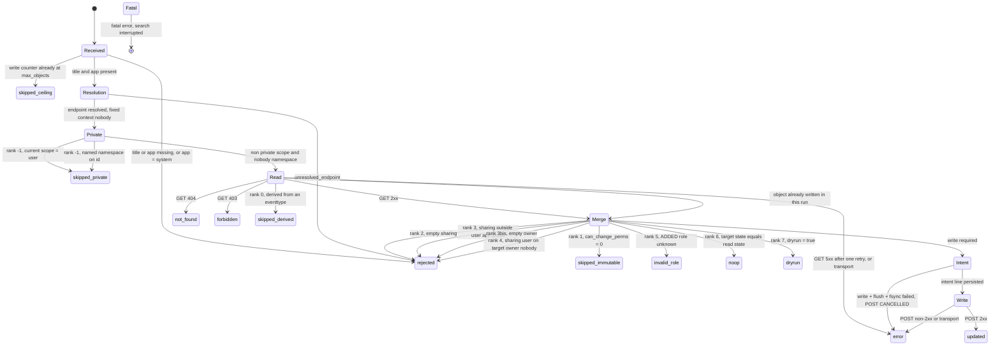

# SA-acl-tools - design notes

This document is for whoever has to **change this code**, or to read it cold in a year.
It carries what the [README](../README.md) deliberately leaves out: the architecture,
the measurements the behaviour rests on, the traps found on the way, and the decisions
with their motive.

`docs/` is excluded from the deployable archive by `.gitattributes`, like `tests/` and
`tools/`: design documentation has no business inside an app installed on a search head.

**How to read it.** Sections 1 to 3 describe the shape of the code. Section 4 is the
important one: a catalogue of **facts no documentation gives**, every one of them
established by measurement on Splunk Enterprise 9.4.6. Sections 5 to 9 explain the
mechanisms whose form is not obvious from reading them. Section 10 lists the guard rails
of the test suite and what each one is worth. Section 11 records what was deliberately
left out.

---

## Contents

1. [Layering](#1-layering)
2. [Module map](#2-module-map)
3. [State machine](#3-state-machine)
4. [Measured facts, none of them deducible](#4-measured-facts-none-of-them-deducible)
5. [The journal](#5-the-journal)
6. [The shipped SPL artefacts](#6-the-shipped-spl-artefacts)
7. [The SDK adapter](#7-the-sdk-adapter)
8. [Idempotence, and what it does not cover](#8-idempotence-and-what-it-does-not-cover)
9. [Derived objects](#9-derived-objects)
10. [Guard rails of the test suite](#10-guard-rails-of-the-test-suite)
11. [What was deliberately left out](#11-what-was-deliberately-left-out)
12. [Still open](#12-still-open)

---

## 1. Layering

| Layer | Content | Imports allowed |
|---|---|---|
| Pure core | normalisation, merge, endpoint resolution, mapping table, journal serialisation, state machine | standard library, **no network** |
| Adapters | REST client (`acltools/rest.py`), journal writer | standard library, network allowed **in `rest.py` only** |
| Wrapper | `bin/editacl.py` | the SDK - deliberately minimal surface, **no business rule** |

The rule is not a comment: `tests/test_layering.py` reads the syntax tree of every core
module and fails if one of them imports the network outside `rest.py`, or mentions the
SDK at all. Without it the rule would be an intention, and one hastily added import
would be enough for the merge matrix to stop being testable on a machine with no Splunk
instance.

The consequence that matters: **the whole unit suite runs with no instance and no
network**, and `bin/lib/` is never loaded by it. That is not a convenience, it is what
makes the suite runnable by a reviewer who has no lab.

---

## 2. Module map

```
bin/
  editacl.py            SDK adapter. Options, chunk lifecycle, output, fatal path.
  acl_endpoint_map.json Mapping table eai:type -> handler path.
  acltools/
    model.py            Data types, ACL_STATUSES, output field set, parameter names.
    binding.py          SPL record -> EventInput. Single injection point of presence.
    endpoint.py         URI building, encoding rule, namespace reading of id.
    mapping.py          Loading of the table + operator override, coverage.
    normalize.py        Role list normalisation.
    merge.py            Merge and the ordered pre-write checks.
    derived.py          Discovery of the carrier of a derived object.
    preflight.py        Per-run initialisation: capability, real time, roles, table.
    pipeline.py         Per-event orchestration, counters, deduplication, summary.
    rest.py             Raw HTTP client on urllib + ssl. The only network module.
    journal.py          Write-ahead journal: serialisation, fsync, three phases.
    diag.py             Run diagnostic, redaction, never fatal.
    errors.py           Fatal error and per-event rejection.
```

Two single injection points are worth naming, because both replaced a rule that had been
dispersed and therefore unverifiable:

- **`binding.field_present`** decides column presence, on one line, for the whole
  package. No other caller tests for the presence of a field. That is what makes the
  presence semantics a rule instead of a convention.
- **`editacl._emit_message`** is the only place that talks to the search interface, and
  the only place that applies the `editacl: ` prefix. A prefix repeated on thirty
  literals is a convention somebody forgets; a single emission point checked by a test
  is a rule. `tests/test_message_prefix.py` and `tests/test_editacl_adapter.py` fail if
  `write_warning`, `write_error`, `write_info` or `write_fatal` is called anywhere else.

---

## 3. State machine

The twelve terminal states in lower case are the `acl_status` values, declared once in
`acltools.model.ACL_STATUSES`. Each of them produces **exactly one** `outcome` journal
line then **one** output event - the ceiling included. Only a fatal error interrupts the
search, and it then produces neither an `intent` line, nor an `outcome` line, nor an
output event.



**The order of ranks -1 to 7 is normative**: it decides which status wins when several
conditions hold at once. Four consequences:

- the ceiling comes before everything, the GET included: once reached, every following
  object comes out `skipped_ceiling` with no HTTP exchange at all, **and the search
  carries on**;
- rank -1 skips private objects before any read, and rank 0 precedes every following
  check: an object derived from an `eventtype` comes out `skipped_derived` even when it
  is immutable, even in simulation, even when it is already compliant;
- `can_change_perms` is read **in the GET response**, never in the input event -
  trusting the event would make the guard rail bypassable by an upstream `eval`;
- rank 6 precedes rank 7: an object that is already compliant is a `noop` **even in
  simulation**.

That last point has a consequence for every consumer, and it had never been written down
until late: **counting the `dryrun` rows of a simulation does not give the size of the
batch**, it gives the number of objects that would change. A panel labelling that column
"simulated objects" would be lying.

### 3.1 Why the write ceiling is no longer fatal, and why it defaults to ten

In its earlier form, reaching the ceiling raised a fatal error: the search stopped, the
output was **entirely lost** (`resultCount = 0`), and the operator was left with a
partial mutation **and** blindness about what had just happened. The guard rail
therefore produced, at the exact moment it fired, the worst of both worlds.

Its real value is elsewhere, narrow but legitimate: it bounds the blast radius of an
operator who launches a real write **without having simulated**. On the disciplined path
- simulate, examine, replay - it adds nothing, since the simulation already showed the
volume. That function is entirely preserved by stopping the writes. What disappears is
the blindness. **A guard rail must inform, not blind.**

Batch atomicity stays out of scope for the same reason a global abort on a single
failure stays out of scope: over several hundred objects it would produce an
uncharacterised partial state, where the journal characterises it entirely.

**Why ten and not five hundred.** A one-off correction - a few identified objects,
checked in simulation - goes through without the operator having to think about the
ceiling at all. Beyond that, they have to write it, therefore to **state the volume they
are about to mutate**. A ceiling of five hundred let operations of several hundred
objects through on a production platform without a word, which amounted to keeping none
of the guard rail in most real cases.

What makes a default that low workable is that **simulation never enters the counter**:
a `dryrun` covers the whole batch whatever its size, so the friction sits on the real
write and never on the examination.

---

## 4. Measured facts, none of them deducible

Every item below was established by measurement on a lab instance, not by reading
documentation. They are the expensive part of this project, and they are the reason this
file exists.

### 4.1 `admin/directory` sees 60.6 % of the objects

`| rest /servicesNS/-/-/admin/directory` returns **894 objects out of 1 476**,
independently of capabilities. Seven families are entirely absent, the largest being
lookup files with **526 objects**. The truncation is even partial inside a single
endpoint: modular alert actions appear, the six legacy alert actions do not.

That is the whole reason the `acl_inventory` macro exists and unions the native
endpoints family by family, at a cost of roughly thirty REST calls instead of one.

### 4.2 The field filter changes the value of `id`

Two measurements on the same platform had concluded the opposite of each other: 100 % of
`id` values self-referential for one, 0 % for the other. **Both were right.**

The discriminant is the **field filter**. Queried with no `f=`, `admin/directory` emits
the URI of the native endpoint, which is usable. Queried with `f=...&f=id` - that is,
the way a canonical pipeline writes it - it emits its own self-reference. Measured over
938 objects: 0 % against 100 %, on the sole presence of the filter.

**The field filter does not merely restrict what is returned: it changes the value of a
field.** Nothing lets you predict that, and no amount of reading would have given it.

Symmetrically, the seven families absent from `admin/directory` emit no `eai:type` on
their native endpoint: for them `id` is the only possible resolution - hence the
obligation on the inventory macro to synthesise `eai:type`.

### 4.3 Presence of the column, never its value, decides

Measured: the command receives either a key **absent** from the record, or a key
**present** holding the empty string. Never `None`, never an empty list. And a
multivalue field reduced to a single value **arrives as a string**, not as a list of one
element - a type test would conclude "single value" where there is nothing to conclude,
and would say nothing at all about presence.

The v1 assumed the distinction impossible, on the grounds that an `mvmap` emptying a
multivalue produces a null indistinguishable from a field never mentioned. The
measurement refutes the conclusion without refuting the premise: an emptied `mvmap`
**is** null in the SPL sense, but **a null field is not removed from the result set**.
The column survives, including when the field is empty on every single row - verified
over eleven chunks of a twenty thousand row search.

**Positive rule**: the column is only lost when the field carried a value **nowhere, at
no point** of the pipeline. "`eval X=null()` removes the field" is false in general; it
only removes it when it had never been valued.

The extra caution `raw is not None` on top of `key in record` would be a mistake, not a
precaution: it would bring value-based discrimination back through the back door and
would turn an explicit "empty this attribute" into "preserve it". The predicate in
`binding.field_present` is therefore **exactly** `key in record`, with no further clause.

The whole removed `fields` parameter of the v1, and its eighteen-row merge matrix,
followed from the wrong assumption.

### 4.4 Normalisation has to drop empty elements

After a POST carrying an empty permission, the next GET returns neither `[]` nor `null`
but **`[""]`** - a list holding one empty string. Without that filtering, the read state
and the merged state are never equal, idempotence detection fails on **every** object
with an empty permission, and a second pass rewrites everything.

### 4.5 Fixed-context addressing, and what it fixed

A shared object belonging to somebody else is reachable through the `nobody` context,
for reading as well as for writing, at both sharing scopes, and the GET response always
carries the **real owner** - never the addressing context. The `id` the platform returns
is itself in `nobody`.

The v1 addressed through `eai:acl.owner`. **A private object masks a shared homonym in
the namespace of its holder**: if the owner of a shared object also held a private
object of the same name in the same application, the command reached **the private one**
and wrote its ACL - `200` on the GET, merge computed, POST succeeded, row reported
`updated`. A silent write on the wrong target, that neither the acceptance run nor two
audits had caught, for want of measuring namespace resolution.

The wildcard context is **never** used: it refuses writes, and on two homonyms it
returns two entries on a single-object path, where a client reading the first would be
choosing blind.

### 4.6 The namespace segment of `id` is the scope, not the owner

That nuance is what makes the second private-detection path reliable. Measured on
homonyms of the same application: a **shared object owned by a named account** is still
emitted as `/servicesNS/nobody/...`, while a private object carries the namespace of its
holder. The segment does not say **who** owns the object, it says **whether it is
shared**.

The fallback previously advertised - "the GET through the fixed context answers `404`
and the object comes out `not_found`" - **is false as soon as a shared homonym exists**:
the fixed addressing then reaches the shared object, and the command would read and
write **an object other than the one designated on input**. Same class of defect as the
v1 one that fixed addressing was supposed to have closed, reintroduced by the fallback.

The possible error of the second path is bounded and conservative: a shared object whose
`id` had been harvested in a named context would come out `skipped_private` wrongly.
**Abstention, never a wrong write** - the same discipline as rank 0.

Two successive versions of that paragraph promised a `not_found`, the second one all the
more firmly since the first had already proved false. Neither held. A reassuring clause
added at the end of a paragraph, with no measurement behind it, is a promise made on
intuition.

### 4.7 The URI has to be rebuilt, and the encoding rule is counter-intuitive

The native `id` field double-encodes the slash but not the other special characters, so
it is not reusable as a URI. `enc()` is a plain percent-encoding of the whole segment,
`safe=''`, with no character left literal. Space gives `%20`, slash gives `%2F`, an
accented character gives its UTF-8 bytes, percent gives `%25`.

Double encoding is an **asymmetric trap**: it works for the slash alone and breaks
space, accent and percent. That is exactly the shape of a bug that passes the first test
somebody writes.

### 4.8 `current-context` returns the flattened effective capability set

`GET /services/authentication/current-context` returns in `content.capabilities` the
**flattened effective** set of the user's capabilities, `imported_roles` inheritance
included. The entitlement check therefore reduces to a membership test; no walk of the
role hierarchy is needed. The separate load of `authorization/roles` serves
`validate_roles` only.

### 4.9 A `searchbnf.conf` confined to its app is silently useless

A valid, loaded, correctly parsed `searchbnf.conf` **has no effect** unless it is
exported out of its application: the interface queries `configs/conf-searchbnf` **in the
namespace of the search page**, not in the one of the app declaring the command.
Measured: without the export, that endpoint returns `total = 0` in the search namespace
and `total = 6` in the app namespace.

Without the export the observed behaviour is the worst possible one: the file is loaded,
`btool` reports nothing, no error is raised anywhere, and the colouring simply does not
appear.

### 4.10 `is_visible = 0` does not block access to an exported view

Measured **with the negative control that makes the measurement conclusive**: a view
exported to the system answers `200` from three distinct app contexts, including the
hidden app itself; the **same view** declared `export = none` answers `404`. Without the
negative control the `200` would have proved nothing.

`export = system` reads back as `sharing = global` in the ACL API, never as `system`: an
operational check written on `sharing="system"` would find nothing.

A view exported to the system does not appear in the menu of another app for all that: a
`nav` entry is still needed there.

### 4.11 An account without the read role gets a `404`, not a `403`

Measured on the monitoring view. Without warning, a non-entitled operator concludes that
the deployment is broken. The README states the fact for that reason.

Two more facts of the same family, both measured:

- **`admin_all_objects` short-circuits the read restriction.** "Readable by a single
  role" only holds for non-administrator accounts. No declaration of the app can prevent
  it.
- A bare role is **not** an empty role: it inherits the platform `[default]` stanza,
  which on a stock install carries `run_collect`, `run_mcollect`, `schedule_rtsearch`,
  `edit_own_objects` and `list_all_objects`. The `editacl_auditor` role refuses the
  first three explicitly and leaves the last two. `schedule_rtsearch` is refused for a
  reason proper to this app: the command refuses by design to run under a real-time
  search, so shipping a role that allows scheduling real-time searches would contradict
  its own doctrine.

### 4.12 A holder of the role without index entitlement sees an empty view, silently

`isFailed = False`, `dispatchState = DONE`, `resultCount = 0` - at the very moment an
`admin` account sees one hundred and sixty-four runs. A dashboard that looks up to date
while showing nothing is a diagnostic trap, which is why the view carries an entitlement
panel telling "no run recorded" from "index not readable".

Index entitlement is deliberately outside the app: the role declares no
`srchIndexesAllowed`, no `srchIndexesDefault`, no `srchFilter`.

### 4.13 Two journal defects that only show at search time

Both had the same signature: **the JSON file was correct**, and nothing showed before
reading the journal where it is meant to be read.

- **`error` used to be `null` when there was no error.** `KV_MODE = json` extracts that
  JSON `null` as **the string `"null"`**, so the obvious predicate `isnotnull(error)` is
  true on every line. Measured in lab: eight objects reported in error out of eight,
  where there were two. A wrong figure, with no signal. `error` is now serialised as the
  empty string, like every other empty field.
- **The `host` key collided with the Splunk `host` metadata field** and came back
  **multivalued** at search time. It is now `member`, the term the diagnostic file
  already used for the same thing.

### 4.14 The chunk regime is not predictable

splunkd does not hand the stream to the command in one piece: it cuts it into **chunks**
and calls the command once per chunk.

| Pipeline measured | Behaviour |
|---|---|
| Materialising source (`makeresults`, `rest`, `map` - therefore the inventory macro) | **a single chunk up to 60 000 records** |
| Search on `_internal` bounded to 160 records | **two chunks** |
| Search on an index fed by `collect`, 160 records, consumer deliberately slowed down | **a single chunk** |

The first version of this note stated a rule - materialising against streaming - and the
third case refutes it. Two searches over an index, same volume, opposite regimes.

**What is established, and is enough**:

- **Multi-chunk happens at low volume** - from about a hundred records, probably fewer.
  It is not a regime reserved for very large batches.
- **It is not predictable from the shape of the pipeline.** Any logic attached to the
  run must therefore survive multi-chunk **by construction**, never through reasoning
  about the expected volume or source.
- **The nominal path, built on the inventory macro, is single-chunk.** That is what
  hid the journal lifecycle defect for three days, four independent audits and
  twenty-three acceptance scenarios.

**The last chunk of a run may carry no record at all**, and it is nonetheless the one the
end-of-run line and the file closing fall on. Any end-of-run logic must hold on an empty
chunk.

No configuration lever reduces the chunk size received: measured without effect, the
available setting bounds the chunk **produced**, not the chunk received.

### 4.15 An `HTTP 5xx` on persistence mutates the runtime view anyway

When splunkd refuses the POST with `Could not flush changes to disk: ...
metadata/local.meta`, the `local.meta` file is **intact** - fingerprint unchanged - but
the **runtime view** of splunkd has already been mutated. That runtime view is what the
GETs serve, what users and searches see, and what access control is enforced on, until
the next configuration reload or member restart.

The warning is emitted on the **whole** `5xx` class and not on `500` alone: the
divergence comes from the handler having mutated its in-memory state before failing to
persist it, which a `502`, a `503` or a `507` produce just as well. Restricting a guard
rail to the one code you happened to meet makes it depend on your sample.

Recovery is a configuration reload of the family, not a rollback: the rollback macro
only keeps `outcome` lines with status `updated`, and it is right to exclude the object,
since the disk never saw it change.

### 4.16 `admin/ntags` refuses every ACL write

Measured: `HTTP 500`, "ACL modification not supported by this handler". No workaround
exists - that is a limit of the handler, not of the command.

### 4.17 Moving an application, and renaming

- **Moving** exists (`POST <object_endpoint>/move`, `app=` and `user=` both mandatory,
  15 families out of 16), and it is out of scope for one decisive reason: with a `user`
  different from the current owner, the object is written under
  `etc/users/<user>/<app>/` **without `owner` being rewritten**. Address and owner then
  diverge and the object becomes **unreachable for writing**, deletion included. Sixteen
  combinations tried, all `404`. On a tool whose only justification is reversibility, an
  operation able to destroy access to an object is a contradiction. Three lesser
  reasons: only 3.4 % of objects are movable outside lookup files on the reference
  platform, moving an `eventtype` **materialises a second** derived object in the target
  application whose duplicate survives the rollback, and the return address is not
  deducible from `eai:acl.owner`, which breaks the implicit assumption of the rollback
  macro.
- **Renaming does not exist.** 1 560 objects swept over the 27 contractual handlers:
  **18 distinct actions exposed, none of them a rename**. That is not a trade-off, it is
  a fact.

### 4.18 Taking ownership: two platform conditions

`/acl` does apply the `owner` parameter, on 15 families out of 15, and it is not echoed
back; a second POST carrying the old owner reverses it. But `admin_all_objects` is
required - isolated by a single-variable measurement, an account carrying
`edit_own_objects` receives `403` **even on its own object** - and the target owner must
exist, failing which the platform answers `400` without mutating.

The scoping-phase claim that ownership had to stay out of scope was **partly** wrong:
for an object in `sharing=app` or `global` it stays addressable at every namespace after
the change. It holds for `sharing=user` only, which is not the dominant case here.

### 4.19 An empty permission survives journalling and aggregation

The risk was real in principle: since the input contract was reworked, an **absent**
column preserves the attribute instead of emptying it. If the journalling chain lost an
empty permission on the way, a rollback would restore nothing while reporting a success.

**Measured on 9.4.6, it does not lose it - and the measurement was made twice, by two
distinct profiles.** A permission serialised as `""` in the journal is **extracted** at
indexing time: field present, value the empty string, with a control `isnull()` on a
non-existent field establishing that the instrument does tell "absent" from "present and
empty". And it **survives aggregation**: the `stats earliest(...) BY endpoint` of the
rollback macro, run without the `coalesce` and filtered on an object whose two
permissions are empty on 100 % of the aggregated rows, does emit both columns.

The macro nonetheless materialises both permission columns explicitly, **as defence in
depth and not as the fix for an observed defect**. It costs one line and protects
against a behaviour nothing obliges another version of the platform to keep.
`eai:acl.sharing` and `eai:acl.owner` are deliberately **not** treated the same way:
their empty value does not exist on the platform side, a restorable object always
carries one, and materialising an empty column there would only turn a correct
preservation into a rejection.

An earlier version of the shipped documentation claimed the opposite - that the column
disappeared - and built an elegant demonstration about behaviours that are "right for
the wrong reason" on top of it. That claim had never been measured. **A requirement
founded on a supposition stays a supposition, however elegant the reasoning built on
it.**

### 4.20 Real-time detection is exposed, and it was measured

The guard rail reads `isRealTimeSearch` on `GET /services/search/jobs/<sid>`, falling
back on inspection of `earliest_time` / `latest_time`.

**Measured on Splunk 9.4.6** - search submitted in `search_mode = realtime`, bounds
`rt-60s` to `rt`: `isRealTimeSearch = True` is indeed exposed, and the run is refused by
a fatal error. The refusal therefore stays a fatal error and not a warning.

It is not re-validated on another platform. If the information were not exposed and the
fallback did not conclude, the command would emit a **warning** saying the guard rail
could not be applied, and would carry on - `run_in_preview = false` and idempotence
remain the first two lines of defence. That degradation is specified rather than left to
improvisation, and it is documented rather than removed silently.

### 4.21 Aggregating the prior state of a run needs `earliest()`, not `values()`

Measured on a batch carrying one deliberate duplicate. An object presented twice in the
same batch produces two `outcome` lines, so `values()` merges the prior state of the
first pass with the state read back on the second, turns the column multivalued, and
reports "unchanged" on an object that did change.

Every panel of the monitoring view that shows a before/after state therefore aggregates
with `earliest(...) BY endpoint`, which is the same discipline as the rollback macro.

---

## 5. The journal

### 5.1 One file per `sid`, no rotation

A `RotatingFileHandler` is not safe across processes: two concurrent runs on the same
member - a scheduled search crossing a manual one - can lose lines at rotation time. The
journal is the **only** safety net of an irreversible operation, so a known window of
line loss is not acceptable when the fix costs a file name.

Favourable side effect: the rollback set of a run is self-contained in one file, usable
directly before indexing.

The counterpart is that the number of files grows monotonically with no automatic
ceiling. The unit volume is marginal; the README documents a purge by age.

The diagnostic file is the opposite choice on purpose: it carries no restorable state,
so it stays single and rotating, and **no diagnostic failure is fatal**. A diagnostic
that interrupted the operation it observes would add a failure to the one it reports.
For the same reason, opening it never raises: a failure to open yields an inert
diagnostic object, so no call site has to guard itself.

It is nonetheless the **only** trace of a fatal error that survives the end of the
search: the operator message is ephemeral and the job disappears when it expires. It
therefore records the startup line (app version, user, member, `splunkd_uri`, TLS
verification state), the validated parameters, **the nine naming parameters** - without
them a run whose field names were redirected would be unreadable after the fact - the
entitlement check, the real-time check, the resolution of the mapping table with its
counts and its discarded entries, the opening of the rollback journal, and the fatal
errors.

**No secret enters it.** The guarantee is structural first: the diagnostic module never
receives the session key - none of its methods has a parameter carrying it, and the REST
client does not talk to it. A redaction covers, as a second line, the error messages
copied back from the platform: the `Authorization` header, `session_key`, `token`,
`password`, `api_key` and their kin are replaced by a placeholder and **never
truncated** - a truncated secret is still a partially disclosed secret. That file is
collected into an index: it is read by far more people than the disk of the search head.

### 5.2 `fsync` on the intent line, not on the outcome line

`intent` is written, flushed and `os.fsync()`ed **before** the POST. Its failure
**cancels** the POST for that object, which comes out `error` with
`acl_journaled = false`.

`outcome` is written after the response. Its failure cancels nothing - the POST already
happened - and is signalled by `acl_warning = "journal_outcome_failed"`.

The asymmetry is the whole point. The purpose of the write-ahead line is to guarantee
that **no mutation can happen without its prior state being on disk first**; that only
requires a durability barrier upstream of the write. A barrier on the result line would
buy nothing: whatever happens, the mutation has already taken place and the prior state
is already persisted. Paying an `fsync` there would double the cost of every object to
protect nothing.

Consequence to know: an `intent` line with no `outcome` signals an interruption between
the disk synchronisation and the POST response, and **the POST may have succeeded**.
That case is settled against `splunkd_access.log`, not by the journal.

### 5.3 The `summary` line, and why its position in the control flow is the point

`summary` is written once, after the last record of the run, and carries one counter per
status - **every** status, including the ones at zero, so a consumer never has to handle
an absent key. The enumeration of those counters is derived from `ACL_STATUSES`, never
written by hand.

It sits inside the `try` of `stream()`, after the loop over the records, therefore on
the branch a fatal error skips. The fatal path calls the cleanup then ends the process
through `os._exit`: the `finally` never runs and no line can be appended afterwards. A
run interrupted by a fatal error therefore leaves a journal **with no summary line**,
and it is that **absence** which distinguishes it from a run that reached its end.
Putting that write inside the cleanup would have made the two indistinguishable again,
since the fatal path does call the cleanup.

### 5.4 The journal must survive the second chunk

The SDK calls `stream()` **once per chunk** and drains the generator each time. A
cleanup placed unconditionally in the `finally` of `stream()` therefore closed the
journal at the end of the **first** chunk. The initialisation flag staying true, the
setup was not replayed and the journal stayed closed for the rest of the batch: from the
second chunk on, every object came out `error` / `journal_intent_failed` and was **not
written**, since an intent line that cannot be persisted cancels the POST.

That defect lived in the v1, in the v2 and in everything shipped before it was found.
It was hidden by the fact that the nominal path, built on the inventory macro, is
single-chunk - see [4.14](#414-the-chunk-regime-is-not-predictable). None of the
twenty-three acceptance scenarios and none of the four independent audits had used a
streaming source.

The fix conditions the cleanup on the last chunk, reading the SDK flag **negatively**:

```python
return getattr(self, "_finished", None) is not False
```

`is not False` and not `is True`, and that asymmetry is the whole point. Under protocol
v2 the flag is `False` while more chunks are announced and `True` on the last one; under
protocol v1 it stays at its initial `None`, since there is no chunk at all. Reading it
positively would defer the cleanup to a chunk that never comes: the end-of-run line
would never be written and the journal never closed.

The cleanup on the fatal error path stays **unconditional**, alone of its kind, since
that exit unwinds no `finally` at all.

The same reasoning already governed the ceiling warning, which defers its emission to
the last chunk because that is the only moment the number of skipped objects is known.
Two protections written by the same hand, one of which used to undo the other.

The invariant "one `outcome` line per output event, with no exception" was therefore
**false since the v1**, and the run monitoring view was the first artefact of this
project that would have made it visible: a total lower than the real batch, with no
error and no warning. It has been true since the fix, proved on a batch of 150 objects
in five chunks - 150 written, complete journal, end-of-run line present. The defect was
**reproduced on the platform before being fixed**: the same batch on the previous code
gave 74 written and 76 failing from rank 75 on, with the real ACLs read back object by
object to establish that they had stayed at their original value, rather than trusting
the status to say so.

### 5.5 The correlation key

`sid` + `endpoint` + `phase` identifies an entry uniquely **for `phase=intent` only**.
Deduplication by URI guarantees one POST per object per run, therefore one `intent`
line; but one output event per **input** event means an object presented twice produces
two `outcome` lines. The rollback macro filters on `phase="intent"` and is not affected -
nor by the `summary` line, which carries no `endpoint` and therefore lands in a distinct
aggregation group before being dropped by that filter.

The `endpoint` string is a **contract**: rigorously identical on the `intent` and
`outcome` lines of a given event, computed once and never recomputed. It carries no
scheme, host or port - two search head cluster members would otherwise produce two
distinct keys for the same object - and no `/acl` suffix. It is the same string as the
`acl_endpoint` output field.

`endpoint` is filled in **from resolution onwards, not from the write attempt**: an
object that could not be found carries one. And the reverse trap: `eai_type` may be
empty on the line of an object that was written and resolved, so any breakdown by object
type undercounts unless it labels those lines.

---

## 6. The shipped SPL artefacts

Four design points that a reader of the `.conf` files would otherwise have to
reconstruct.

### Every shipped search names its source through a macro

No shipped search - panel, saved search or macro - writes `index=` literally. One macro
names the journal source, one names the diagnostic source, and both carry the
`sourcetype` as well.

Two reasons, and the second one is the interesting one.

- `inputs.conf` governs ingestion and the macros govern reading. An operator who
  redirects the journal index without overriding both gets **an empty result with no
  message** from every shipped search - including the rollback macro, on the only safety
  net of an irreversible operation. No Simple XML construct brings that down to a single
  configuration point, so the constraint is **stated** rather than promised away.
- Carrying the `sourcetype` inside those macros makes a separate rule **structurally
  unbreakable** instead of leaving it to discipline: no search may write
  `sourcetype=editacl:*`. The diagnostic file produces seventeen extracted business
  fields with no `props.conf`, among them `app`, `title`, `id`, `type` and `user` -
  **homonyms of the journal ones, with inverted semantics**: they carry an *SPL field
  name*, not the value of an object. The wildcard mixes the two sets without raising a
  single error, and produces rows where `title` designates sometimes an object and
  sometimes the name of a parameter.

### Twenty-seven inventory macro stanzas, generated rather than one quoted argument

Splunk indexes macros **by arity**: `acl_inventory(savedsearch,views)` is a two-argument
call and looks for the two-argument stanza, not for a one-argument stanza holding a
comma-separated string. The parameterised form therefore needs one stanza per argument
count, up to the number of families in the shipped lookup.

The alternative - a single-arity macro called with a quoted list - reintroduces a
quoting requirement in the call form, which is exactly the class of error the removed
`fields` parameter demonstrated to be silent and expensive. Twenty-seven mechanically
generated stanzas are a visible maintenance cost; a forgotten quote is an invisible
defect. The visible cost wins.

### The applied rollback macro delegates instead of copying

`editacl_rollback_apply` expands `editacl_rollback` rather than repeating its SPL. Two
copies of the same pipeline diverge at the first amendment, and the forgotten copy would
be the one that **writes**. It also carries the ceiling explicitly, since the default of
ten would stop a rollback of a larger batch at the eleventh object.

### The re-validation is a script, not an SPL search

Building the URI of an object obeys a single, non-obvious encoding rule, implemented once
in `acltools/endpoint.py`. Rewriting it in SPL would create a second implementation that
would drift - the exact defect the single-injection-point rule forbids. The script
**reuses** the mapping coverage function and the path builder; it reimplements nothing.

It also produces a section nobody asked for and everybody needs: a consistency check
between `bin/acl_endpoint_map.json`, read by the Python code, and
`lookups/acl_object_families.csv`, read by the inventory macro. SPL cannot read JSON, so
the same information exists in two forms, and a divergence would make the inventory and
the resolution inconsistent.

---

## 7. The SDK adapter

### 7.1 The output field set is declared, never inferred

The SDK writer builds the stream header from the **keys of the first record emitted**,
then projects every later record onto it: a field absent from that first record
**disappears from the entire output**, with no error and no warning.

The eight `acl_before_*` / `acl_after_*` fields are only carried by records whose merge
was computed. A `skipped_private`, a `skipped_derived`, a `skipped_ceiling` or an
upstream rejection carries none of them. A batch whose first row falls into one of those
statuses therefore deprived the operator of **everything a simulation exists to show** -
and the inventory macro, which lists private and derived objects alongside the rest,
routinely produces such batches.

The SDK exposes `RecordWriter.custom_fields` for exactly this: names listed there are
added to the header whatever the first record holds. **The vendored SDK is therefore not
modified**; the declaration is made from the app, and `custom_fields` survives the
end-of-chunk clearing, which makes it valid for every chunk of the run.

The declaration is made from `prepare()` - the extension point the SDK provides - **and**
from the setup that runs before the first `yield`, which covers a protocol where
`prepare()` would not be reached. It is idempotent, and no failure of it may interrupt
the command: it improves the output, it conditions no write.

**The symmetry is worth seeing.** The whole presence semantics rests, on **input**, on
the fact that the column set is the one of the result set and not of the event. The
output obeys a constraint of the same nature - frozen, but on the **first record**
instead of the complete set. The contract was built by measuring the input and assuming
the output.

### 7.2 `_journal_writer`, and above all not `_journal`

The SDK stores the value of an `Option` in the attribute `"_" + <option name>`
(`searchcommands/decorators.py`). The `journal` option therefore occupies `_journal`.

Storing the journal writer there created a **two-way collision**: the boolean of the
option got closed like a file on the fatal error path, and writing the writer made the
value of the option unreadable. The attribute is therefore named `_journal_writer`, and
`tests/test_editacl_adapter.py` mechanically forbids the defect from coming back.

Anything the adapter stores on `self` has to be checked against the option names for the
same reason.

### 7.3 The fatal error message is emitted in a non-final chunk

The SDK's `error_exit()` writes the message then raises `SystemExit`, which the SDK turns
into a `finish()` - a final chunk with `finished: true` - followed by exit code 1. That
chunk tells splunkd the command ended normally, and splunkd then ignores the return
code. Measured on Splunk 9.4.6: the job comes out `dispatchState=DONE`,
`isFailed=false`, `resultCount=0`. A scheduler or an alert built on that pipeline
therefore cannot tell an interruption from an empty batch, and the `MSG[ERROR]` is only
visible to whoever inspects the job.

The message is therefore emitted in a **non-final** chunk, and the process then exits
with a non-zero code **without ever sending `finished: true`**. splunkd then marks
`dispatchState=FAILED` / `isFailed=true` **and keeps the message**; it adds its own,
"External search command exited unexpectedly with non-zero error code 1", which is
accurate and expected.

`os._exit` short-circuits the `finally` blocks, so the cleanup is done by the caller
**before** that call. The journal loses nothing for all that: every line is already
flushed on write, and the `intent` line is `fsync`ed.

The indirection through `_abort_process` exists for two reasons: to name what `os._exit`
does - no return, no cleanup, no final chunk - and to make the failure path
**exercisable**, since a hardcoded `os._exit` would kill the test process instead of
failing it.

### 7.4 `type` cannot be passed to `@Configuration`

`StreamingCommand` pins `type` to `streaming` and the SDK refuses any redeclaration. The
decorator therefore reads `@Configuration(local=True)`; the effect is identical, the form
is imposed by the SDK. `local = true` is carried by `commands.conf` as well.

### 7.5 One warning per run, not per event

Three warnings are emitted once per run and never per event: the simulation warning, the
ceiling warning and the runtime divergence warning. Over several hundred objects, a
repeated warning is noise, and noise gets filtered out mentally.

Two of them can only be emitted on the last chunk, because that is the only moment their
number is known. The third one is guarded by a plain flag on the command instance.

---

## 8. Idempotence, and what it does not cover

The merged state is compared with the read state after identical normalisation on both
sides - split, `trim`, removal of empty elements, deduplication, sort. The comparison
bears on `owner`, `sharing`, `perms.read` and `perms.write`, over sorted collections: a
permutation of role order is a `noop`.

`owner` entered the comparison when taking ownership entered the scope. Excluding it -
which the v1 did, on the grounds that it was never modified - would make `new_owner`
inoperative: a batch changing only the owner would come out entirely `noop`, with not a
single POST.

**A green second pass does not establish that the rollback set is right.**

Idempotence detects only **one of the two known failure modes**. It flags the case where
the **state** is wrong - the second pass does not converge, objects come out `updated`
where they should all be `noop`. It stays **completely silent** on the case where it is
the **rollback set** that is wrong: that case comes out 100 % `noop`, exactly like a
healthy batch.

The reason is mechanical: idempotence compares the target state with the state read
**now**. It never compares the state journalled as prior with the state that really was
prior. A `before_*` captured after another object of the same batch already mutated this
one is a false `before_*`, and nothing in a second pass reveals it.

That limit goes **beyond the case of derived objects**. It holds for any situation where
the state of an object can change between its preflight and the end of the batch.
Verifying a rollback means **replaying** it and comparing field by field, not observing a
`noop` rate.

---

## 9. Derived objects

### 9.1 Why abstain rather than handle

Writing the derived object leads, depending on the order of the pipeline, either to a
**wrong final state** - the cascade from the carrier overwrites the value just written -
or to a **wrong rollback set** - the preflight of the derived object reads an
already-cascaded state and journals a prior value that never existed. **No order gives
both correct.** Abstention eliminates both modes.

Measured properties of the cascade: it bears on **one single stanza**, the one of the
`saved/fvtags` object; it is **unidirectional**; and it is triggered only by an
**effective POST** - a `noop` carrier does not cascade. That last point is what made a
remediation possible without a redesign: the trigger is identified, punctual, and
observable by the command itself.

The favourable side effect is that writing the carrier **aligns** the derived object.
The tool therefore makes the estate converge towards a consistent state batch after
batch, without ever writing the derived object itself.

### 9.2 The relation is discovered, not computed

No name of a derived object is ever recomposed by concatenation from the name of a
carrier. A guessed link would one day produce a homonym, with the same consequences as a
guessed endpoint. The traversal is **from child to carrier**, and each of its three steps
rests on data supplied by splunkd:

1. **the family** comes from the resolved handler path, itself coming from the `id`
   emitted by a native endpoint or from the mapping table validated by a real GET;
2. **the identity of the object** is the one splunkd returns in the GET response
   (`entry[0].name`), never the `title` field of the input event, which an upstream
   `eval` may have forged. It is the composite key of the family, whose grammar
   `<field>=<value>` is the platform's own: that is the form under which splunkd names
   the object, addresses it, creates it and writes it into `tags.conf`;
3. **the existence of the carrier is confirmed by a real GET** on `saved/eventtypes` in
   the same namespace, memoised for the duration of the run. That is the step that turns
   the relation into an observation.

The grammar of the composite key is **measured, not assumed**: an `eventtype` named
`drv_eq=inside` does produce `eventtype=drv_eq=inside`, and a POST of ACL on the carrier
did cascade to it. And the method **actually discriminates**: on the four `fvtags`
objects of the witness app, three come out `skipped_derived` and the fourth does not,
because its key designates another field. Any family-based or name-shape heuristic would
have skipped all four.

Direct and verifiable consequence: an **orphan** `fvtags` - whose designated carrier does
not exist - stays **modifiable**. No cascade can reach it, so there is no reason to
abstain. A naming heuristic would have skipped it wrongly.

If the confirming GET can neither establish nor rule out the existence of the carrier
(`403`, `5xx`, transport failure), the abstention is pronounced anyway and traced by
`acl_warning = "carrier_probe_inconclusive:<code>"`. That is deliberately conservative:
writing a derived object whose carrier might exist falsifies the rollback set **in
silence**, whereas one abstention too many is visible and has no effect on the estate.

### 9.3 Scope of the rule

The rule is bounded to objects derived from an `eventtype`. The pattern "writing the ACL
of A modifies the ACL of B" was looked for on 11 of the 27 families and is found nowhere
outside the tag cluster; the remaining 16 families are **inferred** exempt, not observed.

It does not extend to the `tags` family (`admin/tags`) either, although its objects are
also derived from an `eventtype`. An `admin/tags` object acquires its own metadata stanza
on its first ACL write and stops being exposed to the cascade from then on: abstaining
from it for good would remove it from decommissioning **with no cascade coming to align
it in return**.

### 9.4 The blind spot, and where it is treated

A diverging derived object whose carrier does not enter the batch is reached by no
cascade. If it carries a reference to a decommissioned role that its carrier does not
carry, the batch filtered on that role does not return the carrier, nothing fires, and
**that reference survives**. It is the only place where the objective of effective
disappearance of the references is not met by the command alone.

That divergence belongs to the upstream configuration - typically an `eventtype` pushed
by a deployer with a metadata stanza of its own, without the materialisation mechanism of
the derived object having run. It is treated upstream, on the deployer side, before local
configurations are taken over.

The shipped `ACL - eventtype / derived object divergences` search makes the volume
measurable. Its own limit: pairing is scoped **by application**, so a carrier shared
globally from another application than its derived object would not be paired.

---

## 10. Guard rails of the test suite

The suite runs outside Splunk, with no instance and no network, on the standard library
alone:

```sh
python -m unittest discover -s tests -t . -v
```

Six of its modules are not tests of behaviour but **guard rails**: they exist to make a
rule mechanically enforceable rather than a matter of goodwill. Each one is worth
exactly what its stated scope is worth, and each states the limits of its own reach.

### 10.1 `test_statuses.py` - the status enumeration is derived from the code

Four successive writings of that list were wrong: three in the specification, then one
in the test suite the specification had entrusted it to - a constant announcing twelve
values and carrying eleven, with `skipped_derived` missing. The flaw is not
forgetfulness: a hand-written enumeration has **no mechanical link** with what the code
produces, and therefore drifts at every change.

The module reads the syntax tree of the core and sorts **every** construct touching a
status into one of three exhaustive categories:

1. **canonical** - the status is a literal, it gets collected;
2. **recognised propagation** - the value is a status born elsewhere, already collected
   at its birth;
3. **opaque** - everything else. **Opaque fails the suite**, naming the module, the
   line, the scope and the offending source fragment.

That reversal of the default is the point. The first version recognised two written
forms and **ignored everything else**: a status passed as a keyword argument or by
indirection entered the core unseen and the suite stayed green - measured at the closing
audit, two stealth statuses and 501 tests passing. Adding those two forms to the
extractor would have reproduced the flaw one notch further out. A noisy blind spot is
infinitely better than a silent one.

Its reach stops where the reading of a syntax tree stops: it does not see a module added
outside its source list, a status built at run time (`exec`, `importlib`, a metaclass, a
decorator rewriting an attribute), a status written into an attribute of another name, or
the real value behind a `<expr>.status` propagation. Exemptions are declared one by one,
justified, and a **dead exemption fails the suite** as well.

**Where the enumeration lives in the shipped documentation, and why.** The enumeration is
carried by `README.md`, once, in the output field table: it is part of the operator's
output contract, and an operator must be able to read the complete set of values without
opening a design document. This file carries the **state machine** instead, because that
diagram shows the normative ranks and the internal transitions, which is design material.
One copy each, each one anchored to `ACL_STATUSES` by a dedicated test:

| Document | What it carries | Anchoring test |
|---|---|---|
| `README.md` | the enumeration, in order, in the output field table | `test_the_readme_enumeration_equals_ACL_STATUSES` |
| `README.md` | the count, spelled out in words | `test_the_count_announced_by_the_readme_is_right` |
| `README.md` | every status mentioned somewhere in the prose | `test_every_status_is_mentioned_in_the_readme` |
| `docs/DESIGN.md` | the state machine | `test_the_design_state_machine_covers_every_status` |

Adding a status without updating the document that carries its copy fails the suite,
naming which document and which value.

### 10.2 `test_language.py` - the repository is in English

This app is published, and its comments are not decoration: they carry measurements and
reasoning. Half of that value is lost on a reader who does not speak French. The
repository was therefore translated in full, and that module is what keeps it
translated - in both directions. It passes on the translated repository, and it fails on
French witness sentences, including ones whose subject matter is entirely technical.

Three layered detectors, any one of them firing being a fault. First, a list of French
function words that do not exist in English and are not plausible identifiers here.
Second, the commonest French conjunction, on its own, with a lookahead sparing its one
legitimate Latin use in English - it exists because the word list alone misses a
telegraphic fragment such as a docstring title, which carries no article and no pronoun
at all. Third, French elision, which is the strongest signal available, because an
English apostrophe follows the END of a word while an elided French article is a lone
letter before it.

The examples are deliberately not written out here: this file is inside the scan, and a
sample of the very thing being detected would make the check fail on the document that
explains it. That is exactly why the detector module excludes itself, and the effect was
observed on this paragraph while writing it.

Its only remaining declared exclusions are the vendored SDK, whose integrity is held by a
hash manifest, and the module itself, whose vocabulary **is** the detector. Both
`README.md` and this file are inside its scope.

### 10.3 `test_message_prefix.py` and `test_editacl_adapter.py` - the single emission point

They read the syntax tree of the adapter and fail if a message reaches the search
interface anywhere other than `_emit_message`, or through a construct they cannot
analyse. They also forbid the return of the `_journal` collision described in
[7.2](#72-_journal_writer-and-above-all-not-_journal).

### 10.4 `test_layering.py` - the core does not know about the network or the SDK

Without it, the layering rule is an intention in a comment and one hastily added import
is enough for the merge matrix to stop being testable on a machine with no instance.

### 10.5 `test_spl_artifacts.py` - the removed parameter stays removed

The `fields` parameter of the v1 was the most serious defect this project ever had: an
unquoted list was **truncated by SPL to its first value**, with no error and no warning,
so that a rollback restored `perms.read`, left `perms.write` and `sharing` mutated, and
reported a success. There was no possible guard in the code: a legitimate quoted single
value and a truncated list arrive identical at the command.

The defect is now eliminated **by construction** - each parameter carries a single field
name, with no comma - and the module sweeps the deliverables to make sure the removed
form is not offered anywhere again. A comma inside a naming parameter is also refused
explicitly, to catch the operator still thinking in v1 terms.

### 10.6 `test_vendor_manifest.py` - the vendored SDK is what the script installs

The manifest describes **what the vendoring script installs**, not the raw content of the
directory: compilation artefacts are excluded from the walk, on writing as on
verification. They appear on the first import of the SDK, that is, on the first run of
the command on a deployed app, and counting them as a divergence would make the check
unusable exactly where it serves. A real modification, addition or disappearance of a
vendored file is still detected.

### 10.7 What the suite also covers

Worth naming because each one froze a measured behaviour rather than an intention:

- the twelve rows of the presence matrix - four target attributes times three column
  states - one per named test, with no grouping and no parameterised test;
- discrimination by key presence rather than by type: a multivalue reduced to one value,
  arriving as a string, is treated as a value and not as an absence;
- addressing with no owner: the built URI always carries the fixed context, and the
  signature of the path builder exposes no owner parameter at all;
- the non-fatal ceiling: complete output, `skipped_ceiling` on the skipped objects,
  counter of skipped objects kept, no firing in simulation, resumption with no double
  write;
- role list normalisation, including the `[""]` case;
- URI rebuilding over the four character classes;
- the normative order of the pre-write checks;
- the three journal invariants, and the field contract of the rollback macro;
- the Simple XML of the monitoring view, parsed in the suite - which is one of the three
  reasons that view is Simple XML and not Dashboard Studio, the other two being version
  portability from 8.x to 9.x on an unspecified target platform, and the fact that a
  Simple XML diff can be reviewed while a Studio JSON cannot.

---

## 11. What was deliberately left out

| Left out | Why |
|---|---|
| Parallelism | REST calls are serialised. No concurrency parameter is exposed. Speculative surface on a tool whose bottleneck is the operator's caution, not throughput. |
| Batch atomicity | Over several hundred objects, a global abort on a single failure would produce an uncharacterised partial state. The journal characterises the partial state entirely, which is strictly better. |
| Retry on the POST | A retry could not tell "the POST never left" from "the POST succeeded and the response was lost". Cross-checking with `splunkd_access.log` is the honest answer. |
| An identity key in the journal | `endpoint` identifies every resolved object uniquely, and counting `outcome` lines gives the exact total per status. Identity would only be missing to designate an individual **unresolved** object in a drill-down. Speculative surface. |
| An opt-in parameter to write derived objects anyway | Same reason. There is no order of operations that gives both a correct final state and a correct rollback set. |
| Moving an object between applications | See [4.17](#417-moving-an-application-and-renaming). It deserves its own tool, with its own safety net. |
| Renaming an object | Does not exist on the platform. Not a trade-off. |
| Writing `.meta` files directly | Out of scope since scoping: the command goes exclusively through the REST API. |
| Managing roles (`authorize.conf`) | Out of scope since scoping, apart from the two stanzas the app declares for itself. |
| Filtering derived or private objects out of the inventory | It is the modification that abstains, not the view. An operator must be able to see what the tool does not process. |

---

## 12. Still open

- **Search head cluster replication of a mutated but unpersisted runtime state.** After
  an `HTTP 5xx` on persistence, does the mutated runtime state replicate to the other
  members? Not observable on a standalone instance.
- **Version portability of the mapping table.** Established on 9.4.6 only. The
  re-validation script exists precisely because no claim is made beyond that version.
- **The 16 families where the cascade pattern was not looked for.** They are inferred
  exempt, not observed - see [9.3](#93-scope-of-the-rule).
- **Pairing of the divergence search across applications.** Not observed on the reference
  platform, not ruled out either.

---

## Reading order for a cold start

1. `bin/acltools/model.py` - the vocabulary: statuses, output fields, parameter names.
2. `bin/acltools/binding.py` - presence semantics, which everything else assumes.
3. `bin/acltools/merge.py` - the ordered checks, which decide the status.
4. `bin/acltools/pipeline.py` - the per-event orchestration.
5. `bin/editacl.py` - the SDK adapter, and only then.
6. `tests/test_merge_matrix.py` - the twelve rows of the presence matrix, one per test.
